# サイバーエージェント生産性向上プラットフォーム
## 「CA Productivity Portal」提案書

## 1. エグゼクティブサマリー

本提案は、サイバーエージェントの競争力を飛躍的に高める「CA Productivity Portal」の構築を目指すものです。このプラットフォームは、社外ツール、社内ツールを問わず、あらゆる生産性向上ツールや技術を網羅し、全従業員の生産性を最大化することを目的としています。初期フェーズではエンジニアを中心に展開し、半年以内に全職種へ拡大する計画です。

本ポータルは、大きく分けて「Discovery（情報発見、比較、推奨）」と「Application（利用申請）」の2つの機能を提供し、従業員のツール選択から導入までをシームレスにサポートします。

## 2. 背景と課題

### 2.1 急速な技術革新
- AI、クラウド、自動化ツールなど、技術の進化が加速
- 従業員が最新ツールに追いつけていない現状

### 2.2 生産性向上の緊急性
- 市場競争の激化による生産性向上の必要性

### 2.3 ツール導入の非効率性と長期化
- 技術選定、検証プロセスに1-2ヶ月以上の開発リードタイムが発生
- 部署ごとの個別選定による重複作業と非効率
- グループ全体の信頼できる専門家による比較・検証結果の共有不足
- セキュリティ、法務、契約プロセスの煩雑さによる導入遅延

### 2.4 知識共有の不足
- 効果的なツール活用ノウハウの共有不足
- 部門間のベストプラクティス共有の欠如

## 3. ビジョン

**「最先端ツールで、すべての従業員の潜在能力を解放する」**

CA Productivity Portalは、サイバーエージェントの全従業員が、最適なツールを瞬時に発見、比較、導入し、その効果を最大限に引き出すことを可能にします。これにより、個人の生産性を飛躍的に向上させ、会社全体のイノベーションと成長を加速させます。

## 4. 提案内容：CA Productivity Portal

### 4.1 Discovery機能

1. **包括的ツールカタログ**
   - 社外ツール、社内ツールを問わず、AI、プロジェクト管理、デザイン、マーケティング、財務など、全部門向けの生産性向上ツールを網羅
   - サイバーエージェント独自の社内開発ツールも含めた、詳細な機能比較、ユーザーレビュー、導入事例を提供
   - 「生成AI活用コンサル」チームが発掘した高インパクトツールを優先的に掲載
   - 各ツールの公式開発者ブログ（社内ツールの場合は開発チームのブログ）へのリンクと最新アップデート情報の提供
   - ワンクリックで利用申請が可能な導線の設置

   例：
   ```
   ツール名：GitHub Copilot
   概要：AIを活用したコード補完・生成ツール
   主な機能：
     - リアルタイムコード提案
     - 自然言語からのコード生成
     - 多言語サポート
   開発者ブログ：[GitHub Copilot Blog](https://github.blog/category/copilot/)
   最新アップデート：コンテキストを考慮したコード生成精度の向上（2023/4/1）
   利用申請：[申請フォームへ](https://example.com/request-copilot)
   セキュリティステータス：承認済み
   法務確認：完了
   ```

2. **AIパワード検索・推奨システム（来期以降）**
   - ユーザーの役割、スキル、プロジェクトに基づいた最適ツール推奨（社内外を問わず）
   - 自然言語での高度な検索機能
   - 「生成AI活用コンサル」チームの知見を活用した、AIツールの効果的な活用方法の提案
   - ツール検索結果に、関連する開発者ブログの最新記事や利用申請へのクイックリンクを表示

3. **チュートリアル等が見れる**
   - 社外ツール、社内ツールそれぞれの詳細なチュートリアルとベストプラクティス
   - 各ツールの開発者ブログからのリンクを定期更新

4. **リアルタイム分析ダッシュボード（実施はアゲ太郎・来期以降）**
   - 部門別、ツール別（社内外問わず）の利用状況と生産性指標の可視化
   - ROI分析と継続的な改善提案（社内ツールの場合、開発チームへのフィードバックも含む）
   - 「生成AI活用コンサル」チームの分析結果を反映した、AI活用による生産性向上の具体的な指標提示
   - ツール利用状況と開発者ブログの更新頻度・内容の相関分析

5. **カスタマイズ可能なワークフロー統合**
   - 社外ツールと社内ツールを組み合わせた、効率的なワークフロー構築支援
   - 部門特有のニーズに対応するカスタマイズオプション
   - 「生成AI活用コンサル」チームが開発した、AI活用ベストプラクティスワークフローテンプレートの提供
   - 開発者ブログで紹介された新機能や連携事例を基にしたワークフロー改善提案

### 4.2 Application機能

Application機能は、既存ツールと新規ツールの2つのカテゴリに分けて設計されています：

#### 4.2.1 既存ツールの申請プロセス

1. **統合申請ポータル**
   - CA Productivity Portal内で、全ての既存ツールの申請を一元的に表示

2. **適切な申請フォームへのリダイレクト**
   - 選択されたツールに応じて、以下の適切な申請フォームに自動リダイレクト：
     - LIM（ライセンス・インベントリ管理）システム
     - CDC（コーポレートデジタルセンター）申請フォーム
     - 各子会社の独自申請システム
     - DP室のZendeskインスタンス

3. **申請状況トラッキング**
   - リダイレクト後も、CA Productivity Portal上で申請状況を一元的に確認可能

4. **承認フロー可視化**
   - 部門長承認、予算確認、セキュリティチェックなど、承認プロセスの進捗を視覚的に表示

#### 4.2.2 新規ツールの申請プロセス
1. **オープンな提案システム**
   - 新規ツールの提案は、全従業員が行うことが可能
   - DP（デジタルプロダクト）室が提案を一次受付
   - 標準化された提案フォームにより、必要情報を漏れなく収集

2. **初期評価プロセス**
   - DP室による新規ツールの初期評価
     - セキュリティリスク評価
     - コスト分析
     - 既存ツールとの重複チェック
     - 全社的な有用性の検討
   - 提案者へのフィードバックと改善提案の機会提供

3. **パイロット導入サポート**
   - 評価が positive な場合、限定的なパイロット導入をサポート
   - ユーザーフィードバックの収集と分析
   - 提案者を含むパイロットチームの形成

4. **CDCへの運用移管**
   - パイロット導入が成功し、本格導入が決定：
     - DP室からCDCへの運用移管プロセスを開始
     - 移管完了後、既存ツールの申請プロセスに統合
   - 提案者への成功報告と感謝の表明

5. **継続的モニタリングと改善**
   - 新規ツールの利用状況と効果を定期的に評価
   - 必要に応じて、全社展開や廃止の判断を実施
   - 従業員からの継続的なフィードバックと改善提案の受付

### 4.2.3 共通機能

1. **中央集権型ダッシュボード**
   - 既存ツールと新規ツールの申請状況を一元的に表示
   - ユーザー別、部署別の申請履歴と利用状況の可視化

2. **自動化されたコンプライアンスチェック**
   - セキュリティポリシー、法務要件、予算制限などの自動チェック
   - 潜在的な問題の早期発見と対応

3. **柔軟なワークフロー設定**
   - 部署や役職に応じたカスタム承認フローの設定
   - 緊急申請や特別承認プロセスの柔軟な対応

4. **統合分析レポート**
   - ツール利用傾向、コスト効率、産性向上指標などの総合的な分析
   - 経営層向けのインサイトレポート自動生成

この改善されたApplication機能により、既存ツールと新規ツールの申請プロセスを効率的に管理し、全社的なツール導入と利用の最適化を実現します。DP室とCDCの連携により、革新的なツールの迅速な評価と導入、そして安定的な運用を両立させることが可能となります。

### 4.3 システム構造

CA Productivity Portalは以下の階層構造で設計されています：

1. トップレベル：CA生産性ポータル
2. 職種レベル：ビジネス（初期）、エンジニア、クリエイター

```mermaid
graph TD
    A[CA生産性ポータル]
    
    A --> CA[サイバーエージェント]
    A --> CAM[CAM]
    A --> CP[カラフルパレット]

    CA --> B["AIテックスタジオポータル
    健 鷹雄
    https://adtechstudio.zendesk.com/"]
    CA --> C["openavisupport
    久美子 吉田
    https://openavisupport.zendesk.com/"]
    CA --> D["CATOMS
    Inoue Eri
    https://catoms.zendesk.com/"]
    CA --> E["CyberArrow
    真弥 玉岡
    https://cyberarrow.zendesk.com/"]
    CA --> F["CAライセンスポータル
    健 鷹雄
    https://ca-ec.zendesk.com/"]
    CA --> G["Account Helpdesk
    大倉 香織
    https://ca-grid-helpdesk.zendesk.com/"]

    CAM --> H["CAM
    勝也 庭木
    https://iu-portal.zendesk.com/"]

    CP --> I["Colorful Palette コーポレート
    中村 優太
    https://cpce.zendesk.com/"]

    B --> T1[GitHub]
    B --> T2[GitHub Copilot]
    B --> T3[Zenhub]
    B --> T4[Pager Duty]
    B --> T5[Updown]

    F --> F1[Azure OpenAI]
    F --> F2[Udemy]
    F --> F3[Tableau]
    F --> F4[Jetbrains]
    F --> F5[Datadog]
    F --> F6[Github Enterprise]
    F --> F7[Snowflake]
    F --> F8[Adobe]
    F --> F9[フォントLETS]
    F --> F10[モリサワ]
    F --> F11[Figma Enterprise]
    F --> F12[Unity]
    F --> F13[Sketch]
    F --> F14[HuggingFace]

    classDef company fill:#f9f,stroke:#333,stroke-width:4px;
    class CA,CAM,CP company;
    classDef tool fill:#lightgreen,stroke:#333,stroke-width:2px;
    class T1,T2,T3,T4,T5,F1,F2,F3,F4,F5,F6,F7,F8,F9,F10,F11,F12,F13,F14 tool;
```



### 4.4 段階的展開計画

**フェーズ1：エンジニアリング部門（0-3ヶ月）**
- 開発、IDE、テスト、デプロイメント関連ツールの統合
- CI/CD、コード品質、プロジェクト管理ツールの最適化
- 「生成AI活用コンサル」チームが推奨するAIコーディング支援ツールの優先導入
**フェーズ2：クリエイティブ＆マーケティング部門（4-5ヶ月）**
- デザイン、コンテンツ制作、マーケティング自動化ツールの追加
- クリエイティブワークフロー最適化機能の実装
- 「生成AI活用コンサル」チームが発掘した、クリエイティブ業務向けAIツールの統合

**フェーズ3：ビジネス＆管理部門、ゲーム・動画・音声制作部門（6ヶ月）**
- 財務、HR、営業支援ツールの統合
- 全社的なデータ分析と意思決定支援機能の強化
- 「生成AI活用コンサル」チームの知見を活かした、ビジネスインテリジェンス向けAIツールの導入
- ゲーム開発、動画編集、音声制作関連ツールの統合
- ゲーム、動画、音声制作のワークフロー最適化と自動化機能の実装
- 「生成AI活用コンサル」チームが推奨する、ゲーム・動画・音声制作向けAIツールの導入

## 5. 期待される効果

1. **生産性の飛躍的向上**
   - ツール導入・活用の最適化による作業効率30%向上
   - 部門間のベストプラクティス共有による相乗効果

2. **イノベーションの加速**
   - 最新テクノロジーの迅速な導入による競争優位性の確保
   - クロスファンクショナルな協業促進による新アイデアの創出

3. **コスト削減と資源の最適化**
   - ツールの重複排除とライセンス管理の一元化（推定20%のコスト削減）
   - 効果的なツール活用による人的リソースの最適配分

4. **従業員満足度の向上**
   - 最適なツール提供によるストレス軽減と業務満足度向上
   - 継続的な学習と成長機会の提供

5. **リスク管理の強化**
   - セキュリティ、コンプライアンスの一元管理による脆弱性の低減
   - データガバナンスの強化とプライバシー保護の徹底

6. **データドリブンな経営判断**
   - 全社的なツール活用状況と生産性指標の可視化
   - 部門横断的な分析による戦略的リソース配分の実現

7. **AI活用による革新的なワークスタイルの実現**
   - 「生成AI活用コンサル」チームの知見を全社で共有し、AI時代に適応した新しい働き方の確立
   - AIツールの効果的な活用による、創造的業務時間の増加と付加価値の高い成果の創出

8. **統合されたツール管理**
   - 複数の企業や部門にまたがるツール・サービスの一元管理による効率化
   - リクエスト処理時間の大幅短縮（平均処理時間50%削減）

9. **コンプライアンスとセキュリティの強化**
   - 中央集権的な管理による、ツール利用の透明性向上
   - セキュリティチェックと法務確認の自動化による、リスク低減

## 6. 実装ロードマップ

1. **企画・設計フェーズ（2ヶ月）**
   - 要件定義、アーキテクチャ設計、UI/UXデザイン

2. **コア機能開発（3ヶ月）**
   - ツールカタログ、検索エンジン、導入フロー基盤の構築

3. **セキュリティ・コンプライアンス対応（1ヶ月）**
   - セキュリティ監査、法務レビュー、GDPR対応

4. **パイロット運用・フィードバック（1ヶ月）**
   - エンジニアリング部門での限定運用とフィードバック収集

5. **全社展開準備（2ヶ月）**
   - フィードバックに基づく改善、マニュアル作成、社内啓蒙活動

6. **段階的全社展開（3ヶ月）**
   - 部門ごとの展開、トレーニング実施、サポート体制の確立

7. **Zendesk統合（2ヶ月）**
   - 既存Zendeskインスタンスとの連携
   - 自動ルーティングシステムの構築

8. **Application機能のテストと最適化（1ヶ月）**
   - エンドツーエンドのリクエストフローテスト
   - ユーザーフィードバックに基づく改善

## 7. 投資対効果（ROI）
初期投資：約2000万円（開発費、ライセンス費含む）

年間運用コスト：約800万円（人件費）

**期待される年間効果：**
1. 生産性向上による利益増：20億円
   （従業員1人あたり年間100万円の生産性向上と仮定）
2. ツール最適化によるコスト削減：5億円
3. イノベーション促進による新規事業創出：10億円

**5年間のROI：約1000%**

## 8. リスクと対策

1. **データセキュリティとプライバシー**
   - 対策：最新の暗号化技術の採用、定期的な脆弱性診断の実施

2. **従業員の抵抗感**
   - 対策：段階的な導入、充実したトレーニングプログラム、成功事例の共有

3. **システムの複雑化**
   - 対策：モジュラー設計の採用、継続的な簡素化と最適化

4. **ベンダーロックイン**
   - 対策：オープンスタンダードの採用、マルチベンダー戦略の実施

5. **システム統合の複雑性**
   - 対策：段階的な統合アプローチ、十分なテスト期間の確保、専門チームの編成

6. **ユーザー教育の必要性**
   - 対策：包括的なトレーニングプログラムの実施、ユーザーガイドの作成、サポートデスクの設置

## 9. 結論

CA Productivity Portalは、ツールの発見から導入までを一元化することで、サイバーエージェントの働き方を根本から変革し、全従業員の潜在能力を最大限に引き出すプラットフォームです。DiscoveryとApplicationの両機能を統合することで、我々は生産性とイノベーションにおいて業界のリーダーとしての地位を確立し、急速に変化するデジタル時代において持続的な競争優位性を獲得することができます。

本プロジェクトの成功は、サイバーエージェントの未来を形作る重要な一歩となるでしょう。共に、この革新的な取り組みを実現し、新たな成長の時代を切り開いていきましょう。

## 10. 将来の展望：公開ポータルと内部ポータルの統合

CA Productivity Portalの成功を見据え、次のステップとして、公開可能な情報を活用した外部向けポータルの構築を計画しています。これにより、サイバーエージェントの技術力と革新的な取り組みを広くアピールし、優秀な人材の獲得につなげることが可能となります。

### 10.1 公開ポータル（外部向け）

1. **目的**
   - サイバーエージェントの技術力と革新的な取り組みのアピール
   - 優秀な人材の獲得
   - 業界内でのリーダーシップの確立

2. **主要機能**
   - 採用中の最新技術やツールの紹介
   - 社内での革新的な活用事例の共有
   - 技術ブログや登壇情報の集約
   - オープンソースプロジェクトへの貢献の可視化

3. **コンテンツ例**
   - 各部門でのAIツール活用事例
   - 生産性向上に成功したプロジェクトの紹介
   - エンジニア・クリエイターによる技術記事
   - 社内ハッカソンやイノベーションコンテストの結果

### 10.2 内部ポータル（CA従業員専用）

1. **アクセス制御**
   - 多要素認証を用いた厳格なアクセス管理
   - 役職や部署に応じた詳細な権限設定

2. **NDA対象情報の管理**
   - ツールのコスト情報
   - 詳細な利用統計とROI分析
   - 開発中の新機能や戦略的ツール情報
   - セキュリティ監査結果

3. **高度な分析機能**
   - 部門横断的ツール利用傾向の分析
   - 個人・チームレベルでの生産性指標の可視化
   - AIを活用した将来の技術トレンド予測

### 10.3 統合のメリット

1. **一貫したブランディング**
   - 内部・外部で一貫したユーザー体験を提供
   - サイバーエージェントの技術力を内外に示す

2. **情報の適切な管理と活用**
   - 公開可能な情報を最大限に活用した採用・PR活動
   - 機密情報の厳格な管理による競争優位性の維持

3. **従業員のモチベーション向上**
   - 自社の取り組みが外部に評価されることによる誇りの醸成
   - 技術記事執筆やオープンソース貢献へのインセンティブ

4. **継続的な改善サイクルの確立**
   - 外部からのフィードバックを内部の改善に活かす
   - 内部の革新的な取り組みを適切に外部にアピール

### 10.4 実装ステップ

1. 内部ポータルの安定運用と効果測定（6ヶ月）
2. 公開可能情報の選定と承認プロセスの確立（2ヶ月）
3. 外部向けポータルのデザインと開発（3ヶ月）
4. セキュリティ監査と脆弱性テスト（1ヶ月）
5. 段階的な公開と効果測定（3ヶ月）
6. フィードバックに基づく改善と機能拡張（継続的）

この将来展望により、CA Productivity Portalは単なる内部ツールから、サイバーエージェントの技術力と革新性を体現する象徴的なプラットフォームへと進化します。これは、社内の生産性向上だけでなく、優秀な人材の獲得や業界でのリーダーシップ確立にも大きく貢献するでしょう。

## 11. 懸念点と対策

本プロジェクトの実施にあたり、以下の懸念点が指摘されています。これらに対する対策を講じることで、プロジェクトの成功確率を高めます。

### 11.1 他事業部CTOとのコンセンサス形成

**懸念点:**
- 各事業部のCTOの意見や要望が異なる可能性がある
- 全社的な取り組みとしての合意形成が必要

**対策:**
1. CTO統括室からの公式な提案として本プロジェクトを位置づける
2. 各事業部のCTOを運営メンバーに加え、意思決定プロセスに参画してもらう
3. 特にFK氏（キーパーソン）の承諾を得ることに注力し、コスト意識や統制に関する懸念を丁寧に解消する
4. AI事業部CTOの参画も検討し、AI関連ツールの評価や導入に関する専門的な知見を活用する

### 11.2 チケットシステムの移行と統合

**懸念点:**
- 一部部署でZendeskからJIRAへの移行が検討されている
- 複数のチケットシステムが並存する可能性がある

**対策:**
1. ZendeskとJIRA両方に対応可能な柔軟なインターフェースを設計する
2. JIRAの「チケット共有」機能の調査と、必要に応じた統合計画の策定
3. 大倉氏を中心とした運用体制の確立により、システムの違いを吸収する
4. 将来的なチケットシステムの統一に向けたロードマップの作成

### 11.3 ツールリクエスト機能の重要性

**期待される効果:**
1. 従業員のニーズを直接反映したツール導入が可能になる
2. リクエスト数に基づく優先順位付けにより、効率的なリソース配分が実現する
3. 各事業部のツール利用状況や予算配分の可視化が進む
4. コスト最適化の機会が明確になり、全社的な効率化につながる

**実装方針:**
1. 使いやすいリクエストインターフェースの設計
2. リクエスト数や緊急度を考慮した優先順位付けシステムの導入
3. DP室による評価プロセスの確立と、評価結果の透明性確保
4. 定期的なリクエスト傾向分析レポートの作成と経営層への共有

## 12. プロジェクト成功に向けた次のステップ

1. CTO統括室を中心とした公式プロジェクトチームの発足
2. 各事業部CTOとの個別ヒアリングと要望収集
3. FK氏を含むキーパーソンとの詳細な議論と承諾取得
4. チケットシステム統合に関する詳細調査と方針決定
5. プロトタイプ開発とユーザーテストの実施
6. 全社キックオフミーティングの開催と推進体制の確立

これらのステップを着実に実行することで、CA Productivity Portalは全社を巻き込んだ革新的なプロジェクトとして成功し、サイバーエージェントの競争力強化に大きく貢献することが期待されます。

## 13. ネーミングとブランディング

プロジェクトの成功には、魅力的で記憶に残るネーミングとブランディングが不可欠です。以下に、本プラ��トフォームのネーミング候補とドメイン候補を提示します。

### 13.1 ネーミング候補

**「CA Productivity Portal」**

このネーミングを推奨する理由：
1. 「CA」でサイバーエージェントを明確に示している
2. 「Productivity」がプラットフォームの主要目的を直接的に表現している
3. 「Portal」が統合的なアクセスポイントであることを示唆している
4. 略称「CAPP」が発音しやすく、覚えやすい

### 13.2 ドメイン候補

1. **ca-portal.pro**
   - 簡潔で覚えやすい
   - 「pro」でプロフェッショナルな印象を与える

2. **ca-productivity.com**
   - ネーミングと直接リンクしている
   - 一般的な「.com」ドメインで認知されやすい

3. **ca-pp.pro**
   - 最も短く、入力が容易
   - 略称「CAPP」を反映している

4. **cyberagent.pro**
   - 会社名をフルに使用し、公式感がある
   - 「pro」で生産性とプロフェッショナリズムを示唆

5. **cyberagent.tools**
   - 会社名と提供するサービスの性質を明確に示している
   - 新しい「.tools」ドメインで革新的な印象を与える

### 13.3 推奨案

ネーミング：**CA Productivity Portal**
ドメイン：**ca-portal.pro**

この組み合わせを推奨する理由：
1. ネーミングが目的を明確に伝えつつ、略称「CAPP」が親しみやすい
2. ドメインが短く覚えやすい上に、「pro」で生産性向上の意図を示している
3. 内部利用と将来の外部公開の両方に適している

### 13.4 ブランディング戦略

1. **ロゴデザイン**
   - CAのコーポレートカラーを基調としつつ、生産性向上を象徴する上昇矢印や歯車のモチーフを取り入れる

2. **キャッチフレーズ**
   - 「Empowering Innovation, One Tool at a Time」
   - 「Your Gateway to Peak Performance」

3. **ビジュアルアイデンティティ**
   - モダンでクリーンなデザインを採用し、使いやすさと効率性を視覚的に表現

4. **内部コミュニケーション**
   - 「CAPP」という略称を積極的に使用し、親しみやすさを醸成

5. **外部コミュニケーション**
   - サイバーエージェントの革新性と技術力を体現するプラットフォームとして位置づけ

このネーミングとブランディング戦略により、CA Productivity Portalは社内外で認知度を高め、サイバーエージェントの生産性向上とイノベーション推進の象徴となることが期待されます。