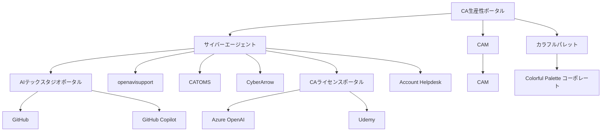

# CA Productivity Portal

サイバーエージェント生産性向上プラットフォーム提案書

---

# 1. エグゼクティブサマリー

- 「CA Productivity Portal」の構築を提案
- 目的：社外・社内ツールを網羅し、全従業員の生産性を最大化
- 対象：初期フェーズはエンジニア中心、半年以内に全職種へ拡大
- 主要機能：
  - Discovery（情報発見、比較、推奨）
    - 包括的ツールカタログ
    - AIパワード検索・推奨システム
  - Application（利用申請）
    - 統合申請ポータル
    - 新規ツール提案システム
- 期待効果：生産性30%向上、コスト20%削減、イノベーション加速

---

# 2. 背景と課題

<v-clicks>

## 2.1 急速な技術革新
- AI、クラウド、自動化ツールの進化加速
- 従業員が最新ツールに追いつけていない現状

## 2.2 生産性向上の緊急性
- 市場競争の激化による生産性向上の必要性
- イノベーションスピードの要求増大

## 2.3 ツール導入の非効率性
- 技術選定・検証プロセスに1-2ヶ月以上のリードタイム
- 部署ごとの個別選定による重複作業と非効率
- グループ全体での知見共有不足
- セキュリティ、法務、契約プロセスの煩雑さ

## 2.4 知識共有の不足
- ツール活用ノウハウの共有不足
- 部門間のベストプラクティス共有欠如

</v-clicks>

---

# 3. ビジョン

  <h2 class="text-3xl font-bold mt-10">
    「最先端ツールで、すべての従業員の潜在能力を解放する」
  </h2>

<v-clicks>

- 最適なツールを瞬時に発見、比較、導入
- ツールの効果を最大限に引き出す環境整備
- 個人の生産性を飛躍的に向上（目標：30%向上）
- 会社全体のイノベーションと成長を加速
- データドリブンな意思決定の促進
- AI時代に適応した新しい働き方の確立

</v-clicks>

---

# サポート内容

  

# サポート内容（続き）

  

---

# 4. 提案内容：CA Productivity Portal

<v-clicks>

## 4.1 Discovery機能
- 包括的ツールカタログ
  - 社内外のツールを網羅
  - 詳細な機能比較、ユーザーレビュー、導入事例
- AIパワード検索・推奨システム（来期以降）
  - ユーザーの役割、スキル、プロジェクトに基づいた推奨
- チュートリアルとベストプラクティス
- リアルタイム分析ダッシュボード（来期以降）
- カスタマイズ可能なワークフロー統合

## 4.2 Application機能
- 既存ツールの申請プロセス
  - 統合申請ポータル
  - 適切な申請フォームへの自動リダイレクト
- 新規ツールの申請プロセス
  - オープンな提案システム
  - DP室による初期評価
- 共通機能
  - 中央集権型ダッシュボード
  - 自動化されたコンプライアンスチェック

</v-clicks>

---

# システム構造

---

# 4.4 段階的展開計画

<v-clicks>

## フェーズ1：エンジニアリング部門（0-3ヶ月）
- 開発、IDE、テスト、デプロイメント関連ツールの統合
- CI/CD、コード品質、プロジェクト管理ツールの最適化
- AIコーディング支援ツールの優先導入
- 対象ツール例：GitHub, GitHub Copilot, Zenhub, Pager Duty

## フェーズ2：クリエイティブ＆マーケティング部門（4-5ヶ月）
- デザイン、コンテンツ制作、マーケティング自動化ツールの追加
- クリエイティブワークフロー最適化機能の実装
- 対象ツール例：Adobe Creative Suite, Figma, HubSpot

## フェーズ3：ビジネス＆管理部門、ゲーム・動画・音声制作部門（6ヶ月）
- 財務、HR、営業支援ツールの統合
- 全社的なデータ分析と意思決定支援機能の強化
- ゲーム開発、動画編集、音声制作関連ツールの統合
- 対象ツール例：Tableau, Workday, Unity, Adobe Premiere Pro

</v-clicks>

---

# 5. 期待される効果

<v-clicks>

1. 生産性の飛躍的向上
   - ツール導入・活用の最適化による作業効率30%向上
   - 部門間のベストプラクティス共有による相乗効果

2. イノベーションの加速
   - 最新テクノロジーの迅速な導入による競争優位性の確保
   - クロスファンクショナルな協業促進による新アイデアの創出

3. コスト削減と資源の最適化
   - ツールの重複排除とライセンス管理の一元化（推定20%のコスト削減）
   - 効果的なツール活用による人的リソースの最適配分

4. 従業員満足度の向上
   - 最適なツール提供によるストレス軽減と業務満足度向上
   - 継続的な学習と成長機会の提供

5. リスク管理の強化
   - セキュリティ、コンプライアンスの一元管理による脆弱性の低減
   - データガバナンスの強化とプライバシー保護の徹底

</v-clicks>

---

# 6. 実装ロードマップ

<v-clicks>

1. 企画・設計フェーズ（2ヶ月）
   - 要件定義、アーキテクチャ設計、UI/UXデザイン

2. コア機能開発（3ヶ月）
   - ツールカタログ、検索エンジン、導入フロー基盤の構築

3. セキュリティ・コンプライアンス対応（1ヶ月）
   - セキュリティ監査、法務レビュー、GDPR対応

4. パイロット運用・フィードバック（1ヶ月）
   - エンジニアリング部���での限定運用とフィードバック収集

5. 全社展開準備（2ヶ月）
   - フィードバックに基づく改善、マニュアル作成、社内啓蒙活動

6. 段階的全社展開（3ヶ月）
   - 部門ごとの展開、トレーニング実施、サポート体制の確立

7. Zendesk統合（2ヶ月）
   - 既存Zendeskインスタンスとの連携、自動ルーティングシステムの構築

8. Application機能のテストと最適化（1ヶ月）
   - エンドツーエンドのリクエストフローテスト、ユーザーフィードバックに基づく改善

</v-clicks>

---

# 7. 投資対効果（ROI）

<v-clicks>

- 初期投資：約2000万円（開発費、ライセンス費含む）
- 年間運用コスト：約800万円（人件費）

## 期待される年間効果
1. 生産性向上による利益増：20億円
   （従業員1人あたり年間100万円の生産性向上と仮定）
2. ツール最適化によるコスト削減：5億円
3. イノベーション促進による新規事業創出：10億円

**5年間のROI：約1000%**

具体的な計算：
(35億円 × 5年 - 2000万円 - 800万円 × 5年) ÷ (2000万円 + 800万円 × 5年) × 100 ≈ 1000%

</v-clicks>

---

# 8. リスクと対策

<v-clicks>

1. データセキュ��ティとプライバシー
   - 対策：最新の暗号化技術の採用、定期的な脆弱性診断の実施
   - 具体例：エンドツーエンド暗号化、多要素認証の導入

2. 従業員の抵抗感
   - 対策：段階的な導入、充実したトレーニングプログラム、成功事例の共有
   - 具体例：部門ごとのチャンピオンユーザー育成、定期的なワークショップ開催

3. システムの複雑化
   - 対策：モジュラー設計の採用、継続的な簡素化と最適化
   - 具体例：マイクロサービスアーキテクチャの採用、定期的なコードリファクタリング

4. ベンダーロックイン
   - 対策：オープンスタンダードの採用、マルチベンダー戦略の実施
   - 具体例：APIファーストアプローチ、複数のクラウドプロバイダーの利用

5. システム統合の複雑性
   - 対策：段階的な統合アプローチ、十分なテスト期間の確保、専門チームの編成
   - 具体例：統合テストの自動化、専門のインテグレーションチームの設置

6. ユーザー教育の必要性
   - 対策：包括的なトレーニングプログラムの実施、ユーザーガイドの作成、サポートデスクの設置
   - 具体例：オンデマンドビ��オトレーニング、インタラクティブなヘルプシステムの導入

</v-clicks>

---

# 9. 結論

<v-clicks>

- CA Productivity Portalは働き方を根本から変革
  - ツールの発見から導入までを一元化
  - 全従業員の潜在能力を最大限に引き出す環境を創出

- DiscoveryとApplicationの統合で生産性とイノベーションを促進
  - 最適なツールの迅速な導入と効果的な活用を実現
  - 部門を超えた知識共有とベストプラクティスの普及

- 業界リーダーとしての地位を確立
  - 最新テクノロジーの積極的導入による競争優位性の確保
  - データドリブンな意思決定による経営効率の向上

- 持続的な競争優位性を獲得
  - 継続的な改善サイクルによる組織の適応力強化
  - AI時代に適応した新しい働き方のモデルケース構築

- サイバーエージェントの未来を形作る重要な一歩
  - 全社的なデジタルトランスフォーメーションの加速
  - イノベーション文化の醸成と人材育成の強化

</v-clicks>

---

# 10. 将来の展望：公開ポータルと内部ポータルの統合

<v-clicks>

## 10.1 公開ポータル（外部向け）
- サイバーエージェントの技術力と革新的な取り組みのアピール
  - 採用中の最新技術やツールの紹介
  - 社内での革新的な活用事例の共有
- 優秀な人材の獲得
  - 技術ブログや登壇情報の集約
  - オープンソースプロジェクトへの貢献の可視化
- 業界内でのリーダーシップの確立
  - 最新のテクノロジートレンドに関する洞察の提供
  - 業界標準の形成に向けた取り組みの発信

## 10.2 内部ポータル（CA従業員専用）
- 厳格なアクセス管理
  - 多要素認証を用いた厳格なアクセス管理
  - 役職や部署に応じた詳細な権限設定

</v-clicks>

---

# 11. 懸念点と対策

<v-clicks>

## 11.1 他事業部CTOとのコンセンサス形成
- CTO統括室からの公式提案
- 各事業部CTOの運営メンバー参画
- FK氏の承諾獲得に注力
- AI事業部CTOの参画検討

## 11.2 チケットシステムの移行と統合
- 柔軟なインターフェース設計
- JIRA「チケット共有」機能の調査
- 大倉氏中心の運用体制確立
- チケットシステム統一ロードマップ作成

## 11.3 ツールリクエスト機能の重要性
- 使いやすいインターフェース設計
- 優先順位付けシステムの導入
- DP室による評価プロセス確立
- 定期的なリクエスト傾向分析

</v-clicks>

---

# 12. プロジェクト成功に向けた次のステップ

<v-clicks>

1. CTO統括室中心の公式プロジェクトチーム発足
2. 各事業部CTOとの個別ヒアリングと要望収集
3. FK氏を含むキーパーソンとの詳細な議論と承諾取得
4. チケットシステム統合に関する詳細調査と方針決定
5. プロトタイプ開発とユーザーテストの実施
6. 全社キックオフミーティングの開催と推進体制の確立

</v-clicks>

---

# 13. ネーミングとブランディング

<v-clicks>

## ネーミング：CA Productivity Portal
- 略称：CAPP

## ドメイン：ca-portal.pro

## ブランディング戦略
1. ロゴデザイン：CAコーポレートカラー + 生産性向上を象徴するモチーフ
2. キャッチフレーズ：
   - "Empowering Innovation, One Tool at a Time"
   - "Your Gateway to Peak Performance"
3. モダンでクリーンなビジュアルアイデンティティ
4. 内部での「CAPP」略称の積極使用
5. 外部への革新性と技術力のアピール

</v-clicks>

---

# Thank You

CA Productivity Portal で、サイバーエージェントの未来を創造しましょう！