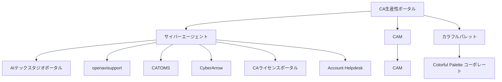

# CA Productivity Portal

サイバーエージェント生産性向上プラットフォーム提案書

---

# 1. エグゼクティブサマリー

<v-clicks>

- 「CA Productivity Portal」の構築を提案
- 社外・社内ツールを網羅し、全従業員の生産性を最大化
- 初期フェーズ：エンジニア中心
- 半年以内に全職種へ拡大
- 主要機能：
  - Discovery（情報発見、比較、推奨）
  - Application（利用申請）

</v-clicks>

---

# 2. 背景と課題

<v-clicks>

## 2.1 急速な技術革新
- AI、クラウド、自動化ツールの進化加速
- 従業員が最新ツールに追いつけていない

## 2.2 生産性向上の緊急性
- 市場競争の激化

## 2.3 ツール導入の非効率性
- 長期化する技術選定・検証プロセス
- 部署ごとの個別選定による重複作業
- グループ全体での知見共有不足
- 煩雑な承認プロセス

</v-clicks>

---

# 3. ビジョン

  <h2 class="text-3xl font-bold mt-10">
    「最先端ツールで、すべての従業員の潜在能力を解放する」
  </h2>

<v-clicks>

- 最適なツールを瞬時に発見、比較、導入
- 効果を最大限に引き出す
- 個人の生産性を飛躍的に向上
- 会社全体のイノベーションと成長を加速

</v-clicks>

---

# 4. 提案内容：CA Productivity Portal

<v-clicks>

## 4.1 Discovery機能
- 包括的ツールカタログ
- AIパワード検索・推奨システム（来期以降）
- チュートリアル等の閲覧
- リアルタイム分析ダッシュボード（来期以降）
- カスタマイズ可能なワークフロー統合

## 4.2 Application機能
- 既存ツールの申請プロセス
- 新規ツールの申請プロセス
- 共通機能（ダッシュボード、コンプライアンスチェック等）

</v-clicks>

---

# システム構造

---

# 4.4 段階的展開計画

<v-clicks>

## フェーズ1：エンジニアリング部門（0-3ヶ月）
- 開発、IDE、テスト、デプロイメント関連ツールの統合
- CI/CD、コード品質、プロジェクト管理ツールの最適化
- AIコーディング支援ツールの優先導入

## フェーズ2：クリエイティブ＆マーケティング部門（4-5ヶ月）
- デザイン、コンテンツ制作、マーケティング自動化ツールの追加
- クリエイティブワークフロー最適化機能の実装

<!-- ## フェーズ3：ビジネス＆管理部門、ゲーム・動画・音声制作部門（6ヶ月）
- 財務、HR、営業支援ツールの統合
- 全社的なデータ分析と意思決定支援機能の強化
- ゲーム開発、動画編集、音声制作関連ツールの統合 -->

</v-clicks>

---

# 5. 期待される効果

<v-clicks>

1. 生産性の飛躍的向上
2. イノベーションの加速
3. コスト削減と資源の最適化
4. 従業員満足度の向上
5. リスク管理の強化
6. データドリブンな経営判断
7. AI活用による革新的なワークスタイルの実現
8. 統合されたツール管理
9. コンプライアンスとセキュリティの強化

</v-clicks>

---

# 6. 実装ロードマップ

<v-clicks>

1. 企画・設計フェーズ（2ヶ月）
2. コア機能開発（3ヶ月）
3. セキュリティ・コンプライアンス対応（1ヶ月）
4. パイロット運用・フィードバック（1ヶ月）
5. 全社展開準備（2ヶ月）
6. 段階的全社展開（3ヶ月）
7. Zendesk統合（2ヶ月）
8. Application機能のテストと最適化（1ヶ月）

</v-clicks>

---

# 7. 投資対効果（ROI）

<v-clicks>

- 初期投資：約2000万円
- 年間運用コスト：約800万円

## 期待される年間効果
1. 生産性向上による利益増：20億円
2. ツール最適化によるコスト削減：5億円
3. イノベーション促進による新規事業創出：10億円

**5年間のROI：約1000%**

</v-clicks>

---

# 8. リスクと対策

<v-clicks>

1. データセキュリティとプライバシー
   - 対策：最新の暗号化技術、定期的な脆弱性診断

2. 従業員の抵抗感
   - 対策：段階的導入、トレーニング、成功事例共有

3. システムの複雑化
   - 対策：モジュラー設計、継続的な簡素化

4. ベンダーロックイン
   - 対策：オープンスタンダード、マルチベンダー戦略

5. システム統合の複雑性
   - 対策：段階的統合、十分なテスト、専門チーム編成

6. ユーザー教育の必要性
   - 対策：包括的トレーニング、ガイド作成、サポートデスク設置

</v-clicks>

---

# 9. 結論

<v-clicks>

- CA Productivity Portalは働き方を根本から変革
- 全従業員の潜在能力を最大限に引き出す
- DiscoveryとApplicationの統合で生産性とイノベーションを促進
- 業界リーダーとしての地位を確立
- 持続的な競争優位性を獲得
- サイバーエージェントの未来を形作る重要な一歩

</v-clicks>

---

# 10. 将来の展望：公開ポータルと内部ポータルの統合

<v-clicks>

## 10.1 公開ポータル（外部向け）
- サイバーエージェントの技術力と革新的な取り組みのアピール
- 優秀な人材の獲得
- 業界内でのリーダーシップの確立

## 10.2 内部ポータル（CA従業員専用）
- 厳格なアクセス管理
- NDA対象情報の管理
- 高度な分析機能

## 10.3 統合のメリット
- 一貫したブランディング
- 情報の適切な管理と活用
- 従業員のモチベーション向上
- 継続的な改善サイクルの確立

</v-clicks>

---

# 11. 懸念点と対策

<v-clicks>

## 11.1 他事業部CTOとのコンセンサス形成
- CTO統括室からの公式提案
- 各事業部CTOの運営メンバー参画
- FK氏の承諾獲得に注力
- AI事業部CTOの参画検討

## 11.2 チケットシステムの移行と統合
- 柔軟なインターフェース設計
- JIRA「チケット共有」機能の調査
- 大倉氏中心の運用体制確立
- チケットシステム統一ロードマップ作成

## 11.3 ツールリクエスト機能の重要性
- 使いやすいインターフェース設計
- 優先順位付けシステムの導入
- DP室による評価プロセス確立
- 定期的なリクエスト傾向分析

</v-clicks>

---

# 12. プロジェクト成功に向けた次のステップ

<v-clicks>

1. CTO統括室中心の公式プロジェクトチーム発足
2. 各事業部CTOとの個別ヒアリングと要望収集
3. FK氏を含むキーパーソンとの詳細な議論と承諾取得
4. チケットシステム統合に関する詳細調査と方針決定
5. プロトタイプ開発とユーザーテストの実施
6. 全社キックオフミーティングの開催と推進体制の確立

</v-clicks>

---

# 13. ネーミングとブランディング

<v-clicks>

## ネーミング：CA Productivity Portal
- 略称：CAPP

## ドメイン：ca-portal.pro

## ブランディング戦略
1. ロゴデザイン：CAコーポレートカラー + 生産性向上を象徴するモチーフ
2. キャッチフレーズ：
   - "Empowering Innovation, One Tool at a Time"
   - "Your Gateway to Peak Performance"
3. モダンでクリーンなビジュアルアイデンティティ
4. 内部での「CAPP」略称の積極使用
5. 外部への革新性と技術力のアピール

</v-clicks>

---

# Thank You

CA Productivity Portal で、サイバーエージェントの未来を創造しましょう！