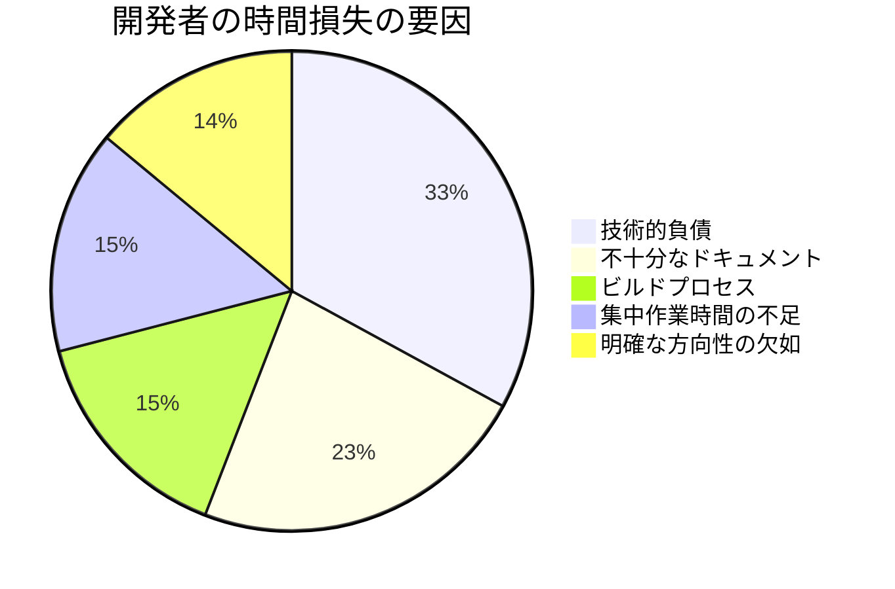
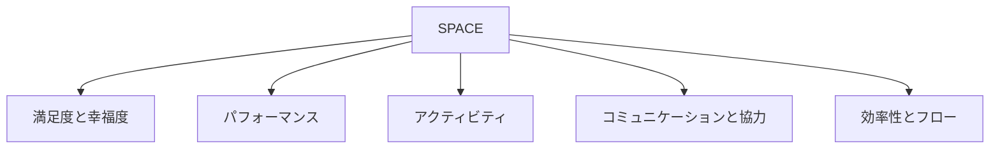
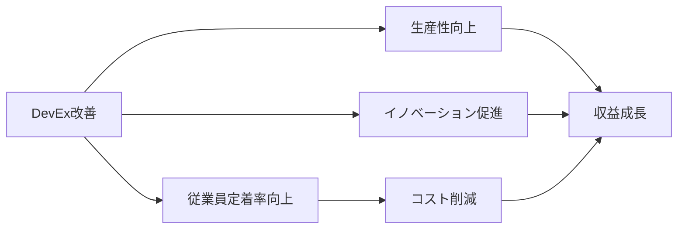

# DevExは究極のROI：開発者満足度が紐解く驚異の収益化

---
layout: two-cols
---

# 目次

<v-clicks>

1. 開発生産性の現状と課題
2. 従来のフレームワーク：DORAとSPACE
3. DevExの登場：新たなパラダイム
4. DevExの3つの次元と測定方法
5. DevExがROIに与える影響：事例研究
6. DX Core 4：統合フレームワークの紹介
7. DevEx導入のベストプラクティス
8. まとめ：DevExが切り開く未来

</v-clicks>

::right::

---

# 1. 開発生産性の現状と課題

<v-clicks>

- 2024年の現状：
  - 69%の開発者が週8時間以上を非効率的な作業に費やしている
  - 開発者の44%が技術的負債に悩まされている
  - 41%が不十分なドキュメンテーションに苦労している

- AIツールの導入状況：
  - 62%の開発者がAIツールによる生産性向上を実感できていない
  - しかし、61%が今後2年以内にAIツールが生産性を向上させると期待

- リーダーシップの認識：
  - 99%のリーダーが開発者の役割の複雑化を認識
  - 48%が人員不足を主な原因と考えている

</v-clicks>

 

---

# 生産性測定の課題

<v-clicks>

- 現在使用されている主な指標：
  1. コード量（55%が非効果的と評価）
  2. ストーリーポイント完了数（54%が非効果的）
  3. 労働時間（55%が非効果的）

- 問題点：
  - 69%の開発者が20%以上の時間を非効率的に過ごしている
  - 41%の組織が同じツールで生産性と満足度を測定

</v-clicks>

 

<table class="table-auto w-full">
  <thead>
    <tr>
      <th>測定方法</th>
      <th>使用率</th>
      <th>非効果的と評価</th>
    </tr>
  </thead>
  <tbody>
    <tr>
      <td>コード量</td>
      <td>高</td>
      <td>55%</td>
    </tr>
    <tr>
      <td>ストーリーポイント完了数</td>
      <td>高</td>
      <td>54%</td>
    </tr>
    <tr>
      <td>労働時間</td>
      <td>69%</td>
      <td>55%</td>
    </tr>
  </tbody>
</table>

---

# 2. 従来のフレームワーク：DORAとSPACE

<v-clicks>

## DORA (DevOps Research and Assessment)
- 4つの主要指標：
  1. デプロイ頻度
  2. リードタイム
  3. 変更失敗率
  4. 平均復旧時間（MTTR）

- 利点：
  - DevOpsパフォーマンスの包括的な評価
  - 業界ベンチマークとの比較が可能

- 限界：
  - ソフトウェア配信パフォーマンスに特化
  - 開発者の日常的な課題を捉えきれない

</v-clicks>

---

# SPACEフレームワーク

<v-clicks>

- 5つの次元：
  1. 満足度と幸福度（Satisfaction and well-being）
  2. パフォーマンス（Performance）
  3. アクティビティ（Activity）
  4. コミュニケーションと協力（Communication and collaboration）
  5. 効率性とフロー（Efficiency and flow）

- 利点：
  - 開発者生産性の多面的な捉え方
  - 主観的要素と客観的要素の統合

- 課題：
  - 具体的な測定方法が不明確
  - 組織への適用が複雑

</v-clicks>

 

---

# 3. DevExの登場：新たなパラダイム

<v-clicks>

## DevExとは
- 定義：開発者が自分の仕事について考え、感じ、価値を見出す方法
- 25以上の社会技術的要因が影響

## なぜDevExが重要か
- 86%のリーダーが優秀な人材の獲得・維持にDevExが不可欠と認識
- 63%の開発者が現職継続の判断にDevExを重視

## DevExの影響範囲
- 生産性向上
- 従業員満足度の増加
- エンゲージメントの向上
- 従業員の定着率改善

</v-clicks>

 

  

---

# 4. DevExの3つの次元と測定方法

## フィードバックループ
- 定義：行動に対する応答の速度と品質
- 例：
  - コードレビューのターンアラウンドタイム
  - CI結果生成時間
  - デプロイメントリードタイム

## 認知負荷
- 定義：タスク実行に必要な精神的処理量
- 例：
  - コードベースの複雑さの認識
  - デバッグの容易さ
  - ドキュメンテーションの理解しやすさ

## フロー状態
- 定義：完全に没頭し、エネルギッシュに集中できる状態
- 例：
  - 中断のない深い作業時間の満足度
  - タスクや目標の明確さ
  - オンコール待機の中断度

---

# DevExの測定方法

<v-clicks>

1. 知覚指標（開発者の態度や意見）
   - 例：自動テスト速度の満足度、コードベースの複雑さの認識
2. ワークフロー指標（システムと過程の動作）
   - 例：CI結果生成時間、変更をデプロイするための手動ステップ数
3. KPI（主要業績評価指標）
   - 例：ソフトウェア配信の容易さの全体的な認識、知覚された生産性

</v-clicks>

 

<table class="table-auto w-full">
  <thead>
    <tr>
      <th>フィードバックループ</th>
      <th>認知負荷</th>
      <th>フロー状態</th>
    </tr>
  </thead>
  <tbody>
    <tr>
      <td>コードレビューの満足度</td>
      <td>コードの理解しやすさ</td>
      <td>中断のない作業時間の満足度</td>
    </tr>
    <tr>
      <td>コードレビューターンアラウンドタイム</td>
      <td>ドキュメンテーション改善の頻度</td>
      <td>計画外タスクの頻度</td>
    </tr>
  </tbody>
</table>

---

# 5. DevExがROIに与える影響：事例研究

<v-clicks>

## McKinseyの調査結果
- 優れた開発者体験を提供する企業は、競合他社と比較して4〜5倍の収益成長を達成

## eBayの事例
- DevEx改善の結果：
  - リリース頻度が2倍に増加
  - デプロイのリードタイムが6分の1に短縮

## 経済的インパクト
- 500人規模の開発チームの例：
  - 週8時間の非効率性 = 年間約690万ドルのコスト
  - DevExの改善により、このコストの大部分を削減可能

</v-clicks>

 

---

# DevExがもたらす具体的な利益

<v-clicks>

1. 開発者の生産性向上
   - 効率的な作業により、より多くの機能をより早くリリース
   - 技術的負債の削減によるメンテナンスコストの低下

2. イノベーションの促進
   - フロー状態の増加により、創造性とイノベーションが向上
   - 新製品や機能の開発が加速

3. 従業員の定着率向上
   - 満足度の高い開発者は離職率が低下（63%の開発者がDevExを重視）
   - 採用・トレーニングコストの削減

4. 品質向上
   - バグの減少とセキュリティの向上
   - カスタマーサポートコストの削減と顧客満足度の向上

5. ビジネスの競争力強化
   - 市場投入までの時間短縮
   - 顧客ニーズへの迅速な対応

</v-clicks>

---

# 6. DX Core 4：統合フレームワークの紹介

<v-clicks>

- DORA、SPACE、DevExを統合した新しいフレームワーク
- 4つの主要次元：
  1. スピード
  2. 効果
  3. 品質
  4. ビジネスインパクト

- 特徴：
  - 多次元的アプローチ
  - 組織の全レベルをサポート
  - 数週間で導入可能
  - 恐怖やゲーミフィケーションを回避

</v-clicks>

 

<table class="table-auto w-full">
  <thead>
    <tr>
      <th>スピード</th>
      <th>効果</th>
      <th>品質</th>
      <th>インパクト</th>
    </tr>
  </thead>
  <tbody>
    <tr>
      <td>リードタイム</td>
      <td>開発者体験指数（DXI）</td>
      <td>変更失敗率</td>
      <td>新機能に費やす時間の割合</td>
    </tr>
    <tr>
      <td>デプロイ頻度</td>
      <td>エンジニアあたりのDiff数</td>
      <td>インシデント復旧時間</td>
      <td>イニシアチブの進捗とROI</td>
    </tr>
    <tr>
      <td>配信の知覚速度</td>
      <td>配信の容易さ</td>
      <td>エンジニアあたりのインシデント数</td>
      <td>エンジニアあたりの収益*</td>
    </tr>
  </tbody>
</table>

*組織レベルのみ

---

# 7. DevEx導入のベストプラクティス

<v-clicks>

1. ベースラインの確立
   - 自己報告データを活用した迅速な測定開始
   - システムデータの段階的な統合

2. 小規模から始める
   - 共通の問題点や改善領域の特定
   - 影響の大きい変更に焦点を当てる

3. 透明性のあるコミュニケーション
   - メトリクスの収集方法と使用目的の明確化
   - 全組織メンバーへの情報共有

4. 継続的な改善
   - 定期的なデータ収集と目標設定（3〜6ヶ月ごと）
   - 大規模な目標に対する進捗確認

5. 開発者の参加促進
   - 匿名の調査結果公開
   - 改善案への投票機会の提供

</v-clicks>

---
layout: two-cols
---

# 8. まとめ：DevExが切り開く未来

<v-clicks>

- DevExは開発者の生産性と満足度を向上させる鍵
- 3つの次元（フィードバックループ、認知負荷、フロー状態）に注目
- 適切な測定方法の採用が重要
- DevEx改善は大きなROIをもたらす
- DX Core 4は包括的で実用的なフレームワーク
- AI時代におけ