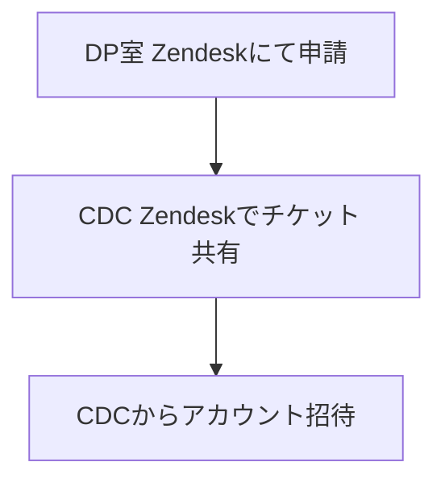
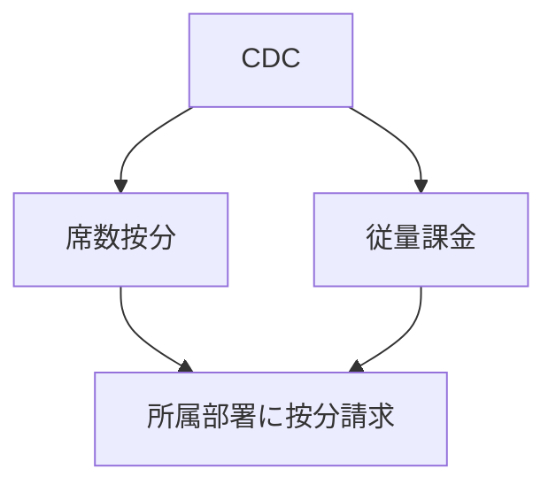

# <mdi-cursor-default-click class="text-blue-500" /> Cursor導入の提案

## 背景

- **生成AI活用コンサル**として、<mdi-office-building class="text-gray-600" /> DP室と<mdi-robot-industrial class="text-gray-600" /> AIオペ室の共同タスクフォースでツール導入の計画・検証を進めています。
- エンジニアの開発生産性向上に最も効果が高いツールとして、<mdi-star-circle class="text-yellow-500" /> **Cursor**の全社導入を決定しました。

## 先行導入ツールの選定

- <mdi-cursor-default-click class="text-blue-500" /> **Cursor**（インパクト：大）
- <mdi-flash class="text-green-500" /> **Dify**（インパクト：中）
- <mdi-github class="text-gray-800" /> **Copilot Code Review**（1月予定、インパクト：中）

---
layout: two-cols
---

# 開発環境（IDE）

## 旧IDE（テキストエディター）
ファイルごとの自動コードコンプリート
- <logos-visual-studio-code class="text-blue-500" /> VSCode
- <logos-intellij-idea class="text-orange-500" /> IntelliJ Idea 
- <logos-github-copilot class="text-gray-800" /> GitHub Copilot

::right::

## AI IDE（AIエージェント）
全体のコード理解し、自動コード生成・自動ツール実行
- <mdi-cursor-default-click class="text-blue-500" /> Cursor（VSCodeと互換性100%）
    - 最も熟成度・完成度高く・最も使われている
- <mdi-waves class="text-purple-500" /> Windsurf（VSCodeと互換性100%）
- <logos-replit-icon class="text-purple-500" /> Replit
- <mdi-lightning-bolt class="text-yellow-500" /> Bolt
- <mdi-robot class="text-gray-600" /> V0

---

# 申請時の問題解決

- 申請がスムーズに進むように、<mdi-account-tie class="text-red-500" /> **CTO統括室で各CTOの事前承認を取得**。

---

## Cursorとは

- <mdi-lightbulb-on class="text-yellow-500" /> OpenAIが出資する最先端のAIコーディングツール
- GitHub Copilotを超える高度な機能を提供：
  - <mdi-wand class="text-purple-500" /> インテリジェントなコード生成
  - <mdi-chat-processing class="text-green-500" /> 自然言語での対話によるコード編集・リファクタリング
  - <mdi-robot class="text-gray-600" /> Agent機能により、より高度な開発支援が可能に：
    - プロジェクト全体を理解したコード生成
    - 複数ファイルを跨いだリファクタリング
    - ツールの自動実行
    - アーキテクチャ設計の提案
- エンジニアの生産性を大幅に向上。
- 社内の好評の声：<mdi-comment-multiple class="text-blue-500" /> [Cursorの声](https://www.notion.so/Cursor-1469cd65444980c48538cf59cf75f494?pvs=21)
- 社内Slackチャンネル：<mdi-slack class="text-purple-500" /> `#ca-tech-cursor`

---
layout: image
image: cursor.png
---

---

## 導入にあたっての進め方

1. <mdi-account-group class="text-blue-500" /> **CDC**と各事業部の責任者を一つのCAチームにまとめ、管理を一元化。
2. <mdi-account-plus class="text-orange-500" /> アカウントの招待・削除管理は各事業責任者またはCDCが担当。
3. <mdi-cash-multiple class="text-yellow-500" /> 費用の按分はCDCが行います。

## 招待・管理方法

- <mdi-email-open class="text-purple-500" /> **招待の仕組み**
  - ドメインの縛り等は特にありません。
  - 管理画面から招待メールを送信、または招待リンクを配布します。
- <mdi-account-multiple class="text-green-500" /> **Team単位での設定適用について**
  - 個人向けの生産性ツールのため、情報漏洩の心配、共有設定などは、ほぼありません。
  - ビリング周りとアカウント管理のみです。

---

## Pricing・コスト管理

- <mdi-cash-register class="text-green-500" /> **Usage-based pricingの設定**
  - 基本的に有効化とし、無効化の要望がある事業部は管理から外れて自分たちで管理を案内。
  - <mdi-chart-donut class="text-blue-500" /> **按分方法**
    - ユーザーベース（メール単位）のRequests Usageの数字で按分。
  - <mdi-alert class="text-red-500" /> **ハードリミットの制限**
    - グループ全体で上限値を設定。業務に支障をきたさないように設定。
- <mdi-currency-usd class="text-blue-500" /> **支払いプラン**
  - ビジネスプラン以下はSSGからNGのため、ビジネスプランを選択。
  - <mdi-calendar-text class="text-blue-500" /> 年間払い（32$） または <mdi-calendar-month class="text-green-500" /> 月間払い（40$） の選択。

---

## 管理・運用に関するポイント

- <mdi-account-key class="text-red-500" /> **各事業部の責任者にAdminを付与するか**
  - 現時点の機能では必要ありません。
- <mdi-chart-line class="text-green-500" /> **ユーザーごとの使用量の把握**
  - CDCに定期的にデータを出力してもらい、Slackで共有。
- <mdi-shield-account class="text-gray-600" /> **Adminが他事業部メンバーの権限を持つ必要性**
  - 現時点では不要です。
- <mdi-account-switch class="text-purple-500" /> **兼務社員の対応**
  - GitHubなどの他ツールと同様のルールで対応。
- <mdi-account-cog class="text-blue-500" /> **事業責任者によるメンバー管理**
  - GitHubなどの他ツールと同様のルールで対応。

---

## 申請フロー

## 削除フロー

---

## 毎月のCursor請求フロー

- **説明**:
  - <mdi-numeric-1-circle class="text-green-500" /> **請求1**: 席数按分（GitHubと同様）
  - <mdi-numeric-2-circle class="text-yellow-500" /> **請求2**: ユーザーごとの従量課金（GitHub Actionsと同様）

---

## 決定が必要なポイント

- **支払いプランの選択**（<mdi-calendar-text class="text-blue-500" /> 年間払い or <mdi-calendar-month class="text-green-500" /> 月間払い）
- **Usage-based pricingの有効化**と**ハードリミットの設定**
- **請求フロー**
- **管理・請求用に関する各種権限設定**
