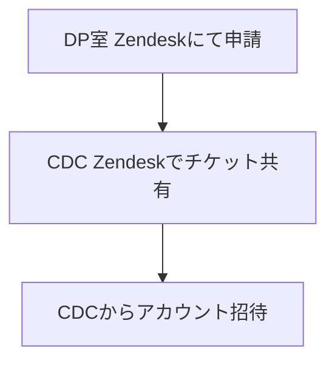
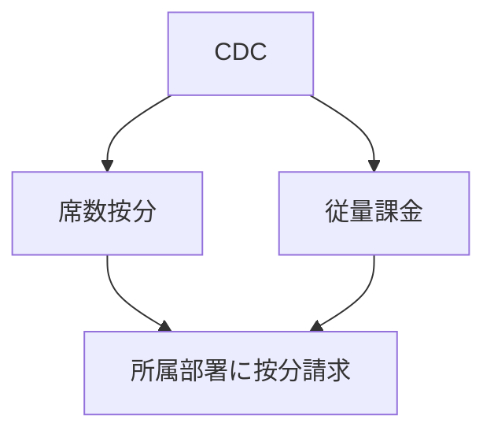

# Cursor導入の提案

## 背景

- **生成AI活用コンサル**として、DP室とAIオペ室の共同タスクフォースでツール導入の計画・検証を進めています。
- エンジニアの開発生産性向上に最も効果が高いツールとして、**Cursor**の全社導入を決定しました。

## 先行導入ツールの選定

- **Cursor**（インパクト：大）
- **Dify**（インパクト：中）
- **Copilot Code Review**（1月予定、インパクト：中）

---

# 申請時の問題解決

- 申請がスムーズに進むように、**CTO統括室で各CTOの事前承認を取得**。

---

## Cursorとは

- OpenAIが出資する最先端のAIコーディングツール
- GitHub Copilotを超える高度な機能を提供：
  - インテリジェントなコード生成
  - 自然言語での対話によるコード編集・リファクタリング
  - Agent機能により、より高度な開発支援が可能に：
    - プロジェクト全体を理解したコード生成
    - 複数ファイルを跨いだリファクタリング
    - ツールの自動実行
    - アーキテクチャ設計の提案
- エンジニアの生産性を大幅に向上。
- 社内の好評の声：[Cursorの声](https://www.notion.so/Cursor-1469cd65444980c48538cf59cf75f494?pvs=21)
- 社内Slackチャンネル：`#ca-tech-cursor`

---
layout: image
image: cursor.png
---

---

## 導入にあたっての進め方

1. **CDC**と各事業部の責任者を一つのCAチームにまとめ、管理を一元化。
2. アカウントの招待・削除管理は各事業責任者またはCDCが担当。
3. 費用の按分はCDCが行います。

## 招待・管理方法

- **招待の仕組み**
  - ドメインの縛り等は特にありません。
  - 管理画面から招待メールを送信、または招待リンクを配布します。
- **Team単位での設定適用について**
  - 個人向けの生産性ツールのため、情報漏洩の心配、共有設定などは、ほぼありません。
  - ビリング周りとアカウント管理のみです。

---

## Pricing・コスト管理

- **Usage-based pricingの設定**
  - 基本的に有効化とし、無効化の要望がある事業部は管理から外れて自分たちで管理を案内。
  - **按分方法**
    - ユーザーベース（メール単位）のRequests Usageの数字で按分。
  - **ハードリミットの制限**
    - グループ全体で上限値を設定。業務に支障をきたさないように設定。
- **支払いプラン**
  - ビジネスプラン以下はSSGからNGのため、ビジネスプランを選択。
  - 年間払い（32$） または 月間払い（40$） の選択。

---

## 管理・運用に関するポイント

- **各事業部の責任者にAdminを付与するか**
  - 現時点の機能では必要ありません。
- **ユーザーごとの使用量の把握**
  - CDCに定期的にデータを出力してもらい、Slackで共有。
- **Adminが他事業部メンバーの権限を持つ必要性**
  - 現時点では不要です。
- **兼務社員の対応**
  - GitHubなどの他ツールと同様のルールで対応。
- **事業責任者によるメンバー管理**
  - GitHubなどの他ツールと同様のルールで対応。

---

## 申請フロー

## 削除フロー

---

## 毎月のCursor請求フロー

- **説明**:
  - **請求1**: 席数按分（GitHubと同様）
  - **請求2**: ユーザーごとの従量課金（GitHub Actionsと同様）

---

## 決定が必要なポイント

- **支払いプランの選択**（年間払い or 月間払い）
- **Usage-based pricingの有効化**と**ハードリミットの設定**
- **請求フロー**
- **管理・請求用に関する各種権限設定**
