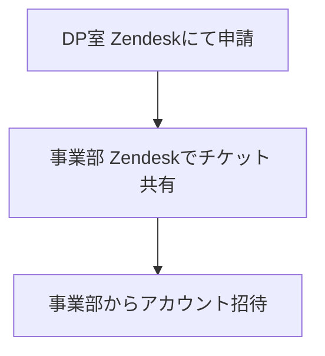

# <mdi-cursor-default-click class="text-blue-500" /> Cursor導入の提案

## 背景

- **生成AI活用コンサル**として、<mdi-office-building class="text-gray-600" /> DP室と<mdi-robot-industrial class="text-gray-600" /> AIオペ室の共同タスクフォースでツール導入の計画・検証を進めています。
- エンジニアの開発生産性向上に効果が高いツールとして、<mdi-star-circle class="text-yellow-500" /> **Cursor**の**事業部・プロジェクト単位での導入**を進めたい。

---

## 導入にあたっての進め方

1. <mdi-account-group class="text-blue-500" /> **各事業部・プロジェクトごとに導入を推進**。
2. <mdi-account-plus class="text-orange-500" /> 契約や請求処理は**各事業部・プロジェクト単位**で実施。
3. <mdi-cash-multiple class="text-yellow-500" /> **Cursorの利用が全社的に広がった場合**、<mdi-account-group class="text-blue-500" /> **CDCでの一元管理**。

---

## 招待・管理方法

- <mdi-ticket class="text-purple-500" /> **申請の流れ**
  - <mdi-office-building class="text-gray-600" /> DP室のZendeskで申請を受け付け
  - 申請を受けた後、該当事業部の担当者とコンタクトを取り、導入を進めます
  - 1次申請はDP室のZendeskと各事業部のZendeskと連携を取る
  - 管理・運用は各事業部・プロジェクトに移管


- <mdi-email-open class="text-purple-500" /> **招待の仕組み**
  - 各事業部・プロジェクトで管理。
  - 管理画面から招待メールを送信、または招待リンクを配布します。

---

## Pricing・コスト管理

- <mdi-cash-register class="text-green-500" /> **Usage-based pricingの設定**
  - 各事業部・プロジェクトで設定を管理。
  - **ハードリミットの制限**も各自で設定。

- <mdi-currency-usd class="text-blue-500" /> **支払いプラン**
  - 年間払い（32$） または 月間払い（40$）を事業部・プロジェクトの判断で選択。

--- 

## 管理・運用に関するポイント

- <mdi-account-key class="text-red-500" /> **各事業部・プロジェクトが独自にAdminを設定**。
- <mdi-chart-line class="text-green-500" /> **ユーザーごとの使用量の把握**
  - 各事業部・プロジェクトで管理。

---

## 申請フロー



---

## 毎月のCursor請求フロー

```mermaid
flowchart TD
    各事業部・プロジェクト[<mdi-office-building class="text-gray-600" /> 各事業部・プロジェクト] --> 請求[<mdi-cash-register class="text-green-500" /> Cursorから直接請求]
```

---

## 2つの導入パターンの比較

### 各導入パターンの概要

1. **各事業部が推進・管理・按分する**
   - 事業部単位でCursorを導入し、管理と費用按分を実施。
2. **CDCでCAグループ一元管理する（現状のIntelliJ、GitHub Copilot）**
   - CDCが全社的に管理し、統一的に導入。

---

### 導入パターンのメリット・デメリット

| 導入パターン | メリット | デメリット |
|---|---|---|
| **1) 各事業部が推進・管理・按分する** | - 事業部ごとのニーズに合わせた柔軟な導入<br>- 能動的な事業部では効果的 | - 按分・管理担当者の不在による導入遅延<br>- 事業部間での導入状況の不均衡<br>- 管理コストの増加 |
| **2) CDCでCAグループ一元管理する** | - 全社的な統一管理・統制が可能<br>- ライセンス費用の削減（ボリュームディスカウント）<br>- セキュリティ・コンプライアンスの強化 | - 大規模な決裁プロセスが必要<br>- 役員レベルでの承認が必要 |

---

### 導入パターンの比較と結論

- **パターン1**は事業部ごとに適した導入ができるが、推進体制が整っていないと導入が進まないリスクが高い。
- **パターン2**は全社的な統一管理が可能であり、長期的な視点では有効だが、導入にはCopilotと同様に役員の承認が必要。

**結論**：

- **短期的にはパターン1**を採用し、各事業部での導入を推進する。
  - 能動的な事業部から導入を開始し、成功事例を共有。
  - 次のステップまでの目標（要すり合わせ）：
    - 2025年Q1までに3事業部での導入
    - 各事業部で最低10名以上の利用者
- **中長期的にはパターン2**への移行を検討する。
  - 全社的な需要と効果を踏まえ、CDCでの一元管理を行う。
    - 全社導入が役員レベルで決定され次第、実施で問題ない。
