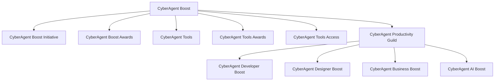

# CyberAgent Boost 包括的ブランディング戦略

**〜生産性向上への全社的取り組み〜**

---

## 目次

1. はじめに
2. ブランドコンセプト
3. ブランド構成
4. ブランド構造のビジュアル化
5. 各プロジェクトの詳細
6. コミュニケーション戦略
7. 期待される効果
8. 今後のステップ

---

## 1. はじめに

- **目的**：サイバーエージェント全体で生産性を向上させるための統合的なブランディング戦略を提案します。
- **背景**：
  - 既存の取り組みを統合し、社内外への認知度を高めたい。
  - 生産性向上に向けた定量的・定性的な取り組みを促進。

---

## 2. ブランドコンセプト

### **ブランド名：CyberAgent Boost**

- **キーワード**：Boost（向上、加速）
- **コンセプト**：生産性向上への全社的な取り組みを統合し、社員一人ひとりのパフォーマンスを最大化。

---

## 3. ブランド構成

1. **CyberAgent Boost Initiative**
2. **CyberAgent Boost Awards**
3. **CyberAgent Tools**
4. **CyberAgent Tools Awards**
5. **CyberAgent Tools Access**
6. **CyberAgent Productivity Guild**
   - **CyberAgent Developer Boost**
   - **CyberAgent Designer Boost**
   - **CyberAgent Business Boost**
   - **CyberAgent AI Boost**

---

## 4. ブランド構造のビジュアル化

---

## 5. 各プロジェクトの詳細

### 1. CyberAgent Boost Initiative

- **目的**：生産性指標を向上させるための全社的な取り組み
- **特徴**：定量的（DORA、SPACEなど）および定性的な指標の両面からアプローチ
- **取り組み内容**：
  - データ分析による課題抽出
  - 改善策の実施と効果測定
  - 社員参加型のワークショップ開催

---

## 5. 各プロジェクトの詳細

### 2. CyberAgent Boost Awards

- **目的**：生産性向上に貢献したチームや個人を表彰
- **効果**：
  - モチベーションの向上
  - 成功事例の共有
- **表彰内容**：
  - 年間MVPチーム・個人
  - 最優秀改善プロジェクト

---

## 5. 各プロジェクトの詳細

### 3. CyberAgent Tools

- **目的**：生産性向上に役立つツールの情報や比較を提供
- **特徴**：
  - 職種を問わず利用可能
  - ユーザーレビューや活用事例の掲載
- **提供内容**：
  - ツールの機能比較
  - 導入手順とサポート情報

---

## 5. 各プロジェクトの詳細

### 4. CyberAgent Tools Awards

- **目的**：生産性向上に貢献した優れたツールを表彰
- **効果**：
  - ツール開発者・提供者のモチベーション向上
  - 社内外でのツール活用促進
- **表彰部門**：
  - ベストイノベーションツール
  - ユーザー満足度No.1ツール

---

## 5. 各プロジェクトの詳細

### 5. CyberAgent Tools Access

- **目的**：従業員が必要なツールを迅速に導入できる申請・承認システム
- **効果**：
  - ツール導入のスピードアップ
  - 管理部門との連携強化
- **機能**：
  - オンライン申請フォーム
  - 承認プロセスの自動化

---

## 5. 各プロジェクトの詳細

### 6. CyberAgent Productivity Guild

- **目的**：職種を超えて生産性向上を推進する横断的なコミュニティ組織
- **特徴**：
  - 知識共有と共同学習の場
  - 社員同士のネットワーキング促進
- **活動内容**：
  - 定期ミーティング
  - ナレッジベースの構築

---

## 5. 各プロジェクトの詳細

#### 子組織

- **CyberAgent Developer Boost**
  - **対象**：開発者
  - **目的**：開発者の生産性向上
  - **活動内容**：コードレビューの標準化、開発ツールの最適化

---

- **CyberAgent Designer Boost**
  - **対象**：デザイナー
  - **目的**：デザイナーの生産性向上
  - **活動内容**：デザインシステムの共有、クリエイティブツールの導入

---

- **CyberAgent Business Boost**
  - **対象**：ビジネス職
  - **目的**：ビジネス職の生産性向上
  - **活動内容**：営業プロセスの効率化、CRMツールの活用

---

- **CyberAgent AI Boost**
  - **対象**：全職種
  - **目的**：AI技術を活用した生産性向上
  - **活動内容**：AIツールの導入支援、AI人材の育成

---

## 6. コミュニケーション戦略

### 社内向け

- **イントラネットでの情報共有**
  - 専用ページの開設
  - 定期的なニュース配信

- **ワークショップ・セミナー**
  - 生産性向上のためのスキルアップ
  - ツールの使い方講座

- **成功事例の共有**
  - 社内報や掲示板での紹介
  - 社員インタビュー

---

### 社外向け

- **専用ウェブサイトの開設**
  - 取り組み内容や成果を公開
  - 採用ブランディング強化

- **プレスリリースとメディア露出**
  - 新しい取り組みや成果を発信
  - 業界誌やオンラインメディアでの露出

- **ソーシャルメディアでの情報発信**
  - TwitterやLinkedInでの発信
  - ハッシュタグキャンペーン

---

## 7. 期待される効果

- **統一感のあるブランドイメージの確立**
  - 社内外での認知度向上
  - 企業ブランド価値の向上

- **生産性向上への社員エンゲージメント向上**
  - モチベーションアップ
  - 離職率の低下

- **業績向上と企業価値の向上**
  - 生産性向上によるコスト削減
  - 売上・利益の増加

- **社外へのポジティブな企業イメージの発信**
  - 優秀な人材の採用促進
  - パートナー企業からの信頼向上

---

## 8. 今後のステップ

1. **経営陣からの承認取得**
   - 提案内容の最終確認
   - 予算とリソースの確保

2. **プロジェクトチームの編成**
   - 各部門からのメンバー選出
   - 役割と責任の明確化

3. **詳細な実施計画の策定**
   - スケジュール作成
   - KPIの設定

4. **施策の実行とモニタリング**
   - 定期的な進捗報告
   - 課題の抽出と改善

---

---

