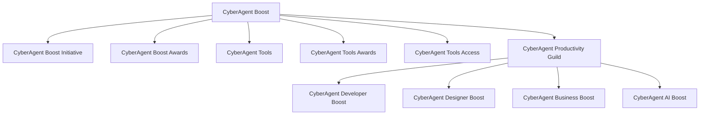

# <mdi-rocket class="text-blue-500" /> CyberAgent Boost 包括的ブランディング戦略

**〜生産性向上への全社的取り組み〜** <mdi-trending-up class="text-green-500" />

---

## <mdi-format-list-bulleted /> 目次

1. はじめに
2. ブランドコンセプト
3. ブランド構成
4. ブランド構造のビジュアル化
5. 各プロジェクトの詳細
6. コミュニケーション戦略
7. 期待される効果
8. 今後のステップ

---

## <mdi-flag class="text-blue-500" /> 1. はじめに

- **目的** <mdi-target />：サイバーエージェント全体で生産性を向上させるための統合的なブランディング戦略を図る。
- **背景** <mdi-history />：
  - 既存の取り組みを統合し、社内外への認知度を高めたい。
  - 生産性向上に向けた定量的・定性的な取り組みを促進。

---

## <mdi-lightbulb class="text-yellow-500" /> 2. ブランドコンセプト

### **ブランド名：CyberAgent Boost** <mdi-rocket-launch class="text-purple-500" />

- **キーワード** <mdi-key />：Boost（向上、加速）
- **コンセプト** <mdi-star class="text-yellow-500" />：生産性向上への全社的な取り組みを統合し、社員一人ひとりのパフォーマンスを最大化。

---

## <mdi-chart-timeline class="text-blue-500" /> 3. ブランド構成

1. **CyberAgent Boost Initiative** <mdi-flag />
2. **CyberAgent Boost Awards** <mdi-trophy class="text-yellow-500" />
3. **CyberAgent Tools** <mdi-tools />
4. **CyberAgent Tools Awards** <mdi-medal />
5. **CyberAgent Tools Access** <mdi-key-variant />
6. **CyberAgent Productivity Guild** <mdi-account-group />
   - **CyberAgent Developer Boost** <mdi-code-tags />
   - **CyberAgent Designer Boost** <mdi-palette />
   - **CyberAgent Business Boost** <mdi-briefcase />
   - **CyberAgent AI Boost** <mdi-robot />

---

## <mdi-sitemap class="text-purple-500" /> 4. ブランド構造のビジュアル化

---

## <mdi-file-document class="text-blue-500" /> 5. 各プロジェクトの詳細

### 1. CyberAgent Boost Initiative <mdi-flag-variant class="text-green-500" />

- **目的** <mdi-target />：生産性指標を向上させるための全社的な取り組み
- **特徴** <mdi-star />：定量的（DORA、SPACEなど）および定性的な指標の両面からアプローチ
- **取り組み内容** <mdi-format-list-checks />：
  - <mdi-chart-box /> データ分析による課題抽出
  - <mdi-cog /> 改善策の実施と効果測定
  - <mdi-account-group /> 社員参加型のワークショップ開催

---

## <mdi-file-document class="text-blue-500" /> 5. 各プロジェクトの詳細

### 2. CyberAgent Boost Awards <mdi-trophy class="text-yellow-500" />

- **目的** <mdi-target />：生産性向上に貢献したチームや個人を表彰
- **効果** <mdi-star />：
  - <mdi-rocket /> モチベーションの向上
  - <mdi-share-variant /> 成功事例の共有
- **表彰内容** <mdi-medal />：
  - <mdi-crown class="text-yellow-500" /> 年間MVPチーム・個人
  - <mdi-star class="text-yellow-500" /> 最優秀改善プロジェクト

---

## <mdi-bullhorn class="text-blue-500" /> 6. コミュニケーション戦略

### 社内向け <mdi-office-building />

- **イントラネットでの情報共有** <mdi-web />
  - <mdi-file-document /> 専用ページの開設
  - <mdi-newspaper /> 定期的なニュース配信

- **ワークショップ・セミナー** <mdi-school />
  - <mdi-trending-up /> 生産性向上のためのスキルアップ
  - <mdi-teach /> ツールの使い方講座

- **成功事例の共有** <mdi-trophy class="text-yellow-500" />
  - <mdi-newspaper-variant /> 社内報や掲示板での紹介
  - <mdi-account-voice /> 社員インタビュー

---

### 社外向け <mdi-earth />

- **専用ウェブサイトの開設** <mdi-web class="text-blue-500" />
  - <mdi-file-document /> 取り組み内容や成果を公開
  - <mdi-account-group /> 採用ブランディング強化

- **プレスリリースとメディア露出** <mdi-newspaper-variant />
  - <mdi-bullhorn /> 新しい取り組みや成果を発信
  - <mdi-television /> 業界誌やオンラインメディアでの露出

- **ソーシャルメディアでの情報発信** <mdi-twitter class="text-blue-400" />
  - <mdi-twitter /> TwitterやLinkedInでの発信
  - <mdi-pound /> ハッシュタグキャンペーン

---

## <mdi-chart-bar class="text-green-500" /> 7. 期待される効果

- **統一感のあるブランドイメージの確立** <mdi-image-filter-vintage />
  - 社内外での認知度向上
  - 企業ブランド価値の向上

- **生産性向上への社員エンゲージメント向上** <mdi-heart class="text-pink-500" />
  - モチベーションアップ
  - 離職率の低下

- **業績向上と企業価値の向上**
  - 生産性向上によるコスト削減
  - 売上・利益の増加

- **社外へのポジティブな企業イメージの発信**
  - 優秀な人材の採用促進
  - パートナー企業からの信頼向上

---

## <mdi-stairs class="text-purple-500" /> 8. 今後のステップ

1. **経営陣からの承認取得** <mdi-check-circle class="text-green-500" />
   - 提案内容の最終確認
   - 予算とリソースの確保

2. **プロジェクトチームの編成** <mdi-account-group class="text-blue-500" />
   - 各部門からのメンバー選出
   - 役割と責任の明確化

3. **詳細な実施計画の策定**
   - スケジュール作成
   - KPIの設定

4. **施策の実行とモニタリング**
   - 定期的な進捗報告
   - 課題の抽出と改善

---

# <mdi-rocket class="text-purple-500" /> CyberAgent Boostブランド足元で進む施策

## <mdi-run class="text-green-500" /> 現在進行中の施策

### 1. 既存プロジェクトのリブランディング <mdi-refresh class="text-blue-500" />
- **開発速度アゲ太郎** → **CyberAgent Boost Initiative** <mdi-arrow-right-bold />
  - <mdi-chart-line /> 開発生産性向上の取り組みを全社的な視点で再構築
  - <mdi-professional-hexagon /> より包括的で専門性の高いブランドイメージへ

### 2. 新規プロジェクトの始動 <mdi-rocket-launch class="text-orange-500" />
- **CyberAgent Boost Guild**の立ち上げ <mdi-account-group class="text-blue-500" />
  - <mdi-account /> 元基さんと一緒に「新しいコミュニティ形成」
  - <mdi-share-variant /> 職種横断的な知見共有の場を創出

### 3. 実施方針 <mdi-flag-checkered />
- <mdi-office-building /> 既存組織構造は維持
- <mdi-bullhorn /> 社内外向けのブランディング強化に重点
- <mdi-stairs-up /> 段階的な展開による円滑な移行

