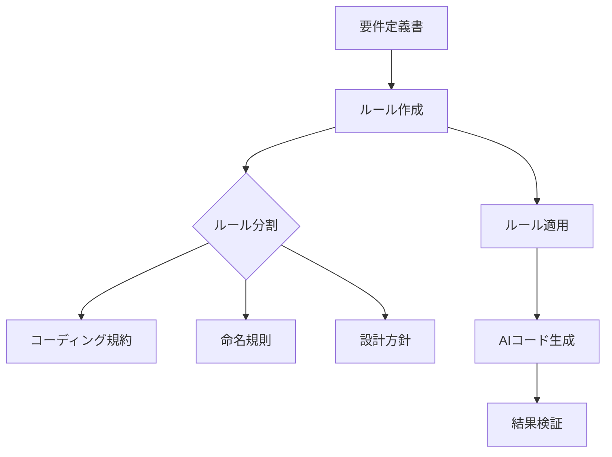

## 表紙

```
# Cursor導入支援 for Developers
ハンズオン資料
```

---

## スライド 1: なぜ今、私たちは AIコーディングに移行するのか？

### トレンド

- **AIコーディング関連のキーワード検索の全世界のトレンド推移（Google Trends）**
  - 期間：2024年11月～2025年4月
  - 横軸：24/11, 24/12, 25/01, 25/02, 25/03, 25/04
  - 縦軸：検索指数（最も人気のある時期を100とし、他の時期を相対的に表現）

> - AIコーディング関連の検索トレンドは上昇傾向  
> - 2025年4月前半のZennのトレンドの半数がAI関連  
> - 3月から急上昇  
> - エンジニアのAIへの関心が高まってきている

---

## スライド 2: AIコードエディタの導入企業の事例

### 企業事例

1. **株式会社ココナラ**
   - AIコードツール「Cursor」の Business プランを導入
   - 社内デザインシステムをMCPサーバー化

2. **Ubie株式会社**
   - エンジニアの生成AIツールによる満足度向上と仕事に対するモチベーションの大幅アップ
   - 新しい技術やツールを活用する文化の醸成
   - 部署間での活発な情報共有とノウハウの横展開

- Cursorから指示するだけでFigmaデザインに沿った要素を生成し、UI実装が爆速に  
- 月額$40の投資がコード補完による生産性向上で十分に回収可能

#### スライド内イメージ例

```
Figmaのデザイン → Cursorが生成したUI
```

---

## スライド 3: コーディング時間の半減を期待できる

- AIエージェントは GitHub Issue の解決精度ベンチマーク SWE-bench で最大65.40%の解決率を達成  
  - 検証対象：人間によって解決可能とされた500件の問題サブセット
- この結果から、3分の2の機能追加やバグ修正タスクをAIが行える時代になってきている

---

## スライド 4: Cursorのご紹介

### Cursorとは

- AIとのシームレスな統合を通じて、開発者の生産性を飛躍的に向上させるコードエディタ  
- VSCodeをフォークして開発されているため、既存のVSCodeユーザーは設定や拡張機能を引き継いでスムーズに移行可能
- 従来のエディタのオートコンプリートを超え、**コードの記述・編集・デバッグ・理解** までを再定義  
- 「単なるツール」ではなく **“AIペアプログラマー”** としての役割を目指す

#### 参考URL

- Cursor公式：https://www.cursor.com/  
- Cursor日本語：https://www.cursor.com/

---

## スライド 5: 基本機能

1. **インライン編集**  
   - コードを選択して編集内容を指示すると、自動で編集が反映される

2. **AIチャット**  
   - 開いているファイルやカーソル位置を自動認識し、コードに関する質問に回答

3. **エージェント（Agent）**  
   - 複雑なタスクを計画からコード変更まで一貫して実行

#### モード切替

- 選択したコードに対して `Cmd + K`, `Cmd + L` → 「Chat」モード  
- カーソル位置で `Cmd + L` → 「Agent」モード

---

## スライド 6: ユースケース | コーディング

- **チャットで「〜を実装してほしい」と説明**  
  - 他の実装内容に沿うようにコードを自動生成
- **関連コードを自動調査して参照**  
  - プロジェクト内の既存コードをAIが参照し、矛盾なくコードを生成
- **複数指示でも計画してステップ実行**  
  - 大きな変更も「タスク分解」して順番に実行
- **生成コードにエラーが発生すると自動修正**  
  - ビルドエラーやLintエラーを検出し、修正案を提示・適用

---

## スライド 7: 利用可能なモデル（2025年5月26日現在）

| ベンダー    | モデル                              |
|-------------|-------------------------------------|
| OpenAI      | gpt-4.5-preview, gpt-4.5, gpt-4, o4-mini, o3 |
| Google      | gemini-2.5-pro-max, gemini-2.5-flash-preview, gemini-2.0-pr |
| Anthropic   | claude-4-sonnet-max, claude-4-sonnet, claude-4-opu, claude-3.7-sonnet |
| DeepSeek    | （非推奨） deepseek-r, deepseek-v, deepseek-v3 |
| xAI         | grok-3-bet, grok-…（省略）         |
| Cursor独自   | cursor-fast, cursor-small         |

- 最新モデルを使用してコーディングが可能  
- 基本料金とは別に従量課金が発生  
- タスクに適したモデルを自動選択するモードもあり

---

## スライド 8: モデルの比較（相対評価）

| モデル                     | コード生成精度 | 最大入力トークン数 | 画像認識 | 数学 | 推論 | 速度     | おすすめ場面                                                         |
|----------------------------|---------------:|-------------------:|--------:|----:|----:|--------:|-----------------------------------------------------------------------|
| o3                         | ★★★☆☆         | 20万               | -       | -   | -   | 高速     | 日常的なコーディング                                                  |
| GPT-4.1 / Claude 4 Sonnet  | ★★★★★         | 100万              | あり     | あり | あり | 遅い     | より複雑なデバッグ、アルゴリズム作成（最も高コスト）                     |
| Gemini 2.5 Pro / Flash     | ★★★★☆         | 100万              | -       | -   | -   | 中速     | 画像や図からUIを実装したいとき、プロジェクト横断的な解析                 |
| Cursor-fast / Cursor-small | ★★★☆☆         | 20万               | -       | -   | -   | 速い     | すぐに回答が欲しいとき                                                 |

> **別途ベンチマーク情報**  
> - SWE-bench Verified による評価  
> - MMLU による評価  
> - AIME 2024 による評価  
> - GPQA Diamond による評価  
> - Cursor利用時の所感で評価（プロジェクト横断の解析）

#### モデル選びの公式ガイド
- https://docs.cursor.com/guides/selecting-models

---

## スライド 9: 類似エディタとの比較

| 比較項目               | Cursor       | GitHub Copilot | Windsurf   | Cline       |
|------------------------|-------------:|---------------:|----------:|------------:|
| プロジェクトコンテキスト処理能力 | 高い           | 中程度         | 低い       | 低い         |
| 高度なコード補完       | ○            | ○             | △         | △           |
| 複雑なタスク実行       | ○            | △             | ×         | ×           |
| 選べるモデルの数       | 多い           | 少ない         | 少ない     | 非対応       |
| 基本料金               | 0～$40/月     | 無料～         | ￥?        | ￥?         |
| CA（CyberAgent）での価格 | Enterprise $15/月～ | 無料           | -          | -            |
| ターゲット             | プロ開発者     | 広範な開発者     | 初心者～中級者 | 中級者         |

---

## スライド 10: Cursorの応用

### “@” Symbols

- **フォルダ内ファイルやWebを簡単にメンション**  
  - 例：「@<ファイル名>」と書くと、そのファイルを参照して回答・コード生成  
  - 例：「@Web<URL>」と書くと、必要な情報をウェブから検索して取得  
  - ファイル名やURLを「@」で指定可能

### オートランモード（旧名: Yoloモード）

- Agentモードでは、コード以外にコマンドの実行もサジェスト  
- 予め許可したコマンドはユーザー承認なしで自動実行  
- メリット：開発速度向上  
- デメリット：予期しない操作リスクあり  
- 許可コマンド・拒否コマンドを細かく設定可能

---

## スライド 11: Rules（Project rules）

- **プロジェクト固有のコーディング規約、ガイドライン、背景知識など**をAIに事前に教え込む機能

1. `.cursor/rules/` フォルダー内にMarkdown形式（`.mdc`）でルールを記述
2. ルールはGit管理を推奨
3. チーム全体で開発標準の一貫性を保てる
4. チャット欄で `/Generate Cursor Rules` を実行すると、会話内容をもとにルールを生成可能
5. ルールは**分割記述可能**、発動条件も指定可能

---

## スライド 12: ルールのベストプラクティス | 整頓

- 回答生成に必要な情報を**過不足なく・整頓して揃える**
- AIに期待通りのアウトプットをさせるには、各タスクで「どのタイミングで、どの情報・ツールを参照するか」を明確に定めることが重要
- **必要資料例**  
  - 要件定義書  
  - ER図  
  - 画面遷移図  
  - フレームワークや標準仕様のリファレンス  
  - ログ  
  - READMEなど 周辺情報



---

## スライド 13: ルールのベストプラクティス | 明文化

- 開発ルールの**明文化**が必須
  - 暗黙知や人間ならではの常識を捨て、「命名規則」「コードスタイル」「設計方針」「パターン」などを言語化
  - ドキュメントの書き方も言語化しておくとさらに良い
  - チームの熟練者がAIに直接伝えるイメージ

> 詳細 → [Software Architecture in an AI-Driven World (Speaker Deck)](https://speakerdeck.com/atty303/software-architecture-in-an-ai-driven-world?slide=6)

---

## スライド 14: ルールのベストプラクティス | 見直し

- ルール運用体制を整え、継続的に見直しを実施
- ルール見直しタスクをスプリントに組み込むのを検討  
- ルールの編集はAIに任せても良い  
  - チャットログやコードベースからルールを書き換える指示が可能
  - チャット欄で `/Generate Cursor Rules` を実行して更新


---

## スライド 15: ユースケース | 繰り返し作業の自動化

- **繰り返し作業をプロンプトファイルとして保存**  
  - 「これ実行して」と指示するだけでCursorが一連の操作を実行  
  - ファイル化することでプロンプトの再利用が可能  
  - 複数ファイルにまたがる操作も自動化できる

---

## スライド 16: ユースケース | AIにプロンプトを編集させる

- プロンプトそのものをAIに編集依頼  
- AIにとってわかりやすい書き方で仕様変更を反映
- 専門用語を逐一確認するフローを作成し、ハルシネーションを防止
- 知見をメモとして残すことで、次回以降の作業がスムーズに

---

## スライド 17: ユースケース | コミットメッセージ作成

- コミットメッセージ欄右の「キラキラマーク」をクリックすると、AIがコミットメッセージを自動生成  
- コミットメッセージの書き方もRulesで指定可能

---

## スライド 18: MCPとの連携

### MCPとは（Model Context Protocol）

- LLMアプリ（例：Cursor）と外部サービスを連携するプロトコル  
- クライアント/サーバー型アーキテクチャを採用

### 社内利用可能なMCPサーバーの紹介

> - SSGからの注意喚起により、公式提供のMCPサーバーは一定の信頼をおいて良い  
> - 非公式MCPサーバーは悪意あるコードが埋め込まれている可能性があるため注意

#### 参考リンク

- 公式CursorMCPサーバー一覧

Cursor v1 でワンクリックインストール。
https://docs.cursor.com/tools

---

## スライド 19: MCP導入方法

1. **MCPサーバーを用意**  
2. `.cursor/mcp.json` にMCPサーバー設定を記述  
3. Cursor設定の「MCP」欄からMCPサーバーを有効化  

---

## スライド 20: ユースケース | GitHub Issue の解決コードを作成

- GitHub公式MCPを利用  
  - リポジトリ名と解決したいIssueを指定するだけで、Issue情報取得 → 解決コードを生成

```bash
# 使用例
# - 必要：GitHubトークン、Docker環境
# - リポジトリ名とIssue番号を指定
```

- GitHub Issue MCP→ https://github.com/github/github-mcp-server

---

## スライド 21: ユースケース | CloudWatch Logs の分析

- AWS公式MCPを利用  
  - AWS認証情報と解析対象ログを指定するだけでロググループ検索 → ログ取得 → 解決コード生成

> - ログがうまく拾えない場合は、RulesでCloudWatchロググループの検索方法を明確化すると改善

- CloudWatch Logs MCP → https://github.com/awslabs/Log-Analyzer-with-MC

---

## スライド 22: ユースケース | より信頼性が高いインフラ設計

- AWS公式MCPを利用  
  - Best Practiceに基づいたインフラ設計をAIがサジェスト  
  - draw.ioのアーキテクチャ図も生成可能

> - 詳細 → https://github.com/awslabs/mcp  
> - 社内Slackチャンネル（aws MCP 情報など）

---

## スライド 23: ハンズオン

- **ブラウザと連携した開発を体験**  
  - 神経衰弱サイトを作成  
  - Playwright MCP を利用し、UI/UXにもこだわったサイトを構築

---

## スライド 24: 前提準備
@environment.md


---

## スライド 25: 新規プロジェクトを立ち上げる

1. 任意のフォルダを作成し、Cursorで開く  
   - メニュー → 「ファイル」 → 「フォルダーを開く…」  
   - またはターミナルで `code .` を実行して開く

2. **Windowsユーザー（任意）**  
   - コマンドプロンプトを標準ターミナルに設定  
     - 設定 → 「規定のターミナル」 → 「Command Prompt」

---

## スライド 26: Node.jsを利用できる状態にする

- Playwright MCPのインストールにNode.jsが必要  
- プロジェクトでNode.jsを利用できるように、ターミナルで以下を実行：
  ```bash
  npm init -y
  ```

---

## スライド 27: Playwright MCP をインストールして有効化

1. ターミナルで：
   ```bash
   npm i @playwright/mcp -D
   ```
2. プロジェクトルートに `.cursor/mcp.json` を作成し、以下を記述：
   ```json
   {
     "mcpServers": {
       "playwright": {
         "command": "npx",
         "args": ["@playwright/mcp@latest"]
       }
     }
   }
   ```
3. Cursor設定画面の「MCP」欄でPlaywrightを有効化

---

## スライド 28: エージェントに作ってほしいサイトを説明する

- `Cmd + L` → チャットを開き、「Agent」モードになっていることを確認  
- 例：「神経衰弱ができるサイトを作ってほしい」とお願い

---

## スライド 29: 生成されたコードを承認（Accept）

- 生成されたコードに問題なければ、チャット欄の「Accept all」またはファイルごとの「Accept file」をクリック

---

## スライド 30: 生成されたサイトを確認

- `index.html` をブラウザで開き、生成サイトを確認  
- ターミナルで `open .` を実行すると、Finder/Explorerが開く

---

## スライド 31: チャットで改善点を伝える

- UI/UX改善や不具合修正をチャットで指示  
- AIが再度コード生成 → Accept で反映

---

## スライド 32: 実際にできたサイトをAIに見に行かせて改善させる

- Playwright MCP を使うことで、AIが **実際にブラウザを操作** して動作確認可能  
- 「Playwright MCP を使ってください」とルールに明記するとベター

---

## スライド 33: Playwright MCP でできること

- **ブラウザ操作**：ページ移動、タブ操作、ウィンドウサイズ変更など  
- **要素操作**：クリック、テキスト入力、ホバーなど  
- **スクリーンキャプチャ**：スクリーンショット取得、アクセシビリティ 
スナップショット取得  
- **ログ取得**：コンソールログ、ネットワークリクエスト監視など

---

## スライド 34: セキュリティ | プライバシーモード

- プライバシーモード有効化で、ユーザーがエディタ上で扱うコード（チャット内容含む）がCursorサーバーやAI応答生成ストレージに平文で永久保存されるのを防止
- プライバシーモード利用者のコードは、**絶対に学習データに使用されない** と明記  
- Businessプランでは強制的にプライバシーモードオン

> “The code data submitted by privacy mode users will never be trained on.”  
> https://trust.cursor.com/ja/security

---

## スライド 35: セキュリティとコンプライアンス

- **SOC 2 Type I, Type II 認証** 取得  
- 第三者セキュリティ専門企業による年1回以上の侵入テスト実施  
- 生成AI利用ガイドラインver2.2以降でCursor利用許可  
  - https://git-generative-ai.services.isca.jp/guideline/
