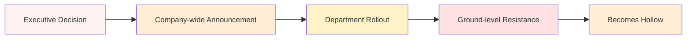
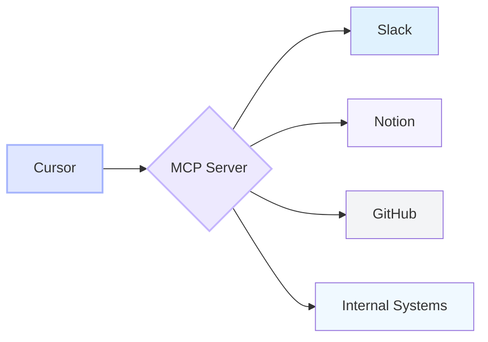

# Breaking Down Enterprise AI Tool Adoption Barriers in Japan
## CyberAgent's Cursor Implementation Strategy

 

  <mdi-cursor-default-outline class="text-purple-400" />
  Cursor Meetup Tokyo 2025

 

  

    <strong>Günther Brunner</strong>
  

  <mdi-briefcase-variant class="text-gray-400" />
  

    CyberAgent, Inc.
  

<!--
【Slide 1】
Good evening everyone! Thank you so much for joining us tonight - over 5,000 attendees!
For the next 15 minutes, let's explore the future of AI coding together.
I'll share how CyberAgent adopted Cursor, the challenges we faced, and what we learned.
Whether you're an engineer, designer, or CEO - let's build the future together!
-->

---

# Why Are We Transitioning to AI Coding Now?

  <mdi-earth class="text-blue-400 text-2xl" />
  <h2 class="text-2xl font-bold m-0">Global Trends</h2>

  <h4 class="flex items-center gap-2 text-lg">
    <mdi-trending-up class="text-green-500" />
    AI Coding Keyword Search Trends
  </h4>
  

    

      November 2024
      

        

          

        

        45
      

    

    

      January 2025
      

        

          

        

        68
      

    

    

      March 2025
      

        

          

        

        92
      

    

    

      April 2025
      

        

          

        

        100
      

    

  

  <emojione-flag-for-japan class="text-2xl" />
  <h2 class="text-2xl font-bold m-0">Japan's Current State</h2>

  

    <mdi-fire class="text-red-500 text-3xl" />
    

      
50% of Japan blog entry trends are AI-related

      
(April 2025)

    

  

  
  

    <mdi-account-group class="text-yellow-600 text-3xl" />
    
Rapid shift in engineering communities

  

  
  

    <mdi-rocket-launch class="text-green-600 text-3xl" />
    
Major transition from traditional development

  

 

  <mdi-format-quote-open class="text-3xl text-purple-400" />
  Not using AI for development is like doing accounting without a calculator
  <mdi-format-quote-close class="text-3xl text-purple-400" />

<!--
【Slide 2】
First, why AI coding now?
Look at Google Trends. Search volume has more than doubled in just six months.
The surge since March isn't coincidental.
In Japan, half of Zenn's trending topics are AI-related.
This is a tide we can't ignore anymore.
-->

---

# Latest AI Code Editor Adoption Cases

  <table class="w-full">
    <thead>
      <tr class="bg-gradient-to-r from-purple-500 to-blue-500 text-white">
        <th class="p-3 text-left rounded-tl-lg">
          

            <mdi-office-building class="text-xl" />
            Company
          

        </th>
        <th class="p-3 text-left">
          

            <mdi-tools class="text-xl" />
            Tool Adopted
          

        </th>
        <th class="p-3 text-left">
          

            <mdi-chart-line class="text-xl" />
            Results
          

        </th>
        <th class="p-3 text-left rounded-tr-lg">
          

            <mdi-cash-multiple class="text-xl" />
            ROI
          

        </th>
      </tr>
    </thead>
    <tbody>
      <tr class="border-b hover:bg-gray-50 transition-colors">
        <td class="p-3 font-semibold">Coconala Inc.</td>
        <td class="p-3">
          Cursor Business
        </td>
        <td class="p-3">
          

            <mdi-speedometer class="text-green-500" />
            UI implementation 10x faster
          

        </td>
        <td class="p-3">$40/month delivering millions in labor savings annually</td>
      </tr>
      <tr class="border-b hover:bg-gray-50 transition-colors">
        <td class="p-3 font-semibold">Ubie, Inc.</td>
        <td class="p-3">
          Multiple AI Dev Tools
        </td>
        <td class="p-3">
          

            <mdi-emoticon-happy class="text-yellow-500" />
            Engineer satisfaction 85% increase
          

        </td>
        <td class="p-3">Reduced hiring costs through lower turnover</td>
      </tr>
      <tr class="hover:bg-gray-50 transition-colors">
        <td class="p-3 font-semibold">Major Tech Company</td>
        <td class="p-3">
          Cursor + MCP
        </td>
        <td class="p-3">
          

            <mdi-clock-fast class="text-blue-500" />
            Development cycle 60% shorter
          

        </td>
        <td class="p-3">3x feature release frequency</td>
      </tr>
    </tbody>
  </table>

 

  

    <mdi-currency-usd class="text-green-600 text-3xl" />
    $40/month investment yields 10x productivity for $100K+ engineers
    <mdi-rocket class="text-blue-600 text-3xl" />
  

<!--
【Slide 3】
Let's look at real adoption cases.
Coconala generates UI directly from Figma using Cursor - 10x faster implementation.
10x! What used to take a week now takes half a day.
Ubie saw 85% improvement in engineer satisfaction.
This is crucial - it means your best engineers don't leave.
Considering hiring costs, the ROI is astronomical.
-->

---
layout: intro
---

# About Me

  <h2 class="text-3xl font-bold">
    Günther Brunner
  </h2>
  

    
    CyberAgent since 2012
  

<h3 class="flex items-center gap-2 mb-4">
  <mdi-office-building class="text-orange-500" />
  Current Position
</h3>

  

    <mdi-cog class="text-orange-600" />
    CTO Office
  

  

    <mdi-rocket-launch class="text-teal-600" />
    Developer Productivity Division
  

<h3 class="flex items-center gap-2 mb-4">
  <mdi-account-network class="text-blue-500" />
  Connect with me
</h3>

  

    <mdi-twitter class="text-blue-600" />
    @gunta85
  

  

    <mdi-github class="text-gray-600" />
    @gunta
  

  

    <mdi-book-open class="text-blue-600" />
    zenn.dev/gunta
  

<!--
【Slide 5】
Let me introduce myself briefly.
I'm Günther Brunner, been with CyberAgent since 2012.
Currently working in the CTO Office's Developer Productivity Division.
Passionate about AI, UX, design, and performance.
Recently started exploring AI art personally too.
-->

---

# My 12-Year Journey at CyberAgent

<h2 class="flex items-center gap-2 text-xl mb-4">
  <mdi-newspaper class="text-purple-600" />
  Media Division
</h2>
<ul class="space-y-2 list-disc list-inside">
  <li>Cultivating service mindset</li>
  <li>Enhancing UX design skills</li>
  <li>User-centered thinking</li>
</ul>

<h2 class="flex items-center gap-2 text-xl mb-4 mt-6">
  <mdi-gamepad-variant class="text-orange-600" />
  Gaming Division
</h2>
<ul class="space-y-2 list-disc list-inside">
  <li>Pushing frontend tech to limits</li>
  <li>Performance optimization</li>
  <li>Exploring interactive experiences</li>
</ul>

<h2 class="flex items-center gap-2 text-xl mb-4">
  <mdi-chart-line class="text-green-600" />
  Cross-functional Division
</h2>
<ul class="space-y-2 list-disc list-inside">
  <li>SLO (Service Level Objectives)</li>
  <li class="font-bold text-green-700">Developer Productivity ⬅️ 🚀 (Current focus)</li>
  <li>Cross-team improvement initiatives</li>
</ul>

<h2 class="flex items-center gap-2 text-xl mb-4 mt-6">
  <mdi-robot class="text-indigo-600" />
  AI Division
</h2>
<ul class="space-y-2 list-disc list-inside">
  <li>Backend technology acquisition</li>
  <li>Mastering Figma</li>
  <li>Practical GenAI applications</li>
  <li>Staying on cutting edge</li>
</ul>

<!--
【Slide 6】
Let me share my 12-year journey at CyberAgent.
Media division taught me UX design, Gaming pushed my frontend skills to the extreme.
Cross-functional work focused on developer productivity, AI division keeps me on the cutting edge.
Now I leverage all this experience as a full-stack AI engineer and designer.
-->

---

# My Mission

<h3 class="flex items-center gap-2 text-xl mb-4">
  <mdi-target class="text-indigo-500" />
  Personal Goals
</h3>

  

    <mdi-rocket class="text-indigo-600" />
    Bring Japan's dev culture to the forefront
  

  

    <mdi-account-group class="text-purple-600" />
    Enhance developer experience
  

  

    <mdi-lightbulb class="text-blue-600" />
    Promote new technology adoption
  

  

    <mdi-earth class="text-green-600" />
    Implement global standards
  

<h3 class="flex items-center gap-2 text-xl mb-4">
  <mdi-wrench class="text-orange-500" />
  Concrete Actions
</h3>

  

    <mdi-robot class="text-orange-600" />
    AI tool implementation
  

  

    <mdi-school class="text-red-600" />
    Developer education & advocacy
  

  

    <mdi-account-group class="text-yellow-600" />
    Community building
  

  

    <mdi-trending-up class="text-pink-600" />
    Demonstrating productivity gains
  

 

  

    <mdi-heart class="text-purple-600 text-3xl" />
    I'm here to make the world better through technology
  

<!--
【Slide 7】
Let me share my mission.
My personal goal: bring Japan's development culture to the global forefront.
Specifically: promoting AI tools, developer education, community activities.
All to improve developer productivity and happiness.
Making the world better through technology - that's my belief.
-->

---

# Tool Migrations I've Championed

  <h2 class="flex items-center justify-center gap-2 text-2xl">
    <mdi-swap-horizontal class="text-indigo-500" />
    History of Transformation
  </h2>

  

    SVN
    <mdi-arrow-right class="text-green-600 text-xl" />
    GitHub
    <mdi-check-circle class="text-green-600 ml-auto text-xl" />
  

  
  

    HipChat
    <mdi-arrow-right class="text-green-600 text-xl" />
    Slack
    <mdi-check-circle class="text-green-600 ml-auto text-xl" />
  

  
  

    Confluence
    <mdi-arrow-right class="text-green-600 text-xl" />
    Notion
    <mdi-check-circle class="text-green-600 ml-auto text-xl" />
  

  
  

    JIRA
    <mdi-arrow-right class="text-yellow-600 text-xl" />
    Linear
    <mdi-sync class="text-yellow-600 ml-auto text-xl animate-spin" />
  

  
  

    IDE
    <mdi-arrow-right class="text-purple-600 text-xl" />
    Cursor
    <mdi-fire class="text-purple-600 ml-auto text-xl" />
    (Now!)
  

<!--
【Slide 6】
Look at my track record. I championed Slack and GitHub adoption.
Successfully migrated to Notion. Now pushing Linear.
But Cursor is my biggest challenge yet.
Because this isn't just a tool change. It's a work revolution.
-->

---

# Why I've Been Following Cursor for 2 Years

  

    

      <mdi-calendar class="text-white text-xl" />
    

  

  

    <h3 class="font-bold text-lg">Late 2022</h3>
    <ul class="space-y-2 mt-2">
      <li class="flex items-center gap-2">
        <mdi-chevron-right class="text-blue-400" />
        OpenAI invested in an IDE
      </li>
    </ul>
  

  

    

      <mdi-lightbulb class="text-white text-xl" />
    

  

  

    <h3 class="font-bold text-lg">Early 2023</h3>
    <ul class="space-y-2 mt-2">
      <li class="flex items-center gap-2 font-bold text-purple-600">
        <mdi-star class="text-purple-500" />
        Discovered Cursor's early version
      </li>
      <li class="flex items-center gap-2">
        <mdi-format-quote-open class="text-purple-400" />
        "This is revolutionary" - my gut feeling
        <mdi-format-quote-close class="text-purple-400" />
      </li>
    </ul>
  

  

    

      <mdi-rocket class="text-white text-xl" />
    

  

  

    <h3 class="font-bold text-lg">Mid 2023</h3>
    <ul class="space-y-2 mt-2">
      <li class="flex items-center gap-2">
        <mdi-chevron-right class="text-green-400" />
        Started using it daily
      </li>
      <li class="flex items-center gap-2">
        <mdi-chevron-right class="text-green-400" />
        Productivity clearly improved
      </li>
    </ul>
  

 

  

    <mdi-eye-outline class="text-3xl text-purple-600" />
    Great tools reveal the future the moment you use them
    <mdi-sparkles class="text-3xl text-blue-600" />
  

<!--
【Slide 6】
Why have I been using Cursor for 2 years?
Late 2022, when OpenAI released Codex API, I knew.
The future of coding was changing.
And the moment I met Cursor, I thought "This is it!"
The instant I used it, I knew this would become the future standard.
-->

---
layout: center
---

# Part 1: CyberAgent - A Unique Enterprise

  <mdi-office-building class="text-blue-500" />
  <mdi-account-group class="text-purple-500" />

<h2 class="text-3xl mb-2">10,000+ Employees</h2>
<h3 class="text-2xl text-gray-600 mb-8">~3,000 Engineers</h3>

  

    <mdi-hand-peace class="text-green-600" />
    "Freedom and Self-Responsibility"
    - That's our culture
    <mdi-fire class="text-green-600" />
  

<!--
【Slide 7】
Let's get to the main topic.
First, you need to understand what kind of company CyberAgent is.
10,000+ employees, 3,000 engineers.
But we're completely different from typical large corporations.
"Freedom and Self-Responsibility" - that's the foundation of everything.
-->

---

# CyberAgent by the Numbers

<h2 class="flex items-center gap-2 text-2xl mb-4">
  <mdi-chart-pie class="text-blue-500" />
  Organization Scale
</h2>

  

    

      

        <mdi-account-multiple class="text-blue-600" />
        Employees
      

      10,000+
    

  

  
  

    

      

        <mdi-code-braces class="text-purple-600" />
        Engineers
      

      ~3,000
    

  

  
  

    

      

        <mdi-domain class="text-green-600" />
        Subsidiaries
      

      100+
    

  

  
  

    

      

        <mdi-slack class="text-pink-600" />
        Slack Workspaces
      

      100+
    

  

<h2 class="flex items-center gap-2 text-2xl mb-4">
  <mdi-palette-swatch class="text-orange-500" />
  Technical Diversity
</h2>

  

    

      

        <mdi-language-python class="text-orange-600" />
        Languages Used
      

      20+
    

  

  
  

    

      

        <mdi-view-dashboard class="text-red-600" />
        Frameworks
      

      50+
    

  

  
  

    

      

        <mdi-cloud class="text-indigo-600" />
        Cloud Providers
      

      AWS, GCP, All
    

  

  
  

    

      

        <mdi-cog class="text-yellow-600" />
        Dev Practices
      

      Team-specific
    

  

 

  

    <mdi-infinity class="text-3xl text-purple-600" />
    Unification is impossible. That's what makes it interesting.
    <mdi-creation class="text-3xl text-pink-600" />
  

<!--
【Slide 8】
The numbers reveal the chaos of this company.
100+ subsidiaries, 100+ Slack workspaces.
Different technologies and languages everywhere.
Normal companies would say "let's standardize."
Not us. This chaos is our source of innovation.
-->

---

# CyberAgent's Organizational Culture

<h2 class="flex items-center gap-2 text-2xl mb-4">
  <mdi-office-building class="text-blue-500" />
  Hundreds of Subsidiaries
</h2>

  

    <mdi-crown class="text-blue-600 text-xl" />
    Independent management authority
  

  

    <mdi-slack class="text-blue-600 text-xl" />
    Separate Slack workspaces
  

  

    <mdi-puzzle class="text-blue-600 text-xl" />
    Autonomous tech stack decisions
  

<h2 class="flex items-center gap-2 text-2xl mb-4">
  <mdi-rocket-launch class="text-purple-500" />
  Bottom-up Culture
</h2>

  

    <mdi-close-circle class="text-purple-600 text-xl" />
    No top-down directives
  

  

    <mdi-account-heart class="text-purple-600 text-xl" />
    Teams choose independently
  

  

    <mdi-fire class="text-orange-600 text-xl" />
    "Learn freely, try freely, fail freely"
  

 

  

    <mdi-city class="text-indigo-600 text-3xl" />
    A large corporation with hundreds of startups inside
    <mdi-rocket class="text-purple-600 text-3xl" />
  

<!--
【Slide 9】
This is our culture.
Each subsidiary is completely independent, CEOs can even decide tech stacks.
"Learn freely, try freely, fail freely" - that's our motto.
We're a large corporation with hundreds of startups inside.
-->

---

# The Beauty and Challenges of This Culture

<h2 class="flex items-center gap-2 text-2xl mb-4">
  <mdi-star class="text-yellow-500" />
  The Beauty
</h2>

  

    <mdi-lightbulb-on class="text-yellow-600 text-xl" />
    Innovation thrives
  

  

    <mdi-target class="text-green-600 text-xl" />
    Teams choose optimal tech
  

  

    <mdi-shield-off class="text-blue-600 text-xl" />
    Fearless failure culture
  

  

    <mdi-flash class="text-purple-600 text-xl" />
    Rapid decision making
  

<h2 class="flex items-center gap-2 text-2xl mb-4">
  <mdi-puzzle-outline class="text-red-500" />
  The Challenges
</h2>

  

    <mdi-link-variant-off class="text-red-600 text-xl" />
    Company-wide tool adoption is hard
  

  

    <mdi-share-variant class="text-orange-600 text-xl" />
    Information sharing silos
  

  

    <mdi-arrow-expand-all class="text-gray-600 text-xl" />
    Hard to spread best practices
  

  

    <mdi-scatter-plot class="text-indigo-600 text-xl" />
    "Everyone's different"
  

 

  

    <mdi-scale-balance class="text-3xl text-purple-600" />
    Freedom is wonderful. But sometimes unity is needed.
  

<!--
【Slide 10】
This culture is amazing, but it has challenges.
Innovation thrives, but company-wide adoption is incredibly hard.
We can't just say "everyone use this starting tomorrow."
But that's what makes it an interesting challenge.
-->

---

# Traditional Tool Adoption Approach (Failed)

 

  

    <mdi-alert-circle class="text-red-600 text-3xl" />
    "Top-down doesn't work here"
  

<!--
【Slide 11】
In normal companies: executives decide, company-wide announcement, done.
But that completely fails here.
Ground teams ask "why?" and resist, nobody uses it.
We've failed many times this way.
So we needed a different approach.
-->

---

# Viral Strategy: The Only Way to Adopt Tools

  <h2 class="flex items-center justify-center gap-2 text-3xl">
    <mdi-virus class="text-purple-500" />
    Information must "infect" to spread
  </h2>

  

    <h3 class="font-bold text-lg mb-2 flex items-center justify-center gap-2"><mdi-account-group class="text-blue-600 text-2xl" />Step 1</h3>
    
Small Team Success

    <ul class="text-sm text-gray-600 list-disc list-inside mt-2 text-left">
      <li>Build track record</li>
      <li>Visualize impact</li>
    </ul>
  

  

    <h3 class="font-bold text-lg mb-2 flex items-center justify-center gap-2"><mdi-bullhorn class="text-green-600 text-2xl" />Step 2</h3>
    
Evangelism Activities

    <ul class="text-sm text-gray-600 list-disc list-inside mt-2 text-left">
      <li>Internal workshops</li>
      <li>Slack advocacy</li>
      <li>Success story sharing</li>
    </ul>
  

  

    <h3 class="font-bold text-lg mb-2 flex items-center justify-center gap-2"><mdi-youtube class="text-orange-600 text-2xl" />Step 3</h3>
    
Public Events to Amplify

    <ul class="text-sm text-gray-600 list-disc list-inside mt-2 text-left">
      <li>YouTube streaming</li>
      <li>External attention</li>
      <li>Internal interest spark</li>
    </ul>
  

<!--
【Slide 12】
So I chose the viral strategy.
Like a virus, "infect" with information.
Start small, create success stories.
Share on Slack, hold workshops.
But that wasn't enough. We needed a final move.
-->

---

# Why Internal Efforts Have Limits

<h2 class="flex items-center gap-2 text-2xl mb-4">
  <mdi-office-building-cog class="text-red-500" />
  Internal Walls
</h2>

  

    <mdi-wall class="text-red-600 text-xl" />
    Information silos between subsidiaries
  

  

    <mdi-file-eye-outline class="text-red-600 text-xl" />
    Treated as "another company's case"
  

  

    <mdi-lightbulb-off-outline class="text-red-600 text-xl" />
    NIH syndrome (Not Invented Here)
  

  

    <mdi-account-group-outline class="text-red-600 text-xl" />
    Seen as internal politics
  

<h2 class="flex items-center gap-2 text-2xl mb-4">
  <mdi-earth class="text-blue-500" />
  External Power
</h2>

  

    <mdi-scale-balance class="text-blue-600 text-xl" />
    Objective evaluation
  

  

    <mdi-trending-up class="text-blue-600 text-xl" />
    Recognition as industry trend
  

  

    <mdi-weight-lifter class="text-blue-600 text-xl" />
    Pressure and motivation
  

  

    <mdi-shield-star class="text-blue-600 text-xl" />
    "External pressure is the strongest driver"
  

 

  

    <emojione-flag-for-japan class="text-3xl" />
    "Japanese are susceptible to external pressure. Let's use that."
  

<!--
【Slide 13】
Why internal efforts aren't enough?
Our company has so many subsidiaries, even sister company cases are treated as "external."
But when it becomes news at external events, suddenly everyone's interested.
It's a Japanese trait - susceptible to external pressure.
So I decided to leverage that.
-->

---

# My Technology Selection Criteria

  <h2 class="flex items-center justify-center gap-3">
    <mdi-calculator-variant-outline class="text-teal-600" />
    TTM (Time to Market) × Trend = Winning Formula
  </h2>

  <h3 class="flex items-center gap-2 text-xl mb-4">
    <mdi-clock-fast class="text-blue-500" />
    TTM Focus
  </h3>
  <ul class="space-y-2 list-disc list-inside">
    <li>Development speed improvement</li>
    <li>Shorter time to market</li>
    <li class="font-bold text-blue-700">"Speed is justice"</li>
  </ul>

  <h3 class="flex items-center gap-2 text-xl mb-4">
    <mdi-chart-line class="text-purple-500" />
    Trend Analysis
  </h3>
  <ul class="space-y-2 list-disc list-inside">
    <li>Anthropic cut Windsurf access</li>
    <li>Cursor dominates surveys</li>
    <li>Speed of new feature/model support</li>
  </ul>

 

  

    <mdi-trophy-award class="text-green-600 text-3xl" />
    "In the IDE category, I'm betting on Cursor"
  

<!--
【Slide 14】
My tech selection criteria is simple.
TTM - how fast can we get to market?
And trends. It's the multiplication of these.
Recently, Anthropic stopped API access to Windsurf.
This is a crucial signal.
What the industry leaders choose - that's the answer.
-->

---

# Latest Industry Trends (June 2025)

  <table class="w-full">
    <thead>
      <tr class="bg-gradient-to-r from-gray-700 to-gray-800 text-white">
        <th class="p-3 text-left rounded-tl-lg">Event</th>
        <th class="p-3 text-left">Meaning</th>
        <th class="p-3 text-left rounded-tr-lg">Impact</th>
      </tr>
    </thead>
    <tbody>
      <tr class="border-b bg-red-50 hover:bg-red-100 transition-colors">
        <td class="p-3 font-semibold flex items-center gap-2"><mdi-vector-link class="text-red-600" /> Anthropic cuts Windsurf API</td>
        <td class="p-3">Stopped supporting competitor</td>
        <td class="p-3 font-bold text-red-700">Cursor advantage solidified</td>
      </tr>
      <tr class="border-b bg-green-50 hover:bg-green-100 transition-colors">
        <td class="p-3 font-semibold flex items-center gap-2"><mdi-cash-plus class="text-green-600" /> OpenAI's additional Cursor investment</td>
        <td class="p-3">Strategic partnership strengthening</td>
        <td class="p-3 font-bold text-green-700">Long-term stability</td>
      </tr>
      <tr class="border-b bg-yellow-50 hover:bg-yellow-100 transition-colors">
        <td class="p-3 font-semibold flex items-center gap-2"><mdi-google class="text-yellow-600" /> Google cancels IDE project</td>
        <td class="p-3">Withdrawal from proprietary development</td>
        <td class="p-3 font-bold text-yellow-700">Consolidation to existing players</td>
      </tr>
      <tr class="bg-blue-50 hover:bg-blue-100 transition-colors">
        <td class="p-3 font-semibold flex items-center gap-2"><mdi-microsoft-visual-studio-code class="text-blue-600" /> Microsoft's VSCode AI integration delays</td>
        <td class="p-3">Internal coordination struggles</td>
        <td class="p-3 font-bold text-blue-700">Cursor's first-mover advantage</td>
      </tr>
    </tbody>
  </table>

 

  

    <mdi-chess-king class="text-purple-600 text-3xl" />
    "The winner is already decided. Now it's about joining or being left behind."
  

<!--
【Slide 15】
Look at the latest developments.
Anthropic cut Windsurf. OpenAI invested more in Cursor.
Both Google and Microsoft are struggling with their own AI IDE development.
The game is already decided.
Now it's about riding the wave or being left behind.
-->

---

# Two Years of Battle

  

    <mdi-cursor-default-outline class="text-purple-600 text-xl" />
    Started using Cursor (almost alone)
  

  

    <mdi-slack class="text-gray-600 text-xl" />
    Created internal Slack channel
    <mdi-arrow-right />
    <mdi-emoticon-sad class="text-gray-600 text-xl" />
    Few responses...
  

  <h3 class="flex items-center gap-3 text-2xl mb-6">
    <mdi-calendar-range class="text-gray-500" />
    First Half of 2024
  </h3>
  

    

      <mdi-microphone class="text-green-600 text-xl" />
      Spoke at internal events
    

    

      <mdi-bullhorn class="text-orange-600 text-xl" />
      Continued evangelism
    

    

      <mdi-emoticon-cry class="text-red-600 text-xl" />
      Still barely used...
      "Attack from outside" strategy pivot
    

  

<!--
【Slide 16】
Honestly, the first two years were lonely.
Created a Slack channel - nobody came.
Spoke at internal events - "oh, cool" and that's it.
But I didn't give up. Because I knew this was the future.
So I decided to change strategy.
-->

---

# What I Learned from the Battle

<h2 class="flex items-center gap-2 text-2xl mb-4">
  <mdi-book-open-page-variant class="text-blue-500" />
  Lessons from Failure
</h2>

  

    <mdi-close-circle-outline class="text-red-600 text-xl" />
    Technical superiority alone doesn't move people
  

  

    <mdi-account-tie-voice-off class="text-orange-600 text-xl" />
    Internal political capital has limits
  

  

    <mdi-clock-alert class="text-yellow-600 text-xl" />
    Timing is crucial
  

  

    <mdi-account-multiple-plus class="text-green-600 text-xl" />
    Building allies is essential
  

<h2 class="flex items-center gap-2 text-2xl mb-4">
  <mdi-chess-pawn class="text-green-500" />
  Laying Groundwork for Success
</h2>

  

    <mdi-star-box-multiple class="text-green-600 text-xl" />
    Accumulating small wins
  

  

    <mdi-web class="text-blue-600 text-xl" />
    Building external networks
  

  

    <mdi-chart-line class="text-purple-600 text-xl" />
    Understanding industry trends
  

  

    <mdi-heart class="text-red-600 text-xl" />
    "Never give up"
  

 

  

    <mdi-account-alert class="text-3xl text-purple-600" />
    Innovators are always lonely at first. But that's okay.
  

<!--
【Slide 17】
I failed a lot in these two years.
But everything was a learning experience.
Great technology alone doesn't move people.
You need timing and allies.
Most importantly, I learned to never give up.
-->

---
layout: center
---

# Turning Point: AI Code Agents Festival!

<h2 class="text-3xl font-bold mb-4 flex items-center justify-center gap-3">
  <mdi-party-popper class="text-yellow-400" />
  February 2025
  <mdi-party-popper class="text-yellow-400" />
</h2>

  <h3 class="text-2xl font-bold text-blue-800">🎯 Results</h3>
  <ul class="text-xl mt-4 space-y-2">
    <li class="flex items-center gap-2"><mdi-youtube class="text-red-500" /> 20,000+ viewers</li>
    <li class="flex items-center gap-2"><mdi-trophy class="text-yellow-500" /> Highest views in CA Developers YouTube history</li>
    <li class="flex items-center gap-2"><mdi-account-star class="text-green-500" /> Kinopi-san joined us!</li>
  </ul>

 

  

    <mdi-rocket-launch class="text-green-600 text-3xl" />
    "Viral strategy: massive success!"
  

<!--
【Slide 19】
Then in February 2025, the turning point came.
"AI Code Agents Festival" was held.
We involved MG-DX's CEO Domae-san, made it a large-scale event.
And Kinopi-san, who's also speaking today, joined us!
The result... massive success! Over 20,000 viewers.
-->

---

# Behind the Event's Success

  <h2 class="flex items-center gap-2 text-2xl mb-4">
    <mdi-target-arrow class="text-green-500" />
    Strategic Points
  </h2>
  <ul class="space-y-3 list-disc list-inside">
    <li>YouTube live streaming</li>
    <li>Famous guest speakers</li>
    <li>Practical demo-focused</li>
    <li>Festival atmosphere with great design & landing page</li>
  </ul>

  <h2 class="flex items-center gap-2 text-2xl mb-4">
    <mdi-rocket class="text-purple-500" />
    Unexpected Effects
  </h2>
  <ul class="space-y-3 list-disc list-inside">
    <li>Internal viewership surge</li>
    <li>Executive management watched</li>
    <li>Inquiries from other companies</li>
    <li class="font-bold text-purple-700">"The whole company moved at once"</li>
  </ul>

 

  

    <mdi-briefcase-search class="text-blue-600 text-3xl" />
    "External events became the strongest internal sales tool"
  

<!--
【Slide 20】
This event was all calculated.
YouTube streaming made it easy for internal people to watch.
Famous guests increased attention.
The effects exceeded expectations.
Even executives watched, and inquiries flooded in the next day.
-->

---

# Dramatic Changes After the Event

  

    <mdi-calendar-today class="text-white text-2xl" />
  

  

    <h3 class="font-bold text-lg">Day After Event</h3>
    <ul class="space-y-2 mt-2 list-disc list-inside">
      <li>Slack notifications wouldn't stop</li>
      <li>"When are we adopting?" inquiries flooded</li>
    </ul>
  

  

    <mdi-calendar-week class="text-white text-2xl" />
  

  

    <h3 class="font-bold text-lg">One Week Later</h3>
    <ul class="space-y-2 mt-2 list-disc list-inside">
      <li>Formal adoption requests from multiple divisions</li>
      <li>Budget allocation movements</li>
    </ul>
  

  

    <mdi-calendar-month class="text-white text-2xl" />
  

  

    <h3 class="font-bold text-lg">Now</h3>
    <ul class="space-y-2 mt-2 list-disc list-inside">
      <li class="font-bold text-purple-700">"An unstoppable momentum"</li>
    </ul>
  

<!--
【Slide 21】
Everything changed from the day after the event.
Slack notifications wouldn't stop.
"When will it be available?" "Our division wants to use it too!"
Within a week, formal requests from multiple divisions.
After a month, it became an executive meeting agenda.
This momentum can't be stopped anymore.
-->

---

# Current Situation

  <h2 class="flex items-center gap-2 text-2xl mb-4">
    <mdi-chart-line class="text-green-500" />
    Rapid Adoption
  </h2>
  <ul class="space-y-3 list-disc list-inside">
    <li>Many teams starting adoption</li>
    <li>Inquiries flooding in</li>
    <li class="font-bold text-green-700">"When's the company-wide rollout?" voices</li>
  </ul>

  <h2 class="flex items-center gap-2 text-2xl mb-4">
    <mdi-check-decagram class="text-blue-500" />
    Company-wide Adoption Coming!
  </h2>
  <ul class="space-y-3 list-disc list-inside">
    <li>Need for bulk contract emerged</li>
    <li>Working out the details now</li>
  </ul>

 

  <h3 class="text-xl font-bold mb-2">Cursor's Biggest Advantage</h3>
  

    <mdi-infinity class="text-purple-600 text-3xl" />
    "Access to all models without additional registration"
  

<!--
【Slide 22】
Let me update you on the current situation.
Company-wide adoption is now a done deal. We're working out details.
Business plan at $15/month. That's incredible value.
Because all AI models are unlimited.
Claude 4, GPT-4.5, Gemini 2.5 - no additional charges!
-->

---

# Available Models (June 2025)

  <table class="w-full">
    <thead>
      <tr class="bg-gradient-to-r from-gray-700 to-gray-800 text-white">
        <th class="p-3 text-left rounded-tl-lg">Vendor</th>
        <th class="p-3 text-left">Model</th>
        <th class="p-3 text-left rounded-tr-lg">Features</th>
      </tr>
    </thead>
    <tbody>
      <tr class="border-b bg-green-50 hover:bg-green-100 transition-colors">
        <td class="p-3 font-semibold flex items-center gap-2"><simple-icons-openai class="text-green-600" /> OpenAI</td>
        <td class="p-3">o3</td>
        <td class="p-3">Latest reasoning capabilities</td>
      </tr>
      <tr class="border-b bg-blue-50 hover:bg-blue-100 transition-colors">
        <td class="p-3 font-semibold flex items-center gap-2"><simple-icons-googlegemini class="text-blue-600" /> Google</td>
        <td class="p-3">gemini-2.5-pro-max</td>
        <td class="p-3">1M token context</td>
      </tr>
      <tr class="border-b bg-purple-50 hover:bg-purple-100 transition-colors">
        <td class="p-3 font-semibold flex items-center gap-2"><simple-icons-anthropic class="text-purple-600" /> Anthropic</td>
        <td class="p-3">claude-4-sonnet-max & opus</td>
        <td class="p-3">Highest accuracy code generation</td>
      </tr>
    </tbody>
  </table>

 

  

    <mdi-star-four-points class="text-indigo-600 text-3xl" />
    "Free access to all these models"
  

<!--
【Slide 23】
Look at this incredible lineup.
Latest GPT-4.5, Claude 4, Gemini 2.5.
All unlimited for $15/month.
Other services require separate contracts and payments.
With Cursor, everything's included. Revolutionary.
-->

---

# My Ambition: CyberAgent's Future

  <h2 class="flex items-center gap-2 text-2xl mb-4">
    <mdi-target class="text-blue-500" />
    Goal 1
  </h2>
  
Everyone Uses Cursor

  <ul class="space-y-2 list-disc list-inside">
    <li>Not just engineers</li>
    <li>Designers too</li>
    <li>Business roles too</li>
    <li class="font-bold text-blue-700">"Even non-coders use Cursor"</li>
  </ul>

  <h2 class="flex items-center gap-2 text-2xl mb-4">
    <mdi-earth class="text-purple-500" />
    Goal 2
  </h2>
  
Most MCP Servers in the World

  <ul class="space-y-2 list-disc list-inside">
    <li>MCP-ify all internal systems</li>
    <li>Productivity tool integration</li>
    <li class="font-bold text-purple-700">"MCP servers > employees"</li>
  </ul>

<!--
【Slide 26】
I have a big ambition.
Make CyberAgent a company where "everyone uses Cursor."
Not just engineers. Designers, sales, everyone.
And become the company with the most MCP servers in the world.
More MCP servers than employees. That's the goal.
-->

---

# Why Everyone Should Use Cursor

  <h2 class="flex items-center gap-2 text-2xl mb-4">
    <mdi-palette class="text-pink-500" />
    For Designers
  </h2>
  <ul class="space-y-3 list-disc list-inside">
    <li>Code generation from Figma</li>
    <li>Design system automation</li>
    <li>Common language with engineers</li>
    <li class="font-bold text-pink-700">Instant implementation feasibility checks</li>
  </ul>

  <h2 class="flex items-center gap-2 text-2xl mb-4">
    <mdi-briefcase class="text-indigo-500" />
    For Business Roles
  </h2>
  <ul class="space-y-3 list-disc list-inside">
    <li>Data analysis without SQL</li>
    <li>Simple automation scripts</li>
    <li>Participation in technical discussions</li>
    <li class="font-bold text-indigo-700">Value of "being able to read code"</li>
  </ul>

 

  

    <mdi-school class="text-lime-700 text-3xl" />
    "Programming is the new literacy. Cursor is the gateway."
  

<!--
【Slide 27】
Why should everyone use Cursor?
Designers can instantly check if their Figma designs are implementable.
Business folks can analyze data without knowing SQL, just use natural language.
Programming isn't a special skill anymore.
It's the new literacy.
-->

---

# What is MCP? Why is it Important?

  <h3 class="text-xl text-gray-600">Standard protocol connecting AI and tools</h3>

 

  

    <mdi-robot-love class="text-red-600 text-3xl" />
    "MCP gives AI hands and feet"
  

<!--
【Slide 28】
What's MCP? Many might wonder.
Model Context Protocol. Simply put, it's technology connecting AI and tools.
AI was just a brain until now. MCP gives it hands and feet.
Post to Slack, update Notion, AI can do everything.
-->

---

# Current Internal MCP Server Examples

  <h3 class="flex items-center gap-2 font-bold text-blue-800 mb-2"><mdi-palette-swatch class="text-blue-600" />Spindle Design System MCP</h3>
  <ul class="text-sm list-disc list-inside">
    <li>Figma Dev Mode integration</li>
    <li class="font-bold text-green-600">10x productivity boost</li>
  </ul>

  <h3 class="flex items-center gap-2 font-bold text-red-800 mb-2"><mdi-shield-alert class="text-red-600" />RISKEN MCP</h3>
  <ul class="text-sm list-disc list-inside">
    <li>Risk visualization efficiency</li>
    <li>Incident prevention</li>
  </ul>

  <h3 class="flex items-center gap-2 font-bold text-purple-800 mb-2"><mdi-book-open-variant class="text-purple-600" />CA Dictionary MCP</h3>
  <ul class="text-sm list-disc list-inside">
    <li>Unified internal terminology</li>
  </ul>

  <h3 class="flex items-center gap-2 font-bold text-cyan-800 mb-2"><mdi-pipe class="text-cyan-600" />PipeCD Documentation MCP</h3>
  <ul class="text-sm list-disc list-inside">
    <li>OSS adoption promotion</li>
    <li>Deployment automation</li>
  </ul>

  <h3 class="flex items-center gap-2 font-bold text-orange-800 mb-2"><mdi-bucket-outline class="text-orange-600" />Bucketeer Feature Flags MCP</h3>
  <ul class="text-sm list-disc list-inside">
    <li>Simplified feature flag management</li>
  </ul>

  <h3 class="flex items-center gap-2 font-bold text-gray-800 mb-2"><mdi-web class="text-gray-600" />Tool Portal & MCP Portal</h3>
  <ul class="text-sm list-disc list-inside">
    <li>cyberagent.tools (in development)</li>
    <li>Internal MCP portal directory (in development)</li>
  </ul>

<!--
【Slide 29】
Let me introduce our already running MCP servers.
Spindle is our design system. Its MCP boosted productivity 10x.
10x! Tasks that took a day now take an hour.
We've also MCP-ified security, dictionary, deployment tools, everything.
-->

---

# TaskMaster: Revolutionizing In-Repository Task Management

  <h2 class="flex items-center justify-center gap-2 text-2xl">
    <mdi-check-all class="text-blue-500" />
    Say goodbye to GitHub Issues, JIRA, and manual tracking for PRDs
  </h2>

  <h2 class="flex items-center gap-2 text-2xl mb-4">
    <mdi-alert-circle class="text-red-500" />
    Traditional Problems
  </h2>
  <ul class="space-y-2 list-disc list-inside">
    <li>Switching between GitHub Issues ⟷ Code</li>
    <li>Manually managing tasks in Markdown</li>
    <li>Implementation and tasks diverge</li>
    <li>Frequent context switching</li>
    <li>Can't see overall project progress</li>
  </ul>

  <h2 class="flex items-center gap-2 text-2xl mb-4">
    <mdi-robot-excited class="text-green-500" />
    TaskMaster MCP
  </h2>
  <ul class="space-y-2 list-disc list-inside">
    <li>Complete task management in repository</li>
    <li>Implementation and tasks always in sync</li>
    <li>PRD generation to implementation seamlessly</li>
    <li>Everything happens inside Cursor</li>
  </ul>

 

  

    <mdi-fire class="text-purple-600 text-3xl" />
    "The definitive in-repository task management. No more external tools."
    <mdi-check-decagram class="text-blue-600 text-3xl" />
  

 

  

    <mdi-web class="text-gray-600" />
    Learn more:
    <a href="https://www.task-master.dev/" class="text-blue-600 font-bold underline">task-master.dev</a>
  

<!--
【TaskMaster Slide】
TaskMaster is truly a game-changer.
No need to use GitHub Issues or JIRA, no switching out.
In the repository, chat with AI to create tasks and implement.
Auto-generate PRDs, structured tasks, real-time progress.
No more external task management tools needed.
-->

---

# Spindle MCP: The Secret to 10x Productivity

  <h2 class="flex items-center gap-2 text-2xl mb-4">
    <mdi-tortoise class="text-red-500" />
    Before (Pre-MCP)
  </h2>
  <ol class="space-y-2 list-decimal list-inside">
    <li>Check design in Figma</li>
    <li>Search for component names</li>
    <li>Check documentation for usage</li>
    <li>Manually write code</li>
    <li>Adjust properties</li>
  </ol>
  
Time: 30min - 1 hour

  <h2 class="flex items-center gap-2 text-2xl mb-4">
    <mdi-rabbit class="text-green-500" />
    After (With MCP)
  </h2>
  <ol class="space-y-2 list-decimal list-inside">
    <li>Paste Figma link</li>
    <li>AI generates code automatically</li>
    <li>Done!</li>
  </ol>
  
Time: 3 minutes

 

  

    <mdi-rocket-launch class="text-purple-600 text-3xl" />
    "This is what 10x means. No going back."
  

<!--
【Slide 30】
Think 10x is exaggeration? Let me show you.
Before: Check Figma, find components, read docs... 30+ minutes.
Now? Paste Figma link, done in 3 minutes.
This is what 10x means. Can't go back to the old way.
-->

---
layout: center
---

# Part 2: Personal Tips & Practice

  

    <h2 class="flex items-center justify-center gap-3 text-4xl">
      <mdi-rocket-launch class="text-purple-500" />
      Vibe Coding for Explosive Productivity
      <mdi-music-clef-treble class="text-blue-500" />
    </h2>
  

<!--
【Slide 31】
Now let me share my personal techniques.
I call it "Vibe Coding" - it's revolutionary.
I'll share all the secrets to explosive productivity.
-->

---

# What is Vibe Coding?

  <h2 class="flex items-center justify-center gap-3 text-3xl p-4 bg-yellow-50 rounded-xl">
    <mdi-music-note class="text-yellow-600" />
    Flow State × AI = Maximum Productivity
    <mdi-brain class="text-yellow-600" />
  </h2>

  

    <h3 class="text-xl font-bold text-blue-800 mb-2">1. Rhythm</h3>
    
Break tasks into small pieces, maintain tempo

  

  

    <h3 class="text-xl font-bold text-green-800 mb-2">2. Flow</h3>
    
Enter the zone through AI dialogue

  

  

    <h3 class="text-xl font-bold text-purple-800 mb-2">3. Fun</h3>
    
Enjoy coding like making music

  

 

  

    <mdi-guitar-electric class="text-pink-600 text-3xl" />
    "Coding is composing. AI is your best band member."
  

<!--
【Slide 32】
What's Vibe Coding?
Simply put, it's a development style where you enter flow state with AI.
Write code rhythmically, like making music.
AI is your best band member, matching your performance.
It's really fun.
-->

---

# My Favorite Models

  <h2 class="flex items-center gap-2 text-2xl mb-4">
    <mdi-brain class="text-indigo-500" />
    Ideas & Planning
  </h2>
  <ul class="space-y-3 list-disc list-inside">
    <li>Claude Opus 4 (Main)</li>
    <li>o3 (When numerical calculations needed)</li>
  </ul>

  <h2 class="flex items-center gap-2 text-2xl mb-4">
    <mdi-code-braces class="text-teal-500" />
    Coding
  </h2>
  <ul class="space-y-3 list-disc list-inside">
    <li>Claude Sonnet 4</li>
    <li>Gemini 2.5 Pro</li>
    <li>(Choose based on context length)</li>
  </ul>

 

  <h3 class="text-xl font-bold text-gray-700">🎯 Model Selection Tips</h3>
  
"Choose optimal model based on task and context length"

<!--
【Slide 33】
Model selection is crucial.
For ideation: Claude Opus 4. It's the most creative.
For actual coding: speed-focused Sonnet 4 or Gemini 2.5.
Long context? Gemini 2.5. Short? Sonnet 4.
This makes a huge efficiency difference.
-->

---

# Task-Based Model Selection Guide

  <table class="w-full">
    <thead>
      <tr class="bg-gradient-to-r from-gray-700 to-gray-800 text-white">
        <th class="p-3 text-left rounded-tl-lg">Task</th>
        <th class="p-3 text-left">Recommended Model</th>
        <th class="p-3 text-left rounded-tr-lg">Reason</th>
      </tr>
    </thead>
    <tbody>
      <tr class="border-b bg-purple-50 hover:bg-purple-100">
        <td class="p-3 font-semibold flex items-center gap-2"><mdi-sitemap class="text-purple-600" />Architecture Design</td>
        <td class="p-3 font-bold">Claude Opus 4</td>
        <td class="p-3">Deep thinking and creativity</td>
      </tr>
      <tr class="border-b bg-red-50 hover:bg-red-100">
        <td class="p-3 font-semibold flex items-center gap-2"><mdi-bug class="text-red-600" />Bug Fixing</td>
        <td class="p-3 font-bold">Claude Sonnet 4</td>
        <td class="p-3">Balance of accuracy and speed</td>
      </tr>
      <tr class="border-b bg-blue-50 hover:bg-blue-100">
        <td class="p-3 font-semibold flex items-center gap-2"><mdi-wrench class="text-blue-600" />Refactoring</td>
        <td class="p-3 font-bold">Gemini 2.5 Pro</td>
        <td class="p-3">Large code processing capability</td>
      </tr>
      <tr class="border-b bg-green-50 hover:bg-green-100">
        <td class="p-3 font-semibold flex items-center gap-2"><mdi-file-document class="text-green-600" />Documentation</td>
        <td class="p-3 font-bold">OpenAI o3</td>
        <td class="p-3">Structured output</td>
      </tr>
    </tbody>
  </table>

 

  

    <mdi-target-account class="text-gray-600 text-3xl" />
    "Right tool for the right job. Same with AI models."
  

<!--
【Slide 34】
Here's a specific usage guide.
Creative work like architecture design? Opus 4.
Bug fixes need accuracy? Sonnet.
Refactoring lots of code? Gemini.
Master this selection and your efficiency soars.
-->

---

# The Secret Sauce: Ultimate Vibe Coding Stack

  <h2 class="flex items-center justify-center gap-3 text-xl">
    <mdi-lock class="text-yellow-600 text-2xl" />
    I didn't want to share this... but for the global tech community!
    <mdi-earth class="text-orange-600 text-2xl" />
  </h2>

  <h3 class="flex items-center gap-2 text-xl mb-4 font-bold">
    <mdi-layers-triple class="text-gray-600" />
    Opinionated Stack
  </h3>

  

    <mdi-robot class="text-purple-600 text-xl" />
    

      AI Agents:
      Mastra
    

  

  
  

    <mdi-database class="text-blue-600 text-xl" />
    

      Backend & Frontend:
      Convex
    

  

  
  

    <mdi-cellphone class="text-green-600 text-xl" />
    

      Native Apps:
      Expo
    

  

  
  

    <mdi-cloud class="text-orange-600 text-xl" />
    

      Hosting:
      Cloudflare
    

  

<h3 class="flex items-center gap-2 text-xl mb-4 font-bold">
  <mdi-fire class="text-green-600" />
  Why Convex?
</h3>

  

    <mdi-language-typescript class="text-indigo-600 text-xl" />
    Complete e2e type safety
  

  
  

    <mdi-sync class="text-cyan-600 text-xl" />
    Real-time DB
  

  
  

    <mdi-database-remove class="text-red-600 text-xl" />
    No SQL!
  

  
  

    <mdi-shield-check class="text-purple-600 text-xl" />
    Schema enforcement = perfect AI gen
  

<!--
【Slide 35】
What I'm about to share, I wanted to keep secret.
It's the source of my competitive advantage.
But I'll share it for the global tech community.
This stack is truly the best.
Especially Convex. It has incredible synergy with AI.
-->

---

# Why This Stack is the Best

<h2 class="flex items-center gap-2 text-2xl mb-4">
  <mdi-rocket-launch class="text-blue-500" />
  Development Speed
</h2>

  

    <mdi-clock-fast class="text-blue-600 text-xl" />
    Idea to implementation in 30 minutes
  

  
  

    <mdi-shield-check class="text-green-600 text-xl" />
    Type safety dramatically reduces bugs
  

  
  

    <mdi-sync class="text-purple-600 text-xl" />
    Real-time features by default
  

  
  

    <mdi-auto-fix class="text-orange-600 text-xl" />
    Automated deployment
  

<h2 class="flex items-center gap-2 text-2xl mb-4">
  <mdi-robot class="text-purple-500" />
  AI Compatibility
</h2>

  

    <mdi-check-decagram class="text-purple-600 text-xl" />
    Complete type info prevents AI mistakes
  

  
  

    <mdi-file-cog class="text-indigo-600 text-xl" />
    Cursor Rules ready
  

  
  

    <mdi-server-network class="text-blue-600 text-xl" />
    MCP servers provided
  

  
  

    <mdi-brain class="text-pink-600 text-xl" />
    "Designed for AI understanding"
  

 

  

    <mdi-speedometer class="text-yellow-600 text-3xl" />
    With this stack, I develop 10x faster
    <mdi-multiplication class="text-orange-600 text-3xl" />
  

<!--
【Slide 36】
Why is this stack the best?
First, it's fast. Idea to implementation in 30 minutes.
And AI doesn't make mistakes. Complete type information.
Convex especially feels designed for AI.
Actually, I'm developing 10x faster with this.
-->

---

# Critical Perspective: The Version Problem

  

    <mdi-alert-circle class="text-red-600 text-3xl" />
    Ever asked for Tailwind v4 code but got v3? Raise your hand!
  

<h3 class="flex items-center gap-2 text-xl mb-4">
  <mdi-close-circle class="text-red-500" />
  Traditional Approach Problems
</h3>

  

    <mdi-history class="text-red-600 text-xl" />
    LLMs trained on old StackOverflow code
  

  
  

    <mdi-alert-octagon class="text-orange-600 text-xl" />
    Version mismatch errors galore
  

  
  

    <mdi-thumb-down class="text-yellow-600 text-xl" />
    Not best practice code
  

<h3 class="flex items-center gap-2 text-xl mb-4">
  <mdi-check-circle class="text-green-500" />
  Solutions
</h3>

  

    <mdi-file-cog class="text-green-600 text-xl" />
    

      
Cursor Rules

      
Tools like Convex provide them

    

  

  
  

    <mdi-server-network class="text-blue-600 text-xl" />
    

      
MCP Documentation Servers

      
(like Mastra)

    

  

  
  

    <mdi-shield-check class="text-purple-600 text-xl" />
    Context7 and GitMCP guarantees latest version & best practices
  

<!--
【Slide 37】
Important point here. Raise your hand please.
Who's had AI generate Tailwind v4 code that didn't work with v3?
Yes, lots of hands. This is a huge problem.
LLMs are trained on old code, don't know latest APIs.
That's why Rules and MCP are critical.
-->

---

# Version Problem Examples

<h2 class="flex items-center gap-2 text-2xl mb-4">
  <mdi-emoticon-sad class="text-red-500" />
  Common Failures
</h2>

  

    

      <mdi-react class="text-red-600 text-xl" />
      Old React 17 code
    

    
AI generates old React 17 class components

  

  
  

    

      <mdi-alert-circle class="text-orange-600 text-xl" />
      Deprecated APIs
    

    
Using deprecated APIs

  

  
  

    

      <mdi-package-variant-closed class="text-yellow-600 text-xl" />
      Old library patterns
    

    
Outdated library usage patterns

  

<h2 class="flex items-center gap-2 text-2xl mb-4">
  <mdi-check-circle class="text-green-500" />
  Solved with Cursor Rules
</h2>

  

    

      <mdi-react class="text-green-600 text-xl" />
      Latest React 19 code
    

    
Modern React 19 function components

  

  
  

    

      <mdi-star class="text-blue-600 text-xl" />
      Latest best practices
    

    
Current best practices applied

  

  
  

    

      <mdi-hook class="text-purple-600 text-xl" />
      Proper hooks usage
    

    
Correct hooks implementation

  

 

  

    <mdi-book-open-variant class="text-3xl text-blue-600" />
    Cursor Rules are the AI's textbook
    <mdi-school class="text-3xl text-purple-600" />
  

<!--
【Slide 38】
Here are specific examples.
Without guidance, AI writes old React class components.
But with Cursor Rules, it writes modern function components.
Cursor Rules are textbooks teaching AI the latest patterns.
-->

---

# Context is King 👑

  

    <mdi-crown class="text-red-600 text-4xl" />
    Leaving Cursor = Losing time AND CONTEXT
    <mdi-timer-sand class="text-orange-600 text-4xl" />
  

<h3 class="flex items-center gap-2 text-xl mb-4">
  <mdi-skull class="text-red-500" />
  Productivity Killers
</h3>

  

    <mdi-swap-horizontal class="text-red-600 text-xl" />
    Context switching
  

  
  

    <mdi-exit-to-app class="text-orange-600 text-xl" />
    Moving to external tools
  

  
  

    <mdi-scatter-plot class="text-yellow-600 text-xl" />
    Information fragmentation
  

<h3 class="flex items-center gap-2 text-xl mb-4">
  <mdi-target class="text-green-500" />
  Solution: Everything in Cursor
</h3>

  

    <mdi-server-network class="text-green-600 text-xl" />
    Use existing MCP servers
  

  
  

    <mdi-wrench class="text-blue-600 text-xl" />
    Build custom MCP servers
  

  
  

    <mdi-link-variant class="text-purple-600 text-xl" />
    Integrate entire workflow
  

<!--
【Slide 39】
This is really important.
Every time you leave Cursor, you lose not just time but precious context.
Context is life for AI.
That's why keeping everything inside Cursor is critical.
MCP is the magic technology that makes this possible.
-->

---

# The Real Cost of Context Switching

  

    
37.5%

    
Actual Coding

    
Core development work

  

  
  

    
25%

    
Tool Switching

    
IDE ⟷ Browser ⟷ Terminal

  

  
  

    
18.75%

    
Context Rebuilding

    
Remembering what you were doing

  

  
  

    
18.75%

    
Documentation Search

    
Looking up APIs and usage

  

 

  

    <mdi-alert-circle class="text-red-600 text-3xl" />
    Actual coding is only 37.5% of the day
    <mdi-chart-pie class="text-orange-600 text-3xl" />
  

<!--
【Slide 40】
Let me show you shocking data.
Average developer's day: only 37.5% is actual coding.
The rest is all tool switching and context rebuilding.
This is incredibly wasteful.
Integrate everything in Cursor with MCP, eliminate this waste.
-->

---

# MCP Workflow for Business Future

  

    

      1
    

  

  

    <h3 class="font-bold text-lg">Step 1: Manual Work</h3>
    
Execute everything manually in Cursor

  

  

    

      2
    

  

  

    <h3 class="font-bold text-lg">Step 2: MCP-ify</h3>
    
Wrap each task with MCP server

    

      

        <mdi-check class="text-orange-600" />
        Cloudflare Agent recommended & Mastra MCP Server recommended
      

    

  

  

    

      3
    

  

  

    <h3 class="font-bold text-lg">Step 3: Agent-ify</h3>
    
Automate entire workflow with Mastra

  

  

    

      4
    

  

  

    <h3 class="font-bold text-lg">Step 4: Monetize</h3>
    

      

        a)
        Create UI/App with Convex
      

      

        b)
        Sell as MCP SaaS (Stripe Agent Toolkit)
      

    

  

<!--
【Slide 41】
MCP workflow evolves in stages.
Start manual, then MCP-ify, then agent-ify.
Finally, sell it as a service.
This is the new business model.
I'm actually building and selling several.
-->

---

# MCP SaaS Examples

<h2 class="flex items-center gap-2 text-2xl mb-4">
  <mdi-target class="text-blue-500" />
  Enterprise MCP
</h2>

  

    

      

        <mdi-account-plus class="text-blue-600" />
        Recruitment Management MCP
      

      Live
    

    
$50/month subscription

  

  
  

    

      

        <mdi-receipt class="text-purple-600" />
        Expense Management MCP
      

      Live
    

    
$30/month subscription

  

  
  

    

      

        <mdi-clock-time-four class="text-orange-600" />
        Time Tracking MCP
      

      In Development
    

  

<h2 class="flex items-center gap-2 text-2xl mb-4">
  <mdi-cash-multiple class="text-green-500" />
  Business Model
</h2>

  

    

      <mdi-clock class="text-green-600" />
      Development Time:
      ~10 hours
    

  

  
  

    

      <mdi-currency-usd class="text-blue-600" />
      Monthly Revenue:
      $500-$2000
    

  

  
  

    

      <mdi-chart-line class="text-purple-600" />
      ROI:
      3-month payback
    

  

  
  

    

      <mdi-repeat class="text-yellow-600" />
      "The more you build, the more revenue streams"
    

  

 

  

    <mdi-server-network class="text-green-600 text-3xl" />
    MCP is the new SaaS model. Anyone can build it.
    <mdi-account-multiple class="text-blue-600 text-3xl" />
  

<!--
【Slide 42】
Let me show you MCP servers I've built and monetized.
Recruitment Management MCP at $50/month, already 20 companies using it.
Development time was about 10 hours. ROI in 3 months.
This is a new business model.
You can build these too. Really.
-->

---

# MCP Investment Metrics

  

    <mdi-chart-timeline-variant class="text-purple-600 text-3xl" />
    MCP server count will become the new company valuation metric
    <mdi-trending-up class="text-blue-600 text-3xl" />
  

<h3 class="flex items-center gap-2 text-xl mb-4">
  <mdi-chart-box class="text-blue-500" />
  Current Trends
</h3>

  

    

      <simple-icons-zapier class="text-blue-600" />
      Zapier:
    

    
"MCP servers > employees"

  

  
  

    

      <mdi-domain class="text-purple-600" />
      Composio:
    

    
Similar announcement

  

<h3 class="flex items-center gap-2 text-xl mb-4">
  <mdi-rocket-launch class="text-green-500" />
  Why It Matters
</h3>

  

    

      <mdi-eye class="text-green-600" />
      Automation level visibility
    

  

  
  

    

      <mdi-chart-line class="text-orange-600" />
      Quantitative productivity metric
    

  

  
  

    

      <mdi-account-tie class="text-red-600" />
      New metric investors watch
    

  

<!--
【Slide 43】
Here's my prediction.
Soon, investors will look at MCP server count as a key metric.
Zapier already announced their MCP servers exceed employee count.
This is a new KPI showing a company's automation level.
-->

---

# Why MCP Server Count Matters

<h2 class="flex items-center gap-2 text-2xl mb-4">
  <mdi-account-tie class="text-blue-500" />
  Investor Perspective
</h2>

  

    <mdi-chart-bar class="text-blue-600 text-xl" />
    Quantifies automation level
  

  
  

    <mdi-crystal-ball class="text-purple-600 text-xl" />
    Predicts future growth
  

  
  

    <mdi-shield-star class="text-green-600 text-xl" />
    Competitive advantage indicator
  

  
  

    <mdi-account-off class="text-orange-600 text-xl" />
    "Low human resource dependency"
  

<h2 class="flex items-center gap-2 text-2xl mb-4">
  <mdi-office-building class="text-purple-500" />
  Company Perspective
</h2>

  

    <mdi-speedometer class="text-purple-600 text-xl" />
    Productivity visualization
  

  
  

    <mdi-lightbulb-on class="text-indigo-600 text-xl" />
    Innovation capability proof
  

  
  

    <mdi-account-star class="text-cyan-600 text-xl" />
    Recruiting competitive edge
  

  
  

    <mdi-star-circle class="text-pink-600 text-xl" />
    "Cutting-edge company branding"
  

 

  

    <mdi-server-network class="text-yellow-600 text-3xl" />
    1000 MCP servers = New unicorn standard
    <mdi-unicorn class="text-orange-600 text-3xl" />
  

<!--
【Slide 44】
Why does MCP server count matter?
For investors, it's an automation metric.
Shows if a company is scalable without human dependency.
For companies, it's cutting-edge branding.
Attracts top talent too.
-->

---

# Breaking: MCP Elicitations (Not Released Yet)

<h3 class="flex items-center justify-center gap-2 text-2xl">
  <mdi-party-popper class="text-yellow-500" />
  Latest Feature: LLMs can ask users questions!
  <mdi-help-circle class="text-blue-500" />
</h3>

<h3 class="flex items-center gap-2 text-lg mb-3">
  <mdi-alert-circle class="text-red-500" />
  Traditional Problems
</h3>

  

    

      <mdi-brain class="text-red-600" />
      AI guesses with insufficient info
    

  

  

    

      <mdi-alert-octagon class="text-orange-600" />
      Hallucinations occur
    

  

  

    

      <mdi-close-circle class="text-yellow-600" />
      Wrong implementations
    

  

<h3 class="flex items-center gap-2 text-lg mb-3">
  <mdi-check-circle class="text-green-500" />
  Solved with Elicitations
</h3>

  

    

      <mdi-help-circle class="text-green-600" />
      AI asks for needed info
    

  

  

    

      <mdi-forum class="text-blue-600" />
      Interactive problem solving
    

  

  

    

      <mdi-check-decagram class="text-purple-600" />
      Accurate implementations
    

  

<h3 class="flex items-center gap-2 text-lg mb-3">
  <mdi-star class="text-purple-500" />
  Revolutionary Impact
</h3>

  

    <mdi-shield-check class="text-purple-600 text-3xl mb-2" />
    

      Hallucinations dramatically reduced
    

  

 

  

    <mdi-robot class="text-blue-600 text-3xl" />
    Revolutionary feature that dramatically reduces LLM hallucinations
    <mdi-shield-check class="text-purple-600 text-3xl" />
  

<!--
【Slide 45】
Let me introduce the latest feature: Elicitations.
Previously, LLMs would guess or fail when uncertain.
Now they can ask users questions!
This is revolutionary. Hallucinations drop dramatically.
No more failures from wrong assumptions.
-->

---

# Elicitations in Practice

<h2 class="flex items-center gap-2 text-2xl mb-4">
  <mdi-target class="text-blue-500" />
  Development Tasks
</h2>

  

    

      <mdi-robot class="text-blue-600" />
      AI:
    

    
"Which function should I test?"

  

  
  

    

      <mdi-robot class="text-purple-600" />
      AI:
    

    
"Should I include edge cases?"

  

  
  

    

      <mdi-robot class="text-green-600" />
      AI:
    

    
"Which testing framework?"

  

<h2 class="flex items-center gap-2 text-2xl mb-4">
  <mdi-chart-bar class="text-orange-500" />
  Data Analysis
</h2>

  

    

      <mdi-robot class="text-orange-600" />
      AI:
    

    
"What time period?"

  

  
  

    

      <mdi-robot class="text-red-600" />
      AI:
    

    
"What should I compare against?"

  

  
  

    

      <mdi-robot class="text-indigo-600" />
      AI:
    

    
"Preferred output format?"

  

 

  

    <mdi-account-multiple class="text-green-600 text-3xl" />
    Interactive AI is true pair programming
    <mdi-handshake class="text-blue-600 text-3xl" />
  

<!--
【Slide 46】
Here are practical examples.
Ask "write tests" and AI asks for necessary details.
Request "analyze sales" and it confirms specifics.
This is true pair programming.
Like a human partner, confirming as it goes.
-->

---

# Measured Productivity Gains

<h2 class="flex items-center justify-center gap-2 text-2xl">
  <mdi-chart-timeline-variant class="text-purple-500" />
  Before vs After (My Case)
</h2>

  <table class="w-full">
    <thead>
      <tr class="bg-gradient-to-r from-blue-500 to-purple-500 text-white">
        <th class="p-3 text-left rounded-tl-lg">
          

            <mdi-chart-box class="text-xl" />
            Metric
          

        </th>
        <th class="p-3 text-center">
          

            <mdi-clock-minus class="text-xl" />
            Before
          

        </th>
        <th class="p-3 text-center">
          

            <mdi-clock-plus class="text-xl" />
            After
          

        </th>
        <th class="p-3 text-center rounded-tr-lg">
          

            <mdi-trending-up class="text-xl" />
            Improvement
          

        </th>
      </tr>
    </thead>
    <tbody>
      <tr class="border-b hover:bg-gray-50 transition-colors">
        <td class="p-3 font-semibold">
          

            <mdi-cog class="text-blue-600" />
            Features/Day
          

        </td>
        <td class="p-3 text-center">1-2</td>
        <td class="p-3 text-center font-bold text-green-600">5-8</td>
        <td class="p-3 text-center">
          
            400%
          
        </td>
      </tr>
      <tr class="border-b hover:bg-gray-50 transition-colors">
        <td class="p-3 font-semibold">
          

            <mdi-bug class="text-red-600" />
            Bug Rate
          

        </td>
        <td class="p-3 text-center">15%</td>
        <td class="p-3 text-center font-bold text-green-600">3%</td>
        <td class="p-3 text-center">
          
            80% reduction
          
        </td>
      </tr>
      <tr class="border-b hover:bg-gray-50 transition-colors">
        <td class="p-3 font-semibold">
          

            <mdi-eye-check class="text-purple-600" />
            Code Review Time
          

        </td>
        <td class="p-3 text-center">2 hours</td>
        <td class="p-3 text-center font-bold text-green-600">30 min</td>
        <td class="p-3 text-center">
          
            75% reduction
          
        </td>
      </tr>
      <tr class="hover:bg-gray-50 transition-colors">
        <td class="p-3 font-semibold">
          

            <mdi-file-document class="text-orange-600" />
            Documentation
          

        </td>
        <td class="p-3 text-center">Next day</td>
        <td class="p-3 text-center font-bold text-green-600">Instant</td>
        <td class="p-3 text-center">
          
            ∞
          
        </td>
      </tr>
    </tbody>
  </table>

 

  

    <mdi-check-decagram class="text-yellow-600 text-3xl" />
    This is not an exaggeration.
    <mdi-chart-line class="text-orange-600 text-3xl" />
  

<!--
【Slide 48】
These are my actual numbers. No exaggeration.
Features implemented per day increased 4x.
Bugs reduced by 80%. AI pre-checks everything.
Code reviews are faster. Documentation is auto-generated.
This is reality. You can achieve the same results.
-->

---

# Common Questions & Answers

<h2 class="flex items-center gap-2 text-xl mb-4">
  <mdi-help-circle class="text-red-500" />
  Q: Is it secure?
</h2>

  <h3 class="flex items-center gap-2 font-bold text-green-700 mb-2">
    <mdi-check-circle class="text-green-600" />
    A: Business plan is perfect
  </h3>
  <ul class="space-y-2">
    <li class="flex items-center gap-2">
      <mdi-shield-check class="text-green-600" />
      SOC2 compliant
    </li>
    <li class="flex items-center gap-2">
      <mdi-database-lock class="text-green-600" />
      Data not used for training
    </li>
  </ul>

<h2 class="flex items-center gap-2 text-xl mb-4">
  <mdi-help-circle class="text-blue-500" />
  Q: What about existing workflows?
</h2>

  <h3 class="flex items-center gap-2 font-bold text-blue-700 mb-2">
    <mdi-check-circle class="text-blue-600" />
    A: Gradual migration possible
  </h3>
  <ul class="space-y-2">
    <li class="flex items-center gap-2">
      <mdi-import class="text-blue-600" />
      Easy migration from VSCode
    </li>
    <li class="flex items-center gap-2">
      <mdi-puzzle class="text-blue-600" />
      Most extensions work
    </li>
    <li class="flex items-center gap-2">
      <mdi-account-group class="text-blue-600" />
      Team-by-team adoption OK
    </li>
  </ul>

 

  

    <mdi-lightbulb class="text-purple-600 text-3xl" />
    Try first, worry later. Free tier available.
    <mdi-gift class="text-pink-600 text-3xl" />
  

<!--
【Slide 49】
Let me answer common questions.
Security? Business plan is enterprise-ready.
Existing workflows? Gradual migration works.
From VSCode, it's almost seamless.
Just try it instead of worrying.
-->

---

# More Common Questions

<h2 class="flex items-center gap-2 text-xl mb-4">
  <mdi-help-circle class="text-purple-500" />
  Q: Learning curve?
</h2>

  <h3 class="flex items-center gap-2 font-bold text-purple-700 mb-2">
    <mdi-flash class="text-purple-600" />
    A: Same day if you know VSCode
  </h3>
  <ul class="space-y-2">
    <li class="flex items-center gap-2">
      <mdi-gesture-tap class="text-purple-600" />
      Same basic operations
    </li>
    <li class="flex items-center gap-2">
      <mdi-robot class="text-purple-600" />
      AI features are intuitive
    </li>
    <li class="flex items-center gap-2">
      <emojione-flag-for-japan class="text-purple-600" />
      Rich documentation available
    </li>
  </ul>

<h2 class="flex items-center gap-2 text-xl mb-4">
  <mdi-help-circle class="text-orange-500" />
  Q: Team adoption strategy?
</h2>

  <h3 class="flex items-center gap-2 font-bold text-orange-700 mb-2">
    <mdi-rocket-launch class="text-orange-600" />
    A: Start small recommended
  </h3>
  <ul class="space-y-2">
    <li class="flex items-center gap-2">
      <mdi-account class="text-orange-600" />
      Individual trial first
    </li>
    <li class="flex items-center gap-2">
      <mdi-folder-outline class="text-orange-600" />
      Small project pilots
    </li>
    <li class="flex items-center gap-2">
      <mdi-share-variant class="text-orange-600" />
      Share success stories
    </li>
  </ul>

 

  

    <mdi-wall class="text-green-600 text-3xl" />
    The adoption barrier is low.
    <mdi-heart class="text-blue-600 text-3xl" />
  

<!--
【Slide 50】
More answers to questions.
Learning curve? If you know VSCode, you're ready today.
Team adoption? Start individually, create success stories.
The adoption barrier is really low. All you need is courage.
-->

---

# For Those Hesitating

<h2 class="flex items-center justify-center gap-2 text-2xl">
  <mdi-thought-bubble class="text-blue-500" />
  Common Fears vs Reality
</h2>

  <table class="w-full">
    <thead>
      <tr class="bg-gradient-to-r from-red-500 to-orange-500 text-white">
        <th class="p-3 text-left rounded-tl-lg">
          

            <mdi-alert-circle class="text-xl" />
            Fear
          

        </th>
        <th class="p-3 text-left rounded-tr-lg">
          

            <mdi-lightbulb class="text-xl" />
            Reality
          

        </th>
      </tr>
    </thead>
    <tbody>
      <tr class="border-b hover:bg-gray-50 transition-colors">
        <td class="p-3">
          

            <mdi-robot-angry class="text-red-600" />
            AI will take my job
          

        </td>
        <td class="p-3">
          

            <mdi-handshake class="text-green-600" />
            AI helps you do higher-value work
          

        </td>
      </tr>
      <tr class="border-b hover:bg-gray-50 transition-colors">
        <td class="p-3">
          

            <mdi-emoticon-confused class="text-orange-600" />
            Too complex to learn
          

        </td>
        <td class="p-3">
          

            <mdi-calendar-week class="text-green-600" />
            Comfortable in 1 week, essential in 1 month
          

        </td>
      </tr>
      <tr class="border-b hover:bg-gray-50 transition-colors">
        <td class="p-3">
          

            <mdi-currency-usd-off class="text-yellow-600" />
            Too expensive
          

        </td>
        <td class="p-3">
          

            <mdi-trending-up class="text-green-600" />
            Productivity gains = instant ROI
          

        </td>
      </tr>
      <tr class="hover:bg-gray-50 transition-colors">
        <td class="p-3">
          

            <mdi-account-remove class="text-purple-600" />
            Team resistance
          

        </td>
        <td class="p-3">
          

            <mdi-account-heart class="text-green-600" />
            Users become advocates
          

        </td>
      </tr>
    </tbody>
  </table>

 

  

    <mdi-eye class="text-blue-600 text-3xl" />
    Experience first, fear later. Experience brings understanding.
    <mdi-sparkles class="text-purple-600 text-3xl" />
  

<!--
【Slide 51】
I understand the hesitation.
But most fears are unfounded.
AI won't take your job. It helps you do higher-value work.
Too complex? You'll be comfortable in a week.
Just experience it first.
-->

---

# Keys to Successful Cursor Adoption

  

    <mdi-seedling class="text-green-600 text-4xl" />
  

  <h3 class="text-xl font-bold mb-3">Phase 1: Individual</h3>

  

    <mdi-account class="text-green-600" />
    Try with personal projects
  

  

    <mdi-star class="text-green-600" />
    Build small wins
  

  

    <mdi-school class="text-green-600" />
    Master the basics
  

  

    <mdi-sprout class="text-blue-600 text-4xl" />
  

  <h3 class="text-xl font-bold mb-3">Phase 2: Team</h3>

  

    <mdi-share-variant class="text-blue-600" />
    Share success stories
  

  

    <mdi-presentation class="text-blue-600" />
    Host workshops
  

  

    <mdi-lifebuoy class="text-blue-600" />
    Build support system
  

  

    <mdi-tree class="text-purple-600 text-4xl" />
  

  <h3 class="text-xl font-bold mb-3">Phase 3: Organization</h3>

  

    <mdi-presentation-play class="text-purple-600" />
    Executive presentation
  

  

    <mdi-cash class="text-purple-600" />
    Secure budget
  

  

    <mdi-office-building class="text-purple-600" />
    Company-wide rollout
  

 

  

    <mdi-tortoise class="text-yellow-600 text-3xl" />
    Slow is smooth, smooth is fast. Gradual adoption is the fastest path.
    <mdi-flag-checkered class="text-orange-600 text-3xl" />
  

<!--
【Slide 52】
Here's the secret to successful adoption.
Start individually. Create small wins.
Then expand to your team. Host workshops, build support.
Finally, scale to the organization. This sequence matters.
Slow is smooth, smooth is fast. This is the fastest path.
-->

---

# To the Global Engineering Community

<h2 class="flex items-center justify-center gap-2 text-2xl">
  <mdi-earth class="text-2xl" />
  Let's Transform Development Culture Together
</h2>

<h3 class="flex items-center gap-2 text-xl mb-4">
  <mdi-hand-heart class="text-red-500" />
  What We Can Do
</h3>

  

    <mdi-share-variant class="text-blue-600 text-xl" />
    

      
Knowledge Sharing

      
Blogs, meetups, OSS contributions

    

  

  
  

    <mdi-account-group class="text-green-600 text-xl" />
    

      
Community Building

      
Local Cursor groups, regional meetups

    

  

  
  

    <mdi-trending-up class="text-purple-600 text-xl" />
    

      
Corporate Culture Change

      
Bottom-up transformation

    

  

  
  

    <mdi-school class="text-orange-600 text-xl" />
    

      
Next Generation Training

      
Students & junior developers

    

  

  

    <mdi-flag class="text-red-600 text-6xl mb-4" />
    <h3 class="text-2xl font-bold text-red-700 mb-4">Goal</h3>
    

      Make engineering 
      world-class everywhere
    

  

<!--
【Slide 53】
To the global engineering community:
Let's transform development culture together.
Share knowledge, build communities, change corporate culture.
Train the next generation.
Make engineering world-class everywhere.
-->

---

# Global Cursor Community

<h2 class="flex items-center gap-2 text-2xl mb-4">
  <mdi-web class="text-blue-500" />
  Online Activities
</h2>

  

    

      <mdi-web class="text-blue-600" />
      Cursor-Japan.org Community
    

    
Japanese Resource Hub

  

  
  

    

      <simple-icons-discord class="text-purple-600" />
      MCPVerified.com
    

    
MCP Curated Info

  

  
  

    

      <mdi-youtube class="text-red-600" />
      YouTube
    

    
Tutorial videos

  

  
  

    

      <mdi-file-document class="text-green-600" />
      Dev.to/Medium
    

    
Technical articles

  

<h2 class="flex items-center gap-2 text-2xl mb-4">
  <mdi-handshake class="text-green-500" />
  Offline Activities
</h2>

  

    

      <mdi-calendar-month class="text-orange-600" />
      Monthly Meetups
    

    
Tokyo, Osaka, etc

  

  
  

    

      <mdi-hand-back-right class="text-indigo-600" />
      Hands-on Workshops
    

    
Beginner-friendly sessions

  

  
  

    

      <mdi-office-building class="text-cyan-600" />
      Corporate Visits
    

    
Implementation support

  

  
  

    

      <mdi-microphone class="text-pink-600" />
      Conferences
    

    
Bi-annual major events

  

 

  

    <mdi-account-group class="text-purple-600 text-3xl" />
    Community power breaks adoption barriers.
    <mdi-wall class="text-pink-600 text-3xl" />
  

<!--
【Slide 54】
Let me introduce the global Cursor community.
Online: resource hubs, 24/7 support.
Offline: monthly meetups in major cities.
Beginner workshops are abundant.
You're not alone. Let's learn and grow together.
-->

---

# Future Vision: Development in 2030

<h2 class="flex items-center justify-center gap-2 text-2xl">
  <mdi-crystal-ball class="text-purple-500" />
  The World in 5 Years
</h2>

<h3 class="flex items-center gap-2 text-xl mb-4">
  <mdi-trending-up class="text-blue-500" />
  Predicted Changes
</h3>

  

    <mdi-account-multiple class="text-blue-600 text-xl" />
    

      
Everyone AI pair programs

      
Including non-engineers

    

  

  
  

    <mdi-server-network class="text-green-600 text-xl" />
    

      
MCP ecosystem

      
Tens of thousands of MCP servers

    

  

  
  

    <mdi-briefcase-plus class="text-purple-600 text-xl" />
    

      
New job titles

      
AI Prompt Engineer, MCP Developer

    

  

  
  

    <mdi-rocket-launch class="text-orange-600 text-xl" />
    

      
Productivity

      
10-20x current levels

    

  

  

    <mdi-rocket class="text-purple-600 text-6xl mb-4" />
    <h3 class="text-2xl font-bold text-purple-700 mb-4">The future has already begun</h3>
    

      Join now or never
    

    

      <mdi-clock-alert class="text-red-600 text-3xl mb-2" />
      

        Act now or be left behind forever
      

    

  

<!--
【Slide 55】
Imagine the future 5 years from now.
Everyone pair programs with AI. Even non-engineers.
Tens of thousands of MCP servers automating everything.
New job titles emerge. Productivity 10x+ current levels.
This future has already begun. Join now.
-->

---

# Three Steps to Take Action

<h2 class="flex items-center justify-center gap-2 text-2xl">
  <mdi-rocket-launch class="text-purple-500" />
  What You Can Start Today
</h2>

  

    1
  

  <h3 class="text-xl font-bold mb-3 flex items-center justify-center gap-2">
    <mdi-calendar-today class="text-blue-500" />
    Today
  </h3>

  

    <mdi-download class="text-blue-600" />
    Download Cursor
  

  

    <mdi-gift class="text-blue-600" />
    Start free trial
  

  

    <mdi-folder-outline class="text-blue-600" />
    Try simple project
  

  

    2
  

  <h3 class="text-xl font-bold mb-3 flex items-center justify-center gap-2">
    <mdi-calendar-week class="text-green-500" />
    This Week
  </h3>

  

    <mdi-account-group class="text-green-600" />
    Join Cursor community
  

  

    <mdi-server-network class="text-green-600" />
    Try one MCP server
  

  

    <mdi-share-variant class="text-green-600" />
    Share your success
  

  

    3
  

  <h3 class="text-xl font-bold mb-3 flex items-center justify-center gap-2">
    <mdi-calendar-month class="text-purple-500" />
    This Month
  </h3>

  

    <mdi-account-multiple class="text-purple-600" />
    Introduce to team
  

  

    <mdi-presentation class="text-purple-600" />
    Plan internal workshop
  

  

    <mdi-file-document class="text-purple-600" />
    Create adoption proposal
  

<!--
【Slide 56】
Here's your concrete action plan.
Today: Download Cursor, start free trial.
This week: Join community, try MCP.
This month: Introduce to team, host workshop.
Start with small steps.
-->

---

# My Key Messages

  

    1
  

  

    Bottom-up tool adoption needs "viral" strategy
    (attack from outside!)
  

  

    2
  

  

    Future company value = "MCP server count"
  

  

    3
  

  

    The ultimate AI dev stack exists
    (Convex rocks!)
  

  

    4
  

  

    Don't trust LLM knowledge. Give it "latest textbooks (MCP)"
  

  

    5
  

  

    CONTEXT IS KING.
    (Never leave Cursor!)
  

<!--
【Slide 57】
Here are today's key messages:
1. Viral strategy for successful tool adoption
2. MCP server count as the new company valuation metric
3. Convex-centered ultimate stack for maximum efficiency
4. Give LLMs the latest textbooks (MCP)
5. Never lose context by staying in Cursor
Practice these and your productivity will 10x. Guaranteed.
-->

---

# Announcements

<h3 class="flex items-center gap-2 text-xl mb-4">
  <mdi-web class="text-blue-500" />
  New Projects
</h3>

  

    

      <mdi-check-decagram class="text-blue-600" />
      MCPVerified.com
    

    <ul class="text-sm text-gray-600 space-y-1">
      <li>• MCP information curation site</li>
      <li>• Best practices aggregation</li>
      <li class="font-bold text-blue-600">• Contributors wanted!</li>
    </ul>
  

  
  

    

      <mdi-earth class="text-red-600" />
      Cursor-Japan.org Community
    

    <ul class="text-sm text-gray-600 space-y-1">
      <li>• Documentation</li>
      <li>• Event information</li>
      <li class="font-bold text-red-600">• Contributors wanted!</li>
    </ul>
  

<h3 class="flex items-center gap-2 text-xl mb-4">
  <mdi-calendar-star class="text-purple-500" />
  Event Information
</h3>

  
  
  

    

      <mdi-star class="text-yellow-600" />
      Global MCP Conference
    

    <ul class="text-sm text-gray-600 space-y-1">
      <li>• Big names from tech giants!</li>
      <li>• Details coming soon</li>
    </ul>
  

  <h3 class="flex items-center justify-center gap-2 text-xl mb-2">
    <mdi-briefcase class="text-green-600" />
    We're Hiring!
  </h3>
  

    Join us building the future of development
    <mdi-arrow-right class="text-blue-600" />
    careers@cyberagent.ai
  

<!--
【Slide 58】
Some announcements.
MCPVerified.com launched - join the global MCP community.
Summer Tech Summit in SF - MCP deep dive.
And this summer... major tech leaders joining us!
Interested? Let's connect!
-->

---
layout: cover
background: /images/lastcover.png
class: text-center text-white
---

# Thank You!

<h2 class="flex items-center justify-center gap-2 text-white">
  <mdi-rocket-launch class="text-white" />
  Let's build the future with Cursor and MCP together!
  <mdi-heart class="text-white" />
</h2>

<h3 class="flex items-center justify-center gap-2 text-xl mb-4 text-white">
  <mdi-account-network class="text-white" />
  Connect with me
</h3>

  

    <mdi-twitter class="text-white text-2xl" />
    @gunta85
  

  

    <mdi-sparkles class="text-white text-3xl" />
    The future starts now, here with us
    <mdi-flag class="text-white text-3xl" />
  

<!--
【Slide 60】
Thank you for your attention!
Cursor isn't just an editor.
It's a revolutionary tool that changes how we work and live.
Let's build this new world together!
For questions, find me at the networking session.
Thank you so much for today!
-->