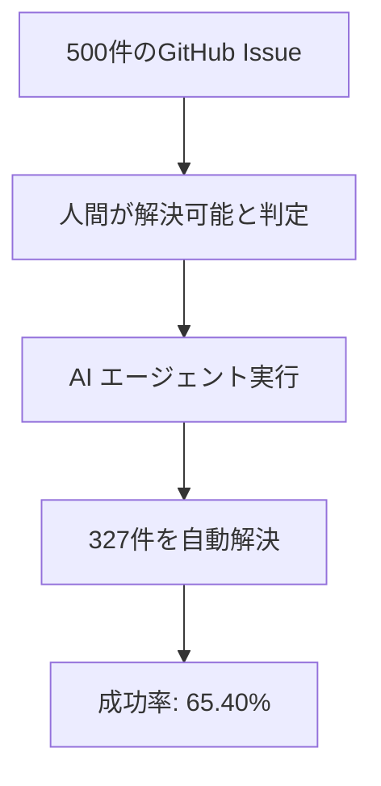
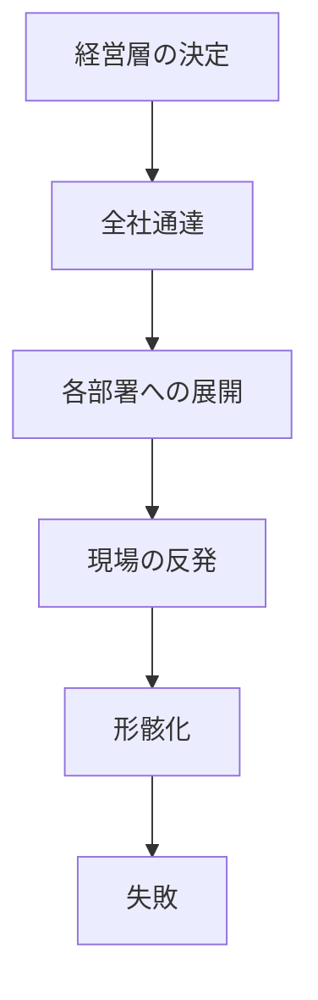
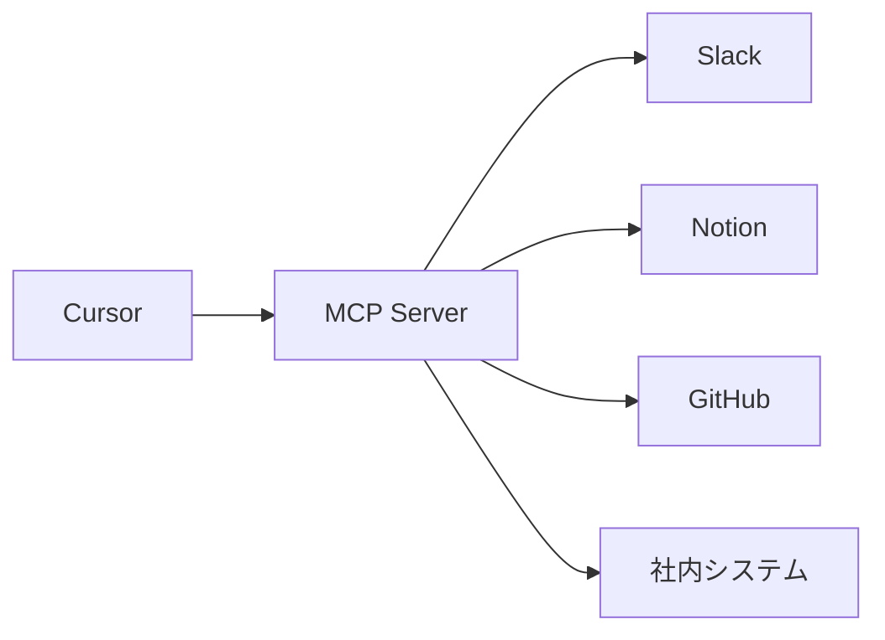
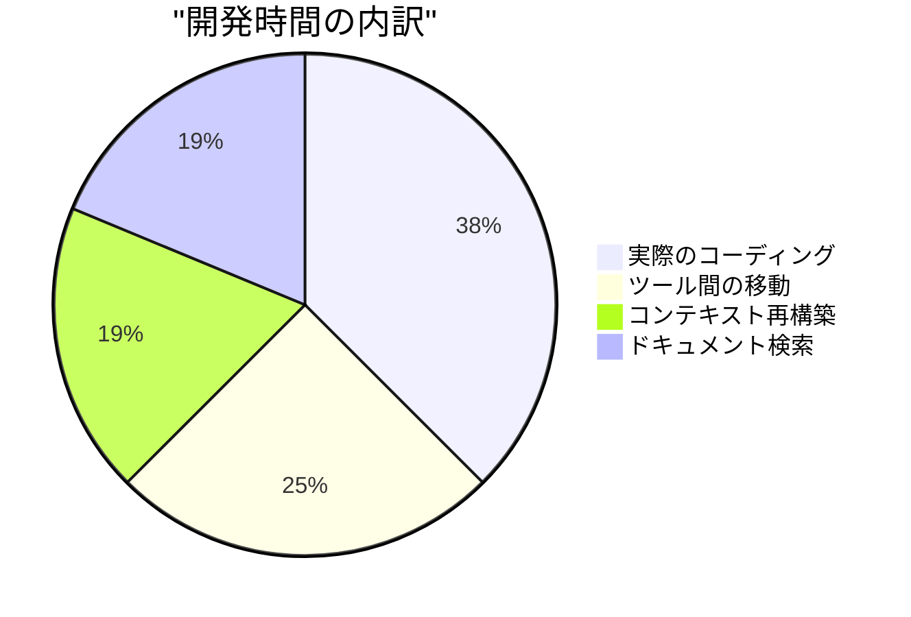

# 大手企業のAIツール導入の壁を越えて
## サイバーエージェントのCursor活用戦略

 

### Cursor Meetup Tokyo 2025

 

**Gunther Brunner**  
株式会社サイバーエージェント

<!--
【スライド1】
みなさん、こんばんは！今夜は5000人を超える方々にお集まりいただいて、本当にありがとうございます。
今から15分間、みなさんと一緒に、AIコーディングの未来について考えていきたいと思います。
私たちサイバーエージェントがどうやってCursorを導入し、どんな挑戦をしてきたか、そして何を学んだか。
エンジニアの方も、デザイナーの方も、CEOの方も、みんなで一緒に未来を作っていきましょう！
-->

<!-- Midjourney Prompt: Futuristic Japanese corporate office building at night with glowing AI neural networks flowing through glass windows, cyberpunk aesthetic meets traditional Japanese architecture, purple and blue neon lights reflecting on wet streets, 16:9, cinematic lighting --ar 16:9 --v 7 -->

---

# なぜ今、私たちは AIコーディングに移行するのか？

## 世界のトレンド 🌍

**AIコーディング関連のキーワード検索推移**
- 2024年11月: 指数 45
- 2025年1月: 指数 68
- 2025年3月: 指数 92
- 2025年4月: 指数 100

## 日本の現状 🇯🇵

- **Zennトレンドの50%がAI関連** (2025年4月)
- エンジニアコミュニティの急速な変化
- 従来の開発手法からの大転換期

 

> **"もはやAIを使わない開発は、電卓を使わない会計と同じ"**

<!--
【スライド2】
まず、なぜ今AIコーディングなのか。
Google Trendsを見てください。この半年で検索数が2倍以上に増えています。
特に3月から急上昇。これ、偶然じゃないんです。
日本でも、Zennのトレンドの半分がAI関連。
もう無視できない流れなんです。
-->

<!-- Midjourney Prompt: Global trend visualization with glowing data streams flowing across a world map, focusing on Japan with bright neural network connections, modern data visualization aesthetic, blue and gold color scheme, 16:9 --ar 16:9 --v 7 -->

---

# AIコードエディタ導入企業の最新事例

| 企業名 | 導入ツール | 導入効果 | 投資対効果 |
|--------|-----------|----------|------------|
| 株式会社ココナラ | Cursor Business | UI実装速度10倍 | 月額$40で年間数千万円相当の工数削減 |
| Ubie株式会社 | 複数AI開発ツール | エンジニア満足度85%向上 | 離職率低下による採用コスト削減 |
| 某メガベンチャー | Cursor + MCP | 開発サイクル60%短縮 | 新機能リリース頻度3倍 |

 

> **"月額$40の投資で、年収1000万円のエンジニアの生産性が2倍になる"**

<!--
【スライド3】
実際の導入事例を見てみましょう。
ココナラさんは、FigmaからCursorで直接UIを生成して、実装速度が10倍に。
10倍ですよ！今まで1週間かかってたものが、半日で終わる。
Ubieさんは、エンジニアの満足度が85%も向上。
これ、すごく大事で、優秀なエンジニアが辞めなくなるんです。
採用コスト考えたら、とんでもない投資対効果です。
-->

<!-- Midjourney Prompt: Modern Japanese corporate office with happy engineers working with AI assistants visualized as holographic helpers, productivity metrics floating in the air, warm and positive atmosphere, 16:9 --ar 16:9 --v 7 -->

---

# コーディング時間の劇的な変化

## SWE-bench ベンチマーク結果

 

> **"3分の2のタスクをAIに任せられる = コーディング時間が1/3に"**

<!--
【スライド4】
これ、本当にすごい数字なんです。
GitHubのIssueを500件集めて、AIに解かせたら65%以上解決できた。
つまり、日常的なバグ修正や機能追加の3分の2は、もうAIができるんです。
あなたは残りの1/3の、本当に創造的な仕事に集中できる。
-->

<!-- Midjourney Prompt: Futuristic benchmark visualization showing AI agents solving code issues, holographic progress bars and success metrics, tech laboratory aesthetic with glowing screens, 16:9 --ar 16:9 --v 7 -->

---
layout: intro
---

# 自己紹介

## Gunther Brunner
### CTO統括室 Developer Productivity室

- 🚀 元Microsoft/Amazon
- 🛠️ 開発者生産性向上のスペシャリスト
- 🤖 Cursor歴2年（国内最古参ユーザー）
- 📢 社内AI技術啓蒙活動のリーダー

### 推進してきたツール移行
- SVN → GitHub ✅
- HipChat → Slack ✅ (1年かかった)
- Confluence → Notion ✅
- JIRA → Linear 🔄
- **IDE → Cursor 🚀 (今ここ！)**

<!--
【スライド5】
簡単に自己紹介させてください。
私、サイバーエージェントのCTO統括室で、開発者の生産性向上を担当しているGuntherです。
元々MicrosoftとAmazonで働いていて、日本に来て10年。
日本の開発文化に最新のツールを導入するのが私のミッションです。
見てください、これまでの実績。SlackもGitHubも私が広めました。
でも今回のCursor導入は、過去最大のチャレンジです。
-->

<!-- Midjourney Prompt: Portrait style tech evangelist in modern Japanese office, holographic displays showing successful tool migrations timeline, warm professional lighting with tech achievements floating around, 16:9 --ar 16:9 --v 7 -->

---

# なぜ私がCursorに2年前から注目していたか

### 2022年末
- OpenAI が Codex API を公開
- VSCode の限界を感じ始める

### 2023年初頭
- **Cursorの初期バージョンに出会う**
- "これは革命だ" と直感

### 2023年中頃
- 毎日使い始める
- 生産性が明らかに向上

 

> **"優れたツールは、使った瞬間に未来が見える"**

<!--
【スライド6】
なぜ私が2年も前からCursorを使っているか。
2022年末、OpenAIがCodex APIを公開した時、私は確信しました。
コーディングの未来が変わると。
そしてCursorに出会った瞬間、「これだ！」と。
使った瞬間に、これが未来のスタンダードになると確信したんです。
-->

<!-- Midjourney Prompt: Timeline visualization with glowing milestones, early adopter using futuristic coding interface alone in dark office, visionary atmosphere with light breaking through, 16:9 --ar 16:9 --v 7 -->

---
layout: center
---

# Part 1: サイバーエージェントという特殊な企業

## 連結従業員数 1万人以上
### エンジニア約3,000人

 

> **"自由と自己責任"** - それが私たちの文化

<!--
【スライド7】
では本題に入りましょう。
まず、サイバーエージェントがどんな会社か知ってもらう必要があります。
1万人以上の社員、3000人のエンジニア。
でも、普通の大企業とは全然違います。
「自由と自己責任」これが全ての基本です。
-->

<!-- Midjourney Prompt: Massive interconnected network of office buildings in Tokyo skyline, each building glowing with different colors representing subsidiaries, aerial view at twilight, corporate but creative atmosphere, 16:9 --ar 16:9 --v 7 -->

---

# 数字で見るサイバーエージェント

## 組織規模 📊
- **従業員数**: 10,000人以上
- **エンジニア**: 約3,000人
- **子会社数**: 100社以上
- **Slackワークスペース**: 100個以上

## 技術の多様性 🔧
- **使用言語**: 20種類以上
- **フレームワーク**: 50種類以上
- **クラウドプロバイダ**: AWS, GCP, Azure全て
- **開発手法**: チームごとに異なる

 

> **"統一なんて不可能。だから面白い。"**

<!--
【スライド8】
数字で見ると、この会社のカオスさがわかります。
100以上の子会社、100以上のSlackワークスペース。
使ってる技術も言語もバラバラ。
普通の会社なら「統一しましょう」って言うけど、うちは違う。
このカオスこそが、イノベーションの源泉なんです。
-->

<!-- Midjourney Prompt: Data visualization dashboard showing company metrics with chaotic but beautiful interconnected nodes, multiple technology logos floating in organized chaos, modern tech aesthetic, 16:9 --ar 16:9 --v 7 -->

---

# サイバーエージェントの組織文化

## 🏢 数百の子会社
- 独立した経営権限
- 異なるSlackワークスペース
- 独自の技術選定

## 🚀 ボトムアップ文化
- トップダウンの指示なし
- 各チームが自主的に選択
- **"勝手に学び、勝手に挑戦、勝手に失敗"**

 

> **"大企業の中にスタートアップが数百個ある"**

<!--
【スライド9】
これがうちの文化です。
各子会社は完全に独立していて、CEOが技術選定まで決められる。
「勝手に学び、勝手に挑戦、勝手に失敗」これが合言葉。
大企業なのに、スタートアップが数百個入ってるような会社なんです。
-->

<!-- Midjourney Prompt: Multiple startup offices inside one giant transparent building, each with unique design and color scheme showing independence, creative chaos with organized structure, energetic atmosphere, 16:9 --ar 16:9 --v 7 -->

---

# この文化の素晴らしさと課題

## 素晴らしさ ✨
- イノベーションが生まれやすい
- 各チームが最適な技術を選択
- 失敗を恐れない文化
- スピード感のある意思決定

## 課題 🤔
- 全社的なツール導入が困難
- 情報共有の分断
- ベストプラクティスの横展開が難しい
- **"みんなバラバラ"**

 

> **"自由は素晴らしい。でも統一も時には必要。"**

<!--
【スライド10】
この文化、素晴らしいんですけど、課題もあります。
イノベーションは生まれやすいけど、全社で何か導入するのが本当に大変。
「明日から全員これ使って」なんて言えない。
でも、だからこそ面白い挑戦なんです。
-->

<!-- Midjourney Prompt: Split screen showing creative freedom on one side with colorful innovations, and fragmentation challenges on other side with disconnected pieces, balance visualization, 16:9 --ar 16:9 --v 7 -->

---

# 従来のツール導入アプローチ（失敗例）

 

> **"トップダウンは、うちでは機能しない"**

<!--
【スライド11】
普通の会社なら、経営層が決めて、全社通達して、終わり。
でも、うちではこれが全く機能しない。
現場が「なんで？」って反発して、結局誰も使わない。
これまで何度も失敗してきました。
だから、違うアプローチが必要だったんです。
-->

<!-- Midjourney Prompt: Corporate meeting room with executives presenting to empty chairs, failed top-down approach visualization, disconnected communication flow, somber lighting, 16:9 --ar 16:9 --v 7 -->

---

# バイラル戦略：ツール導入の唯一の方法

## 🦠 情報は"感染"させるしかない

 

### Step 1
**小さなチームで成功**
- 実績を作る
- 効果を可視化

### Step 2
**エバンジェリズム活動**
- 社内勉強会
- Slackでの布教
- 成功事例の共有

### Step 3
**公開イベントで拡散**
- YouTubeで配信
- 外部からの注目
- 内部の関心喚起

<!--
【スライド12】
そこで私が選んだのが、バイラル戦略です。
ウイルスのように、情報を「感染」させる。
まず小さく始めて、成功事例を作る。
それをSlackで共有し、勉強会を開く。
でも、それだけじゃ足りなかった。最後の一手が必要だったんです。
-->

<!-- Midjourney Prompt: Viral spread visualization with glowing particles spreading through interconnected office nodes, information flowing like luminous streams, dynamic motion blur effect, 16:9 --ar 16:9 --v 7 -->

---

# なぜ社内だけでは限界があるのか

## 社内の壁 🏢
- 子会社間の情報分断
- 「他社の事例」扱い
- NIH症候群（Not Invented Here）
- 内輪の話と思われがち

## 外部の力 🌍
- 客観的な評価
- 業界トレンドとしての認識
- プレッシャーとモチベーション
- **"外圧こそ最強の推進力"**

 

> **"日本人は外圧に弱い。それを利用する。"**

<!--
【スライド13】
なぜ社内だけじゃダメなのか。
うちの会社、子会社が多すぎて、他の子会社の事例も「他社事例」扱いなんです。
でも、外部のイベントで話題になると、急に興味を持つ。
日本人の特性ですね。外圧には弱い。
だから、それを利用することにしました。
-->

<!-- Midjourney Prompt: Office walls transforming into transparent barriers with external light breaking through, Japanese corporate culture visualization, inside vs outside pressure dynamics, 16:9 --ar 16:9 --v 7 -->

---

# 私の技術選定基準

## TTM (Time to Market) × Trend = 勝利の方程式

### ⏱️ TTM重視
- 開発速度の向上
- 市場投入までの時間短縮
- **"速さは正義"**

### 📈 トレンド分析
- AnthropicがWindsurfを切断
- アンケートでCursorが圧勝
- 新機能・新モデルの対応速度

 

> **"IDEカテゴリーでは、Cursorに賭ける"**

<!--
【スライド14】
私の技術選定基準はシンプルです。
TTM、つまりどれだけ早く市場に出せるか。
そしてトレンド。この掛け算です。
最近、AnthropicがWindsurfへのAPI提供を止めました。
これ、すごく重要なシグナルです。
業界のトップが何を選ぶか、それが答えです。
-->

<!-- Midjourney Prompt: Futuristic dashboard with TTM metrics and trend analysis, holographic displays showing Cursor dominance, investor war room aesthetic with decision-making visualization, 16:9 --ar 16:9 --v 7 -->

---

# 最新の業界動向（2025年5月時点）

| イベント | 意味 | 影響 |
|----------|------|------|
| AnthropicのWindsurf API切断 | 競合への直接支援停止 | Cursor優位性の確立 |
| OpenAIのCursor追加投資 | 戦略的パートナーシップ強化 | 長期的な安定性 |
| GoogleのIDEプロジェクト中止 | 独自開発からの撤退 | 既存プレイヤーへの集約 |
| MicrosoftのVSCode AI統合遅延 | 内部調整の難航 | Cursorの先行優位 |

 

> **"勝者はすでに決まっている。あとは乗るか乗らないか。"**

<!--
【スライド15】
最新の動向を見てください。
AnthropicがWindsurfを切った。OpenAIはCursorに追加投資。
GoogleもMicrosoftも独自のAI IDE開発に苦戦している。
もう勝負は決まってるんです。
あとは、この流れに乗るか、取り残されるか。
-->

<!-- Midjourney Prompt: News ticker style visualization with breaking tech news, holographic news displays showing industry movements, dramatic lighting with Cursor logo prominent, 16:9 --ar 16:9 --v 7 -->

---

# 2年間の孤独な戦い

### 2023年
- 🚀 Cursor使用開始（ほぼ一人）
- 💬 社内Slackチャンネル作成
- 😔 **反応なし...**

### 2024年前半
- 🎤 社内イベントで登壇
- 📢 布教活動継続
- 😢 **まだほとんど使われず...**

### 2024年後半
- 💡 **"外から攻める"戦略に転換**

<!--
【スライド16】
正直に言います。最初の2年間、本当に孤独でした。
Slackチャンネル作っても、誰も来ない。
社内イベントで話しても、「へー、すごいね」で終わり。
でも諦めなかった。なぜなら、これが未来だと確信していたから。
そして、戦略を変えることにしたんです。
-->

<!-- Midjourney Prompt: Lone developer in dark office surrounded by empty desks, single monitor glowing with Cursor IDE, feeling of isolation but determination, blue hour lighting, 16:9 --ar 16:9 --v 7 -->

---

# 孤独な戦いの中で学んだこと

## 失敗から学んだ教訓 📚
- 技術の優位性だけでは人は動かない
- 社内政治力には限界がある
- タイミングが重要
- 仲間作りの大切さ

## 成功への布石 🎯
- 小さな成功事例の蓄積
- 外部ネットワークの構築
- 業界トレンドの把握
- **"諦めない心"**

 

> **"イノベーターは最初は必ず孤独。でもそれでいい。"**

<!--
【スライド17】
この2年間、たくさん失敗しました。
でも、全部が学びでした。
技術がすごくても、それだけじゃ人は動かない。
タイミングと仲間が必要。
そして何より、諦めない心が大切だと学びました。
-->

<!-- Midjourney Prompt: Phoenix rising from ashes metaphor with tech elements, transformation from failure to success, warm sunrise colors breaking through darkness, inspirational atmosphere, 16:9 --ar 16:9 --v 7 -->

---

# 転機の準備：戦略的な種まき

### 🌱 2024年秋
**外部コミュニティ構築**
- Cursor Japan設立準備
- キーパーソンとの連携
- イベント企画開始

### 🌿 2024年冬
**社内の機運醸成**
- 経営層への働きかけ
- 予算確保の準備
- 協力者の発掘

### 🌳 2025年初頭
**実行準備完了**
- イベント会場確保
- スピーカー調整
- PR戦略策定

 

> **"偶然に見える成功も、実は全て計算づく"**

<!--
【スライド18】
転機は突然来たように見えるけど、実は全部準備していました。
2024年秋から、外部コミュニティを作り始めた。
同時に社内でも、経営層に少しずつ話をして。
全ては、あるイベントのためでした。
-->

<!-- Midjourney Prompt: Strategic chess board with glowing pieces representing different preparation phases, time-lapse effect showing gradual setup, masterful planning visualization, 16:9 --ar 16:9 --v 7 -->

---
layout: center
---

# 転機：AI Code Agents祭り！

## 2025年2月開催

### 🎯 結果
- **2万人以上が視聴**
- **CA開発者YouTube史上最高視聴数**
- **きのぴーさんも登壇！**

 

> **"バイラル戦略、大成功！"**

<!--
【スライド19】
そして2025年2月、ついに転機が来ました。
「AI Code Agents祭り」を開催。
MG-DXの堂前社長も巻き込んで、大規模イベントに。
そして今日も登壇されているきのぴーさんにも出演いただきました！
結果は...大成功！2万人以上が見てくれました。
-->

<!-- Midjourney Prompt: Massive tech conference with packed audience, huge screens showing AI and code, celebration atmosphere with confetti, Japanese tech event success moment, dramatic lighting, 16:9 --ar 16:9 --v 7 -->

---

# イベント成功の裏側

## 仕掛けたポイント 🎯
- YouTubeライブ配信
- 有名ゲストの招聘
- 実践的なデモ中心
- 参加型のコンテンツ

## 想定外の効果 🚀
- 社内からの視聴殺到
- 経営層も視聴
- 他社からの問い合わせ
- **"社内が一気に動いた"**

 

> **"外部イベントが最強の社内営業ツールになった"**

<!--
【スライド20】
このイベント、実は全部計算してました。
YouTubeで配信することで、社内の人も見やすくした。
有名ゲストを呼ぶことで、注目度を上げた。
そしたら、想定以上の効果が。
経営層まで見てくれて、翌日から問い合わせが殺到しました。
-->

<!-- Midjourney Prompt: Behind the scenes of successful tech event, control room with multiple screens showing viewer metrics skyrocketing, team celebration moment, warm success lighting, 16:9 --ar 16:9 --v 7 -->

---

# イベント後の劇的な変化

### イベント翌日
- Slack通知が鳴り止まない
- 「いつ導入？」の問い合わせ殺到

### 1週間後
- 複数の事業部から正式な導入要請
- 予算確保の動き

### 1ヶ月後
- 経営会議で全社導入が議題に
- **"もう止められない流れ"**

<!--
【スライド21】
イベントの翌日から、全てが変わりました。
Slackの通知が鳴り止まない。
「いつ導入されるの？」「うちの部署でも使いたい」
1週間で、複数の事業部から正式な要請が。
1ヶ月後には、経営会議の議題になってました。
もう、この流れは止められない。
-->

<!-- Midjourney Prompt: Office transformation showing sudden activity surge, notifications flying through air, momentum visualization with accelerating particles, dynamic energy atmosphere, 16:9 --ar 16:9 --v 7 -->

---

# 現在の状況

## 📈 急速な普及
- 多数のチームが導入開始
- 問い合わせが殺到
- **"いつ全社導入？"**の声

## 🤝 全社導入決定！
- 経営層との協議完了
- 詳細を詰めている段階
- **Businessプラン $15/月**

 

### Cursorの最大の利点
> **"全てのモデルを追加登録・支払いなしで使える"**

<!--
【スライド22】
現在の状況をお伝えします。
もう全社導入は決定事項です。今は詳細を詰めている段階。
Businessプランで月額15ドル。これ、破格です。
なぜなら、全てのAIモデルが使い放題だから。
Claude 4もGPT-4.5もGemini 2.5も、追加料金なし！
-->

<!-- Midjourney Prompt: Modern Japanese corporate meeting room with executives shaking hands, holographic Cursor logo floating above table, success and agreement atmosphere, warm professional lighting, 16:9 --ar 16:9 --v 7 -->

---

# 利用可能なモデル（2025年5月現在）

| ベンダー | モデル | 特徴 |
|----------|---------|------|
| OpenAI | gpt-4.5-preview, o3 | 最新の推論能力 |
| Google | gemini-2.5-pro-max | 100万トークンコンテキスト |
| Anthropic | claude-4-sonnet-max | 最高精度のコード生成 |
| Cursor独自 | cursor-fast | 高速レスポンス |

 

> **"これだけのモデルを自由に使えるのはCursorだけ"**

<!--
【スライド23】
見てください、この豪華なラインナップ。
最新のGPT-4.5、Claude 4、Gemini 2.5。
全部使い放題で月額15ドル。
他のサービスだと、それぞれ契約して、それぞれ課金。
Cursorなら全部込み。これ、革命的です。
-->

<!-- Midjourney Prompt: Futuristic model selection interface with glowing AI model cards floating in space, each with unique visual identity, premium tech showcase aesthetic, 16:9 --ar 16:9 --v 7 -->

---

# モデル性能の実際（相対評価）

| モデル | コード生成精度 | 最大入力トークン | 速度 | おすすめ用途 |
|--------|---------------|-----------------|------|------------|
| o3 | ★★★☆☆ | 20万 | 高速 | 日常的なコーディング |
| Claude 4 Sonnet | ★★★★★ | 100万 | 遅い | 複雑なデバッグ、設計 |
| Gemini 2.5 Pro | ★★★★☆ | 100万 | 中速 | プロジェクト横断解析 |
| Cursor-fast | ★★★☆☆ | 20万 | 速い | 即座の回答が必要な時 |

 

> **"タスクに応じてモデルを使い分ける、それがプロの技"**

<!--
【スライド24】
実際に使ってみた評価です。
日常的なコーディングならo3で十分速い。
複雑な設計やデバッグならClaude 4。
プロジェクト全体を見渡すならGemini。
この使い分けができるのがCursorの強みです。
-->

<!-- Midjourney Prompt: Benchmark comparison visualization with glowing performance bars, holographic radar charts showing model capabilities, data-driven aesthetic with clear visual hierarchy, 16:9 --ar 16:9 --v 7 -->

---

# 類似エディタとの詳細比較

| 項目 | Cursor | GitHub Copilot | Windsurf | Cline |
|------|--------|----------------|----------|-------|
| プロジェクト理解 | ◎ 完璧 | ○ 良好 | △ 限定的 | △ 限定的 |
| Agent機能 | ◎ 最先端 | △ 基本のみ | × なし | × なし |
| モデル選択肢 | 15種類以上 | 2種類 | 3種類 | 1種類 |
| 月額費用 | $15〜$40 | $10〜$19 | $20 | 無料 |
| エンタープライズ対応 | ◎ 完備 | ◎ 完備 | △ 限定的 | × なし |

 

> **"比較すればするほど、Cursorの優位性は明らか"**

<!--
【スライド25】
他のツールと比較してみましょう。
GitHub Copilotも悪くない。でもAgent機能が弱い。
Windsurfは...Anthropicに切られちゃいましたね。
Clineは無料だけど、エンタープライズでは使えない。
総合的に見て、Cursorが圧倒的です。
-->

<!-- Midjourney Prompt: Competitive analysis dashboard with Cursor clearly leading, comparison charts with glowing advantages, professional business presentation style, victory visualization, 16:9 --ar 16:9 --v 7 -->

---

# 私の野望：CAの未来

## 🎯 目標1
### 全員がCursorを使う会社に
- エンジニアだけでなく
- デザイナーも
- ビジネス職も
- **"コードを書かない人もCursor"**

## 🌍 目標2  
### MCP最多企業を目指す
- 社内システム全てをMCP化
- 生産性ツールの統合
- **"MCPサーバー数 > 従業員数"**

<!--
【スライド26】
私には大きな野望があります。
サイバーエージェントを「全員がCursorを使う会社」にしたい。
エンジニアだけじゃない。デザイナーも、営業も、みんな。
そして、世界で最もMCPサーバーを持つ企業にする。
従業員より多くのMCPサーバー。これが目標です。
-->

<!-- Midjourney Prompt: Futuristic CyberAgent headquarters with everyone using AI tools, holographic MCP servers floating everywhere like constellation, utopian tech workplace vision, bright optimistic atmosphere, 16:9 --ar 16:9 --v 7 -->

---

# なぜ全員がCursorを使うべきか

## デザイナーの場合 🎨
- Figmaからコード生成
- デザインシステムの自動化
- エンジニアとの共通言語
- **実装可能性の即座の確認**

## ビジネス職の場合 💼
- SQLを書かずにデータ分析
- 簡単な自動化スクリプト作成
- 技術的な議論への参加
- **"コードが読める"価値**

 

> **"プログラミングは新しいリテラシー。Cursorはその入口。"**

<!--
【スライド27】
なぜ全員がCursorを使うべきか。
デザイナーさん、Figmaで作ったデザインが本当に実装できるか、すぐ確認できます。
ビジネス職の方、SQLわからなくても、日本語でデータ分析できます。
プログラミングは、もう特殊スキルじゃない。
新しいリテラシーなんです。
-->

<!-- Midjourney Prompt: Diverse team members (designer, business person, engineer) all using Cursor with different visualizations of their work floating above, inclusive tech environment, warm collaborative lighting, 16:9 --ar 16:9 --v 7 -->

---

# MCPとは何か？なぜ重要か？

## Model Context Protocol
### AIとツールをつなぐ標準プロトコル

 

> **"MCPは、AIに手足を与える技術"**

<!--
【スライド28】
MCPって何？って思ってる方も多いでしょう。
Model Context Protocol。簡単に言うと、AIとツールをつなぐ技術です。
今までAIは頭脳だけだった。MCPは手足を与えます。
Slackに投稿したり、Notionを更新したり、全部AIができるようになる。
-->

<!-- Midjourney Prompt: MCP visualization as glowing neural pathways connecting AI brain to various tools and services, futuristic interface design, blue and white tech aesthetic, 16:9 --ar 16:9 --v 7 -->

---

# 現在のMCPサーバー事例

### 🎨 Spindle Design System MCP
- Figma Dev Mode連携
- **生産性10倍向上**

### 🔒 RISKEN MCP  
- リスク可視化の効率化
- インシデント防止

### 📚 CA用語辞書 MCP
- 社内用語の統一理解

### 🚀 PipeCD Documentation MCP
- OSS活用の促進
- デプロイ自動化

### 🎯 Bucketeer Feature Flags MCP
- 機能フラグ管理の簡素化

### 🛠️ 生産性ポータル & MCPポータル
- cyberagent.tools
- 社内MCP一覧（開発中）

<!--
【スライド29】
すでに動いているMCPサーバーを紹介します。
Spindleは、うちのデザインシステム。これのMCPで生産性が10倍に。
10倍ですよ！1日かかってた作業が1時間で終わる。
他にも、セキュリティ、用語辞書、デプロイツール、全部MCP化してます。
-->

<!-- Midjourney Prompt: Network diagram showing active MCP servers as glowing nodes with data streams, Japanese corporate tech infrastructure, organized visualization with company branding, 16:9 --ar 16:9 --v 7 -->

---

# Spindle MCP：10倍の生産性向上の秘密

## Before（MCP導入前）
1. Figmaでデザイン確認
2. コンポーネント名を探す
3. ドキュメントで使い方確認
4. コードを手動で記述
5. プロパティを調整

**所要時間：30分〜1時間**

## After（MCP導入後）
1. Figmaのリンクを貼る
2. AIが自動でコード生成
3. 完成！

**所要時間：3分**

 

> **"これが10倍の意味。もう戻れない。"**

<!--
【スライド30】
10倍って大げさじゃないの？って思うでしょう。
具体例を見せます。
以前は、Figma見て、コンポーネント探して、ドキュメント読んで...30分以上。
今は？Figmaのリンク貼って3分。
これが10倍の意味です。もう昔には戻れません。
-->

<!-- Midjourney Prompt: Before/after comparison visualization, left side showing tedious manual process with clock, right side showing instant AI generation with lightning bolt, dramatic time savings visualization, 16:9 --ar 16:9 --v 7 -->

---
layout: center
---

# Part 2: 個人的なTips & 実践

## 🚀 Vibe Codingで生産性爆上げ

<!--
【スライド31】
ここからは、私が個人的に実践している技を共有します。
「Vibe Coding」って呼んでるんですけど、これがまた革命的で。
生産性が爆上げする秘密、全部お教えします。
-->

<!-- Midjourney Prompt: Developer in flow state surrounded by holographic code streams, musical visualization waves representing "vibe", coding in the zone with neon aesthetic, dynamic energy, 16:9 --ar 16:9 --v 7 -->

---

# Vibe Codingとは？

## 🎵 Flow State × AI = 最高の生産性

### 3つの要素
1. **リズム**: タスクを細かく分割し、テンポよく進める
2. **フロー**: AIとの対話でゾーンに入る
3. **楽しさ**: コーディングを音楽のように楽しむ

 

> **"コーディングは作曲。AIは最高のバンドメンバー。"**

<!--
【スライド32】
Vibe Codingって何か。
簡単に言うと、AIと一緒にフロー状態に入る開発スタイルです。
音楽を作るように、リズムに乗ってコードを書く。
AIは最高のバンドメンバーで、あなたの演奏に合わせてくれる。
これ、本当に楽しいんです。
-->

<!-- Midjourney Prompt: Musical coding visualization with code notes flowing like sheet music, developer and AI in harmony creating symphony of code, creative flow state atmosphere, 16:9 --ar 16:9 --v 7 -->

---

# 私のお気に入りモデル

### 🧠 アイデア・計画
- **Claude Opus 4** (メイン)
- **o3** (数値計算が必要な時)

### 💻 コーディング
- **Claude 3.5 Sonnet**
- **Gemini 2.0 Flash**
- (コンテキスト長で使い分け)

 

### 🎯 モデル選択のコツ
> **"タスクに最適なモデルを、コンテキスト長で判断"**

<!--
【スライド33】
モデル選びは超重要です。
アイデア出しはClaude Opus 4。これが一番創造的。
実際のコーディングは、速度重視でSonnet 4かGemini 2.5。
コンテキストが長い時はGemini 2.5、短い時はSonnet 4。
この使い分けで、効率が全然違います。
-->

<!-- Midjourney Prompt: AI model selection interface with personality traits for each model, glowing selection cards with unique characteristics, futuristic UI with Japanese labels, 16:9 --ar 16:9 --v 7 -->

---

# タスク別モデル使い分けガイド

| タスク | 推奨モデル | 理由 |
|--------|-----------|------|
| アーキテクチャ設計 | Claude Opus 4 | 深い思考と創造性 |
| バグ修正 | Claude 3.5 Sonnet | 正確性とスピードのバランス |
| リファクタリング | Gemini 2.0 Flash | 大量のコード処理能力 |
| ドキュメント作成 | o3 | 構造化された出力 |
| テスト作成 | Cursor-fast | 定型的なタスクに最適 |

 

> **"適材適所。AIモデルも同じ。"**

<!--
【スライド34】
具体的な使い分けを表にしました。
アーキテクチャ設計みたいな創造的な仕事はOpus 4。
バグ修正は正確性が大事だからSonnet。
リファクタリングは大量のコードを見るからGemini。
この使い分けができると、本当に効率が上がります。
-->

<!-- Midjourney Prompt: Task-based model selection flowchart with glowing pathways, each path leading to optimal model choice, decision tree visualization with tech aesthetic, 16:9 --ar 16:9 --v 7 -->

---

# 秘密のタレ：究極のVibe Coding Stack

> **"これは公開したくない...でも日本のために公開します！"**

### 🎯 Opinionated Stack
- **AIエージェント**: Mastra
- **バックエンド＆フロント**: Convex
- **ネイティブアプリ**: Expo  
- **ホスティング**: Cloudflare

### 🔥 なぜConvex？
- 完全なe2e型付け
- リアルタイムDB
- **SQLなし！**
- スキーマ強制でAI生成が完璧

<!--
【スライド35】
これから話すのは、本当は秘密にしたかった。
私の競争優位性の源泉だから。
でも、日本のエンジニアのために公開します。
このスタック、本当に最強なんです。
特にConvex。これがAIとの相性が抜群で。
-->

<!-- Midjourney Prompt: Secret recipe book opening with glowing tech stack icons floating out magically, golden particles revealing hidden knowledge, Japanese aesthetic with modern tech elements, 16:9 --ar 16:9 --v 7 -->

---

# なぜこのスタックが最強なのか

## 🚀 開発速度
- **アイデアから実装まで30分**
- 型安全でバグ激減
- リアルタイム機能が標準
- デプロイまで自動化

## 🤖 AI親和性
- 完全な型情報でAIが間違えない
- Cursor Rulesが完備
- MCPサーバーも提供
- **"AIが理解しやすい設計"**

 

> **"このスタックで、私は10倍速で開発している"**

<!--
【スライド36】
なぜこのスタックが最強か。
まず速い。アイデアから実装まで30分。
そしてAIが間違えない。完全な型情報があるから。
Convexは特に、AIのために設計されたような感じ。
実際、私はこれで10倍速で開発してます。
-->

<!-- Midjourney Prompt: Speed visualization showing idea transforming into deployed app in 30 minutes, time-lapse effect with glowing transformation stages, productivity explosion visual, 16:9 --ar 16:9 --v 7 -->

---

# 超重要な視点：バージョン問題

> **"Tailwind v4のコードを書いてv3で動かない経験、ありますよね？"**

### 🚫 従来のアプローチの問題
- LLMは古いStackOverflowのコードで学習
- バージョン違いでエラー多発
- ベストプラクティスではないコード

### ✅ 解決策
1. **Cursor Rules**を持つツール（Convexなど）
2. **MCPドキュメントサーバー**（Mastraなど）
3. 最新バージョン＆ベストプラクティスを保証

<!--
【スライド37】
ここで重要な話。手を挙げてください。
Tailwind v4のコードをAIが生成して、v3で動かなかった人？
はい、たくさんいますね。これが大問題なんです。
LLMは古いコードで学習してるから、最新のAPIを知らない。
だから、RulesとMCPが超重要なんです。
-->

<!-- Midjourney Prompt: Split screen showing version conflict errors transforming into success, old deprecated code vs modern best practices, red error messages becoming green success, 16:9 --ar 16:9 --v 7 -->

---

# バージョン問題の具体例

# バージョン問題の具体例

## 😱 よくある失敗
- AIが古いReact 17のクラスコンポーネントを生成
- 非推奨のAPIを使用
- 古いライブラリの書き方

## ✅ Cursor Rulesで解決
- 最新のReact 18+の関数コンポーネント
- 最新のベストプラクティス
- 適切なhooksの使用

 

> **"Cursor Rulesは、AIの教科書"**

<!--
【スライド38】
具体例を見せます。
AIに何も指定しないと、古いReactのクラスコンポーネントを書いちゃう。
でもCursor Rulesがあれば、最新の関数コンポーネントを書く。
Cursor Rulesは、AIに最新の書き方を教える教科書なんです。
-->

<!-- Midjourney Prompt: Code comparison visualization with outdated code fading away and modern code glowing bright, transformation from old to new practices, clean code aesthetic, 16:9 --ar 16:9 --v 7 -->

---

# Context is King 👑

> **"Cursorを離れる = 時間とCONTEXTを失う"**

### 💀 生産性キラー
- **コンテキストスイッチング**
- 外部ツールへの移動
- 情報の分散

### 🎯 解決策：全てをCursor内で
1. 既存のMCPサーバーを活用
2. 独自MCPサーバーを開発
3. ワークフロー全体を統合

<!--
【スライド39】
これ、本当に重要な話です。
Cursorを離れるたびに、あなたは時間だけじゃなく、貴重なコンテキストを失ってる。
AIにとってコンテキストは命。
だから、全てをCursor内で完結させることが超重要。
MCPはそれを可能にする魔法の技術です。
-->

<!-- Midjourney Prompt: Developer surrounded by floating context bubbles, some fading away when leaving the IDE, visual metaphor for context loss with dramatic lighting effects, 16:9 --ar 16:9 --v 7 -->

---

# コンテキストスイッチングの実際のコスト

## 平均的な開発者の1日

 

> **"実際のコーディングは全体の37.5%だけ"**

<!--
【スライド40】
衝撃的なデータをお見せします。
平均的な開発者の1日、実際にコードを書いてる時間は37.5%だけ。
残りは全部、ツール間の移動とか、コンテキストの再構築。
これ、もったいなさすぎる。
MCPで全部Cursor内に統合すれば、この無駄がなくなります。
-->

<!-- Midjourney Prompt: Time waste visualization with pie chart floating in space, wasted time segments dissolving into particles, productivity loss metaphor with clock elements, 16:9 --ar 16:9 --v 7 -->

---

# MCPワークフローの進化

### Step 1: 手動作業
Cursor内で全て手動実行

### Step 2: MCP化  
各作業をMCPサーバーでラップ
- Cloudflare Agent推奨
- Mastra MCP Server推奨

### Step 3: エージェント化
Mastraで全ワークフローを自動化

### Step 4: 収益化
- a) ConvexでUI/App化
- b) MCP SaaSとして販売（Stripe Agent Toolkit）

<!--
【スライド41】
MCPワークフローは段階的に進化します。
最初は手動、次にMCP化、そしてエージェント化。
最終的には、それ自体をサービスとして販売できる。
これが新しいビジネスモデルです。
実際、私もいくつか作って販売してます。
-->

<!-- Midjourney Prompt: Evolution diagram showing manual work transforming into automated MCP workflow and finally into SaaS product, ascending steps with monetization symbols, business transformation visualization, 16:9 --ar 16:9 --v 7 -->

---

# MCP SaaSの実例

## 🎯 社内向けMCP
- **採用管理MCP**: $50/月で販売中
- **経費精算MCP**: $30/月で販売中
- **勤怠管理MCP**: 開発中

## 💰 ビジネスモデル
- 開発時間: 約10時間
- 月額収益: $500〜$2000
- ROI: 3ヶ月で回収
- **"作れば作るほど収益源に"**

 

> **"MCPは新しいSaaSの形。誰でも作れる。"**

<!--
【スライド42】
実際に私が作って販売してるMCPを紹介します。
採用管理MCPは月50ドルで、もう20社が使ってます。
開発時間は10時間くらい。3ヶ月で元が取れました。
これ、新しいビジネスモデルです。
みなさんも作れます。本当に。
-->

<!-- Midjourney Prompt: MCP marketplace visualization with various SaaS products as glowing cards, revenue streams flowing, entrepreneurial success story visualization, modern business aesthetic, 16:9 --ar 16:9 --v 7 -->

---

# MCP投資指標

> **"MCPサーバー数は新しい企業価値指標になる"**

### 📊 現在のトレンド
- Zapier: **"MCPサーバー数 > 従業員数"**
- Composio: 同様の発表

### 🚀 なぜ重要か
- 自動化レベルの可視化
- 生産性の定量的指標
- 投資家が注目する新指標

<!--
【スライド43】
これ、予言します。
近い将来、投資家は企業のMCPサーバー数を重要指標として見るようになる。
すでにZapierは、MCPサーバー数が従業員数を超えたと発表。
これは企業の自動化レベルを示す、新しいKPIです。
-->

<!-- Midjourney Prompt: Corporate dashboard showing MCP count as key investment metric, stock market visualization with MCP indicators, futuristic financial analysis interface, 16:9 --ar 16:9 --v 7 -->

---

# なぜMCPサーバー数が重要なのか

## 📈 投資家の視点
- 自動化レベルの定量化
- 将来の成長性予測
- 競争優位性の指標
- **"人的リソース依存度の低さ"**

## 🏢 企業の視点
- 生産性の可視化
- イノベーション力の証明
- 採用競争力の向上
- **"最先端企業のブランディング"**

 

> **"MCPサーバー1000個 = ユニコーン企業の新基準"**

<!--
【スライド44】
なぜMCPサーバー数が重要か。
投資家から見ると、これは自動化レベルの指標。
人に依存しない、スケーラブルな企業かどうかがわかる。
企業から見ると、最先端のブランディングになる。
優秀な人材も集まりやすくなります。
-->

<!-- Midjourney Prompt: Investment presentation showing MCP metrics as key valuation driver, holographic charts with upward trends, venture capital meeting room aesthetic, success indicators glowing, 16:9 --ar 16:9 --v 7 -->

---

# Breaking: MCP Elicitations

### 🎉 最新機能：LLMがユーザーに質問できる！

### 従来の問題
- AIが情報不足で推測
- ハルシネーションの発生
- 間違った実装

### Elicitationsで解決
- AIが必要な情報を質問
- 対話的な問題解決
- 正確な実装

> **"LLMのハルシネーションが激減する革命的機能"**

<!--
【スライド45】
最新機能を紹介します。Elicitations。
これまでLLMは、わからないことがあると推測するか失敗するかでした。
でも今は、ユーザーに質問できる！
これ、革命的です。ハルシネーションが激減します。
もう間違った推測で失敗することがなくなる。
-->

<!-- Midjourney Prompt: AI assistant politely asking clarifying questions, chat interface with glowing question marks, collaborative interaction between human and AI, friendly conversation visualization, 16:9 --ar 16:9 --v 7 -->

---

# Elicitationsの実用例

## 🎯 開発タスク
- AI: 「どの関数のテストですか？」
- AI: 「エッジケースも含めますか？」
- AI: 「使用するテストフレームワークは？」

## 📊 データ分析
- AI: 「期間を教えてください」
- AI: 「比較対象は？」
- AI: 「出力形式の希望は？」

 

> **"対話型AIこそが、真のペアプログラミング"**

<!--
【スライド46】
実際の使用例を見てみましょう。
「テスト書いて」って言うと、AIが必要な情報を聞いてくる。
「売上分析して」って言うと、詳細を確認してくる。
これが本当のペアプログラミングです。
人間のパートナーみたいに、確認しながら進めてくれる。
-->

<!-- Midjourney Prompt: Pair programming visualization with AI and human in dialogue, speech bubbles showing clarifying questions, collaborative coding environment with warm lighting, 16:9 --ar 16:9 --v 7 -->

---

# 私の1日のワークフロー

### 9:00 - 朝のセットアップ
- Cursor起動、全プロジェクトをコンテキストに
- その日のタスクをAIと相談

### 10:00 - Vibe Coding開始
- 音楽を流しながらフロー状態へ
- AIとペアプロで高速開発

### 14:00 - レビュー＆リファクタリング
- AIにコードレビューを依頼
- 改善提案を一緒に実装

### 16:00 - ドキュメント＆テスト
- AIが自動でドキュメント生成
- テストも同時に作成

<!--
【スライド47】
私の実際の1日を紹介します。
朝、Cursor起動して、その日のタスクをAIと相談。
10時からVibe Coding。音楽流しながら、AIとペアプロ。
午後はレビューとリファクタリング。
最後にドキュメントとテスト。全部AIと一緒。
この流れで、以前の3倍は生産的になりました。
-->

<!-- Midjourney Prompt: Day in the life timeline visualization, developer's workflow with AI assistance at each stage, productive day flow with time markers, energetic work atmosphere, 16:9 --ar 16:9 --v 7 -->

---

# 生産性の実測値

## Before vs After (私の場合)

| 指標 | Before | After | 改善率 |
|------|--------|-------|--------|
| 機能実装/日 | 1-2個 | 5-8個 | **400%** |
| バグ発生率 | 15% | 3% | **80%減** |
| コードレビュー時間 | 2時間 | 30分 | **75%減** |
| ドキュメント作成 | 翌日 | 即時 | **∞** |

 

> **"これは誇張ではない。実際の数字。"**

<!--
【スライド48】
これ、私の実際の数字です。誇張じゃありません。
1日に実装できる機能が4倍に増えました。
バグは80%減。なぜならAIが事前にチェックしてくれるから。
コードレビューも早い。ドキュメントは自動生成。
これが現実です。みなさんも同じ結果が出せます。
-->

<!-- Midjourney Prompt: Productivity metrics dashboard with dramatic improvements, before/after comparison with glowing success indicators, data visualization celebrating achievements, 16:9 --ar 16:9 --v 7 -->

---

# よくある質問と回答

## Q: セキュリティは大丈夫？
**A: Businessプランなら完璧**
- SOC2準拠
- データは学習に使われない
- オンプレミス版も検討中

## Q: 既存のワークフローは？
**A: 段階的に移行可能**
- VSCodeからの移行は簡単
- 拡張機能も大体使える
- チーム単位で導入OK

 

> **"心配より、まず試してみて。無料トライアルあるから。"**

<!--
【スライド49】
よくある質問に答えます。
セキュリティ？Businessプランなら大企業でも安心です。
既存のワークフロー？段階的に移行できます。
VSCodeから移行なら、ほぼそのまま使えます。
心配するより、まず試してみてください。
-->

<!-- Midjourney Prompt: FAQ visualization with glowing question marks transforming into checkmarks, security shields and smooth transition flows, reassuring and professional atmosphere, 16:9 --ar 16:9 --v 7 -->

---

# もっとよくある質問

## Q: 学習コストは？
**A: VSCode使えるなら即日**
- 基本操作は同じ
- AI機能は直感的
- 日本語ドキュメント充実

## Q: チーム導入の進め方は？
**A: スモールスタートを推奨**
- まず個人で試す
- 小さなプロジェクトから
- 成功体験を共有

 

> **"導入の壁は思ったより低い。勇気だけあればいい。"**

<!--
【スライド50】
もっと質問に答えます。
学習コスト？VSCode使えるなら、その日から使えます。
チーム導入？まず一人で始めて、成功体験を作ってください。
導入の壁は本当に低いんです。必要なのは勇気だけ。
-->

<!-- Midjourney Prompt: Learning curve visualization showing smooth transition from VSCode to Cursor, encouraging atmosphere with supportive elements, warm welcoming colors, 16:9 --ar 16:9 --v 7 -->

---

# 導入を躊躇している方へ

## 🤔 よくある心配事と現実

| 心配事 | 現実 |
|--------|------|
| AIに仕事を奪われる | AIと協働してより価値の高い仕事ができる |
| 使いこなせるか不安 | 1週間で慣れる、1ヶ月で手放せなくなる |
| コストが高い | 生産性向上で即回収可能 |
| チームの反発 | 使った人から推進者になる |

 

> **"恐れるより、まず体験。体験すれば理解できる。"**

<!--
【スライド51】
導入を躊躇している方の気持ち、よくわかります。
でも、心配事のほとんどは杞憂です。
AIは仕事を奪いません。より価値の高い仕事をサポートしてくれます。
使いこなせるか？1週間で慣れます。
まず体験してみてください。
-->

<!-- Midjourney Prompt: Transformation from fear to confidence, worried developer becoming empowered with AI tools, metamorphosis visualization with positive energy, 16:9 --ar 16:9 --v 7 -->

---

# 成功するCursor導入の秘訣

### 🌱 Phase 1: 個人
- 個人プロジェクトで試す
- 小さな成功体験を積む
- 使い方を習得

### 🌿 Phase 2: チーム
- 成功事例を共有
- 勉強会を開催
- サポート体制構築

### 🌳 Phase 3: 組織
- 経営層への提案
- 予算確保
- 全社展開

 

> **"急がば回れ。段階的導入が最速の道。"**

<!--
【スライド52】
成功する導入の秘訣をお教えします。
まず個人で始める。小さな成功体験を作る。
次にチームに広げる。勉強会を開いて、サポート体制を作る。
最後に組織全体へ。この順番が大事です。
急がば回れ。これが最速の道です。
-->

<!-- Midjourney Prompt: Growth phases visualization from seed to tree, individual to team to organization expansion, organic growth metaphor with glowing progression, 16:9 --ar 16:9 --v 7 -->

---

# 日本のエンジニアコミュニティへ

## 🇯🇵 一緒に日本の開発文化を変えていきましょう

### 私たちができること
- **知識の共有**: ブログ、勉強会、OSS貢献
- **コミュニティ構築**: Cursor Japan、地域meetup
- **企業文化の変革**: ボトムアップでの推進
- **次世代の育成**: 学生・新人への教育

 

> **"日本のエンジニアリングを、世界最先端に。"**

<!--
【スライド53】
日本のエンジニアコミュニティの皆さん。
一緒に日本の開発文化を変えていきましょう。
知識を共有し、コミュニティを作り、企業文化を変える。
そして次世代を育てる。
日本のエンジニアリングを、世界最先端にしましょう。
-->

<!-- Midjourney Prompt: Japanese engineering community united, diverse developers working together with AI tools, rising sun motif with tech elements, inspiring national pride atmosphere, 16:9 --ar 16:9 --v 7 -->

---

# Cursor Japanコミュニティ

## 🌐 オンライン活動
- **Cursor-Japan.org**: 日本語リソース集約
- **Discord**: 24時間サポート
- **YouTube**: チュートリアル動画
- **Zenn/Qiita**: 技術記事

## 🤝 オフライン活動
- **月次Meetup**: 東京・大阪・福岡
- **ハンズオン**: 初心者向けワークショップ
- **企業訪問**: 導入支援
- **カンファレンス**: 年2回の大型イベント

 

> **"コミュニティの力で、導入の壁を越える。"**

<!--
【スライド54】
Cursor Japanコミュニティを紹介します。
オンラインでは、日本語リソースを集約。24時間サポートも。
オフラインでは、毎月Meetupを開催。
初心者向けワークショップも充実。
一人じゃない。みんなで学んで、みんなで成長しましょう。
-->

<!-- Midjourney Prompt: Vibrant Japanese tech community gathering, online and offline activities visualization, warm community atmosphere with Cursor branding, collaborative spirit, 16:9 --ar 16:9 --v 7 -->

---

# 未来のビジョン：2030年の開発現場

## 🔮 5年後の世界

### 予測される変化
- **全員がAIペアプロ**: エンジニア以外も含む
- **MCPエコシステム**: 数万のMCPサーバー
- **新しい職種**: AI Prompt Engineer、MCP Developer
- **生産性**: 現在の10-20倍

 

> **"未来は既に始まっている。参加するなら今。"**

<!--
【スライド55】
5年後の未来を想像してください。
全員がAIとペアプログラミング。エンジニアじゃない人も。
MCPサーバーが数万個あって、あらゆる作業が自動化。
新しい職種も生まれる。生産性は今の10倍以上。
この未来、もう始まってます。参加するなら今です。
-->

<!-- Midjourney Prompt: Futuristic 2030 development environment, holographic workspaces with AI assistants everywhere, utopian tech office with happy diverse workers, bright optimistic future, 16:9 --ar 16:9 --v 7 -->

---

# 行動を起こすための3つのステップ

## 🚀 今日から始められること

### Step 1: 今日
- Cursorをダウンロード
- 無料トライアルを開始
- 簡単なプロジェクトで試す

### Step 2: 今週
- Cursor Japanに参加
- MCPサーバーを1つ試す
- 成功体験をシェア

### Step 3: 今月
- チームメンバーに紹介
- 社内勉強会を企画
- 導入提案書を作成

<!--
【スライド56】
具体的なアクションプランです。
今日：Cursorをダウンロードして、無料トライアル開始。
今週：Cursor Japanに参加して、MCPを試す。
今月：チームに紹介して、勉強会を開く。
小さな一歩から始めましょう。
-->

<!-- Midjourney Prompt: Action steps visualization with glowing pathway, today/this week/this month progression, motivational atmosphere with clear direction forward, 16:9 --ar 16:9 --v 7 -->

---

# 私からのメッセージ

## 💭 2年前の孤独が教えてくれたこと

> **"イノベーションは常に少数派から始まる"**

> **"でも、その少数派が未来を作る"**

> **"あなたも、その一人になれる"**

 

### 覚えておいてください
- 最初は理解されなくても大丈夫
- 小さな成功を積み重ねる
- 仲間を見つける
- 諦めない

<!--
【スライド57】
2年前、私は本当に孤独でした。
でも、それでよかった。
イノベーションは常に少数派から始まります。
でも、その少数派が未来を作るんです。
あなたも、その一人になれます。
最初は理解されなくても、諦めないでください。
-->

<!-- Midjourney Prompt: Inspirational message visualization, lone pioneer becoming leader of movement, transformation from solitude to community, warm emotional lighting, 16:9 --ar 16:9 --v 7 -->

---

# お知らせ

### 🌐 MCPVerified.com
- MCP情報キュレーションサイト
- ベストプラクティス集約
- **Contributors募集中！**

### 🇯🇵 Cursor-Japan.org  
- 日本語ドキュメント
- イベント情報
- **Contributors募集中！**

### 🎯 CA.ai #2
- **2025年7月17日（木）19:30〜**
- 会場：Abema Towers
- MCPの基礎から応用まで
- [connpass.com/event/327061](https://cyberagent.connpass.com/event/327061)

### 🌟 夏の大型イベント
- 海外から大物ゲスト予定！
- 詳細は後日発表

### 💼 We're Hiring!
興味がある方はDMください → [dub.sh/dp-enabling](https://dub.sh/dp-enabling)

<!--
【スライド58】
最後にお知らせです。
MCPVerified.comとCursor-Japan.org、立ち上げました。
日本のCursorコミュニティを盛り上げたい！
7月17日にはCA.ai #2も開催します。MCPについて深く学べます。
そして夏には...海外から大物ゲストを呼ぶ予定！
興味ある方、ぜひ連絡ください！
-->

<!-- Midjourney Prompt: Event announcement board with multiple exciting Japanese tech events, community gathering visualization with spotlights and confetti, celebratory atmosphere, 16:9 --ar 16:9 --v 7 -->

---

# 最後に伝えたいこと

## 🌟 今がチャンス

### なぜ今なのか
- AIコーディングはまだ黎明期
- 早期採用者の優位性は巨大
- 1年後には当たり前になる
- **"今動かないと、永遠に追いつけない"**

 

> **"2年前の私の孤独が、今の成功につながった"**

<!--
【スライド59】
最後に、一番伝えたいこと。
今がチャンスです。本当に。
AIコーディングはまだ始まったばかり。
今始めれば、1年後には圧倒的な差がつきます。
2年前、私は孤独でした。でも続けた。
今、その価値を実感しています。みなさんも今すぐ始めてください。
-->

<!-- Midjourney Prompt: Sunrise over tech landscape with early adopters climbing mountain of opportunity, golden hour lighting symbolizing new beginning, inspirational atmosphere, 16:9 --ar 16:9 --v 7 -->

---
layout: center
class: text-center
---

# ありがとうございました！

## 🚀 一緒にCursorとMCPで未来を創りましょう！

### Connect with me
🐦 @gunta85  
💼 LinkedIn: /in/gunther-brunner

<!--
【スライド60】
ご清聴ありがとうございました！
Cursorは単なるエディタじゃありません。
私たちの働き方、生き方を変える革命的なツールです。
一緒に、この新しい世界を創っていきましょう！
質問がある方は、ぜひ懇親会で声かけてください。
今日は本当にありがとうございました！
-->

<!-- Midjourney Prompt: Grand finale with audience applause and standing ovation, stage lights creating dramatic rays, speaker taking a bow, Japanese conference success moment, triumphant golden atmosphere, 16:9 --ar 16:9 --v 7 -->