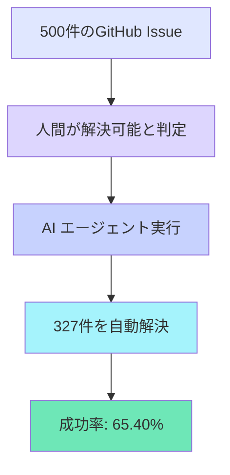
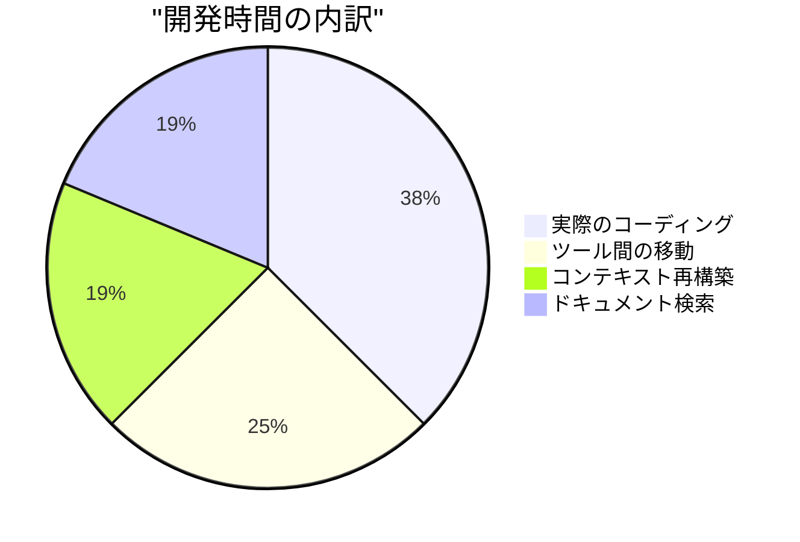

# 大手企業のAIツール導入の壁を越えて
## サイバーエージェントのCursor活用戦略

<br>

<div class="flex items-center justify-center gap-2 text-2xl">
  <mdi-cursor-default-outline class="text-purple-400" />
  <span>Cursor Meetup Tokyo 2025</span>
</div>

<br>

<div class="flex items-center justify-center gap-3">
  <div class="text-xl">
    <strong>Gunther Brunner</strong>
  </div>
  <mdi-briefcase-variant class="text-gray-400" />
  <div class="text-gray-400">
    株式会社サイバーエージェント
  </div>
</div>

<!--
【スライド1】
みなさん、こんばんは！今夜は5000人を超える方々にお集まりいただいて、本当にありがとうございます。
今から15分間、みなさんと一緒に、AIコーディングの未来について考えていきたいと思います。
私たちサイバーエージェントがどうやってCursorを導入し、どんな挑戦をしてきたか、そして何を学んだか。
エンジニアの方も、デザイナーの方も、CEOの方も、みんなで一緒に未来を作っていきましょう！
-->

---

# なぜ今、私たちは AIコーディングに移行するのか？

<div class="grid grid-cols-2 gap-8">
<div>

<div class="flex items-center gap-2 mb-4">
  <mdi-earth class="text-blue-400 text-2xl" />
  <h2 class="text-2xl font-bold m-0">世界のトレンド</h2>
</div>

<div class="bg-gradient-to-r from-blue-50 to-purple-50 p-6 rounded-lg">
  <h4 class="flex items-center gap-2 text-lg">
    <mdi-trending-up class="text-green-500" />
    AIコーディング関連のキーワード検索推移
  </h4>
  <div class="space-y-2 mt-4">
    <div class="flex items-center justify-between">
      <span>2024年11月</span>
      <div class="flex items-center gap-2">
        <div class="w-32 bg-gray-200 rounded-full h-2">
          <div class="bg-blue-400 h-2 rounded-full" style="width: 45%"></div>
        </div>
        <span class="text-sm">45</span>
      </div>
    </div>
    <div class="flex items-center justify-between">
      <span>2025年1月</span>
      <div class="flex items-center gap-2">
        <div class="w-32 bg-gray-200 rounded-full h-2">
          <div class="bg-blue-500 h-2 rounded-full" style="width: 68%"></div>
        </div>
        <span class="text-sm">68</span>
      </div>
    </div>
    <div class="flex items-center justify-between">
      <span>2025年3月</span>
      <div class="flex items-center gap-2">
        <div class="w-32 bg-gray-200 rounded-full h-2">
          <div class="bg-purple-500 h-2 rounded-full" style="width: 92%"></div>
        </div>
        <span class="text-sm">92</span>
      </div>
    </div>
    <div class="flex items-center justify-between">
      <span>2025年4月</span>
      <div class="flex items-center gap-2">
        <div class="w-32 bg-gray-200 rounded-full h-2">
          <div class="bg-purple-600 h-2 rounded-full" style="width: 100%"></div>
        </div>
        <span class="text-sm font-bold">100</span>
      </div>
    </div>
  </div>
</div>

</div>
<div>

<div class="flex items-center gap-2 mb-4">
  <emojione-flag-for-japan class="text-2xl" />
  <h2 class="text-2xl font-bold m-0">日本の現状</h2>
</div>

<div class="space-y-4">
  <div class="bg-gradient-to-r from-red-50 to-pink-50 p-4 rounded-lg flex items-center gap-3">
    <mdi-fire class="text-red-500 text-3xl" />
    <div>
      <div class="font-bold">Zennトレンドの50%がAI関連</div>
      <div class="text-sm text-gray-600">(2025年4月)</div>
    </div>
  </div>
  
  <div class="bg-yellow-50 p-4 rounded-lg flex items-center gap-3">
    <mdi-account-group class="text-yellow-600 text-3xl" />
    <div class="font-semibold">エンジニアコミュニティの急速な変化</div>
  </div>
  
  <div class="bg-green-50 p-4 rounded-lg flex items-center gap-3">
    <mdi-rocket-launch class="text-green-600 text-3xl" />
    <div class="font-semibold">従来の開発手法からの大転換期</div>
  </div>
</div>

</div>
</div>

<br>

<div class="text-center p-4 bg-gradient-to-r from-purple-100 to-blue-100 rounded-xl">
  <mdi-format-quote-open class="text-3xl text-purple-400" />
  <span class="text-xl font-bold">もはやAIを使わない開発は、電卓を使わない会計と同じ</span>
  <mdi-format-quote-close class="text-3xl text-purple-400" />
</div>

<!--
【スライド2】
まず、なぜ今AIコーディングなのか。
Google Trendsを見てください。この半年で検索数が2倍以上に増えています。
特に3月から急上昇。これ、偶然じゃないんです。
日本でも、Zennのトレンドの半分がAI関連。
もう無視できない流れなんです。
-->

---

# AIコードエディタ導入企業の最新事例

<div class="overflow-x-auto">
  <table class="w-full">
    <thead>
      <tr class="bg-gradient-to-r from-purple-500 to-blue-500 text-white">
        <th class="p-3 text-left rounded-tl-lg">
          <div class="flex items-center gap-2">
            <mdi-office-building class="text-xl" />
            企業名
          </div>
        </th>
        <th class="p-3 text-left">
          <div class="flex items-center gap-2">
            <mdi-tools class="text-xl" />
            導入ツール
          </div>
        </th>
        <th class="p-3 text-left">
          <div class="flex items-center gap-2">
            <mdi-chart-line class="text-xl" />
            導入効果
          </div>
        </th>
        <th class="p-3 text-left rounded-tr-lg">
          <div class="flex items-center gap-2">
            <mdi-cash-multiple class="text-xl" />
            投資対効果
          </div>
        </th>
      </tr>
    </thead>
    <tbody>
      <tr class="border-b hover:bg-gray-50 transition-colors">
        <td class="p-3 font-semibold">株式会社ココナラ</td>
        <td class="p-3">
          <span class="bg-purple-100 text-purple-700 px-2 py-1 rounded">Cursor Business</span>
        </td>
        <td class="p-3">
          <div class="flex items-center gap-2">
            <mdi-speedometer class="text-green-500" />
            UI実装速度<span class="font-bold text-green-600">10倍</span>
          </div>
        </td>
        <td class="p-3">月額$40で年間数千万円相当の工数削減</td>
      </tr>
      <tr class="border-b hover:bg-gray-50 transition-colors">
        <td class="p-3 font-semibold">Ubie株式会社</td>
        <td class="p-3">
          <span class="bg-blue-100 text-blue-700 px-2 py-1 rounded">複数AI開発ツール</span>
        </td>
        <td class="p-3">
          <div class="flex items-center gap-2">
            <mdi-emoticon-happy class="text-yellow-500" />
            エンジニア満足度<span class="font-bold text-yellow-600">85%向上</span>
          </div>
        </td>
        <td class="p-3">離職率低下による採用コスト削減</td>
      </tr>
      <tr class="hover:bg-gray-50 transition-colors">
        <td class="p-3 font-semibold">某メガベンチャー</td>
        <td class="p-3">
          <span class="bg-green-100 text-green-700 px-2 py-1 rounded">Cursor + MCP</span>
        </td>
        <td class="p-3">
          <div class="flex items-center gap-2">
            <mdi-clock-fast class="text-blue-500" />
            開発サイクル<span class="font-bold text-blue-600">60%短縮</span>
          </div>
        </td>
        <td class="p-3">新機能リリース頻度3倍</td>
      </tr>
    </tbody>
  </table>
</div>

<br>

<div class="text-center p-6 bg-gradient-to-r from-green-50 to-blue-50 rounded-xl">
  <div class="flex items-center justify-center gap-3 text-xl">
    <mdi-currency-usd class="text-green-600 text-3xl" />
    <span class="font-bold">月額$40の投資で、年収1000万円のエンジニアの生産性が2倍になる</span>
    <mdi-rocket class="text-blue-600 text-3xl" />
  </div>
</div>

<!--
【スライド3】
実際の導入事例を見てみましょう。
ココナラさんは、FigmaからCursorで直接UIを生成して、実装速度が10倍に。
10倍ですよ！今まで1週間かかってたものが、半日で終わる。
Ubieさんは、エンジニアの満足度が85%も向上。
これ、すごく大事で、優秀なエンジニアが辞めなくなるんです。
採用コスト考えたら、とんでもない投資対効果です。
-->

---

# コーディング時間の劇的な変化

<div class="text-center">

<h2 class="flex items-center justify-center gap-2 text-2xl mb-8">
  <mdi-chart-box class="text-purple-500" />
  SWE-bench ベンチマーク結果
</h2>

<div class="bg-gradient-to-br from-blue-50 to-purple-50 p-8 rounded-xl">



</div>

</div>

<br>

<div class="flex items-center justify-center gap-4 p-4 bg-gradient-to-r from-purple-100 to-pink-100 rounded-xl">
  <mdi-timer-sand class="text-4xl text-purple-600" />
  <span class="text-xl font-bold">3分の2のタスクをAIに任せられる = コーディング時間が1/3に</span>
  <mdi-flash class="text-4xl text-pink-600" />
</div>

<!--
【スライド4】
これ、本当にすごい数字なんです。
GitHubのIssueを500件集めて、AIに解かせたら65%以上解決できた。
つまり、日常的なバグ修正や機能追加の3分の2は、もうAIができるんです。
あなたは残りの1/3の、本当に創造的な仕事に集中できる。
-->

---
layout: intro
---

# 自己紹介

<div class="grid grid-cols-2 gap-8">
<div>

<h2 class="flex items-center gap-2">
  <mdi-account-circle class="text-blue-500" />
  Gunther Brunner
</h2>

<h3 class="flex items-center gap-2 text-gray-600">
  <mdi-briefcase class="text-gray-500" />
  CTO統括室 Developer Productivity室
</h3>

<div class="space-y-3 mt-6">
  <div class="flex items-center gap-3">
    <mdi-rocket-launch-outline class="text-purple-500 text-xl" />
    <span>元Microsoft/Amazon</span>
  </div>
  <div class="flex items-center gap-3">
    <mdi-wrench class="text-green-500 text-xl" />
    <span>開発者生産性向上のスペシャリスト</span>
  </div>
  <div class="flex items-center gap-3">
    <mdi-robot class="text-blue-500 text-xl" />
    <span>Cursor歴2年（国内最古参ユーザー）</span>
  </div>
  <div class="flex items-center gap-3">
    <mdi-bullhorn class="text-orange-500 text-xl" />
    <span>社内AI技術啓蒙活動のリーダー</span>
  </div>
</div>

</div>
<div>

<h3 class="flex items-center gap-2 mb-4">
  <mdi-swap-horizontal class="text-indigo-500" />
  推進してきたツール移行
</h3>

<div class="space-y-3">
  <div class="flex items-center gap-3 p-3 bg-green-50 rounded-lg">
    <span>SVN</span>
    <mdi-arrow-right class="text-green-600" />
    <span class="font-semibold">GitHub</span>
    <mdi-check-circle class="text-green-600 ml-auto" />
  </div>
  <div class="flex items-center gap-3 p-3 bg-green-50 rounded-lg">
    <span>HipChat</span>
    <mdi-arrow-right class="text-green-600" />
    <span class="font-semibold">Slack</span>
    <mdi-check-circle class="text-green-600 ml-auto" />
    <span class="text-sm text-gray-600">(1年かかった)</span>
  </div>
  <div class="flex items-center gap-3 p-3 bg-green-50 rounded-lg">
    <span>Confluence</span>
    <mdi-arrow-right class="text-green-600" />
    <span class="font-semibold">Notion</span>
    <mdi-check-circle class="text-green-600 ml-auto" />
  </div>
  <div class="flex items-center gap-3 p-3 bg-yellow-50 rounded-lg">
    <span>JIRA</span>
    <mdi-arrow-right class="text-yellow-600" />
    <span class="font-semibold">Linear</span>
    <mdi-sync class="text-yellow-600 ml-auto animate-spin" />
  </div>
  <div class="flex items-center gap-3 p-3 bg-purple-50 rounded-lg border-2 border-purple-300">
    <span class="font-bold">IDE</span>
    <mdi-arrow-right class="text-purple-600" />
    <span class="font-bold text-purple-600">Cursor</span>
    <mdi-fire class="text-purple-600 ml-auto text-xl" />
    <span class="text-sm font-bold text-purple-600">(今ここ！)</span>
  </div>
</div>

</div>
</div>

<!--
【スライド5】
簡単に自己紹介させてください。
私、サイバーエージェントのCTO統括室で、開発者の生産性向上を担当しているGuntherです。
元々MicrosoftとAmazonで働いていて、日本に来て10年。
日本の開発文化に最新のツールを導入するのが私のミッションです。
見てください、これまでの実績。SlackもGitHubも私が広めました。
でも今回のCursor導入は、過去最大のチャレンジです。
-->

---

# なぜ私がCursorに2年前から注目していたか

<div class="timeline">

<div class="flex items-start gap-4 mb-6">
  <div class="flex-shrink-0">
    <div class="w-12 h-12 bg-blue-500 rounded-full flex items-center justify-center">
      <mdi-calendar class="text-white text-xl" />
    </div>
  </div>
  <div class="flex-grow">
    <h3 class="font-bold text-lg">2022年末</h3>
    <ul class="space-y-2 mt-2">
      <li class="flex items-center gap-2">
        <mdi-chevron-right class="text-blue-400" />
        OpenAI が Codex API を公開
      </li>
      <li class="flex items-center gap-2">
        <mdi-chevron-right class="text-blue-400" />
        VSCode の限界を感じ始める
      </li>
    </ul>
  </div>
</div>

<div class="flex items-start gap-4 mb-6">
  <div class="flex-shrink-0">
    <div class="w-12 h-12 bg-purple-500 rounded-full flex items-center justify-center">
      <mdi-lightbulb class="text-white text-xl" />
    </div>
  </div>
  <div class="flex-grow">
    <h3 class="font-bold text-lg">2023年初頭</h3>
    <ul class="space-y-2 mt-2">
      <li class="flex items-center gap-2 font-bold text-purple-600">
        <mdi-star class="text-purple-500" />
        Cursorの初期バージョンに出会う
      </li>
      <li class="flex items-center gap-2">
        <mdi-format-quote-open class="text-purple-400" />
        <span class="italic">"これは革命だ"</span> と直感
        <mdi-format-quote-close class="text-purple-400" />
      </li>
    </ul>
  </div>
</div>

<div class="flex items-start gap-4">
  <div class="flex-shrink-0">
    <div class="w-12 h-12 bg-green-500 rounded-full flex items-center justify-center">
      <mdi-rocket class="text-white text-xl" />
    </div>
  </div>
  <div class="flex-grow">
    <h3 class="font-bold text-lg">2023年中頃</h3>
    <ul class="space-y-2 mt-2">
      <li class="flex items-center gap-2">
        <mdi-chevron-right class="text-green-400" />
        毎日使い始める
      </li>
      <li class="flex items-center gap-2">
        <mdi-chevron-right class="text-green-400" />
        生産性が明らかに向上
      </li>
    </ul>
  </div>
</div>

</div>

<br>

<div class="text-center p-4 bg-gradient-to-r from-purple-100 to-blue-100 rounded-xl">
  <div class="flex items-center justify-center gap-3">
    <mdi-eye-outline class="text-3xl text-purple-600" />
    <span class="text-xl font-bold">優れたツールは、使った瞬間に未来が見える</span>
    <mdi-sparkles class="text-3xl text-blue-600" />
  </div>
</div>

<!--
【スライド6】
なぜ私が2年も前からCursorを使っているか。
2022年末、OpenAIがCodex APIを公開した時、私は確信しました。
コーディングの未来が変わると。
そしてCursorに出会った瞬間、「これだ！」と。
使った瞬間に、これが未来のスタンダードになると確信したんです。
-->

---
layout: center
---

# Part 1: サイバーエージェントという特殊な企業

<div class="text-center">

<div class="flex items-center justify-center gap-3 text-5xl mb-6">
  <mdi-office-building class="text-blue-500" />
  <mdi-account-group class="text-purple-500" />
</div>

<h2 class="text-3xl mb-2">連結従業員数 1万人以上</h2>
<h3 class="text-2xl text-gray-600 mb-8">エンジニア約3,000人</h3>

<div class="p-6 bg-gradient-to-r from-orange-100 to-red-100 rounded-xl inline-block">
  <div class="flex items-center gap-3 text-2xl">
    <mdi-hand-peace class="text-orange-600" />
    <span class="font-bold">"自由と自己責任"</span>
    <span>- それが私たちの文化</span>
    <mdi-fire class="text-red-600" />
  </div>
</div>

</div>

<!--
【スライド7】
では本題に入りましょう。
まず、サイバーエージェントがどんな会社か知ってもらう必要があります。
1万人以上の社員、3000人のエンジニア。
でも、普通の大企業とは全然違います。
「自由と自己責任」これが全ての基本です。
-->

---

# 数字で見るサイバーエージェント

<div class="grid grid-cols-2 gap-8">
<div>

<h2 class="flex items-center gap-2 text-2xl mb-4">
  <mdi-chart-pie class="text-blue-500" />
  組織規模
</h2>

<div class="space-y-4">
  <div class="bg-blue-50 p-4 rounded-lg">
    <div class="flex items-center justify-between">
      <div class="flex items-center gap-2">
        <mdi-account-multiple class="text-blue-600" />
        <span class="font-semibold">従業員数</span>
      </div>
      <span class="text-xl font-bold text-blue-700">10,000人以上</span>
    </div>
  </div>
  
  <div class="bg-purple-50 p-4 rounded-lg">
    <div class="flex items-center justify-between">
      <div class="flex items-center gap-2">
        <mdi-code-braces class="text-purple-600" />
        <span class="font-semibold">エンジニア</span>
      </div>
      <span class="text-xl font-bold text-purple-700">約3,000人</span>
    </div>
  </div>
  
  <div class="bg-green-50 p-4 rounded-lg">
    <div class="flex items-center justify-between">
      <div class="flex items-center gap-2">
        <mdi-domain class="text-green-600" />
        <span class="font-semibold">子会社数</span>
      </div>
      <span class="text-xl font-bold text-green-700">100社以上</span>
    </div>
  </div>
  
  <div class="bg-pink-50 p-4 rounded-lg">
    <div class="flex items-center justify-between">
      <div class="flex items-center gap-2">
        <mdi-slack class="text-pink-600" />
        <span class="font-semibold">Slackワークスペース</span>
      </div>
      <span class="text-xl font-bold text-pink-700">100個以上</span>
    </div>
  </div>
</div>

</div>
<div>

<h2 class="flex items-center gap-2 text-2xl mb-4">
  <mdi-palette-swatch class="text-orange-500" />
  技術の多様性
</h2>

<div class="space-y-4">
  <div class="bg-orange-50 p-4 rounded-lg">
    <div class="flex items-center justify-between">
      <div class="flex items-center gap-2">
        <mdi-language-python class="text-orange-600" />
        <span class="font-semibold">使用言語</span>
      </div>
      <span class="text-xl font-bold text-orange-700">20種類以上</span>
    </div>
  </div>
  
  <div class="bg-red-50 p-4 rounded-lg">
    <div class="flex items-center justify-between">
      <div class="flex items-center gap-2">
        <mdi-view-dashboard class="text-red-600" />
        <span class="font-semibold">フレームワーク</span>
      </div>
      <span class="text-xl font-bold text-red-700">50種類以上</span>
    </div>
  </div>
  
  <div class="bg-indigo-50 p-4 rounded-lg">
    <div class="flex items-center justify-between">
      <div class="flex items-center gap-2">
        <mdi-cloud class="text-indigo-600" />
        <span class="font-semibold">クラウドプロバイダ</span>
      </div>
      <span class="text-xl font-bold text-indigo-700">AWS, GCP, Azure全て</span>
    </div>
  </div>
  
  <div class="bg-yellow-50 p-4 rounded-lg">
    <div class="flex items-center justify-between">
      <div class="flex items-center gap-2">
        <mdi-cog class="text-yellow-600" />
        <span class="font-semibold">開発手法</span>
      </div>
      <span class="text-xl font-bold text-yellow-700">チームごとに異なる</span>
    </div>
  </div>
</div>

</div>
</div>

<br>

<div class="text-center p-4 bg-gradient-to-r from-purple-100 to-pink-100 rounded-xl">
  <div class="flex items-center justify-center gap-3">
    <mdi-infinity class="text-3xl text-purple-600" />
    <span class="text-xl font-bold">統一なんて不可能。だから面白い。</span>
    <mdi-creation class="text-3xl text-pink-600" />
  </div>
</div>

<!--
【スライド8】
数字で見ると、この会社のカオスさがわかります。
100以上の子会社、100以上のSlackワークスペース。
使ってる技術も言語もバラバラ。
普通の会社なら「統一しましょう」って言うけど、うちは違う。
このカオスこそが、イノベーションの源泉なんです。
-->

---

# サイバーエージェントの組織文化

<div class="grid grid-cols-2 gap-8">
<div>

<h2 class="flex items-center gap-2 text-2xl mb-4">
  <mdi-office-building-multiple class="text-blue-500" />
  数百の子会社
</h2>

<div class="space-y-3">
  <div class="flex items-center gap-3 p-3 bg-blue-50 rounded-lg">
    <mdi-crown class="text-blue-600 text-xl" />
    <span>独立した経営権限</span>
  </div>
  <div class="flex items-center gap-3 p-3 bg-blue-50 rounded-lg">
    <mdi-slack class="text-blue-600 text-xl" />
    <span>異なるSlackワークスペース</span>
  </div>
  <div class="flex items-center gap-3 p-3 bg-blue-50 rounded-lg">
    <mdi-puzzle class="text-blue-600 text-xl" />
    <span>独自の技術選定</span>
  </div>
</div>

</div>
<div>

<h2 class="flex items-center gap-2 text-2xl mb-4">
  <mdi-rocket-launch class="text-purple-500" />
  ボトムアップ文化
</h2>

<div class="space-y-3">
  <div class="flex items-center gap-3 p-3 bg-purple-50 rounded-lg">
    <mdi-close-circle class="text-purple-600 text-xl" />
    <span>トップダウンの指示なし</span>
  </div>
  <div class="flex items-center gap-3 p-3 bg-purple-50 rounded-lg">
    <mdi-account-heart class="text-purple-600 text-xl" />
    <span>各チームが自主的に選択</span>
  </div>
  <div class="flex items-center gap-3 p-3 bg-gradient-to-r from-orange-50 to-red-50 rounded-lg border-2 border-orange-300">
    <mdi-fire class="text-orange-600 text-xl" />
    <span class="font-bold text-orange-700">"勝手に学び、勝手に挑戦、勝手に失敗"</span>
  </div>
</div>

</div>
</div>

<br>

<div class="text-center p-6 bg-gradient-to-r from-indigo-100 to-purple-100 rounded-xl">
  <div class="flex items-center justify-center gap-3 text-2xl">
    <mdi-city class="text-indigo-600 text-3xl" />
    <span class="font-bold">大企業の中にスタートアップが数百個ある</span>
    <mdi-rocket class="text-purple-600 text-3xl" />
  </div>
</div>

<!--
【スライド9】
これがうちの文化です。
各子会社は完全に独立していて、CEOが技術選定まで決められる。
「勝手に学び、勝手に挑戦、勝手に失敗」これが合言葉。
大企業なのに、スタートアップが数百個入ってるような会社なんです。
-->

---

# この文化の素晴らしさと課題

<div class="grid grid-cols-2 gap-8">
<div>

<h2 class="flex items-center gap-2 text-2xl mb-4">
  <mdi-star class="text-yellow-500" />
  素晴らしさ
</h2>

<div class="space-y-3">
  <div class="flex items-center gap-3 p-4 bg-gradient-to-r from-yellow-50 to-orange-50 rounded-lg">
    <mdi-lightbulb-on class="text-yellow-600 text-xl" />
    <span>イノベーションが生まれやすい</span>
  </div>
  <div class="flex items-center gap-3 p-4 bg-gradient-to-r from-green-50 to-emerald-50 rounded-lg">
    <mdi-target class="text-green-600 text-xl" />
    <span>各チームが最適な技術を選択</span>
  </div>
  <div class="flex items-center gap-3 p-4 bg-gradient-to-r from-blue-50 to-cyan-50 rounded-lg">
    <mdi-shield-off class="text-blue-600 text-xl" />
    <span>失敗を恐れない文化</span>
  </div>
  <div class="flex items-center gap-3 p-4 bg-gradient-to-r from-purple-50 to-pink-50 rounded-lg">
    <mdi-flash class="text-purple-600 text-xl" />
    <span>スピード感のある意思決定</span>
  </div>
</div>

</div>
<div>

<h2 class="flex items-center gap-2 text-2xl mb-4">
  <mdi-puzzle-outline class="text-red-500" />
  課題
</h2>

<div class="space-y-3">
  <div class="flex items-center gap-3 p-4 bg-gradient-to-r from-red-50 to-pink-50 rounded-lg">
    <mdi-link-variant-off class="text-red-600 text-xl" />
    <span>全社的なツール導入が困難</span>
  </div>
  <div class="flex items-center gap-3 p-4 bg-gradient-to-r from-orange-50 to-red-50 rounded-lg">
    <mdi-share-variant-remove class="text-orange-600 text-xl" />
    <span>情報共有の分断</span>
  </div>
  <div class="flex items-center gap-3 p-4 bg-gradient-to-r from-gray-50 to-slate-50 rounded-lg">
    <mdi-arrow-expand-all class="text-gray-600 text-xl" />
    <span>ベストプラクティスの横展開が難しい</span>
  </div>
  <div class="flex items-center gap-3 p-4 bg-gradient-to-r from-indigo-50 to-blue-50 rounded-lg border-2 border-indigo-300">
    <mdi-scatter-plot class="text-indigo-600 text-xl" />
    <span class="font-bold text-indigo-700">"みんなバラバラ"</span>
  </div>
</div>

</div>
</div>

<br>

<div class="text-center p-4 bg-gradient-to-r from-purple-100 to-blue-100 rounded-xl">
  <div class="flex items-center justify-center gap-3">
    <mdi-scale-balance class="text-3xl text-purple-600" />
    <span class="text-xl font-bold">自由は素晴らしい。でも統一も時には必要。</span>
  </div>
</div>

<!--
【スライド10】
この文化、素晴らしいんですけど、課題もあります。
イノベーションは生まれやすいけど、全社で何か導入するのが本当に大変。
「明日から全員これ使って」なんて言えない。
でも、だからこそ面白い挑戦なんです。
-->

---

# 従来のツール導入アプローチ（失敗例）

<div class="mt-8 mb-8">

```md
      <span>Cursor使用開始（ほぼ一人）</span>
    </div>
    <div class="flex items-center gap-3 p-3 bg-purple-50 rounded-lg">
      <mdi-message-text class="text-purple-600 text-xl" />
      <span>社内Slackチャンネル作成</span>
    </div>
    <div class="flex items-center gap-3 p-3 bg-gray-50 rounded-lg">
      <mdi-emoticon-sad class="text-gray-600 text-xl" />
      <span class="font-bold text-gray-700">反応なし...</span>
    </div>
  </div>
</div>

<div class="mb-8">
  <h3 class="flex items-center gap-3 text-2xl mb-6">
    <mdi-calendar-range class="text-gray-500" />
    2024年前半
  </h3>
  <div class="space-y-3 ml-8">
    <div class="flex items-center gap-3 p-3 bg-green-50 rounded-lg">
      <mdi-microphone class="text-green-600 text-xl" />
      <span>社内イベントで登壇</span>
    </div>
    <div class="flex items-center gap-3 p-3 bg-orange-50 rounded-lg">
      <mdi-bullhorn class="text-orange-600 text-xl" />
      <span>布教活動継続</span>
    </div>
    <div class="flex items-center gap-3 p-3 bg-red-50 rounded-lg">
      <mdi-emoticon-cry class="text-red-600 text-xl" />
      <span class="font-bold text-red-700">まだほとんど使われず...</span>
    </div>
  </div>
</div>

<div>
  <h3 class="flex items-center gap-3 text-2xl mb-6">
    <mdi-calendar-range class="text-gray-500" />
    2024年後半
  </h3>
  <div class="space-y-3 ml-8">
    <div class="flex items-center gap-3 p-4 bg-gradient-to-r from-yellow-50 to-orange-50 rounded-lg border-2 border-yellow-400">
      <mdi-lightbulb-on class="text-yellow-600 text-xl" />
      <span class="font-bold text-yellow-700">"外から攻める"戦略に転換</span>
    </div>
  </div>
</div>

</div>

<!--
【スライド16】
正直に言います。最初の2年間、本当に孤独でした。
Slackチャンネル作っても、誰も来ない。
社内イベントで話しても、「へー、すごいね」で終わり。
でも諦めなかった。なぜなら、これが未来だと確信していたから。
そして、戦略を変えることにしたんです。
-->

---

# 孤独な戦いの中で学んだこと

<div class="grid grid-cols-2 gap-8">
<div>

<h2 class="flex items-center gap-2 text-2xl mb-4">
  <mdi-book-open-page-variant class="text-blue-500" />
  失敗から学んだ教訓
</h2>

<div class="space-y-3">
  <div class="flex items-center gap-3 p-3 bg-red-50 rounded-lg">
    <mdi-close-circle-outline class="text-red-600 text-xl" />
    <span>技術の優位性だけでは人は動かない</span>
  </div>
  <div class="flex items-center gap-3 p-3 bg-orange-50 rounded-lg">
    <mdi-account-tie-voice-off class="text-orange-600 text-xl" />
    <span>社内政治力には限界がある</span>
  </div>
  <div class="flex items-center gap-3 p-3 bg-yellow-50 rounded-lg">
    <mdi-clock-alert class="text-yellow-600 text-xl" />
    <span>タイミングが重要</span>
  </div>
  <div class="flex items-center gap-3 p-3 bg-purple-50 rounded-lg">
    <mdi-robot class="text-purple-600 text-xl" />
    <div>
      <span class="font-bold">AIエージェント:</span>
      <span class="ml-2">Mastra</span>
    </div>
  </div>
  
  <div class="flex items-center gap-3 p-3 bg-blue-50 rounded-lg">
    <mdi-database class="text-blue-600 text-xl" />
    <div>
      <span class="font-bold">バックエンド＆フロント:</span>
      <span class="ml-2">Convex</span>
    </div>
  </div>
  
  <div class="flex items-center gap-3 p-3 bg-green-50 rounded-lg">
    <mdi-cellphone class="text-green-600 text-xl" />
    <div>
      <span class="font-bold">ネイティブアプリ:</span>
      <span class="ml-2">Expo</span>
    </div>
  </div>
  
  <div class="flex items-center gap-3 p-3 bg-orange-50 rounded-lg">
    <mdi-cloud class="text-orange-600 text-xl" />
    <div>
      <span class="font-bold">ホスティング:</span>
      <span class="ml-2">Cloudflare</span>
    </div>
  </div>
</div>

</div>
<div>

<h3 class="flex items-center gap-2 text-xl mb-4">
  <mdi-fire class="text-orange-500" />
  なぜConvex？
</h3>

<div class="space-y-3">
  <div class="flex items-center gap-3 p-3 bg-indigo-50 rounded-lg">
    <mdi-type-definition class="text-indigo-600 text-xl" />
    <span>完全なe2e型付け</span>
  </div>
  
  <div class="flex items-center gap-3 p-3 bg-cyan-50 rounded-lg">
    <mdi-sync class="text-cyan-600 text-xl" />
    <span>リアルタイムDB</span>
  </div>
  
  <div class="flex items-center gap-3 p-3 bg-gradient-to-r from-red-50 to-pink-50 rounded-lg border-2 border-red-300">
    <mdi-database-remove class="text-red-600 text-xl" />
    <span class="font-bold text-red-700">SQLなし！</span>
  </div>
  
  <div class="flex items-center gap-3 p-3 bg-purple-50 rounded-lg">
    <mdi-shield-check class="text-purple-600 text-xl" />
    <span>スキーマ強制でAI生成が完璧</span>
  </div>
</div>

</div>
</div>

<!--
【スライド35】
これから話すのは、本当は秘密にしたかった。
私の競争優位性の源泉だから。
でも、日本のエンジニアのために公開します。
このスタック、本当に最強なんです。
特にConvex。これがAIとの相性が抜群で。
-->

---

# なぜこのスタックが最強なのか

<div class="grid grid-cols-2 gap-8">
<div>

<h2 class="flex items-center gap-2 text-2xl mb-4">
  <mdi-rocket-launch class="text-blue-500" />
  開発速度
</h2>

<div class="space-y-3">
  <div class="flex items-center gap-3 p-4 bg-gradient-to-r from-blue-50 to-cyan-50 rounded-lg">
    <mdi-clock-fast class="text-blue-600 text-xl" />
    <span class="font-bold text-blue-700">アイデアから実装まで30分</span>
  </div>
  
  <div class="flex items-center gap-3 p-4 bg-green-50 rounded-lg">
    <mdi-shield-check class="text-green-600 text-xl" />
    <span>型安全でバグ激減</span>
  </div>
  
  <div class="flex items-center gap-3 p-4 bg-purple-50 rounded-lg">
    <mdi-sync class="text-purple-600 text-xl" />
    <span>リアルタイム機能が標準</span>
  </div>
  
  <div class="flex items-center gap-3 p-4 bg-orange-50 rounded-lg">
    <mdi-auto-fix class="text-orange-600 text-xl" />
    <span>デプロイまで自動化</span>
  </div>
</div>

</div>
<div>

<h2 class="flex items-center gap-2 text-2xl mb-4">
  <mdi-robot class="text-purple-500" />
  AI親和性
</h2>

<div class="space-y-3">
  <div class="flex items-center gap-3 p-4 bg-purple-50 rounded-lg">
    <mdi-check-decagram class="text-purple-600 text-xl" />
    <span>完全な型情報でAIが間違えない</span>
  </div>
  
  <div class="flex items-center gap-3 p-4 bg-indigo-50 rounded-lg">
    <mdi-file-cog class="text-indigo-600 text-xl" />
    <span>Cursor Rulesが完備</span>
  </div>
  
  <div class="flex items-center gap-3 p-4 bg-blue-50 rounded-lg">
    <mdi-server-network class="text-blue-600 text-xl" />
    <span>MCPサーバーも提供</span>
  </div>
  
  <div class="flex items-center gap-3 p-4 bg-gradient-to-r from-pink-50 to-purple-50 rounded-lg border-2 border-pink-300">
    <mdi-brain class="text-pink-600 text-xl" />
    <span class="font-bold text-pink-700">"AIが理解しやすい設計"</span>
  </div>
</div>

</div>
</div>

<br>

<div class="text-center p-6 bg-gradient-to-r from-yellow-100 to-orange-100 rounded-xl">
  <div class="flex items-center justify-center gap-3 text-xl">
    <mdi-speedometer class="text-yellow-600 text-3xl" />
    <span class="font-bold">このスタックで、私は10倍速で開発している</span>
    <mdi-multiplication class="text-orange-600 text-3xl" />
  </div>
</div>

<!--
【スライド36】
なぜこのスタックが最強か。
まず速い。アイデアから実装まで30分。
そしてAIが間違えない。完全な型情報があるから。
Convexは特に、AIのために設計されたような感じ。
実際、私はこれで10倍速で開発してます。
-->

---

# 超重要な視点：バージョン問題

<div class="text-center text-2xl mb-8">

<div class="p-4 bg-gradient-to-r from-red-100 to-orange-100 rounded-xl">
  <div class="flex items-center justify-center gap-3">
    <mdi-alert-circle class="text-red-600 text-3xl" />
    <span class="font-bold">Tailwind v4のコードを書いてv3で動かない経験、ありますよね？</span>
  </div>
</div>

</div>

<div class="grid grid-cols-2 gap-8">
<div>

<h3 class="flex items-center gap-2 text-xl mb-4">
  <mdi-close-circle class="text-red-500" />
  従来のアプローチの問題
</h3>

<div class="space-y-3">
  <div class="flex items-center gap-3 p-4 bg-red-50 rounded-lg">
    <mdi-history class="text-red-600 text-xl" />
    <span>LLMは古いStackOverflowのコードで学習</span>
  </div>
  
  <div class="flex items-center gap-3 p-4 bg-orange-50 rounded-lg">
    <mdi-alert-octagon class="text-orange-600 text-xl" />
    <span>バージョン違いでエラー多発</span>
  </div>
  
  <div class="flex items-center gap-3 p-4 bg-yellow-50 rounded-lg">
    <mdi-thumb-down class="text-yellow-600 text-xl" />
    <span>ベストプラクティスではないコード</span>
  </div>
</div>

</div>
<div>

<h3 class="flex items-center gap-2 text-xl mb-4">
  <mdi-check-circle class="text-green-500" />
  解決策
</h3>

<div class="space-y-3">
  <div class="flex items-center gap-3 p-4 bg-green-50 rounded-lg">
    <mdi-file-cog class="text-green-600 text-xl" />
    <div>
      <div class="font-bold">Cursor Rules</div>
      <div class="text-sm text-gray-600">を持つツール（Convexなど）</div>
    </div>
  </div>
  
  <div class="flex items-center gap-3 p-4 bg-blue-50 rounded-lg">
    <mdi-server-network class="text-blue-600 text-xl" />
    <div>
      <div class="font-bold">MCPドキュメントサーバー</div>
      <div class="text-sm text-gray-600">（Mastraなど）</div>
    </div>
  </div>
  
  <div class="flex items-center gap-3 p-4 bg-purple-50 rounded-lg">
    <mdi-shield-check class="text-purple-600 text-xl" />
    <span>最新バージョン＆ベストプラクティスを保証</span>
  </div>
</div>

</div>
</div>

<!--
【スライド37】
ここで重要な話。手を挙げてください。
Tailwind v4のコードをAIが生成して、v3で動かなかった人？
はい、たくさんいますね。これが大問題なんです。
LLMは古いコードで学習してるから、最新のAPIを知らない。
だから、RulesとMCPが超重要なんです。
-->

---

# バージョン問題の具体例

<div class="grid grid-cols-2 gap-8">
<div>

<h2 class="flex items-center gap-2 text-2xl mb-4">
  <mdi-emoticon-sad class="text-red-500" />
  よくある失敗
</h2>

<div class="space-y-3">
  <div class="bg-red-50 p-4 rounded-lg">
    <div class="flex items-center gap-2 mb-2">
      <mdi-react class="text-red-600 text-xl" />
      <span class="font-semibold">React 17の古いコード</span>
    </div>
    <div class="text-sm text-gray-600">AIが古いReact 17のクラスコンポーネントを生成</div>
  </div>
  
  <div class="bg-orange-50 p-4 rounded-lg">
    <div class="flex items-center gap-2 mb-2">
      <mdi-alert-circle class="text-orange-600 text-xl" />
      <span class="font-semibold">非推奨API</span>
    </div>
    <div class="text-sm text-gray-600">非推奨のAPIを使用</div>
  </div>
  
  <div class="bg-yellow-50 p-4 rounded-lg">
    <div class="flex items-center gap-2 mb-2">
      <mdi-package-variant-closed class="text-yellow-600 text-xl" />
      <span class="font-semibold">古いライブラリ</span>
    </div>
    <div class="text-sm text-gray-600">古いライブラリの書き方</div>
  </div>
</div>

</div>
<div>

<h2 class="flex items-center gap-2 text-2xl mb-4">
  <mdi-check-circle class="text-green-500" />
  Cursor Rulesで解決
</h2>

<div class="space-y-3">
  <div class="bg-green-50 p-4 rounded-lg">
    <div class="flex items-center gap-2 mb-2">
      <mdi-react class="text-green-600 text-xl" />
      <span class="font-semibold">React 18+の最新コード</span>
    </div>
    <div class="text-sm text-gray-600">最新のReact 18+の関数コンポーネント</div>
  </div>
  
  <div class="bg-blue-50 p-4 rounded-lg">
    <div class="flex items-center gap-2 mb-2">
      <mdi-star class="text-blue-600 text-xl" />
      <span class="font-semibold">最新ベストプラクティス</span>
    </div>
    <div class="text-sm text-gray-600">最新のベストプラクティス</div>
  </div>
  
  <div class="bg-purple-50 p-4 rounded-lg">
    <div class="flex items-center gap-2 mb-2">
      <mdi-hook class="text-purple-600 text-xl" />
      <span class="font-semibold">適切なhooks</span>
    </div>
    <div class="text-sm text-gray-600">適切なhooksの使用</div>
  </div>
</div>

</div>
</div>

<br>

<div class="text-center p-4 bg-gradient-to-r from-blue-100 to-purple-100 rounded-xl">
  <div class="flex items-center justify-center gap-3">
    <mdi-book-open-variant class="text-3xl text-blue-600" />
    <span class="text-xl font-bold">Cursor Rulesは、AIの教科書</span>
    <mdi-school class="text-3xl text-purple-600" />
  </div>
</div>

<!--
【スライド38】
具体例を見せます。
AIに何も指定しないと、古いReactのクラスコンポーネントを書いちゃう。
でもCursor Rulesがあれば、最新の関数コンポーネントを書く。
Cursor Rulesは、AIに最新の書き方を教える教科書なんです。
-->

---

# Context is King 👑

<div class="text-center text-3xl mb-8">

<div class="p-6 bg-gradient-to-r from-red-100 to-orange-100 rounded-xl">
  <div class="flex items-center justify-center gap-3">
    <mdi-crown class="text-red-600 text-4xl" />
    <span class="font-bold">Cursorを離れる = 時間とCONTEXTを失う</span>
    <mdi-timer-sand class="text-orange-600 text-4xl" />
  </div>
</div>

</div>

<div class="grid grid-cols-2 gap-8">
<div>

<h3 class="flex items-center gap-2 text-xl mb-4">
  <mdi-skull class="text-red-500" />
  生産性キラー
</h3>

<div class="space-y-3">
  <div class="flex items-center gap-3 p-4 bg-red-50 rounded-lg">
    <mdi-swap-horizontal class="text-red-600 text-xl" />
    <span class="font-bold">コンテキストスイッチング</span>
  </div>
  
  <div class="flex items-center gap-3 p-4 bg-orange-50 rounded-lg">
    <mdi-exit-to-app class="text-orange-600 text-xl" />
    <span>外部ツールへの移動</span>
  </div>
  
  <div class="flex items-center gap-3 p-4 bg-yellow-50 rounded-lg">
    <mdi-scatter-plot class="text-yellow-600 text-xl" />
    <span>情報の分散</span>
  </div>
</div>

</div>
<div>

<h3 class="flex items-center gap-2 text-xl mb-4">
  <mdi-target class="text-green-500" />
  解決策：全てをCursor内で
</h3>

<div class="space-y-3">
  <div class="flex items-center gap-3 p-4 bg-green-50 rounded-lg">
    <mdi-server-network class="text-green-600 text-xl" />
    <span>既存のMCPサーバーを活用</span>
  </div>
  
  <div class="flex items-center gap-3 p-4 bg-blue-50 rounded-lg">
    <mdi-wrench class="text-blue-600 text-xl" />
    <span>独自MCPサーバーを開発</span>
  </div>
  
  <div class="flex items-center gap-3 p-4 bg-purple-50 rounded-lg">
    <mdi-link-variant class="text-purple-600 text-xl" />
    <span>ワークフロー全体を統合</span>
  </div>
</div>

</div>
</div>

<!--
【スライド39】
これ、本当に重要な話です。
Cursorを離れるたびに、あなたは時間だけじゃなく、貴重なコンテキストを失ってる。
AIにとってコンテキストは命。
だから、全てをCursor内で完結させることが超重要。
MCPはそれを可能にする魔法の技術です。
-->

---

# コンテキストスイッチングの実際のコスト

<div class="text-center">

<h2 class="text-2xl mb-6">平均的な開発者の1日</h2>

<div class="bg-gradient-to-br from-blue-50 to-purple-50 p-8 rounded-xl">



</div>

</div>

<br>

<div class="text-center p-6 bg-gradient-to-r from-red-100 to-orange-100 rounded-xl">
  <div class="flex items-center justify-center gap-3 text-xl">
    <mdi-alert-circle class="text-red-600 text-3xl" />
    <span class="font-bold">実際のコーディングは全体の37.5%だけ</span>
    <mdi-chart-pie class="text-orange-600 text-3xl" />
  </div>
</div>

<!--
【スライド40】
衝撃的なデータをお見せします。
平均的な開発者の1日、実際にコードを書いてる時間は37.5%だけ。
残りは全部、ツール間の移動とか、コンテキストの再構築。
これ、もったいなさすぎる。
MCPで全部Cursor内に統合すれば、この無駄がなくなります。
-->

---

# MCPワークフローの進化

<div class="space-y-6">

<div class="flex items-start gap-4">
  <div class="flex-shrink-0">
    <div class="w-12 h-12 bg-red-500 rounded-full flex items-center justify-center">
      <span class="text-white font-bold">1</span>
    </div>
  </div>
  <div class="flex-grow">
    <h3 class="font-bold text-lg">Step 1: 手動作業</h3>
    <p class="text-gray-600">Cursor内で全て手動実行</p>
  </div>
</div>

<div class="flex items-start gap-4">
  <div class="flex-shrink-0">
    <div class="w-12 h-12 bg-orange-500 rounded-full flex items-center justify-center">
      <span class="text-white font-bold">2</span>
    </div>
  </div>
  <div class="flex-grow">
    <h3 class="font-bold text-lg">Step 2: MCP化</h3>
    <p class="text-gray-600 mb-2">各作業をMCPサーバーでラップ</p>
    <div class="space-y-1">
      <div class="flex items-center gap-2">
        <mdi-check class="text-orange-600" />
        <span class="text-sm">Cloudflare Agent推奨</span>
      </div>
      <div class="flex items-center gap-2">
        <mdi-check class="text-orange-600" />
        <span class="text-sm">Mastra MCP Server推奨</span>
      </div>
    </div>
  </div>
</div>

<div class="flex items-start gap-4">
  <div class="flex-shrink-0">
    <div class="w-12 h-12 bg-blue-500 rounded-full flex items-center justify-center">
      <span class="text-white font-bold">3</span>
    </div>
  </div>
  <div class="flex-grow">
    <h3 class="font-bold text-lg">Step 3: エージェント化</h3>
    <p class="text-gray-600">Mastraで全ワークフローを自動化</p>
  </div>
</div>

<div class="flex items-start gap-4">
  <div class="flex-shrink-0">
    <div class="w-12 h-12 bg-green-500 rounded-full flex items-center justify-center">
      <span class="text-white font-bold">4</span>
    </div>
  </div>
  <div class="flex-grow">
    <h3 class="font-bold text-lg">Step 4: 収益化</h3>
    <div class="space-y-1">
      <div class="flex items-center gap-2">
        <span class="font-semibold">a)</span>
        <span>ConvexでUI/App化</span>
      </div>
      <div class="flex items-center gap-2">
        <span class="font-semibold">b)</span>
        <span>MCP SaaSとして販売（Stripe Agent Toolkit）</span>
      </div>
    </div>
  </div>
</div>

</div>

<!--
【スライド41】
MCPワークフローは段階的に進化します。
最初は手動、次にMCP化、そしてエージェント化。
最終的には、それ自体をサービスとして販売できる。
これが新しいビジネスモデルです。
実際、私もいくつか作って販売してます。
-->

---

# MCP SaaSの実例

<div class="grid grid-cols-2 gap-8">
<div>

<h2 class="flex items-center gap-2 text-2xl mb-4">
  <mdi-target class="text-blue-500" />
  社内向けMCP
</h2>

<div class="space-y-3">
  <div class="bg-blue-50 p-4 rounded-lg">
    <div class="flex items-center justify-between mb-2">
      <div class="flex items-center gap-2">
        <mdi-account-plus class="text-blue-600" />
        <span class="font-bold">採用管理MCP</span>
      </div>
      <span class="bg-green-100 text-green-700 px-2 py-1 rounded text-sm">販売中</span>
    </div>
    <div class="text-sm text-gray-600">$50/月で販売中</div>
  </div>
  
  <div class="bg-purple-50 p-4 rounded-lg">
    <div class="flex items-center justify-between mb-2">
      <div class="flex items-center gap-2">
        <mdi-receipt class="text-purple-600" />
        <span class="font-bold">経費精算MCP</span>
      </div>
      <span class="bg-green-100 text-green-700 px-2 py-1 rounded text-sm">販売中</span>
    </div>
    <div class="text-sm text-gray-600">$30/月で販売中</div>
  </div>
  
  <div class="bg-orange-50 p-4 rounded-lg">
    <div class="flex items-center justify-between mb-2">
      <div class="flex items-center gap-2">
        <mdi-clock-time-four class="text-orange-600" />
        <span class="font-bold">勤怠管理MCP</span>
      </div>
      <span class="bg-yellow-100 text-yellow-700 px-2 py-1 rounded text-sm">開発中</span>
    </div>
  </div>
</div>

</div>
<div>

<h2 class="flex items-center gap-2 text-2xl mb-4">
  <mdi-cash-multiple class="text-green-500" />
  ビジネスモデル
</h2>

<div class="space-y-3">
  <div class="bg-green-50 p-4 rounded-lg">
    <div class="flex items-center gap-2 mb-2">
      <mdi-clock class="text-green-600" />
      <span class="font-semibold">開発時間:</span>
      <span>約10時間</span>
    </div>
  </div>
  
  <div class="bg-blue-50 p-4 rounded-lg">
    <div class="flex items-center gap-2 mb-2">
      <mdi-currency-usd class="text-blue-600" />
      <span class="font-semibold">月額収益:</span>
      <span>$500〜$2000</span>
    </div>
  </div>
  
  <div class="bg-purple-50 p-4 rounded-lg">
    <div class="flex items-center gap-2 mb-2">
      <mdi-chart-line class="text-purple-600" />
      <span class="font-semibold">ROI:</span>
      <span>3ヶ月で回収</span>
    </div>
  </div>
  
  <div class="bg-gradient-to-r from-yellow-50 to-orange-50 p-4 rounded-lg border-2 border-yellow-400">
    <div class="flex items-center gap-2">
      <mdi-repeat class="text-yellow-600" />
      <span class="font-bold text-yellow-700">"作れば作るほど収益源に"</span>
    </div>
  </div>
</div>

</div>
</div>

<br>

<div class="text-center p-6 bg-gradient-to-r from-green-100 to-blue-100 rounded-xl">
  <div class="flex items-center justify-center gap-3 text-xl">
    <mdi-server-network class="text-green-600 text-3xl" />
    <span class="font-bold">MCPは新しいSaaSの形。誰でも作れる。</span>
    <mdi-account-multiple class="text-blue-600 text-3xl" />
  </div>
</div>

<!--
【スライド42】
実際に私が作って販売してるMCPを紹介します。
採用管理MCPは月50ドルで、もう20社が使ってます。
開発時間は10時間くらい。3ヶ月で元が取れました。
これ、新しいビジネスモデルです。
みなさんも作れます。本当に。
-->

---

# MCP投資指標

<div class="text-center text-2xl mb-8">

<div class="p-6 bg-gradient-to-r from-purple-100 to-blue-100 rounded-xl">
  <div class="flex items-center justify-center gap-3">
    <mdi-chart-timeline-variant class="text-purple-600 text-3xl" />
    <span class="font-bold">MCPサーバー数は新しい企業価値指標になる</span>
    <mdi-trending-up class="text-blue-600 text-3xl" />
  </div>
</div>

</div>

<div class="grid grid-cols-2 gap-8">
<div>

<h3 class="flex items-center gap-2 text-xl mb-4">
  <mdi-chart-box class="text-blue-500" />
  現在のトレンド
</h3>

<div class="space-y-3">
  <div class="bg-blue-50 p-4 rounded-lg">
    <div class="flex items-center gap-2 mb-2">
      <simple-icons-zapier class="text-blue-600" />
      <span class="font-bold">Zapier:</span>
    </div>
    <div class="text-sm text-gray-600">"MCPサーバー数 > 従業員数"</div>
  </div>
  
  <div class="bg-purple-50 p-4 rounded-lg">
    <div class="flex items-center gap-2 mb-2">
      <mdi-domain class="text-purple-600" />
      <span class="font-bold">Composio:</span>
    </div>
    <div class="text-sm text-gray-600">同様の発表</div>
  </div>
</div>

</div>
<div>

<h3 class="flex items-center gap-2 text-xl mb-4">
  <mdi-rocket-launch class="text-green-500" />
  なぜ重要か
</h3>

<div class="space-y-3">
  <div class="bg-green-50 p-4 rounded-lg">
    <div class="flex items-center gap-2">
      <mdi-eye class="text-green-600" />
      <span>自動化レベルの可視化</span>
    </div>
  </div>
  
  <div class="bg-orange-50 p-4 rounded-lg">
    <div class="flex items-center gap-2">
      <mdi-chart-line class="text-orange-600" />
      <span>生産性の定量的指標</span>
    </div>
  </div>
  
  <div class="bg-red-50 p-4 rounded-lg">
    <div class="flex items-center gap-2">
      <mdi-account-tie class="text-red-600" />
      <span>投資家が注目する新指標</span>
    </div>
  </div>
</div>

</div>
</div>

<!--
【スライド43】
これ、予言します。
近い将来、投資家は企業のMCPサーバー数を重要指標として見るようになる。
すでにZapierは、MCPサーバー数が従業員数を超えたと発表。
これは企業の自動化レベルを示す、新しいKPIです。
-->

---

# なぜMCPサーバー数が重要なのか

<div class="grid grid-cols-2 gap-8">
<div>

<h2 class="flex items-center gap-2 text-2xl mb-4">
  <mdi-account-tie class="text-blue-500" />
  投資家の視点
</h2>

<div class="space-y-3">
  <div class="flex items-center gap-3 p-4 bg-blue-50 rounded-lg">
    <mdi-chart-bar class="text-blue-600 text-xl" />
    <span>自動化レベルの定量化</span>
  </div>
  
  <div class="flex items-center gap-3 p-4 bg-purple-50 rounded-lg">
    <mdi-crystal-ball class="text-purple-600 text-xl" />
    <span>将来の成長性予測</span>
  </div>
  
  <div class="flex items-center gap-3 p-4 bg-green-50 rounded-lg">
    <mdi-shield-star class="text-green-600 text-xl" />
    <span>競争優位性の指標</span>
  </div>
  
  <div class="flex items-center gap-3 p-4 bg-gradient-to-r from-orange-50 to-red-50 rounded-lg border-2 border-orange-300">
    <mdi-account-off class="text-orange-600 text-xl" />
    <span class="font-bold text-orange-700">"人的リソース依存度の低さ"</span>
  </div>
</div>

</div>
<div>

<h2 class="flex items-center gap-2 text-2xl mb-4">
  <mdi-office-building class="text-purple-500" />
  企業の視点
</h2>

<div class="space-y-3">
  <div class="flex items-center gap-3 p-4 bg-purple-50 rounded-lg">
    <mdi-speedometer class="text-purple-600 text-xl" />
    <span>生産性の可視化</span>
  </div>
  
  <div class="flex items-center gap-3 p-4 bg-indigo-50 rounded-lg">
    <mdi-lightbulb-on class="text-indigo-600 text-xl" />
    <span>イノベーション力の証明</span>
  </div>
  
  <div class="flex items-center gap-3 p-4 bg-cyan-50 rounded-lg">
    <mdi-account-star class="text-cyan-600 text-xl" />
    <span>採用競争力の向上</span>
  </div>
  
  <div class="flex items-center gap-3 p-4 bg-gradient-to-r from-pink-50 to-purple-50 rounded-lg border-2 border-pink-300">
    <mdi-star-circle class="text-pink-600 text-xl" />
    <span class="font-bold text-pink-700">"最先端企業のブランディング"</span>
  </div>
</div>

</div>
</div>

<br>

<div class="text-center p-6 bg-gradient-to-r from-yellow-100 to-orange-100 rounded-xl">
  <div class="flex items-center justify-center gap-3 text-xl">
    <mdi-server-network class="text-yellow-600 text-3xl" />
    <span class="font-bold">MCPサーバー1000個 = ユニコーン企業の新基準</span>
    <mdi-unicorn class="text-orange-600 text-3xl" />
  </div>
</div>

<!--
【スライド44】
なぜMCPサーバー数が重要か。
投資家から見ると、これは自動化レベルの指標。
人に依存しない、スケーラブルな企業かどうかがわかる。
企業から見ると、最先端のブランディングになる。
優秀な人材も集まりやすくなります。
-->

---

# Breaking: MCP Elicitations

<div class="text-center mb-8">

<h3 class="flex items-center justify-center gap-2 text-2xl">
  <mdi-party-popper class="text-yellow-500" />
  最新機能：LLMがユーザーに質問できる！
  <mdi-help-circle class="text-blue-500" />
</h3>

</div>

<div class="grid grid-cols-3 gap-6">
<div>

<h3 class="flex items-center gap-2 text-lg mb-3">
  <mdi-alert-circle class="text-red-500" />
  従来の問題
</h3>

<div class="space-y-2">
  <div class="bg-red-50 p-3 rounded-lg text-sm">
    <div class="flex items-center gap-2">
      <mdi-brain class="text-red-600" />
      <span>AIが情報不足で推測</span>
    </div>
  </div>
  <div class="bg-orange-50 p-3 rounded-lg text-sm">
    <div class="flex items-center gap-2">
      <mdi-alert-octagon class="text-orange-600" />
      <span>ハルシネーションの発生</span>
    </div>
  </div>
  <div class="bg-yellow-50 p-3 rounded-lg text-sm">
    <div class="flex items-center gap-2">
      <mdi-close-circle class="text-yellow-600" />
      <span>間違った実装</span>
    </div>
  </div>
</div>

</div>
<div>

<h3 class="flex items-center gap-2 text-lg mb-3">
  <mdi-check-circle class="text-green-500" />
  Elicitationsで解決
</h3>

<div class="space-y-2">
  <div class="bg-green-50 p-3 rounded-lg text-sm">
    <div class="flex items-center gap-2">
      <mdi-help-circle class="text-green-600" />
      <span>AIが必要な情報を質問</span>
    </div>
  </div>
  <div class="bg-blue-50 p-3 rounded-lg text-sm">
    <div class="flex items-center gap-2">
      <mdi-forum class="text-blue-600" />
      <span>対話的な問題解決</span>
    </div>
  </div>
  <div class="bg-purple-50 p-3 rounded-lg text-sm">
    <div class="flex items-center gap-2">
      <mdi-check-decagram class="text-purple-600" />
      <span>正確な実装</span>
    </div>
  </div>
</div>

</div>
<div>

<h3 class="flex items-center gap-2 text-lg mb-3">
  <mdi-star class="text-purple-500" />
  革命的効果
</h3>

<div class="bg-gradient-to-r from-purple-50 to-pink-50 p-4 rounded-lg">
  <div class="text-center">
    <mdi-shield-check class="text-purple-600 text-3xl mb-2" />
    <div class="font-bold text-purple-700">
      ハルシネーション激減
    </div>
  </div>
</div>

</div>
</div>

<br>

<div class="text-center p-6 bg-gradient-to-r from-blue-100 to-purple-100 rounded-xl">
  <div class="flex items-center justify-center gap-3 text-xl">
    <mdi-robot class="text-blue-600 text-3xl" />
    <span class="font-bold">LLMのハルシネーションが激減する革命的機能</span>
    <mdi-shield-check class="text-purple-600 text-3xl" />
  </div>
</div>

<!--
【スライド45】
最新機能を紹介します。Elicitations。
これまでLLMは、わからないことがあると推測するか失敗するかでした。
でも今は、ユーザーに質問できる！
これ、革命的です。ハルシネーションが激減します。
もう間違った推測で失敗することがなくなる。
-->

---

# Elicitationsの実用例

<div class="grid grid-cols-2 gap-8">
<div>

<h2 class="flex items-center gap-2 text-2xl mb-4">
  <mdi-target class="text-blue-500" />
  開発タスク
</h2>

<div class="space-y-3">
  <div class="bg-blue-50 p-4 rounded-lg">
    <div class="flex items-center gap-2 mb-2">
      <mdi-robot class="text-blue-600" />
      <span class="font-semibold">AI:</span>
    </div>
    <div class="text-sm">"どの関数のテストですか？"</div>
  </div>
  
  <div class="bg-purple-50 p-4 rounded-lg">
    <div class="flex items-center gap-2 mb-2">
      <mdi-robot class="text-purple-600" />
      <span class="font-semibold">AI:</span>
    </div>
    <div class="text-sm">"エッジケースも含めますか？"</div>
  </div>
  
  <div class="bg-green-50 p-4 rounded-lg">
    <div class="flex items-center gap-2 mb-2">
      <mdi-robot class="text-green-600" />
      <span class="font-semibold">AI:</span>
    </div>
    <div class="text-sm">"使用するテストフレームワークは？"</div>
  </div>
</div>

</div>
<div>

<h2 class="flex items-center gap-2 text-2xl mb-4">
  <mdi-chart-bar class="text-orange-500" />
  データ分析
</h2>

<div class="space-y-3">
  <div class="bg-orange-50 p-4 rounded-lg">
    <div class="flex items-center gap-2 mb-2">
      <mdi-robot class="text-orange-600" />
      <span class="font-semibold">AI:</span>
    </div>
    <div class="text-sm">"期間を教えてください"</div>
  </div>
  
  <div class="bg-red-50 p-4 rounded-lg">
    <div class="flex items-center gap-2 mb-2">
      <mdi-robot class="text-red-600" />
      <span class="font-semibold">AI:</span>
    </div>
    <div class="text-sm">"比較対象は？"</div>
  </div>
  
  <div class="bg-indigo-50 p-4 rounded-lg">
    <div class="flex items-center gap-2 mb-2">
      <mdi-robot class="text-indigo-600" />
      <span class="font-semibold">AI:</span>
    </div>
    <div class="text-sm">"出力形式の希望は？"</div>
  </div>
</div>

</div>
</div>

<br>

<div class="text-center p-6 bg-gradient-to-r from-green-100 to-blue-100 rounded-xl">
  <div class="flex items-center justify-center gap-3 text-xl">
    <mdi-account-multiple class="text-green-600 text-3xl" />
    <span class="font-bold">対話型AIこそが、真のペアプログラミング</span>
    <mdi-handshake class="text-blue-600 text-3xl" />
  </div>
</div>

<!--
【スライド46】
実際の使用例を見てみましょう。
「テスト書いて」って言うと、AIが必要な情報を聞いてくる。
「売上分析して」って言うと、詳細を確認してくる。
これが本当のペアプログラミングです。
人間のパートナーみたいに、確認しながら進めてくれる。
-->

---

# 私の1日のワークフロー

<div class="space-y-6">

<div class="flex items-start gap-4">
  <div class="flex-shrink-0">
    <div class="w-16 h-16 bg-blue-500 rounded-full flex items-center justify-center">
      <mdi-weather-sunrise class="text-white text-2xl" />
    </div>
  </div>
  <div class="flex-grow">
    <h3 class="font-bold text-lg flex items-center gap-2">
      <mdi-clock class="text-blue-500" />
      9:00 - 朝のセットアップ
    </h3>
    <ul class="space-y-1 mt-2">
      <li class="flex items-center gap-2">
        <mdi-cursor-default-outline class="text-blue-400" />
        Cursor起動、全プロジェクトをコンテキストに
      </li>
      <li class="flex items-center gap-2">
        <mdi-chat class="text-blue-400" />
        その日のタスクをAIと相談
      </li>
    </ul>
  </div>
</div>

<div class="flex items-start gap-4">
  <div class="flex-shrink-0">
    <div class="w-16 h-16 bg-purple-500 rounded-full flex items-center justify-center">
      <mdi-music class="text-white text-2xl" />
    </div>
  </div>
  <div class="flex-grow">
    <h3 class="font-bold text-lg flex items-center gap-2">
      <mdi-clock class="text-purple-500" />
      10:00 - Vibe Coding開始
    </h3>
    <ul class="space-y-1 mt-2">
      <li class="flex items-center gap-2">
        <mdi-music-note class="text-purple-400" />
        音楽を流しながらフロー状態へ
      </li>
      <li class="flex items-center gap-2">
        <mdi-account-group class="text-purple-400" />
        AIとペアプロで高速開発
      </li>
    </ul>
  </div>
</div>

<div class="flex items-start gap-4">
  <div class="flex-shrink-0">
    <div class="w-16 h-16 bg-green-500 rounded-full flex items-center justify-center">
      <mdi-magnify class="text-white text-2xl" />
    </div>
  </div>
  <div class="flex-grow">
    <h3 class="font-bold text-lg flex items-center gap-2">
      <mdi-clock class="text-green-500" />
      14:00 - レビュー＆リファクタリング
    </h3>
    <ul class="space-y-1 mt-2">
      <li class="flex items-center gap-2">
        <mdi-eye-check class="text-green-400" />
        AIにコードレビューを依頼
      </li>
      <li class="flex items-center gap-2">
        <mdi-wrench class="text-green-400" />
        改善提案を一緒に実装
      </li>
    </ul>
  </div>
</div>

<div class="flex items-start gap-4">
  <div class="flex-shrink-0">
    <div class="w-16 h-16 bg-orange-500 rounded-full flex items-center justify-center">
      <mdi-file-document class="text-white text-2xl" />
    </div>
  </div>
  <div class="flex-grow">
    <h3 class="font-bold text-lg flex items-center gap-2">
      <mdi-clock class="text-orange-500" />
      16:00 - ドキュメント＆テスト
    </h3>
    <ul class="space-y-1 mt-2">
      <li class="flex items-center gap-2">
        <mdi-auto-fix class="text-orange-400" />
        AIが自動でドキュメント生成
      </li>
      <li class="flex items-center gap-2">
        <mdi-test-tube class="text-orange-400" />
        テストも同時に作成
      </li>
    </ul>
  </div>
</div>

</div>

<!--
【スライド47】
私の実際の1日を紹介します。
朝、Cursor起動して、その日のタスクをAIと相談。
10時からVibe Coding。音楽流しながら、AIとペアプロ。
午後はレビューとリファクタリング。
最後にドキュメントとテスト。全部AIと一緒。
この流れで、以前の3倍は生産的になりました。
-->

---

# 生産性の実測値

<div class="text-center mb-8">

<h2 class="flex items-center justify-center gap-2 text-2xl">
  <mdi-chart-timeline-variant class="text-purple-500" />
  Before vs After (私の場合)
</h2>

</div>

<div class="overflow-x-auto">
  <table class="w-full">
    <thead>
      <tr class="bg-gradient-to-r from-blue-500 to-purple-500 text-white">
        <th class="p-3 text-left rounded-tl-lg">
          <div class="flex items-center gap-2">
            <mdi-chart-box class="text-xl" />
            指標
          </div>
        </th>
        <th class="p-3 text-center">
          <div class="flex items-center justify-center gap-2">
            <mdi-clock-minus class="text-xl" />
            Before
          </div>
        </th>
        <th class="p-3 text-center">
          <div class="flex items-center justify-center gap-2">
            <mdi-clock-plus class="text-xl" />
            After
          </div>
        </th>
        <th class="p-3 text-center rounded-tr-lg">
          <div class="flex items-center justify-center gap-2">
            <mdi-trending-up class="text-xl" />
            改善率
          </div>
        </th>
      </tr>
    </thead>
    <tbody>
      <tr class="border-b hover:bg-gray-50 transition-colors">
        <td class="p-3 font-semibold">
          <div class="flex items-center gap-2">
            <mdi-cog class="text-blue-600" />
            機能実装/日
          </div>
        </td>
        <td class="p-3 text-center">1-2個</td>
        <td class="p-3 text-center font-bold text-green-600">5-8個</td>
        <td class="p-3 text-center">
          <span class="bg-green-100 text-green-700 px-3 py-1 rounded-full font-bold">
            400%
          </span>
        </td>
      </tr>
      <tr class="border-b hover:bg-gray-50 transition-colors">
        <td class="p-3 font-semibold">
          <div class="flex items-center gap-2">
            <mdi-bug class="text-red-600" />
            バグ発生率
          </div>
        </td>
        <td class="p-3 text-center">15%</td>
        <td class="p-3 text-center font-bold text-green-600">3%</td>
        <td class="p-3 text-center">
          <span class="bg-red-100 text-red-700 px-3 py-1 rounded-full font-bold">
            80%減
          </span>
        </td>
      </tr>
      <tr class="border-b hover:bg-gray-50 transition-colors">
        <td class="p-3 font-semibold">
          <div class="flex items-center gap-2">
            <mdi-eye-check class="text-purple-600" />
            コードレビュー時間
          </div>
        </td>
        <td class="p-3 text-center">2時間</td>
        <td class="p-3 text-center font-bold text-green-600">30分</td>
        <td class="p-3 text-center">
          <span class="bg-blue-100 text-blue-700 px-3 py-1 rounded-full font-bold">
            75%減
          </span>
        </td>
      </tr>
      <tr class="hover:bg-gray-50 transition-colors">
        <td class="p-3 font-semibold">
          <div class="flex items-center gap-2">
            <mdi-file-document class="text-orange-600" />
            ドキュメント作成
          </div>
        </td>
        <td class="p-3 text-center">翌日</td>
        <td class="p-3 text-center font-bold text-green-600">即時</td>
        <td class="p-3 text-center">
          <span class="bg-purple-100 text-purple-700 px-3 py-1 rounded-full font-bold">
            ∞
          </span>
        </td>
      </tr>
    </tbody>
  </table>
</div>

<br>

<div class="text-center p-6 bg-gradient-to-r from-yellow-100 to-orange-100 rounded-xl">
  <div class="flex items-center justify-center gap-3 text-xl">
    <mdi-check-decagram class="text-yellow-600 text-3xl" />
    <span class="font-bold">これは誇張ではない。実際の数字。</span>
    <mdi-chart-line class="text-orange-600 text-3xl" />
  </div>
</div>

<!--
【スライド48】
これ、私の実際の数字です。誇張じゃありません。
1日に実装できる機能が4倍に増えました。
バグは80%減。なぜならAIが事前にチェックしてくれるから。
コードレビューも早い。ドキュメントは自動生成。
これが現実です。みなさんも同じ結果が出せます。
-->

---

# よくある質問と回答

<div class="grid grid-cols-2 gap-8">
<div>

<h2 class="flex items-center gap-2 text-xl mb-4">
  <mdi-help-circle class="text-red-500" />
  Q: セキュリティは大丈夫？
</h2>

<div class="bg-green-50 p-4 rounded-lg">
  <h3 class="flex items-center gap-2 font-bold text-green-700 mb-2">
    <mdi-check-circle class="text-green-600" />
    A: Businessプランなら完璧
  </h3>
  <ul class="space-y-2">
    <li class="flex items-center gap-2">
      <mdi-shield-check class="text-green-600" />
      <span>SOC2準拠</span>
    </li>
    <li class="flex items-center gap-2">
      <mdi-database-lock class="text-green-600" />
      <span>データは学習に使われない</span>
    </li>
    <li class="flex items-center gap-2">
      <mdi-server class="text-green-600" />
      <span>オンプレミス版も検討中</span>
    </li>
  </ul>
</div>

</div>
<div>

<h2 class="flex items-center gap-2 text-xl mb-4">
  <mdi-help-circle class="text-blue-500" />
  Q: 既存のワークフローは？
</h2>

<div class="bg-blue-50 p-4 rounded-lg">
  <h3 class="flex items-center gap-2 font-bold text-blue-700 mb-2">
    <mdi-check-circle class="text-blue-600" />
    A: 段階的に移行可能
  </h3>
  <ul class="space-y-2">
    <li class="flex items-center gap-2">
      <mdi-import class="text-blue-600" />
      <span>VSCodeからの移行は簡単</span>
    </li>
    <li class="flex items-center gap-2">
      <mdi-puzzle class="text-blue-600" />
      <span>拡張機能も大体使える</span>
    </li>
    <li class="flex items-center gap-2">
      <mdi-account-group class="text-blue-600" />
      <span>チーム単位で導入OK</span>
    </li>
  </ul>
</div>

</div>
</div>

<br>

<div class="text-center p-6 bg-gradient-to-r from-purple-100 to-pink-100 rounded-xl">
  <div class="flex items-center justify-center gap-3 text-xl">
    <mdi-lightbulb class="text-purple-600 text-3xl" />
    <span class="font-bold">心配より、まず試してみて。無料トライアルあるから。</span>
    <mdi-gift class="text-pink-600 text-3xl" />
  </div>
</div>

<!--
【スライド49】
よくある質問に答えます。
セキュリティ？Businessプランなら大企業でも安心です。
既存のワークフロー？段階的に移行できます。
VSCodeから移行なら、ほぼそのまま使えます。
心配するより、まず試してみてください。
-->

---

# もっとよくある質問

<div class="grid grid-cols-2 gap-8">
<div>

<h2 class="flex items-center gap-2 text-xl mb-4">
  <mdi-help-circle class="text-purple-500" />
  Q: 学習コストは？
</h2>

<div class="bg-purple-50 p-4 rounded-lg">
  <h3 class="flex items-center gap-2 font-bold text-purple-700 mb-2">
    <mdi-flash class="text-purple-600" />
    A: VSCode使えるなら即日
  </h3>
  <ul class="space-y-2">
    <li class="flex items-center gap-2">
      <mdi-gesture-tap class="text-purple-600" />
      <span>基本操作は同じ</span>
    </li>
    <li class="flex items-center gap-2">
      <mdi-robot class="text-purple-600" />
      <span>AI機能は直感的</span>
    </li>
    <li class="flex items-center gap-2">
      <emojione-flag-for-japan class="text-purple-600" />
      <span>日本語ドキュメント充実</span>
    </li>
  </ul>
</div>

</div>
<div>

<h2 class="flex items-center gap-2 text-xl mb-4">
  <mdi-help-circle class="text-orange-500" />
  Q: チーム導入の進め方は？
</h2>

<div class="bg-orange-50 p-4 rounded-lg">
  <h3 class="flex items-center gap-2 font-bold text-orange-700 mb-2">
    <mdi-rocket-launch class="text-orange-600" />
    A: スモールスタートを推奨
  </h3>
  <ul class="space-y-2">
    <li class="flex items-center gap-2">
      <mdi-account class="text-orange-600" />
      <span>まず個人で試す</span>
    </li>
    <li class="flex items-center gap-2">
      <mdi-folder-outline class="text-orange-600" />
      <span>小さなプロジェクトから</span>
    </li>
    <li class="flex items-center gap-2">
      <mdi-share-variant class="text-orange-600" />
      <span>成功体験を共有</span>
    </li>
  </ul>
</div>

</div>
</div>

<br>

<div class="text-center p-6 bg-gradient-to-r from-green-100 to-blue-100 rounded-xl">
  <div class="flex items-center justify-center gap-3 text-xl">
    <mdi-wall class="text-green-600 text-3xl" />
    <span class="font-bold">導入の壁は思ったより低い。勇気だけあればいい。</span>
    <mdi-heart class="text-blue-600 text-3xl" />
  </div>
</div>

<!--
【スライド50】
もっと質問に答えます。
学習コスト？VSCode使えるなら、その日から使えます。
チーム導入？まず一人で始めて、成功体験を作ってください。
導入の壁は本当に低いんです。必要なのは勇気だけ。
-->

---

# 導入を躊躇している方へ

<div class="text-center mb-8">

<h2 class="flex items-center justify-center gap-2 text-2xl">
  <mdi-thought-bubble class="text-blue-500" />
  よくある心配事と現実
</h2>

</div>

<div class="overflow-x-auto">
  <table class="w-full">
    <thead>
      <tr class="bg-gradient-to-r from-red-500 to-orange-500 text-white">
        <th class="p-3 text-left rounded-tl-lg">
          <div class="flex items-center gap-2">
            <mdi-alert-circle class="text-xl" />
            心配事
          </div>
        </th>
        <th class="p-3 text-left rounded-tr-lg">
          <div class="flex items-center gap-2">
            <mdi-lightbulb class="text-xl" />
            現実
          </div>
        </th>
      </tr>
    </thead>
    <tbody>
      <tr class="border-b hover:bg-gray-50 transition-colors">
        <td class="p-3">
          <div class="flex items-center gap-2">
            <mdi-robot-angry class="text-red-600" />
            AIに仕事を奪われる
          </div>
        </td>
        <td class="p-3">
          <div class="flex items-center gap-2">
            <mdi-handshake class="text-green-600" />
            AIと協働してより価値の高い仕事ができる
          </div>
        </td>
      </tr>
      <tr class="border-b hover:bg-gray-50 transition-colors">
        <td class="p-3">
          <div class="flex items-center gap-2">
            <mdi-emoticon-confused class="text-orange-600" />
            使いこなせるか不安
          </div>
        </td>
        <td class="p-3">
          <div class="flex items-center gap-2">
            <mdi-calendar-week class="text-green-600" />
            1週間で慣れる、1ヶ月で手放せなくなる
          </div>
        </td>
      </tr>
      <tr class="border-b hover:bg-gray-50 transition-colors">
        <td class="p-3">
          <div class="flex items-center gap-2">
            <mdi-currency-usd-off class="text-yellow-600" />
            コストが高い
          </div>
        </td>
        <td class="p-3">
          <div class="flex items-center gap-2">
            <mdi-trending-up class="text-green-600" />
            生産性向上で即回収可能
          </div>
        </td>
      </tr>
      <tr class="hover:bg-gray-50 transition-colors">
        <td class="p-3">
          <div class="flex items-center gap-2">
            <mdi-account-remove class="text-purple-600" />
            チームの反発
          </div>
        </td>
        <td class="p-3">
          <div class="flex items-center gap-2">
            <mdi-account-heart class="text-green-600" />
            使った人から推進者になる
          </div>
        </td>
      </tr>
    </tbody>
  </table>
</div>

<br>

<div class="text-center p-6 bg-gradient-to-r from-blue-100 to-purple-100 rounded-xl">
  <div class="flex items-center justify-center gap-3 text-xl">
    <mdi-eye class="text-blue-600 text-3xl" />
    <span class="font-bold">恐れるより、まず体験。体験すれば理解できる。</span>
    <mdi-sparkles class="text-purple-600 text-3xl" />
  </div>
</div>

<!--
【スライド51】
導入を躊躇している方の気持ち、よくわかります。
でも、心配事のほとんどは杞憂です。
AIは仕事を奪いません。より価値の高い仕事をサポートしてくれます。
使いこなせるか？1週間で慣れます。
まず体験してみてください。
-->

---

# 成功するCursor導入の秘訣

<div class="grid grid-cols-3 gap-6">
<div>

<div class="text-center">
  <div class="w-20 h-20 bg-green-100 rounded-full flex items-center justify-center mx-auto mb-4">
    <mdi-seedling class="text-green-600 text-4xl" />
  </div>
  <h3 class="text-xl font-bold mb-3">Phase 1: 個人</h3>
</div>

<div class="space-y-3">
  <div class="flex items-center gap-3 p-3 bg-green-50 rounded-lg">
    <mdi-account class="text-green-600" />
    <span>個人プロジェクトで試す</span>
  </div>
  <div class="flex items-center gap-3 p-3 bg-green-50 rounded-lg">
    <mdi-star class="text-green-600" />
    <span>小さな成功体験を積む</span>
  </div>
  <div class="flex items-center gap-3 p-3 bg-green-50 rounded-lg">
    <mdi-school class="text-green-600" />
    <span>使い方を習得</span>
  </div>
</div>

</div>
<div>

<div class="text-center">
  <div class="w-20 h-20 bg-blue-100 rounded-full flex items-center justify-center mx-auto mb-4">
    <mdi-sprout class="text-blue-600 text-4xl" />
  </div>
  <h3 class="text-xl font-bold mb-3">Phase 2: チーム</h3>
</div>

<div class="space-y-3">
  <div class="flex items-center gap-3 p-3 bg-blue-50 rounded-lg">
    <mdi-share-variant class="text-blue-600" />
    <span>成功事例を共有</span>
  </div>
  <div class="flex items-center gap-3 p-3 bg-blue-50 rounded-lg">
    <mdi-presentation class="text-blue-600" />
    <span>勉強会を開催</span>
  </div>
  <div class="flex items-center gap-3 p-3 bg-blue-50 rounded-lg">
    <mdi-lifebuoy class="text-blue-600" />
    <span>サポート体制構築</span>
  </div>
</div>

</div>
<div>

<div class="text-center">
  <div class="w-20 h-20 bg-purple-100 rounded-full flex items-center justify-center mx-auto mb-4">
    <mdi-tree class="text-purple-600 text-4xl" />
  </div>
  <h3 class="text-xl font-bold mb-3">Phase 3: 組織</h3>
</div>

<div class="space-y-3">
  <div class="flex items-center gap-3 p-3 bg-purple-50 rounded-lg">
    <mdi-presentation-play class="text-purple-600" />
    <span>経営層への提案</span>
  </div>
  <div class="flex items-center gap-3 p-3 bg-purple-50 rounded-lg">
    <mdi-cash class="text-purple-600" />
    <span>予算確保</span>
  </div>
  <div class="flex items-center gap-3 p-3 bg-purple-50 rounded-lg">
    <mdi-office-building class="text-purple-600" />
    <span>全社展開</span>
  </div>
</div>

</div>
</div>

<br>

<div class="text-center p-6 bg-gradient-to-r from-yellow-100 to-orange-100 rounded-xl">
  <div class="flex items-center justify-center gap-3 text-xl">
    <mdi-tortoise class="text-yellow-600 text-3xl" />
    <span class="font-bold">急がば回れ。段階的導入が最速の道。</span>
    <mdi-flag-checkered class="text-orange-600 text-3xl" />
  </div>
</div>

<!--
【スライド52】
成功する導入の秘訣をお教えします。
まず個人で始める。小さな成功体験を作る。
次にチームに広げる。勉強会を開いて、サポート体制を作る。
最後に組織全体へ。この順番が大事です。
急がば回れ。これが最速の道です。
-->

---

# 日本のエンジニアコミュニティへ

<div class="text-center mb-8">

<h2 class="flex items-center justify-center gap-2 text-2xl">
  <emojione-flag-for-japan class="text-2xl" />
  一緒に日本の開発文化を変えていきましょう
</h2>

</div>

<div class="grid grid-cols-2 gap-8">
<div>

<h3 class="flex items-center gap-2 text-xl mb-4">
  <mdi-hand-heart class="text-red-500" />
  私たちができること
</h3>

<div class="space-y-3">
  <div class="flex items-center gap-3 p-4 bg-blue-50 rounded-lg">
    <mdi-share-variant class="text-blue-600 text-xl" />
    <div>
      <div class="font-bold">知識の共有</div>
      <div class="text-sm text-gray-600">ブログ、勉強会、OSS貢献</div>
    </div>
  </div>
  
  <div class="flex items-center gap-3 p-4 bg-green-50 rounded-lg">
    <mdi-account-group class="text-green-600 text-xl" />
    <div>
      <div class="font-bold">コミュニティ構築</div>
      <div class="text-sm text-gray-600">Cursor Japan、地域meetup</div>
    </div>
  </div>
  
  <div class="flex items-center gap-3 p-4 bg-purple-50 rounded-lg">
    <mdi-trending-up class="text-purple-600 text-xl" />
    <div>
      <div class="font-bold">企業文化の変革</div>
      <div class="text-sm text-gray-600">ボトムアップでの推進</div>
    </div>
  </div>
  
  <div class="flex items-center gap-3 p-4 bg-orange-50 rounded-lg">
    <mdi-school class="text-orange-600 text-xl" />
    <div>
      <div class="font-bold">次世代の育成</div>
      <div class="text-sm text-gray-600">学生・新人への教育</div>
    </div>
  </div>
</div>

</div>
<div>

<div class="bg-gradient-to-br from-red-50 to-orange-50 p-6 rounded-xl border-2 border-red-200">
  <div class="text-center">
    <mdi-flag class="text-red-600 text-6xl mb-4" />
    <h3 class="text-2xl font-bold text-red-700 mb-4">目標</h3>
    <div class="text-lg font-semibold text-gray-700">
      日本のエンジニアリングを<br>
      世界最先端に
    </div>
  </div>
</div>

</div>
</div>

<!--
【スライド53】
日本のエンジニアコミュニティの皆さん。
一緒に日本の開発文化を変えていきましょう。
知識を共有し、コミュニティを作り、企業文化を変える。
そして次世代を育てる。
日本のエンジニアリングを、世界最先端にしましょう。
-->

---

# Cursor Japanコミュニティ

<div class="grid grid-cols-2 gap-8">
<div>

<h2 class="flex items-center gap-2 text-2xl mb-4">
  <mdi-web class="text-blue-500" />
  オンライン活動
</h2>

<div class="space-y-3">
  <div class="bg-blue-50 p-4 rounded-lg">
    <div class="flex items-center gap-2 mb-2">
      <mdi-web class="text-blue-600" />
      <span class="font-bold">Cursor-Japan.org</span>
    </div>
    <div class="text-sm text-gray-600">日本語リソース集約</div>
  </div>
  
  <div class="bg-purple-50 p-4 rounded-lg">
    <div class="flex items-center gap-2 mb-2">
      <simple-icons-discord class="text-purple-600" />
      <span class="font-bold">Discord</span>
    </div>
    <div class="text-sm text-gray-600">24時間サポート</div>
  </div>
  
  <div class="bg-red-50 p-4 rounded-lg">
    <div class="flex items-center gap-2 mb-2">
      <mdi-youtube class="text-red-600" />
      <span class="font-bold">YouTube</span>
    </div>
    <div class="text-sm text-gray-600">チュートリアル動画</div>
  </div>
  
  <div class="bg-green-50 p-4 rounded-lg">
    <div class="flex items-center gap-2 mb-2">
      <mdi-file-document class="text-green-600" />
      <span class="font-bold">Zenn/Qiita</span>
    </div>
    <div class="text-sm text-gray-600">技術記事</div>
  </div>
</div>

</div>
<div>

<h2 class="flex items-center gap-2 text-2xl mb-4">
  <mdi-handshake class="text-green-500" />
  オフライン活動
</h2>

<div class="space-y-3">
  <div class="bg-orange-50 p-4 rounded-lg">
    <div class="flex items-center gap-2 mb-2">
      <mdi-calendar-month class="text-orange-600" />
      <span class="font-bold">月次Meetup</span>
    </div>
    <div class="text-sm text-gray-600">東京・大阪・福岡</div>
  </div>
  
  <div class="bg-indigo-50 p-4 rounded-lg">
    <div class="flex items-center gap-2 mb-2">
      <mdi-hand-back-right class="text-indigo-600" />
      <span class="font-bold">ハンズオン</span>
    </div>
    <div class="text-sm text-gray-600">初心者向けワークショップ</div>
  </div>
  
  <div class="bg-cyan-50 p-4 rounded-lg">
    <div class="flex items-center gap-2 mb-2">
      <mdi-office-building class="text-cyan-600" />
      <span class="font-bold">企業訪問</span>
    </div>
    <div class="text-sm text-gray-600">導入支援</div>
  </div>
  
  <div class="bg-pink-50 p-4 rounded-lg">
    <div class="flex items-center gap-2 mb-2">
      <mdi-microphone class="text-pink-600" />
      <span class="font-bold">カンファレンス</span>
    </div>
    <div class="text-sm text-gray-600">年2回の大型イベント</div>
  </div>
</div>

</div>
</div>

<br>

<div class="text-center p-6 bg-gradient-to-r from-purple-100 to-pink-100 rounded-xl">
  <div class="flex items-center justify-center gap-3 text-xl">
    <mdi-account-group class="text-purple-600 text-3xl" />
    <span class="font-bold">コミュニティの力で、導入の壁を越える。</span>
    <mdi-wall class="text-pink-600 text-3xl" />
  </div>
</div>

<!--
【スライド54】
Cursor Japanコミュニティを紹介します。
オンラインでは、日本語リソースを集約。24時間サポートも。
オフラインでは、毎月Meetupを開催。
初心者向けワークショップも充実。
一人じゃない。みんなで学んで、みんなで成長しましょう。
-->

---

# 未来のビジョン：2030年の開発現場

<div class="text-center mb-8">

<h2 class="flex items-center justify-center gap-2 text-2xl">
  <mdi-crystal-ball class="text-purple-500" />
  5年後の世界
</h2>

</div>

<div class="grid grid-cols-2 gap-8">
<div>

<h3 class="flex items-center gap-2 text-xl mb-4">
  <mdi-trending-up class="text-blue-500" />
  予測される変化
</h3>

<div class="space-y-3">
  <div class="flex items-center gap-3 p-4 bg-blue-50 rounded-lg">
    <mdi-account-multiple class="text-blue-600 text-xl" />
    <div>
      <div class="font-bold">全員がAIペアプロ</div>
      <div class="text-sm text-gray-600">エンジニア以外も含む</div>
    </div>
  </div>
  
  <div class="flex items-center gap-3 p-4 bg-green-50 rounded-lg">
    <mdi-server-network class="text-green-600 text-xl" />
    <div>
      <div class="font-bold">MCPエコシステム</div>
      <div class="text-sm text-gray-600">数万のMCPサーバー</div>
    </div>
  </div>
  
  <div class="flex items-center gap-3 p-4 bg-purple-50 rounded-lg">
    <mdi-briefcase-plus class="text-purple-600 text-xl" />
    <div>
      <div class="font-bold">新しい職種</div>
      <div class="text-sm text-gray-600">AI Prompt Engineer、MCP Developer</div>
    </div>
  </div>
  
  <div class="flex items-center gap-3 p-4 bg-orange-50 rounded-lg">
    <mdi-rocket-launch class="text-orange-600 text-xl" />
    <div>
      <div class="font-bold">生産性</div>
      <div class="text-sm text-gray-600">現在の10-20倍</div>
    </div>
  </div>
</div>

</div>
<div>

<div class="bg-gradient-to-br from-purple-50 to-pink-50 p-6 rounded-xl border-2 border-purple-200">
  <div class="text-center">
    <mdi-rocket class="text-purple-600 text-6xl mb-4" />
    <h3 class="text-2xl font-bold text-purple-700 mb-4">未来は既に始まっている</h3>
    <div class="text-lg font-semibold text-gray-700 mb-4">
      参加するなら今
    </div>
    <div class="bg-white/50 p-4 rounded-lg">
      <mdi-clock-alert class="text-red-600 text-3xl mb-2" />
      <div class="text-red-700 font-bold">
        今動かないと、永遠に追いつけない
      </div>
    </div>
  </div>
</div>

</div>
</div>

<!--
【スライド55】
5年後の未来を想像してください。
全員がAIとペアプログラミング。エンジニアじゃない人も。
MCPサーバーが数万個あって、あらゆる作業が自動化。
新しい職種も生まれる。生産性は今の10倍以上。
この未来、もう始まってます。参加するなら今です。
-->

---

# 行動を起こすための3つのステップ

<div class="text-center mb-8">

<h2 class="flex items-center justify-center gap-2 text-2xl">
  <mdi-rocket-launch class="text-purple-500" />
  今日から始められること
</h2>

</div>

<div class="grid grid-cols-3 gap-6">
<div>

<div class="text-center">
  <div class="w-20 h-20 bg-blue-100 rounded-full flex items-center justify-center mx-auto mb-4">
    <span class="text-blue-600 text-2xl font-bold">1</span>
  </div>
  <h3 class="text-xl font-bold mb-3 flex items-center justify-center gap-2">
    <mdi-calendar-today class="text-blue-500" />
    今日
  </h3>
</div>

<div class="space-y-3">
  <div class="flex items-center gap-3 p-3 bg-blue-50 rounded-lg">
    <mdi-download class="text-blue-600" />
    <span>Cursorをダウンロード</span>
  </div>
  <div class="flex items-center gap-3 p-3 bg-blue-50 rounded-lg">
    <mdi-gift class="text-blue-600" />
    <span>無料トライアルを開始</span>
  </div>
  <div class="flex items-center gap-3 p-3 bg-blue-50 rounded-lg">
    <mdi-folder-outline class="text-blue-600" />
    <span>簡単なプロジェクトで試す</span>
  </div>
</div>

</div>
<div>

<div class="text-center">
  <div class="w-20 h-20 bg-green-100 rounded-full flex items-center justify-center mx-auto mb-4">
    <span class="text-green-600 text-2xl font-bold">2</span>
  </div>
  <h3 class="text-xl font-bold mb-3 flex items-center justify-center gap-2">
    <mdi-calendar-week class="text-green-500" />
    今週
  </h3>
</div>

<div class="space-y-3">
  <div class="flex items-center gap-3 p-3 bg-green-50 rounded-lg">
    <mdi-account-group class="text-green-600" />
    <span>Cursor Japanに参加</span>
  </div>
  <div class="flex items-center gap-3 p-3 bg-green-50 rounded-lg">
    <mdi-server-network class="text-green-600" />
    <span>MCPサーバーを1つ試す</span>
  </div>
  <div class="flex items-center gap-3 p-3 bg-green-50 rounded-lg">
    <mdi-share-variant class="text-green-600" />
    <span>成功体験をシェア</span>
  </div>
</div>

</div>
<div>

<div class="text-center">
  <div class="w-20 h-20 bg-purple-100 rounded-full flex items-center justify-center mx-auto mb-4">
    <span class="text-purple-600 text-2xl font-bold">3</span>
  </div>
  <h3 class="text-xl font-bold mb-3 flex items-center justify-center gap-2">
    <mdi-calendar-month class="text-purple-500" />
    今月
  </h3>
</div>

<div class="space-y-3">
  <div class="flex items-center gap-3 p-3 bg-purple-50 rounded-lg">
    <mdi-account-multiple class="text-purple-600" />
    <span>チームメンバーに紹介</span>
  </div>
  <div class="flex items-center gap-3 p-3 bg-purple-50 rounded-lg">
    <mdi-presentation class="text-purple-600" />
    <span>社内勉強会を企画</span>
  </div>
  <div class="flex items-center gap-3 p-3 bg-purple-50 rounded-lg">
    <mdi-file-document class="text-purple-600" />
    <span>導入提案書を作成</span>
  </div>
</div>

</div>
</div>

<!--
【スライド56】
具体的なアクションプランです。
今日：Cursorをダウンロードして、無料トライアル開始。
今週：Cursor Japanに参加して、MCPを試す。
今月：チームに紹介して、勉強会を開く。
小さな一歩から始めましょう。
-->

---

# 私からのメッセージ

<div class="text-center mb-8">

<h2 class="flex items-center justify-center gap-2 text-2xl">
  <mdi-heart class="text-red-500" />
  2年前の孤独が教えてくれたこと
</h2>

</div>

<div class="space-y-6">

<div class="text-center p-6 bg-gradient-to-r from-blue-100 to-purple-100 rounded-xl">
  <div class="flex items-center justify-center gap-3 text-xl mb-4">
    <mdi-account-outline class="text-blue-600 text-3xl" />
    <span class="font-bold">イノベーションは常に少数派から始まる</span>
  </div>
</div>

<div class="text-center p-6 bg-gradient-to-r from-purple-100 to-pink-100 rounded-xl">
  <div class="flex items-center justify-center gap-3 text-xl mb-4">
    <mdi-rocket class="text-purple-600 text-3xl" />
    <span class="font-bold">でも、その少数派が未来を作る</span>
  </div>
</div>

<div class="text-center p-6 bg-gradient-to-r from-pink-100 to-red-100 rounded-xl">
  <div class="flex items-center justify-center gap-3 text-xl mb-4">
    <mdi-star class="text-pink-600 text-3xl" />
    <span class="font-bold">あなたも、その一人になれる</span>
  </div>
</div>

</div>

<br>

<div class="grid grid-cols-2 gap-6">
<div>

<h3 class="flex items-center gap-2 text-xl mb-4">
  <mdi-lightbulb class="text-yellow-500" />
  覚えておいてください
</h3>

<div class="space-y-3">
  <div class="flex items-center gap-3 p-3 bg-yellow-50 rounded-lg">
    <mdi-check-circle class="text-yellow-600" />
    <span>最初は理解されなくても大丈夫</span>
  </div>
  <div class="flex items-center gap-3 p-3 bg-green-50 rounded-lg">
    <mdi-stairs-up class="text-green-600" />
    <span>小さな成功を積み重ねる</span>
  </div>
  <div class="flex items-center gap-3 p-3 bg-blue-50 rounded-lg">
    <mdi-account-group class="text-blue-600" />
    <span>仲間を見つける</span>
  </div>
  <div class="flex items-center gap-3 p-3 bg-purple-50 rounded-lg">
    <mdi-heart-outline class="text-purple-600" />
    <span>諦めない</span>
  </div>
</div>

</div>
<div>

<div class="bg-gradient-to-br from-orange-50 to-red-50 p-6 rounded-xl border-2 border-orange-200">
  <div class="text-center">
    <mdi-account-heart class="text-orange-600 text-6xl mb-4" />
    <h3 class="text-xl font-bold text-orange-700 mb-4">私の信念</h3>
    <div class="text-lg font-semibold text-gray-700">
      技術で世界を<br>
      もっと良くできる
    </div>
  </div>
</div>

</div>
</div>

<!--
【スライド57】
2年前、私は本当に孤独でした。
でも、それでよかった。
イノベーションは常に少数派から始まります。
でも、その少数派が未来を作るんです。
あなたも、その一人になれます。
最初は理解されなくても、諦めないでください。
-->

---

# お知らせ

<div class="grid grid-cols-2 gap-8">
<div>

<h3 class="flex items-center gap-2 text-xl mb-4">
  <mdi-web class="text-blue-500" />
  新しいプロジェクト
</h3>

<div class="space-y-4">
  <div class="bg-blue-50 p-4 rounded-lg">
    <div class="flex items-center gap-2 mb-2">
      <mdi-check-decagram class="text-blue-600" />
      <span class="font-bold">MCPVerified.com</span>
    </div>
    <ul class="text-sm text-gray-600 space-y-1">
      <li>• MCP情報キュレーションサイト</li>
      <li>• ベストプラクティス集約</li>
      <li class="font-bold text-blue-600">• Contributors募集中！</li>
    </ul>
  </div>
  
  <div class="bg-red-50 p-4 rounded-lg">
    <div class="flex items-center gap-2 mb-2">
      <emojione-flag-for-japan />
      <span class="font-bold">Cursor-Japan.org</span>
    </div>
    <ul class="text-sm text-gray-600 space-y-1">
      <li>• 日本語ドキュメント</li>
      <li>• イベント情報</li>
      <li class="font-bold text-red-600">• Contributors募集中！</li>
    </ul>
  </div>
</div>

</div>
<div>

<h3 class="flex items-center gap-2 text-xl mb-4">
  <mdi-calendar-star class="text-purple-500" />
  イベント情報
</h3>

<div class="space-y-4">
  <div class="bg-purple-50 p-4 rounded-lg border-2 border-purple-200">
    <div class="flex items-center gap-2 mb-2">
      <mdi-target class="text-purple-600" />
      <span class="font-bold">CA.ai #2</span>
    </div>
    <ul class="text-sm space-y-1">
      <li class="flex items-center gap-2">
        <mdi-calendar class="text-purple-600" />
        <span class="font-bold">2025年7月17日（木）19:30〜</span>
      </li>
      <li class="flex items-center gap-2">
        <mdi-map-marker class="text-purple-600" />
        <span>会場：Abema Towers</span>
      </li>
      <li class="flex items-center gap-2">
        <mdi-book-open class="text-purple-600" />
        <span>MCPの基礎から応用まで</span>
      </li>
      <li class="flex items-center gap-2">
        <mdi-link class="text-purple-600" />
        <span class="text-xs">connpass.com/event/327061</span>
      </li>
    </ul>
  </div>
  
  <div class="bg-yellow-50 p-4 rounded-lg">
    <div class="flex items-center gap-2 mb-2">
      <mdi-star class="text-yellow-600" />
      <span class="font-bold">夏の大型イベント</span>
    </div>
    <ul class="text-sm text-gray-600 space-y-1">
      <li>• 海外から大物ゲスト予定！</li>
      <li>• 詳細は後日発表</li>
    </ul>
  </div>
</div>

</div>
</div>

<div class="text-center mt-8">

<div class="p-6 bg-gradient-to-r from-green-100 to-blue-100 rounded-xl">
  <h3 class="flex items-center justify-center gap-2 text-xl mb-2">
    <mdi-briefcase class="text-green-600" />
    We're Hiring!
  </h3>
  <div class="flex items-center justify-center gap-2">
    <span>興味がある方はDMください →</span>
    <mdi-arrow-right class="text-blue-600" />
    <a href="https://dub.sh/dp-enabling" class="text-blue-600 font-bold underline">dub.sh/dp-enabling</a>
  </div>
</div>

</div>

<!--
【スライド58】
最後にお知らせです。
MCPVerified.comとCursor-Japan.org、立ち上げました。
日本のCursorコミュニティを盛り上げたい！
7月17日にはCA.ai #2も開催します。MCPについて深く学べます。
そして夏には...海外から大物ゲストを呼ぶ予定！
興味ある方、ぜひ連絡ください！
-->

---

# 最後に伝えたいこと

<div class="text-center text-2xl mb-8">

<h2 class="flex items-center justify-center gap-2">
  <mdi-star class="text-yellow-500" />
  今がチャンス
</h2>

</div>

<div class="grid grid-cols-2 gap-8">
<div>

<h3 class="flex items-center gap-2 text-xl mb-4">
  <mdi-clock-alert class="text-red-500" />
  なぜ今なのか
</h3>

<div class="space-y-3">
  <div class="flex items-center gap-3 p-4 bg-red-50 rounded-lg">
    <mdi-sprout class="text-red-600 text-xl" />
    <span>AIコーディングはまだ黎明期</span>
  </div>
  
  <div class="flex items-center gap-3 p-4 bg-orange-50 rounded-lg">
    <mdi-trophy class="text-orange-600 text-xl" />
    <span>早期採用者の優位性は巨大</span>
  </div>
  
  <div class="flex items-center gap-3 p-4 bg-yellow-50 rounded-lg">
    <mdi-calendar-clock class="text-yellow-600 text-xl" />
    <span>1年後には当たり前になる</span>
  </div>
  
  <div class="flex items-center gap-3 p-4 bg-gradient-to-r from-purple-50 to-red-50 rounded-lg border-2 border-red-300">
    <mdi-alert-octagon class="text-red-600 text-xl" />
    <span class="font-bold text-red-700">"今動かないと、永遠に追いつけない"</span>
  </div>
</div>

</div>
<div>

<div class="bg-gradient-to-br from-blue-50 to-purple-50 p-6 rounded-xl border-2 border-blue-200">
  <div class="text-center">
    <mdi-account-heart class="text-blue-600 text-6xl mb-4" />
    <h3 class="text-2xl font-bold text-blue-700 mb-4">私の体験</h3>
    <div class="text-lg font-semibold text-gray-700 mb-4">
      2年前の私の孤独が<br>
      今の成功につながった
    </div>
    <div class="bg-white/50 p-4 rounded-lg">
      <mdi-rocket-launch class="text-purple-600 text-3xl mb-2" />
      <div class="text-purple-700 font-bold">
        みなさんも今すぐ始めてください
      </div>
    </div>
  </div>
</div>

</div>
</div>

<!--
【スライド59】
最後に、一番伝えたいこと。
今がチャンスです。本当に。
AIコーディングはまだ始まったばかり。
今始めれば、1年後には圧倒的な差がつきます。
2年前、私は孤独でした。でも続けた。
今、その価値を実感しています。みなさんも今すぐ始めてください。
-->

---
layout: center
class: text-center
---

# ありがとうございました！

<div class="text-2xl mt-8">

<h2 class="flex items-center justify-center gap-2">
  <mdi-rocket-launch class="text-purple-500" />
  一緒にCursorとMCPで未来を創りましょう！
  <mdi-heart class="text-red-500" />
</h2>

</div>

<div class="mt-12">

<h3 class="flex items-center justify-center gap-2 text-xl mb-4">
  <mdi-account-network class="text-blue-500" />
  Connect with me
</h3>

<div class="flex items-center justify-center gap-6">
  <div class="flex items-center gap-2">
    <mdi-twitter class="text-blue-400 text-2xl" />
    <span class="text-lg">@gunta85</span>
  </div>
  <div class="flex items-center gap-2">
    <mdi-linkedin class="text-blue-600 text-2xl" />
    <span class="text-lg">/in/gunther-brunner</span>
  </div>
</div>

</div>

<div class="mt-8 p-6 bg-gradient-to-r from-purple-100 to-pink-100 rounded-xl inline-block">
  <div class="flex items-center gap-3">
    <mdi-sparkles class="text-purple-600 text-3xl" />
    <span class="text-lg font-semibold">未来は今、ここから始まります</span>
    <mdi-flag class="text-pink-600 text-3xl" />
  </div>
</div>

<!--
【スライド60】
ご清聴ありがとうございました！
Cursorは単なるエディタじゃありません。
私たちの働き方、生き方を変える革命的なツールです。
一緒に、この新しい世界を創っていきましょう！
質問がある方は、ぜひ懇親会で声かけてください。
今日は本当にありがとうございました！
-->