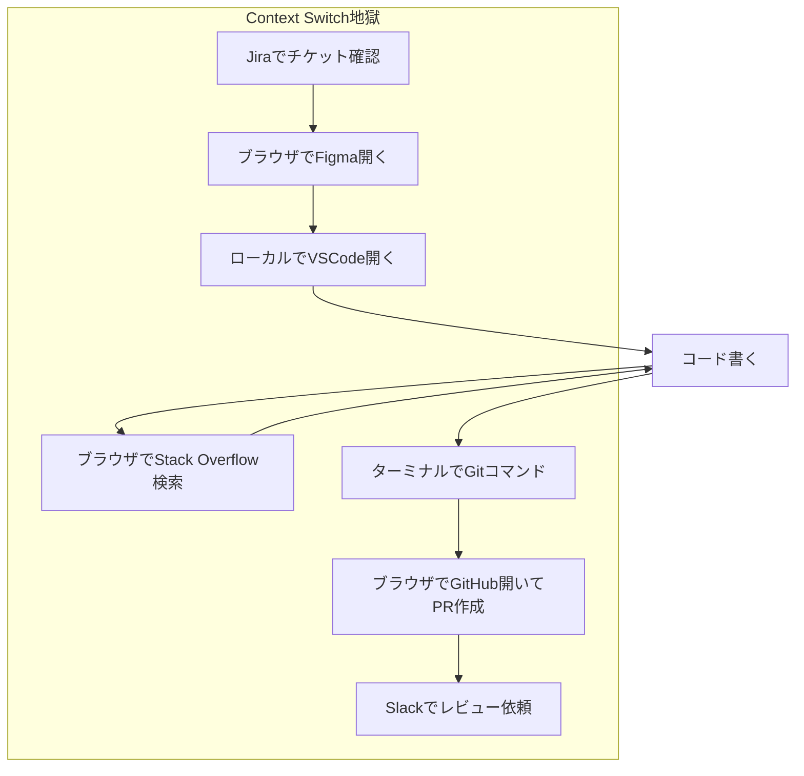
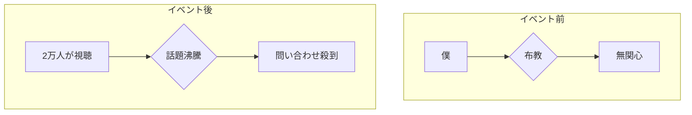
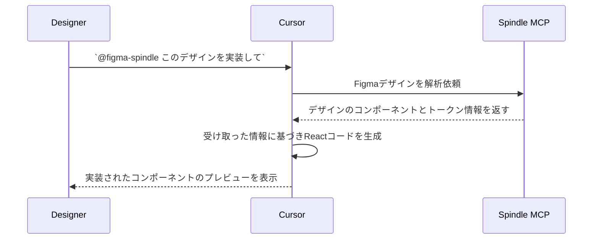
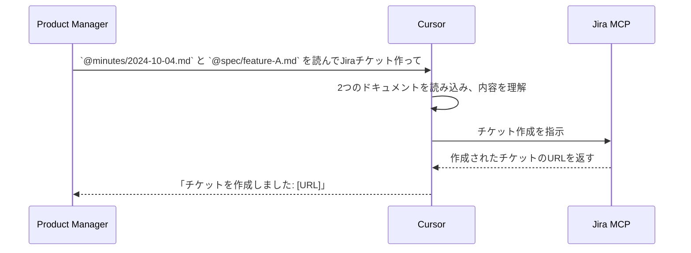
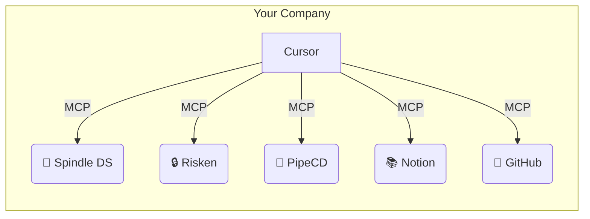
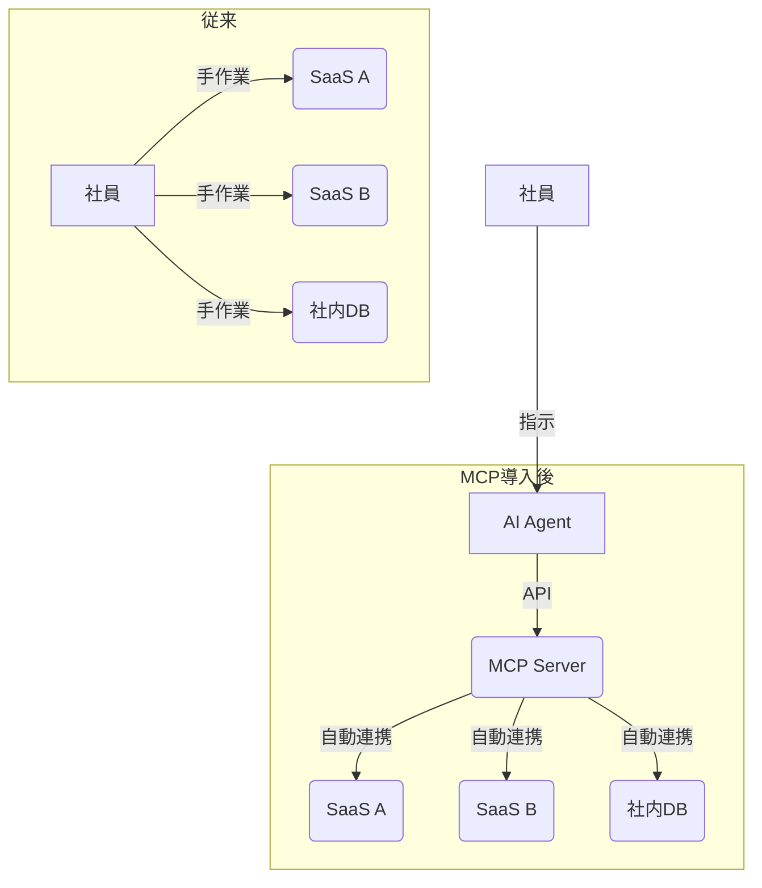
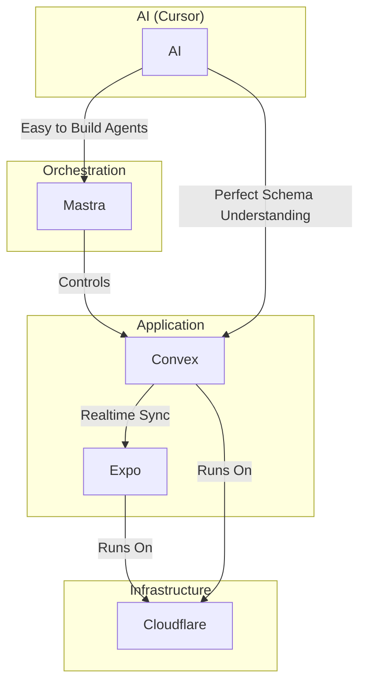

# 1. 大手企業のAIツール導入の壁を越えて
## サイバーエージェントのCursor活用戦略

<br>

### Cursor Meetup Tokyo 2025

<br>

**Gunther Brunner**  
株式会社サイバーエージェント

<!--
皆さん、こんばんは！今日はすごい熱気ですね。5000人以上の方が集まっていると聞いて、本当に興奮しています。ありがとうございます。
これから20分という時間ですが、僕がサイバーエージェントでどうやってCursorを広めてきたか、その泥臭い道のりと、そこから見えた未来について、皆さんと共有したいと思います。
エンジニアの方はもちろん、そうでない方にも楽しんでいただけるように話しますので、リラックスして聞いてください。
-->

<!-- Midjourney Prompt: Futuristic Japanese corporate office with glowing AI neural networks floating above desks, cyberpunk aesthetic meets traditional Japanese design, purple and blue neon lights, 16:9, cinematic lighting --ar 16:9 --v 7 -->

---

# 2. なぜ今、私たちは AIコーディングに移行するのか？

<div class="grid grid-cols-2 gap-8">
<div>

## 世界のトレンド 🌍

**AIコーディング関連のキーワード検索推移**
- 2024年11月: 指数 45
- 2025年1月: 指数 68
- 2025年3月: 指数 92
- 2025年4月: 指数 100

</div>
<div>

## 日本の現状 🇯🇵

- **Zennトレンドの50%がAI関連** (2025年4月)
- エンジニアコミュニティの急速な変化
- 従来の開発手法からの大転換期

</div>
</div>

<br>

> **"もはやAIを使わない開発は、電卓を使わない会計と同じ"**

<!--
まず、なぜ今AIコーディングなのか、という大きな話から始めさせてください。
Googleのトレンドを見てください。この半年で検索数が倍以上に増えています。特にここ数ヶ月の伸びは異常です。
日本でも、Zennのようなエンジニア向けプラットフォームのトレンドは、半分以上がAI関連。
これはもう、無視できない大きな波なんです。電卓を使わずに会計をする人がいないように、これからはAIを使わない開発は考えられなくなります。
-->

<!-- Midjourney Prompt: Global trend visualization with glowing data streams flowing across a world map, focusing on Japan with bright neural network connections, modern data visualization aesthetic, blue and gold color scheme, 16:9 --ar 16:9 --v 7 -->

---

# 3. AIコードエディタ導入企業の最新事例

| 企業名 | 導入ツール | 導入効果 | 投資対効果 |
|--------|-----------|----------|------------|
| 株式会社ココナラ | Cursor Business | UI実装速度10倍 | 月額$40で年間数千万円相当の工数削減 |
| Ubie株式会社 | 複数AI開発ツール | エンジニア満足度85%向上 | 離職率低下による採用コスト削減 |
| 某メガベンチャー | Cursor + MCP | 開発サイクル60%短縮 | 新機能リリース頻度3倍 |

<br>

<div class="text-center text-xl">

> **"月額$40の投資で、年収1000万円のエンジニアの生産性が2倍になる"**

</div>

<!--
実際の導入事例を見てみましょう。
ココナラさんは、Cursorを導入してUIの実装速度が10倍になったそうです。10倍ですよ！今まで1週間かかっていたものが、半日で終わる計算です。
Ubieさんでは、エンジニアの満足度が85%も向上したと。これは本当にすごいことで、優秀なエンジニアが会社を辞めなくなるんです。採用コストを考えれば、月額わずか40ドルの投資で、とんでもないリターンがあるということです。
-->

<!-- Midjourney Prompt: Modern Japanese corporate office with happy engineers working with AI assistants visualized as holographic helpers, productivity metrics floating in the air, warm and positive atmosphere, 16:9 --ar 16:9 --v 7 -->

---
layout: intro
---

# 4. まず、自己紹介をさせてください

<div class="grid grid-cols-2 gap-8">
<div>

## Gunther Brunner
### CTO統括室 Developer Productivity室

- 🚀 **元Microsoft / Amazon**
- 🛠️ **開発者生産性の専門家**
- 🤖 **Cursor歴2年** (国内最古参…のはず！)
- 📢 **社内のAI技術エバンジェリスト**

</div>
<div v-click>


</div>
</div>

<!--
えー、私、ガンサー・ブルナーと申します。サイバーエージェントのCTO統括室というところで、開発者の生産性を上げるためなら何でもやる、という仕事をしています。
以前はMicrosoftやAmazonにいました。
Cursorはもう2年くらい使っていて、多分、日本で一番最初期から使っているユーザーの一人じゃないかな、と自負しています。
-->

<!-- Midjourney Prompt: Portrait style tech evangelist in modern Japanese office, holographic displays showing code and productivity metrics, warm professional lighting, blend of Western and Japanese aesthetic, 16:9 --ar 16:9 --v 7 -->

---

# 5. 僕のミッション

## 「日本の開発現場を、世界最高のツールでアップデートする」

<br>

これまでの戦いの歴史です…

- **SVN → GitHub** | ✅ 完了！
- **HipChat → Slack** | ✅ 1年かかりました…
- **Confluence → Notion** | ✅ これも完了！
- **JIRA → Linear** | 🔄 もう少し…！
- **IDE → Cursor** | 🚀 **今、まさにここです！**

<!--
僕のミッションは、シンプルです。日本の開発現場を、世界で一番イケてるツールでアップデートすること。
これまでも、見ての通り、いろんなツールを社内に導入するために戦ってきました。Slack移行なんて1年もかかりましたよ…。
そして今、僕が最も情熱を注いでいるのが、IDEからCursorへの移行。これが僕の今の最大のテーマです。
-->

<!-- Midjourney Prompt: A timeline visualization showing logos of software evolving from old to new (SVN to GitHub, JIRA to Linear), with a final bright spotlight on the Cursor logo, Japanese design motifs in the background, 16:9 --ar 16:9 --v 7 -->

---

# 6. 本日のアジェンダ

<div class="grid grid-cols-2 gap-8 text-left">
<div>

### **Part 1: 物語**
#### CAという”特殊な城”をいかに攻略したか
- なぜCAは特殊なのか？
- 孤独な2年間の戦い
- 起死回生のバイラル戦略
- 全社導入までの道のり

</div>
<div>

### **Part 2: 秘伝のタレ**
#### 生産性を爆上げする"Vibe Coding"
- 僕の究極の技術スタック
- なぜLLMの知識を信じてはいけないか
- "Context is King"の本当の意味
- あなたの仕事をSaaSに変える方法

</div>
</div>

<!--
今日お話しすることは、大きく二つです。
前半は、僕がサイバーエージェントという特殊な城をどうやって攻略してきたかの「物語」。
そして後半は、僕が実践している生産性爆上げ術、「秘伝のタレ」を皆さんにご紹介します。
-->

<!-- Midjourney Prompt: A slide with two sections. Left side shows a Japanese castle with a lone warrior approaching, labeled "The Story". Right side shows a glowing ramen bowl with steam forming tech logos, labeled "The Secrets". Split-screen, infographic style. --ar 16:9 --v 7 -->

---
layout: center
class: text-center
---

# 7. Part 1
# なぜ、CAでツールを広めるのは"特殊"なのか

<!--
さて、ここからが本題です。
まず、僕たちの会社、サイバーエージェントがいかに「特殊」な場所か、という話をさせてください。
これを知らないと、なぜ僕がこんなに泥臭い戦略を取ったのか、理解できないと思うので。
-->

<!-- Midjourney Prompt: A massive, intricate maze representing a complex corporate structure, with a glowing entrance labeled "CyberAgent", viewed from above, stylized and slightly abstract, 16:9 --ar 16:9 --v 7 -->

---

# 8. その規模と実態

<div class="grid grid-cols-2 gap-8">
<div>

## 🏢 巨大な組織
- **連結従業員数 1万人以上**
- **エンジニア約3,000人**

</div>
<div v-click>

## 🌱 でも、中身は…
- **数百の子会社・事業部**
- **それぞれが独立したスタートアップ**

</div>
</div>

<!--
数字だけ見ると、サイバーエージェントは従業員1万人を超える、いわゆる「大企業」です。エンジニアも3000人くらいいます。
でも、その実態は全く違う。
中には、数百の独立した子会社や事業部があって、それぞれがまるで別のスタートアップみたいに動いているんです。
-->

<!-- Midjourney Prompt: A giant tree with hundreds of branches, each branch having its own small, unique, glowing house, representing independent subsidiaries within a large corporation, against a twilight sky, 16:9 --ar 16:9 --v 7 -->

---

# 9. 文化："自由と自己責任"

> 「自分のアイデアを自分で実現してもらうことで、モチベーションとコミットを引き出しています。極端な言い方をすれば、**勝手に学び、勝手に挑戦し、勝手に失敗から次へと生かす**という、ループが自然に回っていることが理想。」

<br>

<div v-click class="text-center text-3xl">

> **つまり、”トップダウン”がほぼ存在しない**

</div>

<!--
この背景にあるのが、「自由と自己責任」という僕たちの会社のコアな文化です。
会社が「これをやれ」って言うんじゃなくて、社員が自分で考えて、自分で挑戦する。
…ということは、ですよ。新しいツールを導入したいと思っても、「明日から全員これ使ってね！」なんてことは絶対にできないんです。
-->

<!-- Midjourney Prompt: A group of diverse Japanese professionals collaborating in a vibrant, chaotic, and creative office space, without a clear leader figure, emphasizing bottom-up innovation, energetic lighting, 16:9 --ar 16:9 --v 7 -->

---

# 10. ツール導入の壁

<div class="grid grid-cols-2 gap-4">
<div>

### ❌ **一般的な大企業**
- トップが決定
- 全社に通達
- 一斉導入

</div>
<div>

### ✅ **サイバーエージェント**
- トップダウンは機能しない
- 各チームが独自に技術選定
- Slackもポリシーもバラバラ

</div>
</div>

<br>

<div class="text-center text-3xl font-bold">
> **"大企業の中に、スタートアップが数百個ある"**
</div>

<!--
もう、お分かりですよね。
普通の大企業ならトップダウンで済む話が、僕たちの会社では全く通用しない。
数百個のスタートアップを、一つ一つ説得して回るようなものなんです。
これを僕は「内側から攻める」と呼んでいました。…最初は。
-->

<!-- Midjourney Prompt: A split screen visualization. Left side: A single large command arrow pointing down onto a unified block of people. Right side: Hundreds of small, chaotic arrows pointing in different directions from individual people, Japanese corporate context, 16:9 --ar 16:9 --v 7 -->

---

# 11. 唯一の戦略："バイラル"

## ツールを"ウイルス"のように感染させる

<div class="steps">

### 1. **点を作る**
小さなチームで導入し、圧倒的な成功事例を作る

### 2. **線を引く**
その事例を武器に、社内勉強会やSlackでエバンジェリズム活動

### 3. **面にする**
社内だけでは限界。外部を巻き込み、大きなムーブメントを創る

</div>

<!--
じゃあどうするか。答えは一つ。「バイラル」させるしかない。
ツールを、まるでインフルエンザのウイルスみたいに、人から人へと"感染"させていくんです。
まずは小さな成功事例という「点」を作り、それを布教活動で「線」で繋ぎ、最後は社外も巻き込んで大きな「面」にする。これが僕の考えた戦略でした。
-->

<!-- Midjourney Prompt: A glowing particle starting at one point in a network, then spreading exponentially through connected nodes, representing viral adoption, dark background with blue and purple glowing network, 16:9 --ar 16:9 --v 7 -->

---

# 12. なぜ僕がCursorに"賭けた"のか

<div class="text-center text-3xl mb-8">
## TTM (Time to Market) × Trend = 勝利の方程式
</div>

<div class="grid grid-cols-2 gap-8">
<div>
### ⏱️ **TTM: 速さは正義**
- 開発スピードが劇的に向上するものは、必ず勝つ

</div>
<div>
### 📈 **Trend: 未来の波を読む**
- 市場のシグナルを正しく読む
- 競合の動きを分析する

</div>
</div>
<div v-click class="text-center text-3xl font-bold mt-8">
> **"IDEという戦場では、Cursorが勝つと確信した"**
</div>
<!--
そもそも、なぜ僕がここまでCursorにこだわったのか。
僕が技術を選ぶ基準は、TTM、つまり開発速度がどれだけ上がるかと、トレンド、つまり未来の波です。
Cursorは、この両方を満たしていました。
-->
<!-- Midjourney Prompt: A futuristic stock market-style display, but instead of stocks, it shows tech trends. The "Cursor" trend line is rapidly rising, overtaking others like "Windsurf", with "TTM" shown as a key metric, 16:9 --ar 16:9 --v 7 -->

---

# 13. 深掘り: なぜCursorがTTMを加速するのか

- **アイデアからPRまでが数分**
  - ブレスト、タスクリスト生成、コーディング、テスト、ドキュメント生成まで、すべてCursor内
- **コンテキストスイッチングの撲滅**
  - ブラウザ、ドキュメント、チケット管理ツール… すべての移動がなくなる
- **"Auto-runモード"による自動化**
  - 軽微な修正やコマンド実行はAIに完全委任

> **「開発者の思考を止めないこと」が、最高のTTM改善策**

<!--
CursorがTTMを加速する理由は、単にコード生成が速いからじゃありません。
アイデア出しからプルリクエスト作成まで、開発の全工程がCursorの中で完結するからです。
開発者がエディタから離れる必要がない。つまり、「思考が止まらない」。これこそが、最高の時間短縮なんです。
-->

<!-- Midjourney Prompt: A brain with glowing neural pathways directly connected to the Cursor logo, which then outputs a finished product, symbolizing the seamless flow from thought to creation without interruption, 16:9 --ar 16:9 --v 7 -->

---

# 14. 深掘り: 市場トレンドの分析

| 比較項目 | Cursor | GitHub Copilot | Windsurf (旧) |
|---|---|---|---|
| **対応モデル数** | 圧倒的に多い (OpenAI, Google, Anthropic etc.) | 少ない | 非常に少ない |
| **新モデル対応速度** | 最速 (数日以内) | 遅い | サービス終了 |
| **コンテキスト** | プロジェクト全体 (`@`メンション) | 限定的 | ファイル単位 |
| **独自性** | MCP、Rules、Agentなど | VSCode統合 | なし |

<br>

<div v-click>
**市場のシグナル:** AnthropicがWindsurfへのAPI提供を停止 → 特定企業への依存はリスク
**結論:** オープンなモデル戦略と独自機能を持つCursorが、長期的に最も有利
</div>

<!--
トレンド分析も重要です。競合と比較して、Cursorの優位性は明らかでした。
特に、あらゆるAIモデルを迅速に、しかもオープンに使えるという点は、特定の企業にロックインされるリスクを避ける上で決定的に重要です。
Windsurfの事例が、それを証明しています。
-->

<!-- Midjourney Prompt: A competitive analysis chart on a holographic screen, showing Cursor with checkmarks and rising green bars, while other competitors have warning signs or falling red bars. Professional, data-driven visual, 16:9 --ar 16:9 --v 7 -->

---

# 15. …しかし、現実は甘くなかった (2年間の孤独な戦い)

<div class="timeline">
<div>
**2023年**
- 🚀 Cursorを使い始める (社内でほぼ僕一人)
- 💬 Slackに「#times_cursor」チャンネルを作る
- 😔 **反応、ほぼゼロ…**
</div>
<div v-click>
**2024年前半**
- 🎤 社内イベントで何度も登壇
-  evangelism.mdを書き、布教活動を続ける
- 😢 **「ガンサーさんが好きなツールね」で終わる…**
</div>
</div>
<!--
とはいえ、現実は厳しかったです。
2年前から一人で使い始めて、Slackチャンネルを作っても、反応はゼロ。
イベントで話しても、「へー、ガンサーさん、また面白いツール見つけたんだね」くらいの反応で、誰も本気で使ってくれない。
2年間、本当に孤独な戦いでした。
-->
<!-- Midjourney Prompt: A single developer illuminated by a monitor with the Cursor logo in a vast, dark, empty office, conveying a sense of loneliness and determination, cinematic, moody lighting, 16:9 --ar 16:9 --v 7 -->

---

# 16. 当時の僕のワークフロー (手作業地獄)



> **毎日がコンテキストスイッチとの戦いだった**

<!--
当時の僕のワークフローはこんな感じでした。Jira見て、Figma見て、VSCode開いて、ググって、ターミナル叩いて、GitHub開いて、Slackに投稿して…。
ツールからツールへと飛び回る、まさに「手作業地獄」。
これじゃ速いわけがない。AIの力を借りる以前の問題でした。
-->
<!-- Midjourney Prompt: A complex, chaotic flowchart with many different app logos connected by tangled, messy arrows, with a frustrated stick figure in the middle. The title is "My Workflow Hell 2023". --ar 16:9 --v 7 -->

---

# 17. 聞こえてきた抵抗の声

<div class="grid grid-cols-2 gap-4">
<div>

### **「どうせただの流行り物でしょ？」**
- "AIなんてまだ仕事では使えない"
- "ChatGPTで十分"

</div>
<div>

### **「今のままで十分速い」**
- "VSCodeにCopilot入れてるし…"
- "新しいこと覚える方が面倒"

</div>
<div>

### **「セキュリティは大丈夫なの？」**
- "ソースコードを外部に送るなんて"
- "会社の情報が漏洩したら…"

</div>
<div>

### **「またガンサーのオモチャか…」**
- （これは僕の心の声）

</div>
</div>

<!--
布教活動をしても、聞こえてくるのはこんな声ばかり。
「ただの流行りだ」「セキュリティが心配」「今のままでいい」。
そして何より、「またガンサーが何か新しいオモチャを持ってきたぞ」という無言のプレッシャー…。
心が折れそうでしたね、正直。
-->
<!-- Midjourney Prompt: A single person standing in front of a massive wall, with skeptical phrases in Japanese text materializing on the wall as barriers. Phrases like 「セキュリティは？」 and 「今のままで十分」. --ar 16:9 --v 7 -->

---
layout: center
class: text-center
---

# 18. 転機
## "内から"がダメなら、"外から"攻める

<!--
そこで、僕は気づいたんです。
内側から一生懸命ドアを叩いても、誰も開けてくれない。
だったら、外から大きな声で叫んで、内側の人に「外で何か起きてるぞ？」って気づかせればいいんじゃないか？と。
戦略を180度、変えました。
-->
<!-- Midjourney Prompt: A person inside a fortress trying to push open a huge gate (labeled 'Internal Adoption'), then realizing and climbing a ladder to shout from the top of the walls to the outside world, symbolic, dramatic lighting, 16:9 --ar 16:9 --v 7 -->

---

# 19. 決戦兵器：AI Code Agents祭り！

## 2025年2月、大規模公開イベントを開催

<div class="grid grid-cols-2 gap-8">
<div>
- MG-DXの子会社社長、堂前さんも巻き込む
- 今日ここにいる、**きのぴーさん**にも登壇をお願い！
- CAの公式YouTubeチャンネルで全編配信

</div>
<div>


</div>
</div>
<!--
そして実行したのが、この「AI Code Agents祭り」です。
もう、社内イベントじゃなくて、誰でも見れる公開イベントにしてしまえ、と。
子会社の社長や、今日この後のセッションに登壇されるきのぴーさんのような影響力のある方々を巻き込んで、盛大にやりました。
-->
<!-- Midjourney Prompt: A huge, vibrant outdoor festival stage with Japanese lanterns and modern tech screens, the screen shows "AI Code Agents 祭り!", crowd is excited, a blend of tradition and future, 16:9 --ar 16:9 --v 7 -->

---

# 20. イベントの狙いと仕掛け

- **権威付け**: 子会社の社長や著名なエンジニアに登壇してもらう
- **社会的証明**: 「2万人が見た」という事実を作る
- **危機感の醸成**: 「他社はもうこんなに進んでいる」と見せる
- **FOMOを煽る**: "Fear Of Missing Out"。乗り遅れることへの恐怖感を作る

> **「Cursorは、もはや個人の好みではなく、業界のスタンダードだ」という空気を作ること**

<!--
このイベントの狙いは、ただCursorを紹介することではありませんでした。
社長や有名エンジニアに登壇してもらうことで「権威」を、視聴者数で「社会的証明」を作り、社内の人たちに「ヤバい、乗り遅れる！」という危機感、つまりFOMOを抱かせることが目的でした。
Cursorはもはや僕のオモチャじゃなく、業界のスタンダードなんだ、と。
-->

<!-- Midjourney Prompt: A chess board where one player (representing the evangelist) is strategically placing pieces labeled with "Authority", "Social Proof", and "FOMO" to checkmate the opponent (representing resistance). --ar 16:9 --v 7 -->

---

# 21. 結果は、想像を絶するものだった

<div class="grid grid-cols-2 gap-8 items-center">
<div>
## 📈 **2万人以上**が視聴
## 🏆 **CA開発者YouTube史上、最高視聴数を記録**
## 🔥 社内の空気が一変
</div>
<div v-click>



</div>
</div>

<!--
結果は…僕の想像を遥かに超えていました。
なんと、2万人以上の人が見てくれて、サイバーエージェントの開発者向けYouTubeチャンネルで、歴代1位の視聴数を叩き出したんです。
この瞬間、社内の空気が、明らかに変わりました。
-->
<!-- Midjourney Prompt: A graph showing a flat line, then a massive, explosive spike upwards, with the label "AI Code Agents Festival", data visualization, dramatic, on a futuristic interface, 16:9 --ar 16:9 --v 7 -->

---

# 22. 殺到したSlackメッセージ (一部)

<div class="space-y-4 text-left">
<div class="p-4 bg-gray-800 rounded-lg">
**とあるエンジニア:** 「ガンサーさん、イベント見ました！ヤバいですね。僕のチームでもCursor試したいんですが、何から始めれば…？」
</div>
<div class="p-4 bg-gray-800 rounded-lg">
**とある事業部長:** 「昨日の動画、うちの事業部の非エンジニアにも見てほしい内容でした。全社導入の予定ってあります？」
</div>
<div class="p-4 bg-gray-800 rounded-lg">
**昔の同僚:** 「お前、すごいことやったな！俺もアカウント欲しいんだけど、どうすればいい？」
</div>
</div>
<!--
イベントの後、僕のSlackは鳴り止みませんでした。
今まで見向きもしなかったチームから、「どうやって使うんだ」「導入したい」という連絡が殺到したんです。
空気が変わった、と肌で感じました。
-->
<!-- Midjourney Prompt: A smartphone screen showing a flood of positive notification messages from a Slack-like app, with avatars of happy colleagues, conveying a sense of overwhelming positive response. --ar 16:9 --v 7 -->

---

# 23. 全社導入への最終ハードル

| 懸念事項 | 僕の回答 / 解決策 |
|---|---|
| **セキュリティ** | BusinessプランはSOC2 Type2準拠。<br>コードは学習に使われないと規約で明記。プライバシーモード強制。 |
| **コスト** | 月額$15/人の投資で、開発者が1日数分でも時短できれば回収可能。<br>TTM短縮効果は計り知れない。 |
| **ベンダーロックイン** | VSCodeのフォークであり、設定はすべて引き継げる。<br>いつでもVSCodeに戻れる「可逆性」が強み。 |
| **全社展開の手間** | 導入ハンズオン資料(@cursor-handson.md)を作成。<br>各事業部で僕が導入支援会を実施。 |

<!--
もちろん、問い合わせが来ても、すぐに全社導入とはいきません。
経営層からは、セキュリティ、コスト、ベンダーロックインといった当然の懸念が出ました。
これら一つ一つに対して、具体的なデータと解決策を用意し、説明して回りました。いつでもVSCodeに戻れる、という「可逆性」が、最後の決め手の一つになりましたね。
-->

<!-- Midjourney Prompt: A person confidently presenting a slide to a board of executives. The slide shows a checklist with items like "Security", "Cost", "Lock-in" all marked with a green checkmark. --ar 16:9 --v 7 -->

---

# 24. そして、今

<div class="grid grid-cols-2 gap-8">
<div>
## 🌊 津波のような問い合わせ
- 「あのツール、どうやって使うの？」
- 「うちのチームでも導入したい！」
- **「全社導入、まだですか？」**
</div>
<div v-click>
## ✅ 全社導入、正式決定！
- 経営層との協議完了
- 現在、詳細を最終調整中
- **Businessプランを$15/月で提供予定**
</div>
</div>
<!--
そしてついに、先日、全社での導入が正式に決定しました。
2年間の孤独な戦いが、報われた瞬間でした。
-->
<!-- Midjourney Prompt: A Japanese executive's desk with a signed contract in the foreground that has the Cursor logo on it, the background is a bustling, happy office, signifying a successful deal, warm, positive lighting, 16:9 --ar 16:9 --v 7 -->

---

# 25. 僕の野望 ①
## "全員がCursorを使う会社"へ

<div class="text-center">

### エンジニアだけじゃない
## デザイナーも、企画も、営業も。
# "コードを書かない人"こそCursorを使うべきだ

</div>

<!--
でも、これで終わりじゃありません。僕の野望はもっと先にあります。
一つは、サイバーエージェントを「全員がCursorを使う会社」にすること。
エンジニアだけじゃない。コードを書かない人こそ、Cursorの恩恵を受けられるはずなんです。
-->
<!-- Midjourney Prompt: A diverse group of Japanese professionals (designer, marketer, coder, manager) all collaborating around a single, large, holographic Cursor interface, showing that it's a tool for everyone, bright, utopian, 16:9 --ar 16:9 --v 7 -->

---

# 26. なぜ、コードを書かない人にも？

- **ドキュメント作成**
  - `@`メンションで関連資料を読み込ませ、議事録や仕様書を自動生成
- **データ分析**
  - SQLやPythonを知らなくても、自然言語でデータ抽出・分析
- **アイデアの壁打ち**
  - 企画書や提案書の下書きを、AIと対話しながら作成

> **すべての知的生産活動は、Cursorに集約される**

<!--
なぜなら、Cursorはもはや単なるコードエディタではないからです。
議事録の作成、データ分析、企画書の壁打ち。あらゆる知的生産活動が、Cursor上で、AIのサポートを受けながらできるようになります。
すべての仕事が、Cursorに集約されていく。そんな未来が見えています。
-->
<!-- Midjourney Prompt: A split screen showing three use cases: a designer looking at code generated from a design file, a marketer getting a report from a natural language query, a writer co-authoring a document with an AI. All happening inside the Cursor UI. --ar 16:9 --v 7 -->

---

# 27. 未来のワークフロー：デザイナーの場合



> **FigmaのURLをペーストするだけで、コードが完成する世界**

<!--
例えばデザイナーなら。FigmaのURLをCursorにペーストして、「これ、実装しといて」って言うだけ。
あとはデザインシステムのMCPが勝手に解釈して、コードが出来上がる。そんな世界がもうすぐそこです。
-->
<!-- Midjourney Prompt: A designer sitting at a clean desk, dragging a Figma file icon and dropping it into the Cursor app icon. An arrow points from Cursor to a fully rendered website component. Simple, clean, step-by-step visual. --ar 16:9 --v 7 -->

---

# 28. 未来のワークフロー：PMの場合



> **議事録と仕様書を渡せば、タスクが起票される世界**

<!--
プロダクトマネージャーならもっとすごい。議事録と仕様書をAIに読ませて、「これでJiraチケット作っておいて」って言うだけ。
もう手作業でチケットを作る必要はなくなります。
-->
<!-- Midjourney Prompt: A product manager dragging two document icons ('Meeting Notes', 'Spec Doc') into the Cursor app icon. An arrow points from Cursor to a list of generated Jira tickets. Simple, effective, infographic style. --ar 16:9 --v 7 -->

---

# 29. 僕の野望 ②
## 世界一の"MCP"企業になる

<div class="grid grid-cols-2 gap-8">
<div>

## MCP (Model Context Protocol)
- 外部サービスとAIを繋ぐ"通訳"プロトコル

<br>
<br>

<div v-click>

> **"MCPサーバーの数が、未来の企業価値を決める"**

</div>
</div>
<div v-click>



</div>
</div>
<!--
そしてもう一つ。これが、今日僕が一番伝えたいことかもしれません。
サイバーエージェントを、世界で一番「MCPサーバー」を持つ会社にしたい。
MCPっていうのは、AIと外部ツールを繋ぐ通訳みたいなものです。
僕は、これからの時代、このMCPサーバーの数が、会社の競争力を示す重要な指標になると本気で信じています。
-->
<!-- Midjourney Prompt: A futuristic city skyline where each building is a glowing server rack labeled with a different MCP service (GitHub, Figma, etc.), representing a company's AI infrastructure, cyberpunk aesthetic, 16:9 --ar 16:9 --v 7 -->

---

# 30. MCPがなぜ企業価値に繋がるか



- **属人性の排除**: 個人のスキルに依存した業務がなくなる
- **業務の超高速化**: 数時間かかっていた作業が数秒に
- **ナレッジの集約**: MCP自体が会社のノウハウの塊になる

<!--
なぜMCPが企業価値に繋がるのか。それは、企業のワークフローから「人間による手作業」をなくせるからです。
これまで社員が手でやっていたバラバラのツール操作を、MCPサーバーがAIエージェントの指示で全部やってくれる。
これは単なる効率化じゃない。会社のノウハウそのものを、コードとして資産化する行為なんです。
-->
<!-- Midjourney Prompt: A before-and-after diagram. "Before" shows a person manually juggling multiple apps. "After" shows the person simply talking to an AI, which then orchestrates all the apps automatically via glowing MCP connections. --ar 16:9 --v 7 -->

---

# 31. CAの現役MCPサーバー事例

<div class="grid grid-cols-2 gap-4 text-sm">
<div>
### 🎨 **Spindle Design System MCP**
- Figmaと連携し、UI実装が**10倍速**に
</div>
<div>
### 🔒 **RISKEN MCP**
- セキュリティリスクの可視化を自動化
</div>
<div>
### 📚 **CA用語辞書 MCP**
- 「それってどういう意味？」をAIが解説
</div>
<div>
### 🚀 **OSS (PipeCD, Bucketeer) MCP**
- OSSのドキュメントをAIが読んでくれる
</div>
</div>

<!--
これは夢物語じゃなくて、すでにもう、これだけのMCPサーバーが社内で動いています。
特にデザインシステムの「Spindle MCP」は、UIを作るスピードを10倍にしました。
これらがどんどん増えていけば、会社全体の生産性は爆発的に上がります。
-->
<!-- Midjourney Prompt: A clean, organized dashboard interface showing a list of active MCP servers with status indicators (green lights), logos for each service, professional and techy, dark mode, 16:9 --ar 16:9 --v 7 -->

---
layout: center
class: text-center
---

# 32. Part 2
# Vibe Coding: 僕の生産性爆上げ術

<!--
さて、会社の大きな話はここまで。
ここからは、僕個人がどうやってCursorを使い倒して、生産性を爆上げしているか、その具体的な「秘密のタレ」を皆さんだけに公開します。
-->
<!-- Midjourney Prompt: A Japanese developer in a 'flow state', surrounded by holographic code and data streams, with subtle musical notes and waves visualizing the 'vibe', neon and energetic, 16:9 --ar 16:9 --v 7 -->

---

# 33. "Vibe Coding"とは何か？

<br>

> **AIとの対話を通じて、<br>明確な仕様書なしに、<br>直感と"ノリ"でプロダクトを進化させていく開発スタイル**

<br>

- **完璧な計画は不要**
- **高速なイテレーション**
- **「作って、見て、感じる」のループ**

<!--
僕が「Vibe Coding」と呼んでいるものは、何かというと…。
明確な仕様書や計画をガチガチに固めるんじゃなくて、AIとの対話を通じて、自分の直感とか、場のノリを信じて、プロダクトをどんどん作っていく開発スタイルです。
作って、見て、感じて、また作る。このループを、AIと一緒に超高速で回していくイメージです。
-->

<!-- Midjourney Prompt: A developer surfing on a wave of code, with an AI co-pilot next to them, navigating through a fluid, abstract digital landscape. Dynamic, artistic, and full of energy. --ar 16:9 --v 7 -->

---

# 34. Vibe Coding vs 従来のアジャイル

|  | Vibe Coding with AI | 従来のアジャイル |
|---|---|---|
| **計画** | `idea.md` のみ | 詳細なバックログ・ストーリーポイント |
| **1サイクル** | 数分〜数時間 | 1〜2週間 (スプリント) |
| **フィードバック** | AIと自分による即時FB | スプリントレビューでのチームFB |
| **成果物** | 動くコード | "潜在的にリリース可能な製品" |
| **役割** | AIと人間のペア | PO, SM, 開発チーム |

> **Vibe Codingは、アジャイルの原則をAIで極限まで加速させたもの**

<!--
従来のアジャイル開発と比べてみると、その違いは明らかです。
Vibe Codingは、スプリントという概念すらなくし、フィードバックループを数分単位にまで縮めます。
これはアジャイルを否定するものではありません。むしろ、その思想を、AIの力を使って究極の形にしたものだと僕は考えています。
-->

<!-- Midjourney Prompt: A split screen comparison. Left: A developer and an AI robot on a super-fast rocket ship labeled "Vibe Coding". Right: A team of people slowly moving a heavy cart labeled "Traditional Agile Sprint". --ar 16:9 --v 7 -->

---

# 35. 生産性の実測値

<div class="text-center">

## Before vs After (私の場合)

| 指標 | Before | After | 改善率 |
|------|--------|-------|--------|
| 機能実装/日 | 1-2個 | 5-8個 | **400%** |
| バグ発生率 | 15% | 3% | **80%減** |
| コードレビュー時間 | 2時間 | 30分 | **75%減** |
| ドキュメント作成 | 翌日 | 即時 | **∞** |

</div>

<br>

> **"これは誇張ではない。Vibe Codingがもたらした実際の数字。"**

<!--
これが、僕がVibe Codingを実践した結果の、実際の数字です。誇張じゃありません。
1日に実装できる機能が4倍に増えました。
バグは80%減。なぜならAIが常に横でチェックしてくれるから。
コードレビューもAIに手伝ってもらうから爆速。ドキュメントはコーディングと同時に完成します。
これが現実です。みなさんも、この世界に来ることができます。
-->

<!-- Midjourney Prompt: Productivity metrics dashboard with dramatic improvements, before/after comparison with glowing success indicators, data visualization celebrating achievements, 16:9 --ar 16:9 --v 7 -->

---
layout: center
class: text-center
---

# 36. 【秘伝】Vibe Codingの道具箱

<br>

> **"正直、これは教えたくなかった…<br>でも、日本の開発者のために、今日だけ公開します"**

<!--
さあ、お待たせしました。
僕が「Vibe Coding」と呼んでいる、最高に気持ちよく開発できる技術スタック。
これは僕の競争力の源泉なので、正直、今日まで誰にも教えたくなかった。
でも、今日ここに集まってくれた皆さんのために、特別に公開します。
-->
<!-- Midjourney Prompt: A dramatic scene of a Japanese sensei presenting a glowing, ancient scroll to a student. The scroll reveals not text, but modern tech stack logos (Convex, Mastra, etc.), a fusion of tradition and future, 16:9 --ar 16:9 --v 7 -->

---

# 37. Vibe Codingの道具箱 ①：AIモデル

| 用途 | おすすめモデル | なぜ？ |
|---|---|---|
| 🧠 **戦略・アイデア出し** | Claude 3.5 Opus | 思考が深く、多角的な視点をくれる。最高の壁打ち相手。 |
| ✍️ **新規コード生成** | Claude 3.5 Sonnet | 速さと精度のバランスが最強。0→1が得意。 |
| 🐛 **デバッグ・リファクタ** | GPT-4o | 既存コードの複雑なロジックを読み解くのが得意。 |
| 📚 **ドキュメント** | Gemini 2.5 Flash | 長いコンテキストを扱えるので、複数ファイルを読んで要約するのが得意。 |

<br>
<div class="text-center text-2xl">
> **"適材適所。モデルの特性を理解するのが第一歩"**
</div>
<!--
Vibe Codingを実践するための、僕の道具箱を紹介します。まずはAIモデル。
見ての通り、用途によって細かく使い分けています。
例えば、複雑なバグを追うときは、論理的な繋がりを読み解くのが得意なGPT-4oを使ったり、ドキュメントを書くときは長い文章を扱えるGeminiを使ったり。
この使い分けが、全ての基本です。
-->

<!-- Midjourney Prompt: A futuristic toolbox opening up, revealing glowing logos of different AI models (Claude, GPT, Gemini) organized in different compartments labeled 'Creativity', 'Logic', 'Speed', etc. 16:9 --ar 16:9 --v 7 -->

---

# 38. Vibe Codingの道具箱 ②：技術スタック

<div class="grid grid-cols-2 gap-8">
<div>
### 🤖 **AIエージェント**
- ## Mastra
</div>
<div v-click>
### ⚡ **アプリ開発 (BFF)**
- ## Convex
</div>
<div v-click>
### 📱 **ネイティブアプリ**
- ## Expo
</div>
<div v-click>
### ☁️ **インフラ全部**
- ## Cloudflare
</div>
</div>
<!--
これが、僕の選んだ究極のスタックです。
エージェントはMastra、アプリはConvex、ネイティブはExpo、そしてインフラは全部Cloudflare。
異論は認めません（笑）。
なぜこの組み合わせなのか、それぞれのツールについて、少しだけ深く話します。
-->
<!-- Midjourney Prompt: Four glowing pedestals in a futuristic hall, each with a holographic logo of Mastra, Convex, Expo, and Cloudflare, presented like priceless artifacts in a museum, 16:9 --ar 16:9 --v 7 -->

---

# 39. なぜ"Mastra"なのか (AIエージェント)

- **エージェント開発の民主化**
  - TypeScriptで簡単にエージェントを記述・実行できる
- **MCPとの親和性**
  - 様々なMCPをツールとして組み合わせ、複雑なワークフローを構築可能
- **ローカル実行とクラウド実行**
  - 手元でのデバッグから、本番のクラウド実行までシームレス

> **Mastraは、MCP時代の"Kubernetes"になる可能性を秘めている**

<!--
まずMastra。これはAIエージェントを作るためのフレームワークですが、とにかくTypeScriptで簡単に書けるのが素晴らしい。
そして、作ったMCPをツールとして簡単に呼び出せる。複数のMCPを連携させる、いわばエージェントのオーケストレーションツールです。
これはMCP時代のKubernetesになると僕は思っています。
-->

<!-- Midjourney Prompt: A visual metaphor of a music conductor (labeled 'Mastra') skillfully directing an orchestra of robots (labeled with different MCP logos), creating a harmonious symphony of automation. --ar 16:9 --v 7 -->

---

# 40. なぜ"Convex"なのか (アプリ開発)

- **完全なE2E型付け & SQL不要**
  - AIがスキーマを理解し、絶対に間違えない
- **リアルタイムDB**
  - フロントエンドとバックエンドが常に同期。モダンなUIが簡単に作れる
- **サーバーレス**
  - 面倒なインフラ管理が不要

> **Convexは、AIにバックエンド開発を"丸投げ"するための最高のプラットフォーム**

<!--
次にConvex。先ほども言いましたが、AIがスキーマを完全に理解できるので、バックエンドの実装をほぼ丸投げできます。
しかもリアルタイムDBなので、AIが作ったものが、すぐにUIに反映されて気持ちいい。この「気持ちよさ」がVibe Codingでは超重要です。
-->

<!-- Midjourney Prompt: An AI robot perfectly placing a puzzle piece (labeled 'code') into a complex puzzle (labeled 'schema'), symbolizing a perfect fit without errors, clean, futuristic, 3D visualization, 16:9 --ar 16:9 --v 7 -->

---

# 41. なぜ"Expo"なのか (ネイティブアプリ)

- **React Nativeの決定版**
  - 面倒なネイティブのビルド設定から解放される
- **AIとの相性**
  - TypeScriptベースで、Convexとの連携も容易
- **OTA (Over-the-Air) Updates**
  - ストアの審査なしで、アプリのロジックを即時更新できる

> **ExpoのOTAアップデートは、Web開発のようなスピード感をネイティブにもたらす**

<!--
ネイティブアプリを作るならExpo一択です。
React Nativeの面倒な部分を全部隠蔽してくれるし、何よりOTAアップデートが強力。
AIに修正させて、ボタン一つで全ユーザーのアプリを更新できる。このスピード感は、一度味わうと戻れません。
-->

<!-- Midjourney Prompt: A smartphone screen showing an app being updated instantly. A "magic wand" tool, representing Expo OTA updates, touches the app and it transforms without going through an app store icon. --ar 16:9 --v 7 -->

---

# 42. なぜ"Cloudflare"なのか (インフラ)

- **グローバルなCDNとエッジコンピューティング**
  - Workersを使えば、サーバーレスで高速なAPIが作れる
- **R2, D1, Queues...**
  - S3互換ストレージからDB、キューまで、必要なものが全部揃っている
- **圧倒的なコストパフォーマンス**

> **AI時代のインフラは、もはやCloudflareだけでいい**

<!--
そして、これら全てを支えるインフラがCloudflareです。
もはやただのCDNじゃない。サーバーレスの実行環境からDB、ストレージまで、全部ある。
しかも、安い。AIを使った個人開発やスタートアップにとって、これ以上の選択肢は今のところ考えられません。
-->

<!-- Midjourney Prompt: A world map with the Cloudflare logo at the center, showing glowing network lines connecting to all continents, with smaller icons for R2, D1, Workers floating around it, representing an all-in-one global infrastructure. --ar 16:9 --v 7 -->

---

# 43. なぜこのスタックが"Vibe"を生むのか


**シナジー:** すべてがAIフレンドリーで、TypeScriptでE2Eで繋がっている。<br>AIが迷う余地がほとんどない。

<!--
なぜこの組み合わせなのか。それは、AIとの相性が抜群だからです。
ConvexのスキーマはAIが完璧に理解できるし、MastraはAIエージェントを作るのを簡単にしてくれる。
そして全部がTypeScriptで繋がっていて、Cloudflareの上でシームレスに動く。
AIが迷う隙を与えない。これが、気持ちいいVibe Codingのリズムを生むんです。
-->
<!-- Midjourney Prompt: A diagram showing how Mastra, Convex, Expo, and Cloudflare logos connect seamlessly with the Cursor logo at the center, with glowing lines of TypeScript code flowing between them, representing perfect synergy. --ar 16:9 --v 7 -->

---

# 44. 多くの人が犯す"最大の間違い"

<div class="text-center text-3xl mb-8">
> **”LLMがよく知っている技術(Tailwind等)を使おう”**
</div>
<br>
<div v-click>
## …それ、危険です。

<br>

> **手を挙げてください！<br>AIが書いたTailwind v3のコードが、v4で動かなかった人！**

</div>
<!--
ここで、多くの人がやりがちな、でも実はすごく危険な間違いについて話します。
それは、「AIがよく知ってそうな、メジャーな技術を使おう」とすること。
例えば、Tailwind。…はい、ここで手を挙げてください。AIが書いたv3のコードが、v4の環境で動かなくて困ったことがある人！
…ほら、やっぱり。たくさんいますよね。
-->
<!-- Midjourney Prompt: A developer looking frustrated at a screen full of code with red error messages, with a big version number 'v3' crossed out and 'v4' next to it, highlighting the version conflict problem, 16:9 --ar 16:9 --v 7 -->

---

# 45. 問題の本質と解決策

<div class="grid grid-cols-2 gap-8">
<div>
### 🚫 **問題**
- LLMの知識は、**古いStackOverflowのコード**がベース
- バージョン違いで動かない
- ベストプラクティスじゃない
</div>
<div v-click>
### ✅ **解決策**
- AIに”最新の教科書”を渡す
- **1. Cursor Rules** (Convexなど)
- **2. MCPドキュメントサーバー** (Mastraなど)
</div>
</div>
<!--
問題の本質は、LLMの知識が古いってことです。
じゃあどうすればいいか？簡単です。AIに、最新の公式ドキュメントっていう「教科書」を渡してあげればいい。
それを実現するのが、Cursorの「Rules」機能であり、「MCPサーバー」なんです。
-->
<!-- Midjourney Prompt: An AI robot discarding a pile of old, dusty books (labeled 'StackOverflow') and picking up a new, glowing, digital tablet (labeled 'MCP Docs'), symbolizing the shift to up-to-date knowledge, 16:9 --ar 16:9 --v 7 -->

---

# 46. Vibe Codingの作法 ①：効果的な"Rules"の書き方

```md
<!-- .cursor/rules/convex.mdc -->

# Convexベストプラクティス

- `query` と `mutation` の中で直接 `db` を叩くこと。他の関数にラップしない。
- スキーマ定義は `defineSchema` を使う。
- インデックスは `defineTable` の `.index()` で定義する。
- 認証は `ctx.auth` を使う。

## やってはいけない例
```ts
// BAD: 認証ロジックがmutationの外にある
function checkAuth(ctx) { ... }
export const doSomething = mutation({
  handler: async (ctx, args) => {
    checkAuth(ctx); // これは動作しない
  },
});
```
```

- **簡潔に、明確に**
- **アンチパターンと理由も書く**
- **具体的なコード例を入れる**

<!--
Rulesを効果的に使うには、いくつかコツがあります。
簡潔に、箇条書きで書くこと。そして、「こう書け」という良い例だけでなく、「こう書くな」という悪い例も、なぜダメなのかという理由付きで示すのが非常に重要です。
AIは、具体的なコード例から最もよく学びます。
-->
<!-- Midjourney Prompt: A page from a futuristic rulebook, showing clear 'Do's and 'Don'ts' with simple code snippets, holographic checkmarks and crosses next to them, clean infographic style. --ar 16:9 --v 7 -->

---

# 47. RulesをAIに作らせる

<div class="text-left bg-gray-800 rounded-lg p-4">
<p class="text-cyan-400">> /Generate Cursor Rules</p>
<br>
<p class="text-white">このプロジェクトのコーディング規約とベストプラクティスをまとめたルールを生成してください。特に、Reactのカスタムフックの命名規則と、エラーハンドリングのパターンについて詳しく記述してください。</p>
</div>

<br>

> **会話の文脈から、AIがプロジェクトルールを自動生成してくれる**

<!--
さらにすごいのは、このRules自体を、AIに作らせることができるんです。
チャットで「このプロジェクトのルール作って」とお願いするだけで、これまでの会話やプロジェクト内のコードを参考にして、ルールを自動で書き出してくれます。
まさに、AIと一緒にプロジェクトを育てていく感覚です。
-->
<!-- Midjourney Prompt: An AI robot reading through project files and conversations, and then writing on a tablet to create a new rulebook for another, smaller robot to read. Illustrates AI generating rules from context. --ar 16:9 --v 7 -->

---

# 48. Vibe Codingの作法 ②：CONTEXT IS KING.

<div class="text-center text-5xl mb-8">
> **CONTEXT! CONTEXT! CONTEXT!**
</div>

<div v-click>
## Cursorを離れた瞬間、あなたは時間だけでなく、
## AIにとって最も重要な”CONTEXT”を失っている

</div>
<!--
結局、AIにとって一番大事なものは何か。それは「コンテキスト」、文脈です。
もう一度言います。コンテキスト！
あなたがエディタを離れてブラウザを開いた瞬間、あなたは時間だけじゃなく、AIにとって一番のご馳走であるコンテキストを捨ててしまっているんです。
-->
<!-- Midjourney Prompt: A developer sitting at a desk, with a vibrant, glowing sphere of 'Context' around their head. When they look away to a different screen, the sphere starts to flicker and fade, visualizing context loss, 16:9 --ar 16:9 --v 7 -->

---

# 49. コンテキストスイッチングの本当のコスト


> **一度集中が切れると、元に戻るのに平均23分かかる**

<p class="text-sm">
Source: University of California, Irvine
</p>

<!--
これは科学的な事実です。一度集中が途切れると、元の状態に戻るのに平均で23分かかると言われています。
エディタとブラウザを行き来するたびに、あなたは23分を失っているかもしれない。
AIも同じです。コンテキストが途切れると、AIも「あれ、何の話だっけ？」ってなっちゃうんです。
-->

<!-- Midjourney Prompt: A brain visualization with a smooth, flowing energy pattern. Suddenly, a jarring 'context switch' alert appears, and the energy pattern shatters into chaotic fragments. It then slowly and difficultly tries to reform. --ar 16:9 --v 7 -->

---

# 50. Vibe Codingの作法 ③：Project as Code

## アイデアからデプロイまで、すべてをリポジトリで管理する

<div class="steps">
### 1. **`00-idea.md`**
Opusとブレストし、アイデアをMarkdownにまとめる
### 2. **`01-tasks.md`**
アイデアをもとに、AIにタスクリストを生成させる
### 3. **`src/**.ts`**
タスクリストを見ながら、AIとペアプロでコーディング
### 4. **`pull-request.md`**
変更点(`git diff`)をAIに要約させ、PR文を自動生成
</div>

> **Cursorから一歩も出ずに、開発の全サイクルを回す**

<!--
だからこそ、僕は「Project as Code」という考え方を徹底しています。
アイデア出しのメモから、タスク管理、そして実際のコード、プルリクエストの文章まで、プロジェクトに関するもの全てをリポジトリの中に入れる。
こうすることで、Cursorは常にプロジェクトの全コンテキストを把握でき、僕もCursorから一歩も出る必要がなくなります。
-->

<!-- Midjourney Prompt: A Git repository visualized as a physical file cabinet. Drawers are labeled 'Ideas', 'Tasks', 'Code', 'PRs'. An AI robot is seamlessly moving files between drawers, all within the same room. --ar 16:9 --v 7 -->

---

# 51. 実例: `00-idea.md`

```md
# AIペット育成ゲーム

## コンセプト
- AIとしりとりや会話をすると、ペットが成長する
- ペットは会話内容に応じて、ユニークな姿に進化する
- ConvexとExpoを使って、リアルタイムで成長を反映させる

## 機能一覧
- ユーザー登録・ログイン
- ペット選択
- AIとのチャット画面
- ペットのステータス表示
- 進化履歴
```

<br>
**これを書いたら、AIに `@00-idea.md` を読ませて…**

<!--
これが実際の `idea.md` の例です。
AIとブレストしながら、こんな感じでコンセプトとざっくりした機能を書き出します。
重要なのは、完璧じゃなくていい、ということです。AIが理解できれば十分。
そして、このファイルをAIにメンションして…
-->
<!-- Midjourney Prompt: A screenshot of a simple markdown file with the title "AI Pet Game Idea", showing a few headings and bullet points, looking clean and organized within the Cursor editor UI. --ar 16:9 --v 7 -->

---

# 52. 実例: 生成された `01-tasks.md`

```md
# タスクリスト: AIペット育成ゲーム

## Backend (Convex)
- [ ] `convex/schema.ts` の定義 (users, pets, chats)
- [ ] `convex/users.ts` の作成 (createUser)
- [ ] `convex/pets.ts` の作成 (createPet, getPetForUser)
- [ ] `convex/chat.ts` の作成 (sendMessage, onNewMessage)

## Frontend (Expo)
- [ ] `app/screens/LoginScreen.tsx` の作成
- [ ] `app/screens/ChatScreen.tsx` の作成
- [ ] `app/components/PetAvatar.tsx` の作成
- [ ] Convexとの接続設定 (`app/lib/convex.ts`)
```
**`@00-idea.md を元にタスクリスト作って` と指示するだけで、ここまで具体的になる。**

<!--
「このアイデアでタスクリスト作って」とお願いするだけで、これだけ具体的なタスクリストが生成されます。
バックエンドとフロントエンド、必要なファイルまで洗い出してくれています。
あとは、このチェックリストを一つずつ潰していくだけです。もちろん、AIと一緒に。
-->
<!-- Midjourney Prompt: A screenshot of a markdown file as a checklist, with items like "Define schema.ts" and "Create LoginScreen.tsx", with some items already checked off. Shows progress and clarity. --ar 16:9 --v 7 -->

---

# 53. MCPワークフロー進化論

## あなたの仕事を"SaaS"に変える4ステップ

<div class="steps">
### 1. **手動**
まず、Cursorの中で一連の作業を手動でやってみる
### 2. **MCP化**
その作業の一つ一つを、MCPサーバーでラップする
### 3. **エージェント化**
Mastraを使い、MCPを連携させるエージェントを作る
### 4. **収益化**
出来上がったエージェントを、SaaSとして販売する！
</div>

<!--
このMCPという考え方を発展させると、あなたの普段の仕事が、新しいビジネスに変わります。
最初は手動でやってる作業を、一つずつMCPにしていく。
それらを繋ぎ合わせるエージェントを作る。
最終的には、そのエージェント自体を、StripeのMCPと組み合わせてSaaSとして販売できる。
これが、これからの時代の新しい起業の形です。
-->
<!-- Midjourney Prompt: A 4-step infographic showing an evolution. 1: A person doing manual work. 2: The work turns into glowing API blocks (MCPs). 3: The blocks are orchestrated by a robot (Agent). 4: The robot stands on a pile of gold coins (Monetization), 16:9 --ar 16:9 --v 7 -->

---

# 54. 具体例: 経費精算ワークフロー

<div class="grid grid-cols-4 gap-4 text-center">
<div>
### Step 1: 手動
1. SlackのDMからレシート画像をDL
2. 経費精算SaaSにログイン
3. 金額・日付・項目を手入力
4. 申請ボタンを押す
</div>
<div v-click>
### Step 2: MCP化
- Slack MCP
- Receipt Reader MCP
- Expense SaaS MCP
</div>
<div v-click>
### Step 3: エージェント化
`@expense-agent レシートこれよろしく`
とSlackでメンションするだけ
</div>
<div v-click>
### Step 4: SaaS化
このエージェントを月額500円で社外に販売する
</div>
</div>
<!--
例えば、面倒な経費精算。
手動でやると、これだけのステップがありますよね。
これを、Slack、レシート読み取り、経費精算SaaS、それぞれのMCPを作り、Mastraで繋ぐ。
そうすれば、SlackでAIにメンションするだけで、全部自動でやってくれるエージェントが完成します。
そして、このエージェントは、もう立派なSaaSとして販売できるんです。
-->
<!-- Midjourney Prompt: A 4-panel comic strip. 1: A frustrated person manually doing expense reports. 2: Glowing logos for Slack, OCR, and a SaaS app. 3: The person relaxing while a robot agent does the work. 4: The robot agent being sold on a futuristic app store. --ar 16:9 --v 7 -->

---

# 55. 最初のMCPサーバーを作ってみる (超入門)

```typescript
// my-mcp-server/index.ts
import { McpServer, tool } from "mcp";

const myTools = {
  getTodaysWeather: tool({
    description: "東京の今日の天気を取得します",
    handler: async () => {
      // ここで気象APIを叩く
      return { weather: "晴れ", temp: 25 };
    },
  }),
};

const server = new McpServer({ tools: myTools });
server.listen({ port: 3000 });
```
`.cursor/mcp.json` でこのサーバーを指定すれば、チャットで `@getTodaysWeather` と呼べるようになる。

> **たったこれだけで、あなたの作った関数がAIの"ツール"になる**

<!--
MCPサーバーって聞くと難しそうですが、基本はこれだけです。
mcpライブラリをインポートして、ツールとして公開したい関数を定義する。
これだけで、AIがあなたの作った関数を、名前を指定して呼び出せるようになります。
最初のステップは、驚くほど簡単なんです。
-->
<!-- Midjourney Prompt: A very simple, clean code snippet of a "Hello World" MCP server on a dark background, with glowing syntax highlighting. An arrow points from `@getTodaysWeather` in a chat bubble to the `handler` function in the code. --ar 16:9 --v 7 -->

---

# 56. 【速報】MCPの革命的進化

# "Elicitations"

<br>

<div class="text-center text-3xl">
## AIが、ユーザーに"質問"できるようになった
</div>
<!--
最後に、MCPに関する超ホットなニュースです。
「Elicitations」という、革命的な機能が追加されました。
これは何かというと、AIが、分からないことがあったら、ユーザーに質問できるようになったんです。
-->
<!-- Midjourney Prompt: A close-up on an AI robot's face, its eyes changing from a processing symbol to a question mark, symbolizing the ability to ask for clarification, dramatic, cinematic, 16:9 --ar 16:9 --v 7 -->

---

# 57. これがどれだけ凄いことか

<div class="grid grid-cols-2 gap-8">
<div>
### 😭 **これまで**
- **User:** 「メール送って」
- **LLM:** (メールアドレスを知らないから) 勘で送るか、エラーで止まる
</div>
<div v-click>
### 🎉 **これから**
- **User:** 「メール送って」
- **LLM:** 「宛先のメールアドレスを教えてください」
- **User:** 「test@example.com」
- **LLM:** (正確に実行)
</div>
</div>
<div v-click class="text-center text-3xl font-bold mt-8">
> **"AIのハルシネーション(幻覚)が激減する"**
</div>
<!--
これがどれだけ凄いことか。
今までは、AIは分からないことがあっても、勝手に推測して間違えるか、エラーで止まるしかなかった。
これからは、人間と同じように「すみません、宛先は誰ですか？」って聞けるようになったんです。
AIが嘘をつく、いわゆるハルシネーションが、これで劇的に減ります。
-->
<!-- Midjourney Prompt: A split screen. Left side: A confused AI robot shrugging. Right side: The same AI robot having a 'lightbulb moment' after a user provides information in a chat bubble, showing the power of clarification, 16:9 --ar 16:9 --v 7 -->

---
layout: center
class: text-center
---

# 58. Part 3
# まとめと、未来への招待状

<!--
さて、あっという間に最後のパートです。
今日の話をまとめ、皆さんを未来へご招待します。
-->
<!-- Midjourney Prompt: A futuristic, glowing invitation card floating in space, with the text "Invitation to the Future" in Japanese. Stars and nebulae in the background. --ar 16:9 --v 7 -->

---

# 59. 本日のまとめ

<div class="text-lg">
- **1. CAでのツール導入は"バイラル"が鍵** (外から攻めろ！)
- **2. 未来の企業価値は"MCPサーバー数"で決まる**
- **3. AI開発の最強スタックは存在する** (Convex最高！)
- **4. LLMの知識を信じるな。"最新の教科書(MCP)"を与えろ**
- **5. CONTEXT IS KING.** (Cursorから離れるな！)
</div>

<!--
今日の話をまとめます。
サイバーエージェントのようなボトムアップの組織では、バイラル戦略、特に「外から攻める」のが有効です。
そして、これからの企業価値はMCPサーバーの数が決めます。
AIとの開発では、Convexのような型付けが強力なツールを選び、LLMの古い知識に頼らず、MCPで最新の教科書を与えましょう。
そして何より、コンテキストが王様です。絶対にCursorから離れないでください。
-->
<!-- Midjourney Prompt: A summary slide with 5 key icons representing the main takeaways (Virus, Server, Tech Stack, Book/MCP, Crown/Context), clean, infographic style, on a futuristic background, 16:9 --ar 16:9 --v 7 -->

---

# 60. あなたへの宿題

## **明日、職場でやってみること**
ｗ
<br>

<div class="text-3xl">
あなたのチームで、一番面倒で、<br>
誰もやりたがらない**"繰り返し作業"**を見つけてください。
</div>

<br>

<div v-click>
...そして、その作業を自動化する**最初のMCP**を作る計画を立ててみてください。
</div>

<!--
今日の話を聞いて、「面白かったな」で終わらせないでください。
皆さんに、宿題です。
明日、あなたの職場で、一番面倒で、みんなが嫌がっている繰り返し作業を一つ、見つけてみてください。
そして、それを自動化するための、あなたの会社にとっての最初のMCPを作る計画を、こっそり立て始めてみてください。それが、革命の第一歩です。
-->
<!-- Midjourney Prompt: A single, glowing seed on a dark, barren landscape. The seed is labeled "Your First MCP". In the distance, a sunrise is beginning, symbolizing a new beginning. --ar 16:9 --v 7 -->

---

# 61. お知らせ

<div class="grid grid-cols-2 gap-4 text-sm">
<div>
### 🌐 **MCPVerified.com**
- 僕がキュレーションするMCP情報サイト
- **Contributors募集中！**
</div>
<div>
### 🇯🇵 **Cursor-Japan.org**
- 日本語ドキュメント、イベント情報
- **Contributors募集中！**
</div>
<div>
### 🎯 **CA.ai #2 イベント**
- **2025年7月17日(木) 19:30〜** @Abema Towers
- MCPをテーマに、さらに深く話します！
</div>
<div>
### 🌟 **夏の大型イベント**
- 海外から"超大物ゲスト"を呼ぶ計画が…！
- 詳細は後日！
</div>
</div>
<div class="text-center mt-8">
### 💼 **We're Hiring!**
今日の話にワクワクした人、一緒に未来を作りませんか？
DMください！ → **[dub.sh/dp-enabling](https://dub.sh/dp-enabling)**
</div>

<!--
最後にお知らせです。
MCPの最新情報を集めたサイトと、Cursorの日本語情報サイトを立ち上げました。手伝ってくれる人、絶賛募集中です！
そして、7月にはさらにMCPを深掘りするイベントをやります。夏には、海外からヤバいゲストを呼ぶ計画もあります。
そして何より、僕たちは仲間を募集しています。今日の話を聞いて、少しでもワクワクしてくれたなら、ぜひ声をかけてください。
-->
<!-- Midjourney Prompt: A futuristic announcement board with multiple holographic panes showing event details, hiring posters, and community links, all floating in a modern Japanese event space, 16:9 --ar 16:9 --v 7 -->

---
layout: center
class: text-center
---

# 62. ご清聴ありがとうございました

<div class="text-2xl mt-8">
## 🚀 一緒にCursorとMCPで、開発の未来を創りましょう！
</div>

<div class="mt-12">
### Connect with me
🐦 @gunta85
💼 LinkedIn: /in/gunther-brunner
</div>
<!--
20分間、あっという間でした。
Cursorは、僕たちの働き方を、そして世界の作り方を変える力を持っています。
皆さんと一緒に、この革命に参加できることを楽しみにしています。
この後の懇親会で、ぜひ直接お話ししましょう。
本日は、本当にありがとうございました！
-->
<!-- Midjourney Prompt: A speaker on a grand stage, with the entire audience lit up by the glow from their smartphones, creating a sea of lights, symbolizing a connected and inspired community, triumphant atmosphere, 16:9 --ar 16:9 --v 7 -->