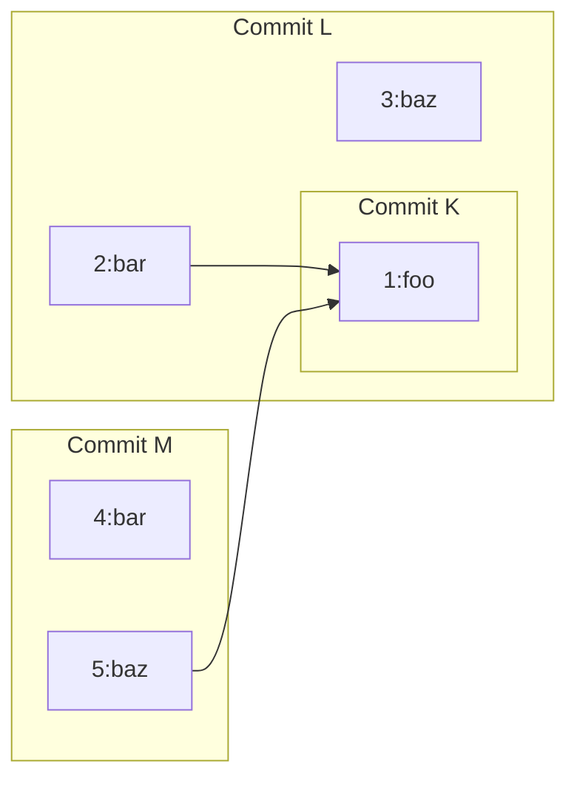

# Copy Tracking and Tracing Design

Authors: [Daniel Ploch](mailto:dploch@google.com), [Martin von Zweigbergk](mailto:martinvonz@google.com)

**Summary:** This Document documents an approach to tracking and detecting copy
information in jj repos, in a way that is compatible with both Git's detection
model and with custom backends that have more complicated tracking of copy
information. This design affects the output of diff commands as well as the
results of rebasing across remote copies.

## Objective

Add support for copy information that is sufficient for at least the following
use cases:

* Diffing: If a file has been copied, show a diff compared to the source version
  instead of showing a full addition.
* Merging: When one side of a merge (or rebase) has renamed a file and the other
  side has modified it, propagate the changes to the other side. (There are many
  other cases to handle too.)
* Log: It should be possible to run something like `jj log -p <file>` and follow
  the file backwards when it had been created by copying.
* Annotate (blame): Similar to the log use case, we should follow the file
  backwards when it had been created by copying.

The solution should support recording and retrieving copy info in a way that
is performant both for Git, which synthesizes copy info on the fly between
arbitrary trees, and for custom backends which may explicitly record and
re-serve copy info over arbitrarily large commit ranges.

The APIs should be defined in a way that makes it easy for custom backends to
ignore copy info entirely until they are ready to implement it.

### Desired UX

The following sections describe some scenarios and how we would ideally handle
them.

We have not seen much reason to distinguish copies from renames, so a rename
is simply the same thing as a copy plus a deletion. This means that we cannot
distinguish "copy `foo` to `bar` and rename `foo` to `baz`" from "copy `foo`
to `baz` and rename `foo` to `bar`".

#### Restoring from a commit should preserve copies

For example, `jj new X--; jj restore --from X` should restore any copies
made in `X-` and `X` into the new working copy. Transitive copies should
be "flattened". For example, if `X-` renamed `foo` to `bar` and `X` renamed
`bar` to `baz`, then the restored commit should rename `foo` to `baz`.

This also applies to reparenting in general, such as for
["verbatim rebase"](https://github.com/martinvonz/jj/issues/1027).

#### Diff after restore

`jj restore --from X; jj diff --from X` should be empty, at least when it comes
to file contents. It may indicate that renamed file have different history.

#### Lossless round-trip of rebase

Except for the [`A+(A-B)=A` rule][same_change_rule], rebasing is currently never
lossy; rebasing a commit and then rebasing it back yields the same content. We
should ideally preserve this property when possible.

For example:
```console
$ jj log
C rename bar->baz
|
B rename foo->bar
|
A add foo

$ jj rebase -r C -d A
$ jj rebase -r C -d B # Takes us back to the state above
```


#### Backing out the parent commit should be a no-op

Patches should be reversible so you can make a change and then back it out, and
end up with an empty diff across both commits.

For example:
```console
$ jj log
B rename foo->bar
|
A add foo

$ jj backout -r B -d B
$ jj diff --from B- --to B+ # Should be empty
```

#### Parallelize/serialize

This is a special case of the lossless rebase.
```console
$ jj log
E edit qux
|
D rename baz->qux
|
C rename bar->baz
|
B rename foo->bar
|
A add foo

$ jj parallelize B::D
# There should be no conflict in E and it should look like a
# regular edit just like before
$ jj rebase -r C -A B
$ jj rebase -r D -A C
# Now we're back to the same graph as before.
```

#### Copies inside merge commit

We should be able to resolve a naming conflict:
```console
$ jj log
D  resolve naming conflict by choosing `foo` as the source
|\
C | rename bar->baz
| |
| B rename foo->baz
|/
A add foo and bar

$ jj file annotate baz # Should not include changes from C
```

We should also be able to back out that resolution and get back into the
name-conflicted state.

We should be able to rename files that exist on only one side:
```console
$ jj log
D  rename foo2->foo3 and bar2->bar3
|\
C | rename bar->bar2
| |
| B rename foo->foo2
|/
A add foo and bar
```

#### Copies across merge commit

```console
$ jj log
D delete baz
|\
C | rename foo->baz
| |
| B rename foo->bar
|/
A add foo
```

`jj diff --from C --to D` should now show a baz->bar rename (just like
`jj diff --from C --to B` would). `jj diff --from B --to D` should show
no renames. That's despite there being a rename in C.

## High-level Design

Jujutsu uses a snapshot-based model similar to Git's. The algebra for our
first-class conflicts is also based on snapshots and being able to calculate
patches as differences between states. That means that we have to fit copy
information into that snapshot-based model too [^martinvonz_slow].

The proposal is to update tree objects to also contain information about a
file's past names. For example, if file `foo` gets renamed to `bar` in one
commit and then to `baz` in another commit, we will record that `baz` previously
had names `bar` and `foo`.

To support merging two files into one, the list of past names is actually a DAG.
Merging can happen in a merge commit when two sides copy/rename different
source files to the same target file. By having support for it in the model, we
can also support merging multiple files into one in a regular non-merge commit.

To avoid having to store all past paths in the tree object entry, we will write
the copy history as an object and the tree will refer to the object by ID. Each
ID refers to a node in the copy history DAG, similar to how commit IDs refer to
a node in the commit DAG.

Each node in the copy history DAG stores the path. Having the path in the copy
graph can be useful for finding copy sources without having to scan the whole
tree or having to ask the backend.

If we use only the file name as only input to the ID, then we get deterministic
tree IDs. On the other hand, if we add a salt to the copy graph node, then we
can represent that a file was rewritten from scratch. For example, a `foo` might
have copy ID `123` in the previous commit and when the file gets rewritten in
the current commit, it gets copy ID `456` even though there was no copy from an
existing file involved. That makes logical sense, but I'm not sure how useful
it will be.

The data structure might look like this:
```rust
// Current `TreeValue::File` variant:
File { id: FileId, executable: bool },
// New `TreeValue::File` variant:
File { id: FileId, executable: bool, copy_id: CopyId },

// A CopyId is a hash of this struct:
struct CopyHistory {
    path: RepoPath,
    parents: Vec<CopyId>
}
```

Should we support copy tracking for symlinks? Their history is not very useful
for annotation purposes, but knowing the history may at least be useful for
detecting directory renames (if all files and symlinks in a directory were
renamed).

We probably should not support tracking copied directories because it seems
complicated. I haven't spent much thinking about it, so it's also possible that
it's not that complicated.

### Diffing

When diffing two trees, we first diff the trees without considering copy info.
For any copy IDs that changed in that diff, we walk all of their copy graphs to
figure out how they're related and which source file to associate with which
destination file.

The details of the algorithm is left for the implementation. The following
sections provide some examples to hopefully show that it's feasible.

#### Example: Divergent copy and rename

Let's look at an example of how this model would look in this scenario:

```console
M rename foo->baz, create bar
|
| L copy foo->bar, create baz
|/
K add foo
```

Assuming the new files are different in each commit, we get the following trees.
Notation:
  * `id`is the hash of the contents (the `FileId`)
  * The `2:bar->1:foo` means that copy ID 2 (i.e. hash of the `CopyHistory`
    struct) has file `bar`, which was copied from copy ID `1`, where it was
    called `foo`.
```console
Commit K:
name: foo, id: K, copy_id: 1:foo

Commit L:
name: bar, id: L, copy_id: 2:bar->1:foo
name: baz, id: L, copy_id: 3:baz
name: foo, id: K, copy_id: 1:foo

Commit M:
name: bar, id: M, copy_id: 4:bar
name: baz, id: M, copy_id: 5:baz->1:foo
```

This graph also shows the relationship between the copy IDs and which commits
they appear in:


Let's first consider the diff from `K` to `M`. Looking at just the trees, that
diff finds that copy IDs 1,4,5 were affected. By walking their graphs, we find
1 and 5 are related, while 4 is not. Considering that copy graph (involving IDs
1 and 5), since `foo` doesn't exist in the destination and `baz` doesn't exist
in the source, we consider it a rename.

Let's now consider the diff from `L` to `M`. This is the same as the diff of the
commit `M2` we'd get by running
`jj new L; jj bookmark create M2; jj restore --from M --to M2` (which would
result in the commit `M2` having the same tree as `M`). Diffing from `L` to
`M` (or `M2`) finds 1,2,3,4,5 as changed copy IDs. By walking their graphs, we
find that 1,2, and 5 are related, while 3 and 4 are not.

The `bar` and `baz` files have unrelated copy graphs, i.e. the copy graphs for
the `bar` file in commit `L` and the `bar` file in commit `M` are disjoint, and
the same is true for the `baz` file. Therefore, we break up their diffs into two
separate diffs for each file.

Among the remaining copy IDs, the shortest path in the copy graph is between
`foo` on the source side and `baz` on the destination side, so we start with.
Since `foo` doesn't exist on the destination side and `baz` doesn't exist on the
source side (with a related copy ID), we consider it a rename.

The remaining file is `bar` on the source side. Its closest relative on the
destination side is `baz`. Since we already used `baz` as a rename target for
`foo`, we won't consider `bar` renamed to it. So we consider `bar` as copied
into `baz`.

So we get these diffs:

* `baz` is deleted (deleting content `L`)
* `bar` is created (with content `M`)
* `foo` is renamed to `baz` (showing diff from `K` to `M`)
* `bar` is merged into `baz` (showing diff from `L` to `M`)

#### Example: Divergent copy and rename (best rename target)

```console
N copy baz->qux
|
M rename foo->baz
|
| L rename foo->bar
|/
K add foo
```

When diffing `L` to `N`, we find that all files are related. Since `bar` does
not exist in the destination, we should find a rename target to match it with.
We pick `baz` because it's closer in the graph than `qux` is. So the diff is:

* `bar` is renamed to `baz`
* `bar` is copied to `qux`

#### Example: Copy onto deleted file

```console
M copy foo->bar
|
L delete bar
|
K add foo, bar
```

When diffing from `K` to `M`, we notice that `bar` has different and unrelated
copy IDs. We present one record saying that `bar` was deleted, and one record
saying that `bar` was copied from `foo`.

When diffing from `M` to `K`, we will instead present one record that says that
`bar` was created, and one record that says that `bar` was merged into `foo`.

### Merging

When merging, we need to add a phase before the content-level merging where we
handle copies. As before, we start by creating the completely unresolved merged
tree based on the input trees. To find the relevant copy information, we look at
the files changed in each diff and then look up the full copy graph for each.
For each copy graph, we can then walk the copy graph to find possible target
paths, which we then look up in the other side of the merge. If the path exists
in the tree and has the right copy ID, then we know that the files are related.

We assume that the differences between the bases and the first term in the
conflict can be very large, so we don't look at that diff. Assuming that the
commit backend can look up the full copy graph based on a given copy ID, we
don't need that diff for correctness.

Once we have found all copies involved in the merge, we analyze them to find
conflicts, such as when two sides of the merge rename a file to the same
target. If there are conflicts, we leave the trees unchanged. The user can then
resolve the name conflicts using `jj resolve` (once we've added support for
that). Depending on how slow the naming conflict phase turns out to be, we may
want to write a flag to commits indicating that they have unresolved naming
conflicts, so subsequent calls can avoid that phase.

When merging trees, we start by rewriting each diff to match any different names
in the destination tree. For example, if the tree conflict is `A+(B-C)+(D-E)`,
then we will rewrite the `(B-C)` diff and the `(D-E)` diff to the paths in `A`.
To translate the `(B-C)` diff, we calculate renames from `C` to `A` and then we
apply those renames to both `C` and `B`. This may result in conflicts.

If a file has a conflict in the copy ID, it will appear as if it doesn't exist
when materialized. It will therefore not show up in the working copy until the
user has resolved the conflict.

For example:
```console
M set foo="bye"
|
| L rename foo->bar
|/
K add foo="hello"
```

When rebasing `M` onto `L`, we apply the `foo->bar` rename to the trees in `M`
and its parent.

Another example:

```console
N rename foo->bar
|
| M create foo="M"
| |
| L delete foo
|/
K add foo="K"
```

When rebasing `M` onto `N`, we find the `foo->bar` rename in `N`, but since it
is unrelated to the `foo` file in `M` (assuming the `foo` file created in `M`
used a different salt), we will not perform any renames. The new `foo` file
is then simply created in the rebased `M` just like it was before the rebase.

#### Propagating changes across copies?

Should we propagate changes to copies? For example, if you've modified file
`foo` and then rebase it onto a commit that copied `foo` to `bar`, should we
apply your change to `bar` too? Mercurial does that but Git doesn't. It's
particularly useful when a file has been split in two. For example, let's say
you've made various changes in file `foo` and then rebase those change onto a
commit that split `foo` into `foo1` and `foo2` (or `foo` and `bar`). If we
propagate the changes to both files, each change will apply successfully in one
file (assuming the changes do not overlap with the split boundary). Each change
will have a modify/delete conflicts in the other file. Those can relatively
easily be resolved in favor of the deleted hunk. If we do not propagate changes,
then changes that belong in one of the files will instead only appear as
modify/delete conflicts in the first file and you will have to manually copy
over the changes to the copied file.

Propagating changes to copies means that rebasing a commit and then rebasing it
back is no longer a no-op even when ignoring the "same-change rule". For
example, if your commit modifies file `foo` and you rebase that commit onto a
commit that copied `foo` to `bar`, and then you rebase it back, the same change
will be applied twice to `foo`. However, thanks to the same-change rule, we
won't consider it a conflict, so maybe it actually works well in practice.

A third option is to not leave it up to the user whether to propagate the
change across the copy. We can do this by leaving the relevant paths in the
input trees unchanged in the conflicted commit. Then we will redo the copy
tracking process every time the commit is inspected. We can have `jj resolve`
ask the user if they want to propagate the changes to the copy target with a
simple yes/no question per copy target.

Decision: Asking the user about propagating copies seems like the best option.
It avoids surprises, and it makes the conflict algebra work in more cases.

#### Example: Propagate changes to copied file, then rebase back

```console
M foo="M"
|
| L copy foo->bar
|/
K add foo="K"
```

Let's say we rebase `M` onto `L`. Since we decided to not automatically
propagate changes to copies, we will leave the `M+(L-K)` tree unresolved (i.e.
without making any changes to the three trees). If the user does not resolve
the conflict, and instead rebases `L` back onto `K`, the conflict will be
resolved automatically per the usual conflict simplification.

#### Example: Multiple copies

```console
N foo="N"
|
| M foo="M, foo2="M2", foo3="M3"
| |
| L copy foo->foo2, copy foo->foo3
|/
K add foo="K"
```

Let's say we rebase `M` onto `N`. The changes to `foo`, `foo2`, and` foo3` will
then all apply to `foo`, which means we get a 4-sided conflict.

#### Example: Convergent renames

Consider this "convergent copy/rename" scenario:
```console
$ jj log
C rename bar->baz
|
| B rename foo->baz
|/
A add foo, add bar

$ jj new B C
```

It seems clear that `baz`'s copy graph should inherit from both `foo` and `bar`,
producing a merge in copy graph. The trees would look like this:
```
Commit A:
name: foo, id: aaa111, copy_id: 1:foo
name: bar, id: aaa111, copy_id: 2:bar

Commit B:
name: bar, id: aaa111, copy_id: 2:bar
name: baz, id: aaa111, copy_id: 3:baz->1:foo

Commit C:
name: foo, id: aaa111, copy_id: 1:foo
name: baz, id: aaa111, copy_id: 4:baz->2:bar

Merge commit:
name: baz, id: aaa111, copy_id: 5:baz->{3:baz->1:foo,4:baz->2:bar}
```

We used the same content for both `foo` and `bar` above to simplify. If they
had been different, we would have had a conflict in the contents but the copy
ID would still have been clear.

#### Example: Rebasing

```console
$ jj log
C rename bar->baz
|
B rename foo->bar
|
A add foo

$ jj rebase -r C -d A
```


```console
$ jj log
C rename foo->baz
|
| B rename foo->bar
|/
A add foo

$ jj rebase -r C -d B
```

#### Example: Rename added file

A well-known and thorny problem in Mercurial occurs in the following scenario:

```console
$ jj log
C rename foo->bar
|
| B modify foo
|/
A add foo

$ jj squash --from C --into A
```

The problem here for Mercurial is that after squashing C into A, the new A has
file `bar` but no record that it used to be called `foo`. The design proposed
above handles this case because we keep the copy ID of `bar` after squashing,
so we can detect that the modifications to `foo` in commit B should be
propagated to `bar`.

#### Example: Divergent renames

Consider this "divergent rename" scenario:
```console
$ jj log
C rename foo->baz
|
| B rename foo->bar
|/
A add foo

$ jj new B C
```

In this scenario, the regular 3-way merge of the trees without considering copy
info results in a tree without conflicts. However, the user might reasonably
expect to have to choose between the `bar` and `baz` names. Here's what Git says
in this scenario:

```console
$ git merge main
CONFLICT (rename/rename): foo renamed to baz in HEAD and to bar in main.
Automatic merge failed; fix conflicts and then commit the result.

$ git st
HEAD detached from ab0b8e3
You have unmerged paths.
  (fix conflicts and run "git commit")
  (use "git merge --abort" to abort the merge)

Unmerged paths:
  (use "git add/rm <file>..." as appropriate to mark resolution)
        added by them:   bar
        added by us:     baz
        both deleted:    foo
```

Interestingly, Git seems to represent this state by using index states that
would not normally end up in the index as a result of conflicts.

Here's what Mercurial says:

```console
$ hg merge main
note: possible conflict - foo was renamed multiple times to:
 bar
 baz
1 files updated, 0 files merged, 0 files removed, 0 files unresolved
(branch merge, don't forget to commit)
```

Mercurial doesn't have a place to record this state, so it just prints that
note and leaves it at that.

The model and algorithm described in this document would result in a conflict
in the copy ID at both paths after propagating the renames.

#### Example: @jonathantanmy's test case:

TODO: fill this out

```console
$ jj log
E baz="baz" (resolves conflict)
|
D <conflict>
|\
C | rename bar->baz
| |
| B rename foo->baz
|/
A add foo="foo" and bar="bar"

$ jj rebase -r E -d C
$ jj new D E -m F
```

If F is empty (auto-merged), it should have the same state as E before.


### Log

The copy graph contains all past paths and copy IDs of a file, so when doing
`jj log <filename>`, we might want to translate that to a revset that's similar
to `files()` but matches specific (path, copy ID) pairs instead of specific
paths.

### Annotate

TBD

### Representation in Git

Do we ever want to record renames in the Git backend? If we do, we would
presumably store it outside the Git object, similar to how we store the change
id for commits.

What do we use for trees where we *don't* have any copy graph recorded? If we
simply create a new copy graph based on the current path, then the caller will
never find any copies. Do we need an indexing pass to detect all renames in a
repo when running `jj git init`? That can be very expensive for large repos.
For reference, `git log --summary --find-copies-harder` takes about 165 seconds
in the git.git repo on my computer, and about 13 hours in the Nixpkgs repo.

An alternative is to do copy indexing in the background after cloning a repo.
That would mean that copy information would not show up until some time later.
It would also be more work to implement it this way.

How to deal with two trees having the same content but different file ids?
Actually store the additional data linked from the commit object? That would
not work if we point to trees from somewhere that's not a commit. We point to a
tree from the working-copy state.

One could imagine not storing any copy info in Git and instead making the model
described above an implementation detail of the backend. Then it could be used
by the native backend and the Google backend, while we still use on-the-fly
copy detection in the Git backend. However, if we want to be able to tell the
user about details of conflicting copy IDs so they can decide how to resolve
such conflicts, then we would have to somehow represent that abstractly too.

### Representation in cloud repo (e.g. Google)

Let's say you have a commit with some files you've modified. You now want to
sync (rebase) that to an updated main branch. If some of the files you modified
no longer exist on the main branch, we want to figure out if they were renamed
so we should propagate your changes to the new file location. As described
earlier, we can do that by finding files that have a different copy ID since the
last time you synced with the main branch. However, if there are 10 million new
commits on the main branch, there's perhaps tens of thousands of such files
spread across the entire tree. That can therefore can be very expensive to
calculate. We therefore need to be able to get help from a custom backend
implementation with this query.

Since we are only interested in copy graphs that involve files modified in the
rebased commit, it should be sufficient if the backend provides a method to
fetch the whole copy graph for a given copy ID (or list of copy IDs). We would
then first find all copy IDs involved in the diff of the rebased commit. Then
we query the backend to get the full copy graphs. We then need to walk the copy
graphs to see if a node exists in the destination tree.

A weakness of this solution is that the search gets expensive if there are very
many related files. That's probably not much of a problem in practice. The
server might want to populate the the index only for public/immutable commits.
Otherwise, a user could poison the index by creating tons of copies
(intentionally or by mistake), which would make all future queries about those
files expensive.

## Implementation plan

A rough implementation plan may look like this:

1. Implement support for copy-tracking in the test backend
3. Implement diff algorithm and test it
4. Implement merge algorithm and test it
5. Implement blame algorithm and test it
6. Implement file-following log algorithm and test it
7. Extract some queries to the commit backend trait so cloud-based backends
   (like the Google backend) can provide versions implemented using database
   indexes
8. Implement support for copy-tracking in the Git backend. This may involve
   backfilling, possibly lazily. Or it may involve new abstractions in the
   commit backend trait.
9.  Implement CLI for recording copies and for resolving conflicts in copies

## Alternatives considered

### Detect copies (like Git)

Git doesn't record copy info. Instead, it infers it when comparing two trees.

It's hard to make this model scale to very large repos. For example, let's say
you're rebasing your local commit to a new upstream commit that's 1 million
commits ahead. We would then want to find if any of the files in your local
commit has been copied upstream. That's very expensive to do by comparing the
old and the new base trees. However, since the query APIs defined above take
commits (not trees) as input, we allow the backend to take the history into
account when calculating the copies. A backend can then create an index based
on the input files (in your local commit) and find if it's been copied without
comparing the full trees.

### Record logical file identifiers in trees (BitKeeper-like model)

BitKeeper records a file ID (which identifies a logical file, unlike our `FileId`
type) for each path (or maybe it's a path for each file ID). That way you can
compare two arbitrary trees, find the added and deleted files and just compare
the file IDs to figure out which of them are renames.

This model doesn't seem to be easily extensible to support copies (it only
supports renames).

To perform a rebase across millions of commits, we would not want to diff the
full trees because that would be too expensive (probably millions of modified
files). We could perhaps instead find renames by bisecting to find commits that
deleted any of the files modified in the commit we're rebasing.

Another problem is how to synthesize the file IDs in the Git backend. That could
perhaps be done by walking from the root commits and persisting an index.

### Include copy info in the FileId (Mercurial-like model)

Mercurial stores copy info in a metadata section in the file content itself
[^mercurial_changeset_copies]. That means that a file will get a new file
(content) ID if its copy history changes. That's quite similar to the proposal
in this document. One difference is that Mercurial's model stores information
only about the most recent copy. If the file is then modified, it will get a new
file ID. One therefore has to walk the history of the file to find the previous
name (which is usually not much of a problem because Mercurial stores a revision
DAG per file in addition to the revision DAG at the commit level).

### Hybrid snapshot/patch model with copy info stored in commits

We considered storing copy info about the copies/renames in the commit object.
That has some significant impact on the data model:

* Without copy info, if there's a linear chain of commits A..D, you can find
  the total diff by diffing just D-A. That works because (B-A)+(C-B)+(D-C)
  simplifies to just D-A. However, if there is copy info, the total diff will
  involve copy info. If that's associated with the individual commits, we will
  need to aggregate it somehow.
* Restoring from another tree is no longer just a matter of copying that tree;
  we also need to figure out copies between the old tree and the new tree.
* Conflict states are represented by a series of states to add and remove. This
  does not work with the patch-based copy info. We spent a lot of time trying
  to figure out a solution that works, but it seems like the snapshot-based
  conflict model and the patch-based copy info model are not reconcilable.
  Therefore, we won't track conflicted copy info, such as between a `foo`->`baz`
  rename and a `bar`->`baz` rename.
* Since copy records are relative to the auto-merged parents, that unfortunately
  means that the records will depend on the merge algorithm, so it's possible
  that a future change to the merge algorithm will make some copy records
  invalid. We will therefore need to not assume that the copy source exists.

For the state in conflicted commits, we considered using a representation like
this:

```rust
struct MergedTree {
    snapshot: Tree,
    diffs: Diff
}

struct Diff {
    before: Tree,
    after: Tree,
    /// Copies from `before` to `after`
    copies: Vec<CopyInfo>,
    /// Copies from `before` to `snapshot`
    copies_to_snapshot: Vec<CopyInfo>,
}

struct CopyInfo {
    source: RepoPathBuf,
    target: RepoPathBuf,
    // Maybe more fields here for e.g. "do not propagate"
}
```

That works for calculating the resulting tree, but it does not seem to allow for
doing the conflict algebra we currently do. That means that things like
parallelizing commits and then serializing them again would lose copy
information.


[same_change_rule]: https://github.com/martinvonz/jj/blob/560d66ecee5a9904b42dbc0b89333f0c27c683de/lib/src/merge.rs#L98-L111

[^martinvonz_slow]: This took me (@martinvonz) months to really understand.
[^mercurial_changeset_copies]: From around
    <https://repo.mercurial-scm.org/hg/rev/49ad315b39ee>, Mercurial also
    supports storing copy info in commits. That made it the kind of
    snapshot/patch model we described above as not working well.
