<div class="absolute inset-0 bg-gradient-to-b from-black/70 via-black/50 to-black/70"></div>

<div class="relative z-10 h-full flex flex-col justify-center items-center text-white">
  <div class="max-w-4xl mx-auto text-center px-8">
    <h1 class="text-5xl md:text-6xl font-bold mb-6 leading-tight drop-shadow-2xl">
      The Madness of Multiple Gemini CLIs Developing Simultaneously
    </h1>
    <h2 class="text-2xl md:text-3xl font-medium mb-4 text-blue-200 drop-shadow-xl">
      A New World of AI Agent Collaboration Enabled by Jujutsu
    </h2>
  </div>

  <div class="fixed inset-x-0 bottom-0 pb-6 flex justify-center pointer-events-none z-50">
    <div class="bg-black/60 backdrop-blur-sm inline-block px-8 py-6 rounded-2xl shadow-2xl pointer-events-auto">
      <div class="text-2xl font-bold mb-2">Günther Brunner</div>
      <div class="text-lg opacity-90">CyberAgent, Inc.</div>
      <div class="text-base opacity-80 mt-3">
        <mdi-calendar class="inline mr-1" /> July 22, 2025 
        <span class="mx-2">•</span>
        <mdi-map-marker class="inline mr-1" /> Gemini CLI Meetup Japan #1
      </div>
    </div>
  </div>
</div>

---
layout: two-cols
zoom: 1.2
---

# About Me

<div class="space-y-4 text-lg">
  <div class="flex items-start gap-3">
    <mdi-rocket-launch class="text-3xl text-red-500" />
    <div>
      <div class="font-bold">Developer Productivity & Performance</div>
      <div class="text-sm opacity-60">Specialist</div>
    </div>
  </div>
  
  <div class="flex items-start gap-3">
    
    <div>
      <div class="font-bold">Joined CyberAgent in 2012</div>
    </div>
  </div>
  
  <div class="flex items-start gap-3">
    <mdi-star class="text-3xl text-yellow-500" />
    <div>
      <div class="font-bold">Creator of OSS OpenSTF</div>
      <div class="text-sm opacity-60">13k+ stars on GitHub</div>
    </div>
  </div>
  
  <div class="flex items-start gap-3">
    <mdi-calendar-star class="text-3xl text-purple-500" />
    <div>
      <div class="font-bold">AI Code Agents Festival Organizer</div>
      <div class="text-xs opacity-50">20,000+ viewers</div>
    </div>
  </div>
  
  <div class="flex items-start gap-3">
    <line-md-twitter-x class="text-3xl text-black" />
    <div>
      <div class="font-bold">Follow me on X</div>
      <div class="text-sm opacity-60">@gunta85</div>
    </div>
  </div>
</div>

::right::

<div class="flex items-center justify-center h-full">
  <div class="bg-gradient-to-br from-purple-200/20 to-pink-200/20 p-8 rounded-2xl backdrop-blur-sm">
    
    <div class="text-center mt-4">
      <div class="text-2xl font-bold bg-gradient-to-r from-purple-400 to-pink-400 bg-clip-text text-transparent">
        Jujutsu
      </div>
      <div class="text-sm opacity-60">Next-Gen VCS</div>
    </div>
  </div>
</div>

---
layout: center
zoom: 1.0
---

# The Problem
<p class="text-sm ">What if AI agents could work like human teams?</p>
<div class="grid grid-cols-1 md:grid-cols-2 gap-6 mt-8">
  <div class="bg-gradient-to-br from-red-50/80 via-red-50/60 to-orange-50/40 p-6 rounded-2xl border border-red-300/50 shadow-lg h-full">
    <h3 class="text-xl font-bold mb-4 flex items-center gap-3">
      <div class="w-10 h-10 rounded-xl bg-gradient-to-br from-red-500 to-red-600 flex items-center justify-center shadow-md flex-shrink-0">
        <mdi-alert-circle class="text-2xl text-white" />
      </div>
      <span>Current Limitations</span>
    </h3>
    <ul class="space-y-3">
      <li class="group">
        <div class="flex items-start gap-2">
          <div>
            <p class="text-base font-medium text-gray-900">
              <mdi-robot class="inline text-red-600" /> Working sequentially with one Gemini CLI
            </p>
            <p class="text-sm text-gray-600">
              <mdi-timer-sand class="inline text-red-400" /> One agent at a time
            </p>
          </div>
        </div>
      </li>
      <li class="group">
        <div class="flex items-start gap-2">
          <div>
            <p class="text-base font-medium text-gray-900">
              <mdi-file-alert class="inline text-orange-600" /> Fear of file conflicts
            </p>
            <p class="text-sm text-gray-600">
              <mdi-sword-cross class="inline text-orange-400" /> Merge conflicts block progress
            </p>
          </div>
        </div>
      </li>
      <li class="group">
        <div class="flex items-start gap-2">
          <div>
            <p class="text-base font-medium text-gray-900">
              <mdi-sleep class="inline text-red-700" /> Parallel development is just a dream
            </p>
            <p class="text-sm text-gray-600">
              <mdi-thought-bubble class="inline text-red-400" /> Sequential bottlenecks
            </p>
          </div>
        </div>
      </li>
    </ul>
  </div>
  <div class="bg-gradient-to-br from-green-50/80 via-emerald-50/60 to-blue-50/40 p-6 rounded-2xl border border-green-300/50 shadow-lg h-full">
    <h3 class="text-xl font-bold mb-4 flex items-center gap-3">
      <div class="w-10 h-10 rounded-xl bg-gradient-to-br from-green-500 to-emerald-600 flex items-center justify-center shadow-md flex-shrink-0">
        <mdi-star class="text-2xl text-white " />
      </div>
      <span>Ideal World</span>
    </h3>
    <ul class="space-y-3">
      <li class="group">
        <div class="flex items-start gap-2">
          <div>
            <p class="text-base font-medium text-gray-900">
              <mdi-account-multiple class="inline text-green-600" /> Multiple Geminis developing simultaneously
            </p>
            <p class="text-sm text-gray-600">
              <mdi-sync class="inline text-green-400" /> True parallel development
            </p>
          </div>
        </div>
      </li>
      <li class="group">
        <div class="flex items-start gap-2">
          <div>
            <p class="text-base font-medium text-gray-900">
              <mdi-peace class="inline text-blue-600" /> Conflict-free collaboration
            </p>
            <p class="text-sm text-gray-600">
              <mdi-check-all class="inline text-blue-400" /> Seamless merging
            </p>
          </div>
        </div>
      </li>
      <li class="group">
        <div class="flex items-start gap-2">
          <div>
            <p class="text-base font-medium text-gray-900">
              <mdi-speedometer class="inline text-purple-600" /> 10x development speed
            </p>
            <p class="text-sm text-gray-600">
              <mdi-flash class="inline text-purple-400" /> Exponential productivity
            </p>
          </div>
        </div>
      </li>
    </ul>
  </div>
</div>

---
layout: center
zoom: 1.0
---

# The Missing Piece: Google's Story

```mermaid
timeline    
    2006 : 🚀 Piper Created
         : 86TB Repository
    
    2014 : 🔧 Fig Development
         : Martin's Project
    
    2020 : ⚡ Jujutsu Born
         : Open Source
    
    2025 : 🎯 Migration Plan
         : Google → Jujutsu
```

<p class="text-sm opacity-60 ">How Google solved version control at massive scale</p>

<div class="mt-4" style="transform: scale(1.5); transform-origin: top center;">


</div>

<div class="grid grid-cols-3 gap-6 p-6 mt-14">
  <div class="text-center">
    <div class="text-3xl font-bold text-blue-600">86TB</div>
    <p class="text-sm text-gray-600">Repository Size</p>
  </div>
  <div class="text-center">
    <div class="text-3xl font-bold text-green-600">45K</div>
    <p class="text-sm text-gray-600">Commits/Day</p>
  </div>
  <div class="text-center">
    <div class="text-3xl font-bold text-purple-600">800K</div>
    <p class="text-sm text-gray-600">Peak QPS</p>
  </div>
</div>

---
layout: center
---

<script setup>
import Avatar from '../../components/Avatar.vue'
</script>

<div class="max-w-6xl mx-auto">
  <h2 class="text-4xl font-normal text-gray-900 mb-8 text-center" style="font-family: 'Google Sans', sans-serif">
    Jujutsu: From Google's Learnings
  </h2>
  <p class="text-xl text-gray-600 text-center mb-10">Next-generation VCS born from Google's experience</p>
  
  <div class="grid grid-cols-2 gap-8">
    <div class="bg-white rounded-xl shadow-sm border border-gray-200 p-6">
      <div class="flex items-center gap-4 mb-4">
        <Avatar
          platform="github"
          username="martinvonz"
          size="lg"
          quality="max"
          fallback-name="Martin von Zweigbergk"
        />
        <div>
          <p class="text-lg font-medium text-gray-900">Martin von Zweigbergk</p>
          <p class="text-sm text-gray-600">Creator of Jujutsu</p>
        </div>
      </div>
      <ul class="space-y-2 text-sm">
        <li class="flex items-start gap-2">
          <mdi-check-circle class="text-green-500 mt-0.5" />
          <span>Git rebase co-author (2008)</span>
        </li>
        <li class="flex items-start gap-2">
          <mdi-check-circle class="text-green-500 mt-0.5" />
          <span>Google Fig VCS architect</span>
        </li>
        <li class="flex items-start gap-2">
          <mdi-check-circle class="text-green-500 mt-0.5" />
          <span>20+ years VCS experience</span>
        </li>
        <li class="flex items-start gap-2">
          <mdi-check-circle class="text-green-500 mt-0.5" />
          <span>Google sponsors full-time development</span>
        </li>
      </ul>
    </div>
    <div class="bg-gradient-to-br from-blue-50 to-green-50 rounded-xl p-6 border border-blue-200">
      <h4 class="font-medium text-gray-900 mb-3">
        <mdi-lightbulb class="inline text-yellow-600" /> Why Jujutsu Matters
      </h4>
      <ul class="space-y-2 text-sm">
        <li class="flex items-start gap-2">
          <mdi-heart class="text-red-600 mt-0.5" />
          <span><strong>First-class conflicts</strong> - commit with conflicts</span>
        </li>
        <li class="flex items-start gap-2">
          <mdi-undo class="text-blue-600 mt-0.5" />
          <span><strong>Complete undo</strong> - any operation reversible</span>
        </li>
        <li class="flex items-start gap-2">
          <mdi-folder-multiple class="text-green-600 mt-0.5" />
          <span><strong>True workspaces</strong> - parallel development</span>
        </li>
        <li class="flex items-start gap-2">
          <mdi-rocket-launch class="text-purple-600 mt-0.5" />
          <span><strong>No staging area</strong> - AI-friendly</span>
        </li>
      </ul>
    </div>
  </div>
</div>

---
layout: center
---

<script setup>
import Avatar from '../../components/Avatar.vue'
</script>

<div class="max-w-4xl mx-auto">
  <div class="bg-white rounded-xl shadow-lg border border-gray-200 p-8">
    <div class="flex items-start gap-6">
      <div class="w-20 h-20 rounded-full bg-green-100 flex items-center justify-center flex-shrink-0">
         <Avatar
            platform="github"
            username="schacon"
            size="xl"
            quality="max"
            fallback-name="Scott Chacon"
          />
      </div>
      <div class="flex-1">
        <div class="flex items-center gap-4 mb-2">
          <h3 class="text-2xl font-medium text-gray-900">Scott Chacon</h3>
          <p class="text-gray-500">@chacon</p>
        </div>
        <p class="text-lg text-gray-600 mb-1">GitHub Co-founder</p>
        <div class="p-6 bg-gray-50 rounded-lg border-l-4 border-green-500">
          <p class="text-lg text-gray-800 italic leading-relaxed">
            "If you like CLIs, Jujutsu is really interesting, and Git backended."
          </p>
        </div>
      </div>
    </div>
  </div>
</div>


---
layout: center
---

<script setup>
import Avatar from '../../components/Avatar.vue'
</script>

<div class="max-w-4xl mx-auto">
  <div class="bg-white rounded-xl shadow-lg border border-gray-200 p-8">
    <div class="flex items-start gap-6">
      <div class="w-20 h-20 rounded-full bg-purple-100 flex items-center justify-center flex-shrink-0">
        <Avatar
            platform="github"
            username="mitchellh"
            size="xl"
            quality="max"
            fallback-name="Mitchell Hashimoto"
          />
      </div>
      <div class="flex-1">
        <div class="flex items-center gap-4 mb-2">
          <h3 class="text-2xl font-medium text-gray-900">Mitchell Hashimoto</h3>
          <p class="text-gray-500">@mitchellh</p>
        </div>
        <p class="text-lg text-gray-600 mb-1">HashiCorp Founder</p>
        <div class="p-6 bg-gray-50 rounded-lg border-l-4 border-purple-500">
          <p class="text-lg text-gray-800 italic leading-relaxed">
            "Almost two months since I tweeted this and I've used jujutsu exclusively the entire time. I want to write something longer form but the tweet form: jj is fantastic and I can't see myself going back, only one exception is I drop down to `git` for bisect still. That's it."
          </p>
        </div>
        <p class="text-gray-500 mt-4">Oct 15, 2024</p>
      </div>
    </div>
  </div>
</div>

---
layout: center
zoom: 0.7
---

# The Game Changer: Conflict Sharing
<p class="text-sm opacity-60 !mt-0">Why Jujutsu enables true parallel AI development</p>

<div class="bg-gradient-to-r from-purple-50 via-blue-50 to-green-50 rounded-2xl p-8 border border-purple-200 shadow-xl">
  <div class="grid grid-cols-2 gap-8 mb-8">
    <div>
      <h3 class="text-xl font-medium text-gray-900 mb-4 flex items-center gap-2">
        <mdi-git class="text-orange-600" /> Traditional Git Model
      </h3>
      <div class="bg-white rounded-lg px-6 py-2 ">
        <div class="flex items-start gap-3"> 
          <div>
            <p class="font-medium"><mdi-numeric-1-circle class="text-gray-500 " /> Conflicts are blockers</p>
            <p class="text-sm text-gray-600">Work stops until resolved</p>
          </div>
        </div>
        <div class="flex items-start gap-3">
          <div>
            <p class="font-medium"><mdi-numeric-2-circle class="text-gray-500 " /> Must resolve before commit</p>
            <p class="text-sm text-gray-600">Cannot save conflicted state</p>
          </div>
        </div>
        <div class="flex items-start gap-3">
          <div>
            <p class="font-medium"><mdi-numeric-3-circle class="text-gray-500 " /> Each worktree is isolated</p>
            <p class="text-sm text-gray-600">No shared understanding</p>
          </div>
        </div>
      </div>
    </div>
    <div>
      <h3 class="text-xl font-medium text-gray-900 mb-4 flex items-center gap-2">
         Jujutsu Revolution
      </h3>
      <div class="bg-white rounded-lg px-6 py-2 ">
        <div class="flex items-start gap-3">
          <div>
            <p class="font-medium"><mdi-numeric-1-circle class="text-green-500 " /> Conflicts are data</p>
            <p class="text-sm text-gray-600">Stored as first-class objects</p>
          </div>
        </div>
        <div class="flex items-start gap-3">
          <div>
            <p class="font-medium"><mdi-numeric-2-circle class="text-green-500 " /> Commit with conflicts</p>
            <p class="text-sm text-gray-600">Continue working immediately</p>
          </div>
        </div>
        <div class="flex items-start gap-3">
          <div>
            <p class="font-medium"><mdi-numeric-3-circle class="text-green-500 " /> Workspaces share state</p>
            <p class="text-sm text-gray-600">All agents see the same conflicts</p>
          </div>
        </div>
      </div>
    </div>
  </div>
  <div class="bg-yellow-50 rounded-xl p-6 border border-yellow-300">
    <h4 class="text-lg font-medium text-gray-900 mb-2 flex items-center gap-2">
      <mdi-lightbulb class="text-yellow-600" /> Key Insight
    </h4>
    <p class="text-gray-700">
      Multiple AI agents can work on the SAME conflicted commit simultaneously
    </p>
  </div>
</div>

---

# Parallel Development Sample

<div class="max-w-6xl mx-auto my-4">
  <p class="text-center text-gray-600 mb-12">3 Gemini CLIs working simultaneously</p>
  
  <div class="grid grid-cols-3 gap-6">
    <div class="bg-white rounded-xl shadow-sm border border-gray-200 p-6">
      <div class="flex items-center gap-3 mb-4">
        <div class="w-10 h-10 rounded-full bg-blue-500 flex items-center justify-center">
          <span class="text-white font-bold">A</span>
        </div>
        <h3 class="text-lg font-medium text-gray-900">Backend</h3>
      </div>
      <code class="text-sm text-gray-600 font-mono block mb-3">backend-workspace</code>
      <ul class="space-y-2 text-sm text-gray-700">
        <li>REST API development</li>
        <li class="text-gray-500">Database integration</li>
      </ul>
    </div>
    <div class="bg-white rounded-xl shadow-sm border border-gray-200 p-6">
      <div class="flex items-center gap-3 mb-4">
        <div class="w-10 h-10 rounded-full bg-green-500 flex items-center justify-center">
          <span class="text-white font-bold">B</span>
        </div>
        <h3 class="text-lg font-medium text-gray-900">Frontend</h3>
      </div>
      <code class="text-sm text-gray-600 font-mono block mb-3">frontend-workspace</code>
      <ul class="space-y-2 text-sm text-gray-700">
        <li>React components</li>
        <li class="text-gray-500">UI/UX implementation</li>
      </ul>
    </div>
    <div class="bg-white rounded-xl shadow-sm border border-gray-200 p-6">
      <div class="flex items-center gap-3 mb-4">
        <div class="w-10 h-10 rounded-full bg-yellow-500 flex items-center justify-center">
          <span class="text-white font-bold">C</span>
        </div>
        <h3 class="text-lg font-medium text-gray-900">Testing</h3>
      </div>
      <code class="text-sm text-gray-600 font-mono block mb-3">test-workspace</code>
      <ul class="space-y-2 text-sm text-gray-700">
        <li>Unit tests</li>
        <li class="text-gray-500">Integration tests</li>
      </ul>
    </div>
  </div>
</div>

```bash
# Create three workspaces
jj workspace add backend
jj workspace add frontend  
jj workspace add test

# Launch Gemini CLI in each
cd backend && gemini -p "Build REST API" &
cd ../frontend && gemini -p "Create React UI" &
cd ../test && gemini -p "Write tests" &
```

---
zoom: 0.7
---

# Conflict Resolution in Action

<div class="bg-gradient-to-br from-blue-50 to-purple-50 rounded-2xl p-8 border border-blue-200">
  <div class="mb-8">
    <h3 class="text-2xl font-medium text-gray-900 mb-4">
      <mdi-merge class="inline text-orange-600" /> The Conflict Scenario
    </h3>
    <div class="bg-white rounded-lg p-6 font-mono text-sm">
      <div class="text-gray-600"># Three AI agents modified server.js differently:</div>
      <div class="mt-2 grid grid-cols-3 gap-4">
        <div class="border-l-4 border-blue-500 pl-4">
          <div class="text-blue-600 font-bold">Team Auth</div>
          <div>app.use(auth)</div>
        </div>
        <div class="border-l-4 border-green-500 pl-4">
          <div class="text-green-600 font-bold">Team Database</div>
          <div>app.use(database)</div>
        </div>
        <div class="border-l-4 border-purple-500 pl-4">
          <div class="text-purple-600 font-bold">Team Logging</div>
          <div>app.use(logger)</div>
        </div>
      </div>
    </div>
  </div>
  <div class="grid grid-cols-2 gap-8">
    <div>
      <h4 class="text-lg font-medium text-gray-900 mb-4">
        <mdi-git class="inline text-orange-600" /> Git: Sequential Resolution
      </h4>
      <div class="space-y-3">
        <div class="flex items-center gap-3">
          <div class="w-8 h-8 rounded-full bg-red-100 flex items-center justify-center">
            <span class="text-xs font-bold">1</span>
          </div>
          <p class="text-sm">Agent A hits conflict → BLOCKED</p>
        </div>
        <div class="flex items-center gap-3">
          <div class="w-8 h-8 rounded-full bg-red-100 flex items-center justify-center">
            <span class="text-xs font-bold">2</span>
          </div>
          <p class="text-sm">Agent B waits for A → BLOCKED</p>
        </div>
        <div class="mt-4 px-6 py-1 bg-red-50 rounded-lg">
          <p class="text-sm text-red-700 font-bold">
            <mdi-timer-sand class="inline" /> Total time: 3x resolution time
          </p>
        </div>
      </div>
    </div>
    <div>
      <h4 class="text-lg font-medium text-gray-900 mb-4">
         Jujutsu: Parallel Resolution
      </h4>
      <div class="space-y-3">
        <div class="flex items-center gap-3">
          <div class="w-8 h-8 rounded-full bg-green-100 flex items-center justify-center">
            <span class="text-xs font-bold">1</span>
          </div>
          <p class="text-sm">All agents see the conflict</p>
        </div>
        <div class="flex items-center gap-3">
          <div class="w-8 h-8 rounded-full bg-green-100 flex items-center justify-center">
            <span class="text-xs font-bold">2</span>
          </div>
          <p class="text-sm">Each works on their part</p>
        </div>
        <div class="mt-4 px-6 py-1 bg-green-50 rounded-lg">
          <p class="text-sm text-green-700 font-bold">
            <mdi-lightning-bolt class="inline" /> Total time: 1x resolution time
          </p>
        </div>
      </div>
    </div>
  </div>
  <div class="bg-gray-900 rounded-lg p-4 m-4 font-mono text-sm">
    <div class="text-green-400"># Each agent in their workspace can:</div>
    <div>jj edit @  <span class="text-gray-500"># Work on the SAME conflicted commit!</span></div>
  </div>
</div>

---

# Real-World Example: Feature Development

<div class="grid grid-cols-2 gap-8">
  <div>
    <h3 class="text-xl font-medium text-gray-900 mb-4">
      <mdi-git class="inline text-orange-600" /> Git Workflow
    </h3>
    <div class="bg-gray-50 rounded-lg p-4 font-mono text-sm space-y-2">
      <div class="text-gray-600"># Create feature branch</div>
      <div>git checkout -b feature-payment</div>
      <div class="text-gray-600"># Work on backend</div>
      <div>git add backend/*</div>
      <div>git commit -m "Add payment API"</div>
      <div class="text-gray-600"># Switch context</div>
      <div>git stash</div>
      <div>git checkout -b feature-payment-ui</div>
      <div class="text-gray-600"># Merge conflicts!</div>
      <div class="text-red-600">git merge feature-payment</div>
      <div class="text-red-600"># CONFLICT (content): Merge conflict</div>
    </div>
  </div>
  <div>
    <h3 class="text-xl font-medium text-gray-900 mb-4">
       Jujutsu Workflow
    </h3>
    <div class="bg-gray-50 rounded-lg p-4 font-mono text-sm space-y-2">
      <div class="text-gray-600"># Create workspace for backend</div>
      <div>jj workspace add backend</div>
      <div class="text-gray-600"># Create workspace for frontend</div>
      <div>jj workspace add frontend</div>
      <div class="text-gray-600"># Work simultaneously</div>
      <div>cd backend && jj new</div>
      <div>cd ../frontend && jj new</div>
      <div class="text-gray-600"># Merge anytime</div>
      <div class="text-green-600">jj new @backend @frontend</div>
      <div class="text-green-600"># Conflicts stored, work continues!</div>
    </div>
  </div>
</div>

---
layout: center
---

<div class="h-screen flex flex-col justify-center items-center">
  <h2 class="text-4xl font-normal text-gray-900 mb-4" style="font-family: 'Google Sans', sans-serif">
    The Result
  </h2>
  <p class="text-xl text-gray-600 mb-12">When parallel development meets coordination</p>
  
  <div class="flex items-center justify-center gap-4 mb-12">
    <div class="text-center">
      <div class="w-20 h-20 bg-blue-100 rounded-2xl flex items-center justify-center mb-2">
        <mdi-server class="w-10 h-10 text-blue-600" />
      </div>
      <p class="text-sm text-gray-600">Backend</p>
    </div>
    <span class="text-2xl text-gray-400">+</span>
    <div class="text-center">
      <div class="w-20 h-20 bg-green-100 rounded-2xl flex items-center justify-center mb-2">
        <mdi-monitor class="w-10 h-10 text-green-600" />
      </div>
      <p class="text-sm text-gray-600">Frontend</p>
    </div>
    <span class="text-2xl text-gray-400">+</span>
    <div class="text-center">
      <div class="w-20 h-20 bg-yellow-100 rounded-2xl flex items-center justify-center mb-2">
        <mdi-clipboard-check class="w-10 h-10 text-yellow-600" />
      </div>
      <p class="text-sm text-gray-600">Tests</p>
    </div>
    <span class="text-2xl text-gray-400">=</span>
    <div class="text-center">
      <div class="w-24 h-24 bg-gradient-to-br from-blue-500 to-green-500 rounded-2xl flex items-center justify-center mb-2 shadow-lg">
        <mdi-check-bold class="w-12 h-12 text-white" />
      </div>
      <p class="text-lg font-medium text-gray-900">Complete!</p>
    </div>
  </div>
  <div class="bg-gray-50 rounded-2xl px-8 py-6 text-center">
    <p class="text-2xl font-medium text-gray-900" style="font-family: 'Google Sans', sans-serif">
      Full Application in 5 Minutes
    </p>
  </div>
</div>

---

# Gemini CLI + Jujutsu: Perfect Match

<div class="grid grid-cols-2 gap-8">
  <div class="bg-gradient-to-br from-blue-50 to-purple-50 rounded-xl p-8 border border-blue-200">
    <h3 class="text-2xl font-medium text-gray-900 mb-2">
      <mdi-robot class="inline text-blue-600" /> AI-Friendly Features
    </h3>
    <ul class="space-y-2">
      <li class="flex items-start gap-3">
        <div>
          <p class="font-medium"><mdi-check class="text-green-500 mt-1" /> No staging confusion</p>
          <p class="text-sm text-gray-600">AI never forgets git add</p>
        </div>
      </li>
      <li class="flex items-start gap-3">
        <div>
          <p class="font-medium"><mdi-check class="text-green-500 mt-1" /> Automatic snapshots</p>
          <p class="text-sm text-gray-600">All changes automatically saved</p>
        </div>
      </li>
      <li class="flex items-start gap-3">
        <div>
          <p class="font-medium"><mdi-check class="text-green-500 mt-1" /> Conflict-resilient</p>
          <p class="text-sm text-gray-600">Continue working with conflicts</p>
        </div>
      </li>
    </ul>
  </div>
  <div class="bg-gradient-to-br from-green-50 to-yellow-50 rounded-xl p-8 border border-green-200">
    <h3 class="text-2xl font-medium text-gray-900 mb-6">
      <mdi-speedometer class="inline text-green-600" /> Productivity Gains
    </h3>
    <div class="space-y-6">
      <div class="bg-white rounded-lg p-4">
        <div class="flex justify-between items-center mb-2">
          <span class="font-medium">Setup Time</span>
          <span class="text-green-600 font-bold">-90%</span>
        </div>
        <div class="w-full bg-gray-200 rounded-full h-2">
          <div class="bg-green-500 h-2 rounded-full" style="width: 10%"></div>
        </div>
      </div>
      <div class="bg-white rounded-lg p-4">
        <div class="flex justify-between items-center mb-2">
          <span class="font-medium">Conflict Resolution</span>
          <span class="text-green-600 font-bold">-95%</span>
        </div>
        <div class="w-full bg-gray-200 rounded-full h-2">
          <div class="bg-green-500 h-2 rounded-full" style="width: 5%"></div>
        </div>
      </div>
      <div class="bg-white rounded-lg p-4">
        <div class="flex justify-between items-center mb-2">
          <span class="font-medium">Overall Speed</span>
          <span class="text-green-600 font-bold">+1000%</span>
        </div>
        <div class="w-full bg-gray-200 rounded-full h-2">
          <div class="bg-green-500 h-2 rounded-full" style="width: 100%"></div>
        </div>
      </div>
    </div>
  </div>
</div>

---
zoom: 0.8
---

# Advanced: Multi-Agent Orchestration

<div class="bg-gradient-to-br from-purple-50 to-pink-50 rounded-xl p-8 border border-purple-200">
  <div class="grid grid-cols-2 gap-8 mb-8">
    <div>
      <h3 class="text-xl font-medium text-gray-900 mb-4">
        <mdi-network class="inline text-purple-600" /> Agent Network Architecture
      </h3>
      <div class="bg-white rounded-lg p-4 space-y-3">
        <div class="flex items-center gap-3">
          <mdi-circle class="text-blue-500" />
          <span class="font-medium">Coordinator Agent</span>
          <span class="text-sm text-gray-600">Task distribution</span>
        </div>
        <div class="flex items-center gap-3 ml-6">
          <mdi-circle class="text-green-500" />
          <span>Backend Agents (x3)</span>
          <span class="text-sm text-gray-600">API development</span>
        </div>
        <div class="flex items-center gap-3 ml-6">
          <mdi-circle class="text-yellow-500" />
          <span>Frontend Agents (x3)</span>
          <span class="text-sm text-gray-600">UI development</span>
        </div>
        <div class="flex items-center gap-3 ml-6">
          <mdi-circle class="text-purple-500" />
          <span>Test Agents (x2)</span>
          <span class="text-sm text-gray-600">Quality assurance</span>
        </div>
      </div>
    </div>
    <div>
      <h3 class="text-xl font-medium text-gray-900 mb-4">
        <mdi-code-tags class="inline text-green-600" /> Sample Orchestration
      </h3>
      <div class="bg-gray-900 text-gray-100 rounded-lg p-4 font-mono text-sm">
        <div class="text-green-400"># Coordinator creates tasks</div>
        <div>jj workspace add coordinator</div>
        <div>jj new -m "Project structure"</div>
        <div class="text-green-400 mt-3"># Spawn specialized agents</div>
        <div>for i in {1..3}; do</div>
        <div class="ml-4">jj workspace add backend-$i</div>
        <div class="ml-4">gemini -p "Build service $i" &</div>
        <div>done</div>
        <div class="text-green-400 mt-3"># Auto-merge all work</div>
        <div>jj new @backend-* @frontend-*</div>
      </div>
    </div>
  </div>
  <div class="bg-white rounded-lg p-6 text-center">
    <p class="text-xl font-medium text-gray-900">
      <mdi-lightning-bolt class="inline text-yellow-500" /> 
      Real-time collaboration with minimal conflicts
    </p>
  </div>
</div>

---
zoom: 0.9
---

# The Future at Scale

<p class="text-xl text-gray-600 text-center mb-12">Imagine 100 Gemini CLIs working in harmony</p>
<div class="max-w-5xl mx-auto">
  <div class="text-center mb-12">
    <span class="text-6xl font-bold text-transparent bg-clip-text bg-gradient-to-r from-blue-600 to-green-600" style="font-family: 'Google Sans', sans-serif">
      100+ AI Agents
    </span>
  </div>
  <div class="grid grid-cols-3 gap-6">
    <div class="bg-white rounded-xl shadow-sm border border-gray-200 p-6 text-center">
      <div class="w-16 h-16 mx-auto mb-4 rounded-full bg-blue-100 flex items-center justify-center">
        <mdi-database class="w-8 h-8 text-blue-600" />
      </div>
      <h3 class="text-lg font-medium text-gray-900 mb-2">Microservices</h3>
      <p class="text-gray-700 mt-2">One AI per service</p>
      <p class="text-sm text-gray-600">Specialized expertise</p>
    </div>
    <div class="bg-white rounded-xl shadow-sm border border-gray-200 p-6 text-center">
      <div class="w-16 h-16 mx-auto mb-4 rounded-full bg-green-100 flex items-center justify-center">
        <mdi-translate class="w-8 h-8 text-green-600" />
      </div>
      <h3 class="text-lg font-medium text-gray-900 mb-2">Polyglot</h3>
      <p class="text-gray-700 mt-2">Language experts</p>
      <p class="text-sm text-gray-600">Python, Go, Rust, JS</p>
    </div>
    <div class="bg-white rounded-xl shadow-sm border border-gray-200 p-6 text-center">
      <div class="w-16 h-16 mx-auto mb-4 rounded-full bg-yellow-100 flex items-center justify-center">
        <mdi-account-group class="w-8 h-8 text-yellow-600" />
      </div>
      <h3 class="text-lg font-medium text-gray-900 mb-2">Specialized Roles</h3>
      <p class="text-gray-700 mt-2">Security, Perf, UX</p>
      <p class="text-sm text-gray-600">Domain experts</p>
    </div>
  </div>
</div>

---
layout: center
---

# Get Started Today

<div class="max-w-4xl mx-auto">
  <div class="bg-gray-50 rounded-xl p-8 mb-8">
    <pre class="text-sm font-mono text-gray-800"><code># Install Jujutsu
brew install jj
# Initialize repository  
jj init --git
# Create workspaces
jj workspace add feature-a
jj workspace add feature-b
# Launch Gemini CLI
gemini -p "Build amazing features"</code></pre>
  </div>
  <div class="grid grid-cols-2 gap-6">
    <div class="bg-white rounded-xl shadow-sm border border-gray-200 p-6">
      <div class="flex items-center gap-4">
        <div class="w-12 h-12 rounded-full bg-blue-100 flex items-center justify-center">
          <mdi-book-open-variant class="w-6 h-6 text-blue-600" />
        </div>
        <div>
          <p class="font-medium text-gray-900">Documentation</p>
          <p class="text-sm text-gray-600">Official Jujutsu docs</p>
          <a href="https://github.com/jj-vcs/jj" class="text-sm text-blue-600 hover:underline">github.com/jj-vcs/jj</a>
        </div>
      </div>
    </div>
    <div class="bg-white rounded-xl shadow-sm border border-gray-200 p-6">
      <div class="flex items-center gap-4">
        <div class="w-12 h-12 rounded-full bg-green-100 flex items-center justify-center">
          <mdi-school class="w-6 h-6 text-green-600" />
        </div>
        <div>
          <p class="font-medium text-gray-900">Tutorial</p>
          <p class="text-sm text-gray-600">Interactive learning</p>
          <a href="https://jj-vcs.github.io" class="text-sm text-blue-600 hover:underline">jj-vcs.github.io</a>
        </div>
      </div>
    </div>
  </div>
</div>

---
class: text-center
layout: image
image: geminibg.png
---

<div class="flex flex-col justify-center items-center">
  <div class="text-center">
    <h1 class="text-6xl font-normal text-gray-900 mb-4" style="font-family: 'Google Sans', sans-serif">
      Thank You
    </h1>
    <div class="mb-12">
      <p class="text-xl text-white mb-2">Günther Brunner</p>
      <p class="text-white-500">CyberAgent, Inc.</p>
      <p class="text-white font-medium mt-2">
        <line-md-twitter-x class="inline text-lg" /> @gunta85
      </p>
    </div>
    <div class="bg-gray-50 rounded-2xl px-8 py-6 inline-block">
      <p class="text-xl font-medium text-gray-900" style="font-family: 'Google Sans', sans-serif">
        Let's Build the Future Together
      </p>
    </div>
  </div>
  
  <div class="absolute bottom-8 left-0 right-0 flex justify-center gap-8 text-sm text-gray-100">
    <span>Jujutsu Evangelist</span>
    <span>•</span>
    <span>AI-Driven Development</span>
    <span>•</span>
    <span class="text-gray-800">Gemini CLI Meetup Japan</span>
  </div>
  
  <div class="absolute bottom-0 left-0 right-0 h-1 bg-gradient-to-r from-blue-500 via-red-500 via-yellow-500 to-green-500"></div>
</div> 