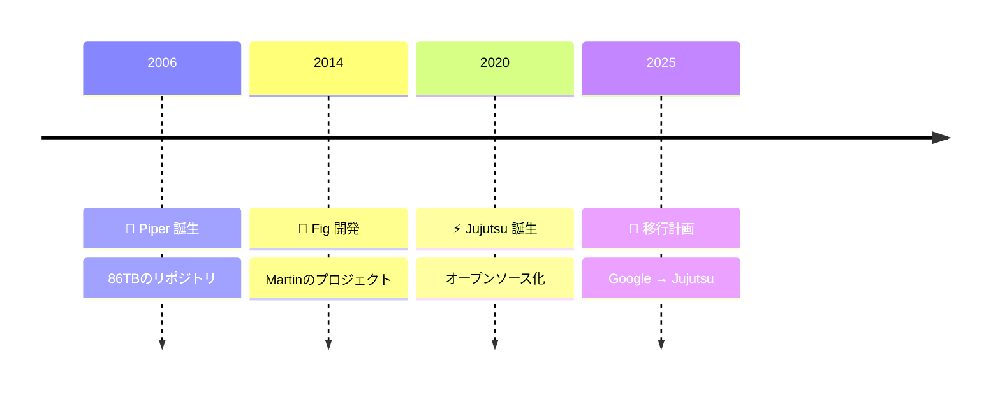

<div class="absolute inset-0 bg-gradient-to-b from-black/70 via-black/50 to-black/70"></div>

<div class="relative z-10 h-full flex flex-col justify-center items-center text-white">
  <div class="max-w-4xl mx-auto text-center px-8">
    <h1 class="text-5xl md:text-6xl font-bold mb-6 leading-tight drop-shadow-2xl">
      複数のGemini CLIが同時開発する狂気
    </h1>
    <h2 class="text-2xl md:text-3xl font-medium mb-4 text-blue-200 drop-shadow-xl">
      Jujutsuが実現するAIエージェント協調の新世界
    </h2>
  </div>

  <div class="fixed inset-x-0 bottom-0 pb-6 flex justify-center pointer-events-none z-50">
    <div class="bg-black/60 backdrop-blur-sm inline-block px-8 py-6 rounded-2xl shadow-2xl pointer-events-auto">
      <div class="text-2xl font-bold mb-2">グンタ・ブルナー Günther Brunner</div>
      <div class="text-lg opacity-90">株式会社サイバーエージェント</div>
      <div class="text-base opacity-80 mt-3">
        <mdi-calendar class="inline mr-1" /> 2025年7月22日 
        <span class="mx-2">•</span>
        <mdi-map-marker class="inline mr-1" /> Gemini CLI Meetup Japan #1
      </div>
    </div>
  </div>
</div>

---
layout: two-cols
---

# 自己紹介

<div class="space-y-4 text-lg">
  <div class="flex items-start gap-3">
    <mdi-rocket-launch class="text-3xl text-red-500" />
    <div>
      <div class="font-bold">開発生産性 & パフォーマンス専門</div>
    </div>
  </div>
  
  <div class="flex items-start gap-3">
    
    <div>
      <div class="font-bold">2012年サイバーエージェント入社</div>
    </div>
  </div>
  
  <div class="flex items-start gap-3">
    <mdi-star class="text-3xl text-yellow-500" />
    <div>
      <div class="font-bold">OSS OpenSTF創設者</div>
      <div class="text-sm opacity-60">GitHub 13k+ スター</div>
    </div>
  </div>
  
  <div class="flex items-start gap-3">
    <mdi-calendar-star class="text-3xl text-purple-500" />
    <div>
      <div class="font-bold">AI Code Agents祭り主催</div>
      <div class="text-xs opacity-50">2万人以上視聴</div>
    </div>
  </div>
  
  <div class="flex items-start gap-3">
    <line-md-twitter-x class="text-3xl text-black" />
    <div>
      <div class="font-bold">X でフォロー</div>
      <div class="text-sm opacity-60">@gunta85</div>
    </div>
  </div>
</div>

::right::

<div class="flex items-center justify-center h-full">
  <div class="bg-gradient-to-br from-purple-600/20 to-pink-600/20 p-8 rounded-2xl backdrop-blur-sm">
    
    <div class="text-center mt-4">
      <div class="text-2xl font-bold bg-gradient-to-r from-purple-400 to-pink-400 bg-clip-text text-transparent">
        Jujutsu
      </div>
      <div class="text-sm opacity-60">次世代VCS</div>
    </div>
  </div>
</div>

---
layout: center
zoom: 0.9
---

# 問題提起

<p class="text-sm opacity-60 !mt-0">AIエージェントが人間のチームのように働けたら？</p>
<div class="grid grid-cols-1 md:grid-cols-2 gap-8 mt-12">
  <div class="relative overflow-hidden">
    <div class="absolute inset-0 bg-gradient-to-br from-red-600/10 to-orange-600/10 blur-3xl"></div>
    <div class="relative bg-gradient-to-br from-red-50/80 via-red-50/60 to-orange-50/40 p-8 rounded-2xl border border-red-300/50 shadow-xl">
      <h3 class="text-2xl font-bold mb-6 flex items-center gap-3">
        <div class="w-12 h-12 rounded-xl bg-gradient-to-br from-red-500 to-red-600 flex items-center justify-center shadow-lg">
          <mdi-alert-circle class="text-3xl text-white" />
        </div>
        <span>現在の限界</span>
      </h3>
      <ul class="space-y-4">
        <li class="group">
          <div class="flex items-start gap-3">
            <div>
              <p class="text-lg font-medium text-gray-900">
                <mdi-robot class="inline text-red-600" /> 1つのGemini CLIで順番に作業
              </p>
              <p class="text-sm text-gray-600">
                <mdi-timer-sand class="inline text-red-400" /> 一つずつしか処理できない
              </p>
            </div>
          </div>
        </li>
        <li class="group">
          <div class="flex items-start gap-3">
            <div>
              <p class="text-lg font-medium text-gray-900">
                <mdi-file-alert class="inline text-orange-600" /> ファイル競合の恐怖
              </p>
              <p class="text-sm text-gray-600">
                <mdi-sword-cross class="inline text-orange-400" /> マージコンフリクトで作業停止
              </p>
            </div>
          </div>
        </li>
        <li class="group">
          <div class="flex items-start gap-3">
            <div>
              <p class="text-lg font-medium text-gray-900">
                <mdi-sleep class="inline text-red-700" /> 並列開発は夢のまた夢
              </p>
              <p class="text-sm text-gray-600">
                <mdi-thought-bubble class="inline text-red-400" /> 順次処理のボトルネック
              </p>
            </div>
          </div>
        </li>
      </ul>
    </div>
  </div>
  <div class="relative overflow-hidden">
    <div class="absolute inset-0 bg-gradient-to-br from-green-600/10 to-blue-600/10 blur-3xl"></div>
    <div class="relative bg-gradient-to-br from-green-50/80 via-emerald-50/60 to-blue-50/40 p-8 rounded-2xl border border-green-300/50 shadow-xl">
      <h3 class="text-2xl font-bold mb-6 flex items-center gap-3">
        <div class="w-12 h-12 rounded-xl bg-gradient-to-br from-green-500 to-emerald-600 flex items-center justify-center shadow-lg">
          <mdi-star class="text-3xl text-white animate-pulse" />
        </div>
        <span>理想の世界</span>
      </h3>
      <ul class="space-y-4">
        <li class="group">
          <div class="flex items-start gap-3">
            <div>
              <p class="text-lg font-medium text-gray-900">
                <mdi-account-multiple class="inline text-green-600" /> 複数のGeminiが同時開発
              </p>
              <p class="text-sm text-gray-600">
                <mdi-sync class="inline text-green-400" /> 真の並列開発
              </p>
            </div>
          </div>
        </li>
        <li class="group">
          <div class="flex items-start gap-3">
            <div>
              <p class="text-lg font-medium text-gray-900">
                <mdi-peace class="inline text-blue-600" /> コンフリクトフリー
              </p>
              <p class="text-sm text-gray-600">
                <mdi-check-all class="inline text-blue-400" /> シームレスなマージ
              </p>
            </div>
          </div>
        </li>
        <li class="group">
          <div class="flex items-start gap-3">
            <div>
              <p class="text-lg font-medium text-gray-900">
                <mdi-speedometer class="inline text-purple-600" /> 10倍速の開発
              </p>
              <p class="text-sm text-gray-600">
                <mdi-flash class="inline text-purple-400" /> 圧倒的な生産性
              </p>
            </div>
          </div>
        </li>
      </ul>
    </div>
  </div>
</div>

---
layout: center
zoom: 1.0
---

# 欠けていたピース：Googleの物語
<p class="text-sm opacity-60 ">Googleが大規模なバージョン管理をどう解決したか</p>

<div class="mt-4" style="transform: scale(1.5); transform-origin: top center;">


</div>

<div class="grid grid-cols-3 gap-6 p-6 mt-14">
  <div class="text-center">
    <div class="text-3xl font-bold text-blue-600">86TB</div>
    <p class="text-sm text-gray-600">リポジトリサイズ</p>
  </div>
  <div class="text-center">
    <div class="text-3xl font-bold text-green-600">45K</div>
    <p class="text-sm text-gray-600">コミット/日</p>
  </div>
  <div class="text-center">
    <div class="text-3xl font-bold text-purple-600">800K</div>
    <p class="text-sm text-gray-600">ピークQPS</p>
  </div>
</div>

---
layout: center
---

<script setup>
import Avatar from '../../components/Avatar.vue'
</script>

<div class="max-w-6xl mx-auto">
  <h2 class="text-4xl font-normal text-gray-900 mb-8 text-center" style="font-family: 'Google Sans', sans-serif">
    Jujutsu: Googleの経験から生まれた
  </h2>
  <p class="text-xl text-gray-600 text-center mb-10">Googleの経験から生まれた次世代VCS</p>
  
  <div class="grid grid-cols-2 gap-8">
    <div class="bg-white rounded-xl shadow-sm border border-gray-200 p-6">
      <div class="flex items-center gap-4 mb-4">
        <Avatar
          platform="github"
          username="martinvonz"
          size="lg"
          quality="max"
          fallback-name="Martin von Zweigbergk"
        />
        <div>
          <p class="text-lg font-medium text-gray-900">Martin von Zweigbergk</p>
          <p class="text-sm text-gray-600">Jujutsuの創作者</p>
        </div>
      </div>
      <ul class="space-y-2 text-sm">
        <li class="flex items-start gap-2">
          <mdi-check-circle class="text-green-500 mt-0.5" />
          <span>Git rebase 共同作者 (2008)</span>
        </li>
        <li class="flex items-start gap-2">
          <mdi-check-circle class="text-green-500 mt-0.5" />
          <span>Google Fig VCS アーキテクト</span>
        </li>
        <li class="flex items-start gap-2">
          <mdi-check-circle class="text-green-500 mt-0.5" />
          <span>20年以上のVCS経験</span>
        </li>
        <li class="flex items-start gap-2">
          <mdi-check-circle class="text-green-500 mt-0.5" />
          <span>Googleがフルタイム開発をスポンサー</span>
        </li>
      </ul>
    </div>
    <div class="bg-gradient-to-br from-blue-50 to-green-50 rounded-xl p-6 border border-blue-200">
      <h4 class="font-medium text-gray-900 mb-3">
        <mdi-lightbulb class="inline text-yellow-600" /> Jujutsuが重要な理由
      </h4>
      <ul class="space-y-2 text-sm">
        <li class="flex items-start gap-2">
          <mdi-heart class="text-red-600 mt-0.5" />
          <span><strong>コンフリクトをファーストクラスに</strong> - コンフリクトのままコミット可能</span>
        </li>
        <li class="flex items-start gap-2">
          <mdi-undo class="text-blue-600 mt-0.5" />
          <span><strong>完全なundo</strong> - あらゆる操作が取り消し可能</span>
        </li>
        <li class="flex items-start gap-2">
          <mdi-folder-multiple class="text-green-600 mt-0.5" />
          <span><strong>真のワークスペース</strong> - 並列開発</span>
        </li>
        <li class="flex items-start gap-2">
          <mdi-rocket-launch class="text-purple-600 mt-0.5" />
          <span><strong>ステージングエリアなし</strong> - AI向き</span>
        </li>
      </ul>
    </div>
  </div>
</div>

---
layout: center
---

<script setup>
import Avatar from '../../components/Avatar.vue'
</script>

<div class="max-w-4xl mx-auto">
  <div class="bg-white rounded-xl shadow-lg border border-gray-200 p-8">
    <div class="flex items-start gap-6">
      <div class="w-20 h-20 rounded-full bg-green-100 flex items-center justify-center flex-shrink-0">
         <Avatar
            platform="github"
            username="schacon"
            size="xl"
            quality="max"
            fallback-name="Scott Chacon"
          />
      </div>
      <div class="flex-1">
        <div class="flex items-center gap-4 mb-2">
          <h3 class="text-2xl font-medium text-gray-900">Scott Chacon</h3>
          <p class="text-gray-500">@chacon</p>
        </div>
        <p class="text-lg text-gray-600 mb-1">GitHub 共同創業者</p>
        <div class="p-6 bg-gray-50 rounded-lg border-l-4 border-green-500">
          <p class="text-gray-600 mt-4">
            「CLIが好きなら、Jujutsuはすごく面白い。Gitがバックエンドだしね。」
          </p>
        </div>
      </div>
    </div>
  </div>
</div>


---
layout: center
---

<script setup>
import Avatar from '../../components/Avatar.vue'
</script>

<div class="max-w-4xl mx-auto">
  <div class="bg-white rounded-xl shadow-lg border border-gray-200 p-8">
    <div class="flex items-start gap-6">
      <div class="w-20 h-20 rounded-full bg-purple-100 flex items-center justify-center flex-shrink-0">
        <Avatar
            platform="github"
            username="mitchellh"
            size="xl"
            quality="max"
            fallback-name="Mitchell Hashimoto"
          />
      </div>
      <div class="flex-1">
        <div class="flex items-center gap-4 mb-2">
          <h3 class="text-2xl font-medium text-gray-900">Mitchell Hashimoto</h3>
          <p class="text-gray-500">@mitchellh</p>
        </div>
        <p class="text-lg text-gray-600 mb-1">HashiCorp 創業者</p>
        <div class="p-6 bg-gray-50 rounded-lg border-l-4 border-purple-500">
          <p class="text-gray-600 mt-4">
            「このツイートから約2ヶ月、ずっとjjだけを使ってる。もっと長く書きたいけど、一言で言うと「jjは最高、もう元には戻れない」。唯一の例外は `git bisect` の時だけgitを使うこと。それだけ。」
          </p>
        </div>
        <p class="text-gray-500 mt-4">2024年10月15日</p>
      </div>
    </div>
  </div>
</div>

---
layout: center
zoom: 0.7
---

# ゲームチェンジャー：コンフリクト共有
<p class="text-sm opacity-60 !mt-0">Jujutsuが真の並列AI開発を可能にする理由</p>

<div class="bg-gradient-to-r from-purple-50 via-blue-50 to-green-50 rounded-2xl p-8 border border-purple-200 shadow-xl">
  <div class="grid grid-cols-2 gap-8 mb-8">
    <div>
      <h3 class="text-xl font-medium text-gray-900 mb-4 flex items-center gap-2">
        <mdi-git class="text-orange-600" /> 従来のGitモデル
      </h3>
      <div class="bg-white rounded-lg px-6 py-2 ">
        <div class="flex items-start gap-3"> 
          <div>
            <p class="font-medium"><mdi-numeric-1-circle class="text-gray-500 " /> コンフリクトは作業を止める</p>
            <p class="text-sm text-gray-600">解決するまで進めない</p>
          </div>
        </div>
        <div class="flex items-start gap-3">
          <div>
            <p class="font-medium"><mdi-numeric-2-circle class="text-gray-500 " /> コミット前に解決必須</p>
            <p class="text-sm text-gray-600">コンフリクト状態は保存不可</p>
          </div>
        </div>
        <div class="flex items-start gap-3">
          <div>
            <p class="font-medium"><mdi-numeric-3-circle class="text-gray-500 " /> 各ワークツリーは独立</p>
            <p class="text-sm text-gray-600">共有された理解なし</p>
          </div>
        </div>
      </div>
    </div>
    <div>
      <h3 class="text-xl font-medium text-gray-900 mb-4 flex items-center gap-2">
         Jujutsu革命
      </h3>
      <div class="bg-white rounded-lg px-6 py-2 ">
        <div class="flex items-start gap-3">
          <div>
            <p class="font-medium"><mdi-numeric-1-circle class="text-green-500 " /> コンフリクトはデータ</p>
            <p class="text-sm text-gray-600">ファーストクラスオブジェクトとして保存</p>
          </div>
        </div>
        <div class="flex items-start gap-3">
          <div>
            <p class="font-medium"><mdi-numeric-2-circle class="text-green-500 " /> コンフリクトのままコミット</p>
            <p class="text-sm text-gray-600">すぐに作業を継続</p>
          </div>
        </div>
        <div class="flex items-start gap-3">
          <div>
            <p class="font-medium"><mdi-numeric-3-circle class="text-green-500 " /> ワークスペース間で状態共有</p>
            <p class="text-sm text-gray-600">全エージェントが同じコンフリクトを見る</p>
          </div>
        </div>
      </div>
    </div>
  </div>
  <div class="bg-yellow-50 rounded-xl p-6 border border-yellow-300">
    <h4 class="text-lg font-medium text-gray-900 mb-2 flex items-center gap-2">
      <mdi-lightbulb class="text-yellow-600" /> 重要な洞察
    </h4>
    <p class="text-gray-700">
      複数のAIエージェントが同じコンフリクトのあるコミットで同時に作業可能
    </p>
  </div>
</div>

---

# 並列開発のサンプル

<div class="max-w-6xl mx-auto my-4">
  <p class="text-center text-gray-600 mb-12">3つのGemini CLIが同時に動作</p>
  
  <div class="grid grid-cols-3 gap-6">
    <div class="bg-white rounded-xl shadow-sm border border-gray-200 p-6">
      <div class="flex items-center gap-3 mb-4">
        <div class="w-10 h-10 rounded-full bg-blue-500 flex items-center justify-center">
          <span class="text-white font-bold">A</span>
        </div>
        <h3 class="text-lg font-medium text-gray-900">バックエンド</h3>
      </div>
      <code class="text-sm text-gray-600 font-mono block mb-3">backend-workspace</code>
      <ul class="space-y-2 text-sm text-gray-700">
        <li>REST API開発</li>
        <li class="text-gray-500">データベース連携</li>
      </ul>
    </div>
    <div class="bg-white rounded-xl shadow-sm border border-gray-200 p-6">
      <div class="flex items-center gap-3 mb-4">
        <div class="w-10 h-10 rounded-full bg-green-500 flex items-center justify-center">
          <span class="text-white font-bold">B</span>
        </div>
        <h3 class="text-lg font-medium text-gray-900">フロントエンド</h3>
      </div>
      <code class="text-sm text-gray-600 font-mono block mb-3">frontend-workspace</code>
      <ul class="space-y-2 text-sm text-gray-700">
        <li>Reactコンポーネント</li>
        <li class="text-gray-500">UI/UX実装</li>
      </ul>
    </div>
    <div class="bg-white rounded-xl shadow-sm border border-gray-200 p-6">
      <div class="flex items-center gap-3 mb-4">
        <div class="w-10 h-10 rounded-full bg-yellow-500 flex items-center justify-center">
          <span class="text-white font-bold">C</span>
        </div>
        <h3 class="text-lg font-medium text-gray-900">テスト</h3>
      </div>
      <code class="text-sm text-gray-600 font-mono block mb-3">test-workspace</code>
      <ul class="space-y-2 text-sm text-gray-700">
        <li>ユニットテスト</li>
        <li class="text-gray-500">統合テスト</li>
      </ul>
    </div>
  </div>
</div>

```bash
# 3つのワークスペースを作成
jj workspace add backend
jj workspace add frontend  
jj workspace add test

# 各ワークスペースでGemini CLIを起動
cd backend && gemini -p "REST APIを構築" &
cd ../frontend && gemini -p "React UIを作成" &
cd ../test && gemini -p "テストを作成" &
```

---
zoom: 0.75
---

# コンフリクト解決の実例

<div class="bg-gradient-to-br from-blue-50 to-purple-50 rounded-2xl p-8 border border-blue-200">
  <div class="mb-8">
    <h3 class="text-2xl font-medium text-gray-900 mb-4">
      <mdi-merge class="inline text-orange-600" /> コンフリクトシナリオ
    </h3>
    <div class="bg-white rounded-lg p-6 font-mono text-sm">
      <div class="text-gray-600"># 3つのAIエージェントがserver.jsを異なる方法で修正:</div>
      <div class="mt-2 grid grid-cols-3 gap-4">
        <div class="border-l-4 border-blue-500 pl-4">
          <div class="text-blue-600 font-bold">認証チーム</div>
          <div>app.use(auth)</div>
        </div>
        <div class="border-l-4 border-green-500 pl-4">
          <div class="text-green-600 font-bold">データベースチーム</div>
          <div>app.use(database)</div>
        </div>
        <div class="border-l-4 border-purple-500 pl-4">
          <div class="text-purple-600 font-bold">ロギングチーム</div>
          <div>app.use(logger)</div>
        </div>
      </div>
    </div>
  </div>
  <div class="grid grid-cols-2 gap-8">
    <div>
      <h4 class="text-lg font-medium text-gray-900 mb-4">
        <mdi-git class="inline text-orange-600" /> Git: 順次解決
      </h4>
      <div class="space-y-3">
        <div class="flex items-center gap-3">
          <div class="w-8 h-8 rounded-full bg-red-100 flex items-center justify-center">
            <span class="text-xs font-bold">1</span>
          </div>
          <p class="text-sm">エージェントAがコンフリクトに遭遇 → ブロック</p>
        </div>
        <div class="flex items-center gap-3">
          <div class="w-8 h-8 rounded-full bg-red-100 flex items-center justify-center">
            <span class="text-xs font-bold">2</span>
          </div>
          <p class="text-sm">エージェントBがAを待つ → ブロック</p>
        </div>
        <div class="mt-4 px-6 py-1 bg-red-50 rounded-lg">
          <p class="text-sm text-red-700 font-bold">
            <mdi-timer-sand class="inline" /> 合計時間: 3倍の解決時間
          </p>
        </div>
      </div>
    </div>
    <div>
      <h4 class="text-lg font-medium text-gray-900 mb-4">
         Jujutsu: 並列解決
      </h4>
      <div class="space-y-3">
        <div class="flex items-center gap-3">
          <div class="w-8 h-8 rounded-full bg-green-100 flex items-center justify-center">
            <span class="text-xs font-bold">1</span>
          </div>
          <p class="text-sm">全エージェントがコンフリクトを確認</p>
        </div>
        <div class="flex items-center gap-3">
          <div class="w-8 h-8 rounded-full bg-green-100 flex items-center justify-center">
            <span class="text-xs font-bold">2</span>
          </div>
          <p class="text-sm">それぞれが自分の部分を作業</p>
        </div>
        <div class="mt-4 px-6 py-1 bg-green-50 rounded-lg">
          <p class="text-sm text-green-700 font-bold">
            <mdi-lightning-bolt class="inline" /> 合計時間: 1倍の解決時間
          </p>
        </div>
      </div>
    </div>
  </div>
  <div class="bg-gray-900 text-gray-100 rounded-lg p-4 m-4 font-mono text-sm">
    <div class="text-green-400"># 各ワークスペースのエージェントは:</div>
    <div>jj edit @  <span class="text-gray-500"># 同じコンフリクトのあるコミットで作業可能！</span></div>
  </div>
</div>

---

# 実例：機能開発

<div class="grid grid-cols-2 gap-8">
  <div>
    <h3 class="text-xl font-medium text-gray-900 mb-4">
      <mdi-git class="inline text-orange-600" /> Gitワークフロー
    </h3>
    <div class="bg-gray-50 rounded-lg p-4 font-mono text-sm space-y-2">
      <div class="text-gray-600"># 機能ブランチを作成</div>
      <div>git checkout -b feature-payment</div>
      <div class="text-gray-600"># バックエンドで作業</div>
      <div>git add backend/*</div>
      <div>git commit -m "支払いAPIを追加"</div>
      <div class="text-gray-600"># コンテキストを切り替え</div>
      <div>git stash</div>
      <div>git checkout -b feature-payment-ui</div>
      <div class="text-gray-600"># マージコンフリクト！</div>
      <div class="text-red-600">git merge feature-payment</div>
      <div class="text-red-600"># CONFLICT (content): マージコンフリクト</div>
    </div>
  </div>
  <div>
    <h3 class="text-xl font-medium text-gray-900 mb-4">
       Jujutsuワークフロー
    </h3>
    <div class="bg-gray-50 rounded-lg p-4 font-mono text-sm space-y-2">
      <div class="text-gray-600"># バックエンド用ワークスペースを作成</div>
      <div>jj workspace add backend</div>
      <div class="text-gray-600"># フロントエンド用ワークスペースを作成</div>
      <div>jj workspace add frontend</div>
      <div class="text-gray-600"># 同時に作業</div>
      <div>cd backend && jj new</div>
      <div>cd ../frontend && jj new</div>
      <div class="text-gray-600"># いつでもマージ</div>
      <div class="text-green-600">jj new @backend @frontend</div>
      <div class="text-green-600"># コンフリクトは保存され、作業は継続！</div>
    </div>
  </div>
</div>

---
layout: center
---

<div class="h-screen flex flex-col justify-center items-center">
  <h2 class="text-4xl font-normal text-gray-900 mb-4" style="font-family: 'Google Sans', sans-serif">
    結果
  </h2>
  <p class="text-xl text-gray-600 mb-12">並列開発と協調が出会うとき</p>
  
  <div class="flex items-center justify-center gap-4 mb-12">
    <div class="text-center">
      <div class="w-20 h-20 bg-blue-100 rounded-2xl flex items-center justify-center mb-2">
        <mdi-server class="w-10 h-10 text-blue-600" />
      </div>
      <p class="text-sm text-gray-600">バックエンド</p>
    </div>
    <span class="text-2xl text-gray-400">+</span>
    <div class="text-center">
      <div class="w-20 h-20 bg-green-100 rounded-2xl flex items-center justify-center mb-2">
        <mdi-monitor class="w-10 h-10 text-green-600" />
      </div>
      <p class="text-sm text-gray-600">フロントエンド</p>
    </div>
    <span class="text-2xl text-gray-400">+</span>
    <div class="text-center">
      <div class="w-20 h-20 bg-yellow-100 rounded-2xl flex items-center justify-center mb-2">
        <mdi-clipboard-check class="w-10 h-10 text-yellow-600" />
      </div>
      <p class="text-sm text-gray-600">テスト</p>
    </div>
    <span class="text-2xl text-gray-400">=</span>
    <div class="text-center">
      <div class="w-24 h-24 bg-gradient-to-br from-blue-500 to-green-500 rounded-2xl flex items-center justify-center mb-2 shadow-lg">
        <mdi-check-bold class="w-12 h-12 text-white" />
      </div>
      <p class="text-lg font-medium text-gray-900">完成！</p>
    </div>
  </div>
  <div class="bg-gray-50 rounded-2xl px-8 py-6 text-center">
    <p class="text-2xl font-medium text-gray-900" style="font-family: 'Google Sans', sans-serif">
      5分で完全なアプリケーション
    </p>
  </div>
</div>

---

# Gemini CLI + Jujutsu: 完璧なマッチ

<div class="grid grid-cols-2 gap-8">
  <div class="bg-gradient-to-br from-blue-50 to-purple-50 rounded-xl p-8 border border-blue-200">
    <h3 class="text-2xl font-medium text-gray-900 mb-2">
      <mdi-robot class="inline text-blue-600" /> AI向けの機能
    </h3>
    <ul class="space-y-2">
      <li class="flex items-start gap-3">
        <div>
          <p class="font-medium"><mdi-check class="text-green-500 mt-1" /> ステージングの混乱なし</p>
          <p class="text-sm text-gray-600">AIが git add を忘れない</p>
        </div>
      </li>
      <li class="flex items-start gap-3">
        <div>
          <p class="font-medium"><mdi-check class="text-green-500 mt-1" /> 自動スナップショット</p>
          <p class="text-sm text-gray-600">全変更が自動保存</p>
        </div>
      </li>
      <li class="flex items-start gap-3">
        <div>
          <p class="font-medium"><mdi-check class="text-green-500 mt-1" /> コンフリクト耐性</p>
          <p class="text-sm text-gray-600">コンフリクトがあっても作業継続</p>
        </div>
      </li>
    </ul>
  </div>
  <div class="bg-gradient-to-br from-green-50 to-yellow-50 rounded-xl p-8 border border-green-200">
    <h3 class="text-2xl font-medium text-gray-900 mb-6">
      <mdi-speedometer class="inline text-green-600" /> 生産性の向上
    </h3>
    <div class="space-y-6">
      <div class="bg-white rounded-lg p-4">
        <div class="flex justify-between items-center mb-2">
          <span class="font-medium">セットアップ時間</span>
          <span class="text-green-600 font-bold">-90%</span>
        </div>
        <div class="w-full bg-gray-200 rounded-full h-2">
          <div class="bg-green-500 h-2 rounded-full" style="width: 10%"></div>
        </div>
      </div>
      <div class="bg-white rounded-lg p-4">
        <div class="flex justify-between items-center mb-2">
          <span class="font-medium">コンフリクト解決</span>
          <span class="text-green-600 font-bold">-95%</span>
        </div>
        <div class="w-full bg-gray-200 rounded-full h-2">
          <div class="bg-green-500 h-2 rounded-full" style="width: 5%"></div>
        </div>
      </div>
      <div class="bg-white rounded-lg p-4">
        <div class="flex justify-between items-center mb-2">
          <span class="font-medium">全体的な速度</span>
          <span class="text-green-600 font-bold">+1000%</span>
        </div>
        <div class="w-full bg-gray-200 rounded-full h-2">
          <div class="bg-green-500 h-2 rounded-full" style="width: 100%"></div>
        </div>
      </div>
    </div>
  </div>
</div>

---
zoom: 0.8
---

# 高度な活用：マルチエージェント協調

<div class="bg-gradient-to-br from-purple-50 to-pink-50 rounded-xl p-8 border border-purple-200">
  <div class="grid grid-cols-2 gap-8 mb-8">
    <div>
      <h3 class="text-xl font-medium text-gray-900 mb-4">
        <mdi-network class="inline text-purple-600" /> エージェントネットワーク構成
      </h3>
      <div class="bg-white rounded-lg p-4 space-y-3">
        <div class="flex items-center gap-3">
          <mdi-circle class="text-blue-500" />
          <span class="font-medium">コーディネーターエージェント</span>
          <span class="text-sm text-gray-600">タスク分配</span>
        </div>
        <div class="flex items-center gap-3 ml-6">
          <mdi-circle class="text-green-500" />
          <span>バックエンドエージェント (x3)</span>
          <span class="text-sm text-gray-600">API開発</span>
        </div>
        <div class="flex items-center gap-3 ml-6">
          <mdi-circle class="text-yellow-500" />
          <span>フロントエンドエージェント (x3)</span>
          <span class="text-sm text-gray-600">UI開発</span>
        </div>
        <div class="flex items-center gap-3 ml-6">
          <mdi-circle class="text-purple-500" />
          <span>テストエージェント (x2)</span>
          <span class="text-sm text-gray-600">品質保証</span>
        </div>
      </div>
    </div>
    <div>
      <h3 class="text-xl font-medium text-gray-900 mb-4">
        <mdi-code-tags class="inline text-green-600" /> オーケストレーションサンプル
      </h3>
      <div class="bg-gray-900 text-gray-100 rounded-lg p-4 font-mono text-sm">
        <div class="text-green-400"># コーディネーターがタスクを作成</div>
        <div>jj workspace add coordinator</div>
        <div>jj new -m "プロジェクト構造"</div>
        <div class="text-green-400 mt-3"># 専門エージェントを生成</div>
        <div>for i in {1..3}; do</div>
        <div class="ml-4">jj workspace add backend-$i</div>
        <div class="ml-4">gemini -p "サービス$iを構築" &</div>
        <div>done</div>
        <div class="text-green-400 mt-3"># 全作業を自動マージ</div>
        <div>jj new @backend-* @frontend-*</div>
      </div>
    </div>
  </div>
  <div class="bg-white rounded-lg p-6 text-center">
    <p class="text-xl font-medium text-gray-900">
      <mdi-lightning-bolt class="inline text-yellow-500" /> 
      最小限のコンフリクトでリアルタイムコラボレーション
    </p>
  </div>
</div>

---
zoom: 0.9
---

# スケールでの未来

<p class="text-xl text-gray-600 text-center mb-12">100のGemini CLIが調和して動作する世界を想像してください</p>
<div class="max-w-5xl mx-auto">
  <div class="text-center mb-12">
    <span class="text-6xl font-bold text-transparent bg-clip-text bg-gradient-to-r from-blue-600 to-green-600" style="font-family: 'Google Sans', sans-serif">
      100+ AIエージェント
    </span>
  </div>
  <div class="grid grid-cols-3 gap-6">
    <div class="bg-white rounded-xl shadow-sm border border-gray-200 p-6 text-center">
      <div class="w-16 h-16 mx-auto mb-4 rounded-full bg-blue-100 flex items-center justify-center">
        <mdi-database class="w-8 h-8 text-blue-600" />
      </div>
      <h3 class="text-lg font-medium text-gray-900 mb-2">マイクロサービス</h3>
      <p class="text-gray-700 mt-2">各サービスに1つのAI</p>
      <p class="text-sm text-gray-600">専門知識の活用</p>
    </div>
    <div class="bg-white rounded-xl shadow-sm border border-gray-200 p-6 text-center">
      <div class="w-16 h-16 mx-auto mb-4 rounded-full bg-green-100 flex items-center justify-center">
        <mdi-translate class="w-8 h-8 text-green-600" />
      </div>
      <h3 class="text-lg font-medium text-gray-900 mb-2">多言語対応</h3>
      <p class="text-gray-700 mt-2">言語専門家</p>
      <p class="text-sm text-gray-600">Python、Go、Rust、JS</p>
    </div>
    <div class="bg-white rounded-xl shadow-sm border border-gray-200 p-6 text-center">
      <div class="w-16 h-16 mx-auto mb-4 rounded-full bg-yellow-100 flex items-center justify-center">
        <mdi-account-group class="w-8 h-8 text-yellow-600" />
      </div>
      <h3 class="text-lg font-medium text-gray-900 mb-2">専門役割</h3>
      <p class="text-gray-700 mt-2">セキュリティ、性能、UX</p>
      <p class="text-sm text-gray-600">ドメインエキスパート</p>
    </div>
  </div>
</div>

---
layout: center
---

# 今すぐ始めよう

<div class="max-w-4xl mx-auto">
  <div class="bg-gray-50 rounded-xl p-8 mb-8">
    <pre class="text-sm font-mono text-gray-800"><code># Jujutsuをインストール
brew install jj
# リポジトリを初期化  
jj init --git
# ワークスペースを作成
jj workspace add feature-a
jj workspace add feature-b
# Gemini CLIを起動
gemini -p "素晴らしい機能を構築"</code></pre>
  </div>
  <div class="grid grid-cols-2 gap-6">
    <div class="bg-white rounded-xl shadow-sm border border-gray-200 p-6">
      <div class="flex items-center gap-4">
        <div class="w-12 h-12 rounded-full bg-blue-100 flex items-center justify-center">
          <mdi-book-open-variant class="w-6 h-6 text-blue-600" />
        </div>
        <div>
          <p class="font-medium text-gray-900">ドキュメント</p>
          <p class="text-sm text-gray-600">Jujutsu公式ドキュメント</p>
          <a href="https://github.com/jj-vcs/jj" class="text-sm text-blue-600 hover:underline">github.com/jj-vcs/jj</a>
        </div>
      </div>
    </div>
    <div class="bg-white rounded-xl shadow-sm border border-gray-200 p-6">
      <div class="flex items-center gap-4">
        <div class="w-12 h-12 rounded-full bg-green-100 flex items-center justify-center">
          <mdi-school class="w-6 h-6 text-green-600" />
        </div>
        <div>
          <p class="font-medium text-gray-900">チュートリアル</p>
          <p class="text-sm text-gray-600">インタラクティブ学習</p>
          <a href="https://jj-vcs.github.io" class="text-sm text-blue-600 hover:underline">jj-vcs.github.io</a>
        </div>
      </div>
    </div>
  </div>
</div>

---
class: text-center
layout: image
image: geminibg.png
---

<div class="flex flex-col justify-center items-center">
  <div class="text-center">
    <h1 class="text-6xl font-normal text-gray-900 mb-4" style="font-family: 'Google Sans', sans-serif">
      ありがとうございました
    </h1>
    <div class="mb-12">
      <p class="text-xl text-white mb-2">グンタ・ブルナー</p>
      <p class="text-white-500">株式会社サイバーエージェント</p>
      <p class="text-white font-medium mt-2">
        <line-md-twitter-x class="inline text-lg" /> @gunta85
      </p>
    </div>
    <div class="bg-gray-50 rounded-2xl px-8 py-6 inline-block">
      <p class="text-xl font-medium text-gray-900" style="font-family: 'Google Sans', sans-serif">
        一緒にAIの未来を創りましょう
      </p>
    </div>
  </div>
  
  <div class="absolute bottom-8 left-0 right-0 flex justify-center gap-8 text-sm text-gray-100">
    <span>Jujutsuエバンジェリスト</span>
    <span>•</span>
    <span>AI駆動開発</span>
    <span>•</span>
    <span class="text-gray-800">Gemini CLI Meetup Japan</span>
  </div>
  
  <div class="absolute bottom-0 left-0 right-0 h-1 bg-gradient-to-r from-blue-500 via-red-500 via-yellow-500 to-green-500"></div>
</div> 