  

    <h1 class="text-5xl md:text-6xl font-bold mb-6 leading-tight drop-shadow-2xl">
      複数のGemini CLIが同時開発する狂気
    </h1>
    <h2 class="text-2xl md:text-3xl font-medium mb-4 text-blue-200 drop-shadow-xl">
      Jujutsuが実現するAIエージェント協調の新世界
    </h2>
    

      Multiple Gemini CLIs Developing Simultaneously: The Madness 
      A New World of AI Agent Collaboration Enabled by Jujutsu
    

  

  

    

      
グンタ・ブルナー Günther Brunner

      
株式会社サイバーエージェント CyberAgent, Inc.

      

        <mdi-calendar class="inline mr-1" /> 2025年7月22日 
        •
        <mdi-map-marker class="inline mr-1" /> Gemini CLI Meetup Japan #1
      

    

  

---
layout: two-cols
---

# 自己紹介 About Me

Self Introduction

  

    <mdi-code-braces class="text-3xl text-blue-500" />
    

      
エンジニア & デザイナー

      
Engineer & Designer

    

  

  
  

    <mdi-rocket-launch class="text-3xl text-red-500" />
    

      
開発生産性 & パフォーマンス専門

      
Developer Productivity & Performance Specialist

    

  

  
  

    
    

      
2012年サイバーエージェント入社

      
Joined CyberAgent in 2012

    

  

  
  

    <mdi-star class="text-3xl text-yellow-500" />
    

      
OSS OpenSTF創設者

      
Original creator of OpenSTF (13k+ GitHub stars)

      
Realtime Android device remote debugging

    

  

  
  

    <mdi-calendar-star class="text-3xl text-purple-500" />
    

      
AI Code Agents祭り主催

      
Organizer of AI Code Agents Festival

      
2万人以上視聴 • events.code-agents.com/2025-winter

    

  

  
  

    <line-md-twitter-x class="text-3xl text-black" />
    

      
Follow me on X

      
@gunta85

    

  

::right::

  

    
    

      

        Jujutsu
      

      
Next-Gen VCS

    

  

---
layout: center
---

# Today's Mission: Unleash AI Potential

今日のミッション：AIの可能性を解き放つ

  

  

    

      
      
×

      

        <mdi-robot class="text-5xl text-white" />
      

    

    <h2 class="text-4xl font-bold text-center mb-6 bg-gradient-to-r from-purple-600 to-pink-600 bg-clip-text text-transparent">
      Jujutsu: The Missing Piece
    </h2>
    

      A version control system designed for the future
      未来のために設計されたバージョン管理システム
    

    

      

        

          <mdi-google class="text-3xl text-purple-600" />
        

        
Google-Born

        
Googleで生まれた技術

      

      

        

          <mdi-infinity class="text-3xl text-blue-600" />
        

        
Unlimited Scale

        
無限のスケール

      

      

        

          <mdi-lightning-bolt class="text-3xl text-green-600" />
        

        
AI-Ready

        
AI時代に最適

      

    

  

  

    <mdi-arrow-right class="inline text-purple-500" /> Let's explore how Google solved version control at scale
  

  
Googleがどのようにバージョン管理の規模の問題を解決したかを探ってみましょう

---
layout: center
---

# Google's VCS Evolution

```mermaid
timeline    
    2006 : 🚀 Piper Created
         : Custom VCS System
         : Bigtable Backend
    
    2012 : ☁️ CitC Launch
         : Cloud Workspaces
         : Spanner Backend
    
    2014 : 🔧 Fig Development
         : Mercurial Fork
         : DVCS Features
    
    2020 : ⚡ Jujutsu Born
         : Martin's Project
         : Open Source
    
    2024 : 📊 Current State
         : 86TB Repository
         : Fig/Mercurial Active
    
    2025 : 🎯 Migration Plan
         : → Jujutsu
         : Future State
```

The Journey to Scale

  

    
86TB

    
Repository Size

  

  

    
2B

    
Lines of Code

  

  

    
35M

    
Total Commits

  

---
layout: center
zoom: 0.9
---

# The Scale Challenge at Google

Why Traditional VCS Failed

  

    

    

      <h3 class="text-2xl font-bold text-gray-900 mb-6 flex items-center gap-3">
        

          <mdi-alert-octagon class="text-3xl text-white" />
        

        The Breaking Points
      </h3>
      <ul class="space-y-5">
        <li class="flex items-start gap-4 group hover:transform hover:scale-105 transition-all duration-200">
          

            <mdi-server-off class="text-2xl text-white" />
          

          

            

              <mdi-desktop-classic class="inline text-red-600" /> Perforce: Single Machine Limit
            

            

              <mdi-alert class="inline text-red-400" /> 単一マシンの限界に到達
            

          

        </li>
        <li class="flex items-start gap-4 group hover:transform hover:scale-105 transition-all duration-200">
          

            <mdi-chart-line class="text-2xl text-white" />
          

          

            

              <mdi-source-commit class="inline text-orange-600" /> 45,000 commits/day
            

            

              <mdi-calendar-clock class="inline text-orange-400" /> 毎日45,000件のコミット
            

          

        </li>
        <li class="flex items-start gap-4 group hover:transform hover:scale-105 transition-all duration-200">
          

            <mdi-speedometer class="text-2xl text-white" />
          

          

            

              <mdi-lightning-bolt class="inline text-amber-600" /> 800,000 QPS peak
            

            

              <mdi-gauge class="inline text-amber-400" /> ピーク時80万クエリ/秒
            

          

        </li>
      </ul>
    

  

  
  

    

    

      <h3 class="text-2xl font-bold text-gray-900 mb-6 flex items-center gap-3">
        

          <mdi-lightbulb-on class="text-3xl text-white animate-pulse" />
        

        Google's Solutions
      </h3>
      <ul class="space-y-5">
        <li class="flex items-start gap-4 group hover:transform hover:scale-105 transition-all duration-200">
          

            <mdi-server-network class="text-2xl text-white" />
          

          

            

              <mdi-pipe class="inline text-blue-600" /> Piper: Distributed VCS
            

            

              <mdi-database class="inline text-blue-400" /> 分散型VCSの開発
            

            

              
                <mdi-database-outline class="inline" /> Bigtable
              
              
                <mdi-arrow-expand-all class="inline" /> Scalable
              
            

          

        </li>
        <li class="flex items-start gap-4 group hover:transform hover:scale-105 transition-all duration-200">
          

            <mdi-cloud-outline class="text-2xl text-white" />
          

          

            

              <mdi-cloud-check class="inline text-purple-600" /> CitC: Cloud Workspaces
            

            

              <mdi-laptop-account class="inline text-purple-400" /> クラウドベースの作業環境
            

          

        </li>
        <li class="flex items-start gap-4 group hover:transform hover:scale-105 transition-all duration-200">
          

            <mdi-source-branch class="text-2xl text-white" />
          

          

            

              <mdi-source-fork class="inline text-green-600" /> Fig: DVCS Features
            

            

              <mdi-code-braces class="inline text-green-400" /> 分散VCS機能の追加
            

          

        </li>
      </ul>
    

  

---
layout: center
---

# Martin's Journey at Google

```mermaid
timeline
    2008-2013 : 🔧 Git contributor
              : 🔄 Co-authored git rebase
              : ✨ Cleaned up rebase code

    2011-2014 : 💻 Full-stack developer
              : 💰 Compensation app
    
    2014-now  : 🚀 SWE on internal VCS
              : 🌳 Fig development
              : 🔀 Mercurial as Piper client
    
    2020      : 🎯 Started Jujutsu
              : 💡 Personal project
              : 📚 Applied Fig learnings
    
    2025-2026 : 🎉 Migration plan
              : 🔄 Replace Google's Mercurial
              : ⚡ With Jujutsu
```

From Git to Jujutsu

  

    <mdi-format-quote-open class="inline text-purple-500" />
    20+ years of version control expertise, from Git rebase to Google-scale VCS
    <mdi-format-quote-close class="inline text-purple-500" />
  

  

    20年以上のバージョン管理の専門知識、GitリベースからGoogleスケールのVCSまで
  

---
layout: center
zoom: 0.9
---

# 問題提起 The Problem

Problem Statement

  

    

    

      <h3 class="text-2xl font-bold mb-6 flex items-center gap-3">
        

          <mdi-alert-circle class="text-3xl text-white" />
        

        現在の限界 Current Limitations
      </h3>
      <ul class="space-y-4">
        <li class="group">
          

            

              

                <mdi-robot class="inline text-red-600" /> 1つのGemini CLIで順番に作業
              

              

                <mdi-timer-sand class="inline text-red-400" /> Working sequentially with one Gemini CLI
              

            

          

        </li>
        <li class="group">
          

            

              

                <mdi-file-alert class="inline text-orange-600" /> ファイル競合の恐怖
              

              

                <mdi-sword-cross class="inline text-orange-400" /> Fear of file conflicts
              

            

          

        </li>
        <li class="group">
          

            

              

                <mdi-sleep class="inline text-red-700" /> 並列開発は夢のまた夢
              

              

                <mdi-thought-bubble class="inline text-red-400" /> Parallel development remains a dream
              

            

          

        </li>
      </ul>
    

  

  

    

    

      <h3 class="text-2xl font-bold mb-6 flex items-center gap-3">
        

          <mdi-star class="text-3xl text-white animate-pulse" />
        

        理想の世界 Ideal World
      </h3>
      <ul class="space-y-4">
        <li class="group">
          

            

              

                <mdi-account-multiple class="inline text-green-600" /> 複数のGeminiが同時開発
              

              

                <mdi-sync class="inline text-green-400" /> Multiple Geminis developing simultaneously
              

            

          

        </li>
        <li class="group">
          

            

              

                <mdi-peace class="inline text-blue-600" /> コンフリクトフリー
              

              

                <mdi-check-all class="inline text-blue-400" /> Conflict-free
              

            

          

        </li>
        <li class="group">
          

            

              

                <mdi-speedometer class="inline text-purple-600" /> 10倍速の開発
              

              

                <mdi-flash class="inline text-purple-400" /> 10x development speed
              

            

          

        </li>
      </ul>
    

  

---
layout: center
---

# <mdi-target class="inline text-purple-500" /> 解決策：Jujutsu

The Solution: Jujutsu

  

  

    <h2 class="text-4xl font-bold text-center mb-8">
      
        Jujutsu (jj)
      
    </h2>
    

      Googleが支援する次世代VCS
      
Next-gen VCS supported by Google

    

    

      

        <mdi-brain class="text-4xl mb-2 text-purple-400" />
        
賢い

        
Smart

      

      

        <mdi-lightning-bolt class="text-4xl mb-2 text-yellow-400" />
        
高速

        
Fast

      

      

        <mdi-sync class="text-4xl mb-2 text-green-400" />
        
並列対応

        
Parallel-ready

      

    

  

---
layout: center
---

  <h2 class="text-4xl font-normal text-gray-900 mb-8 text-center" style="font-family: 'Google Sans', sans-serif">
    Jujutsu: From Google's Learnings
  </h2>
  
Googleの経験から生まれた次世代VCS

  
  

    

      

        <Avatar
          platform="github"
          username="martinvonz"
          size="lg"
          quality="max"
          fallback-name="Martin von Zweigbergk"
        />
        

          
Martin von Zweigbergk

          
Creator of Jujutsu

        

      

      <ul class="space-y-2 text-sm">
        <li class="flex items-start gap-2">
          <mdi-check-circle class="text-green-500 mt-0.5" />
          Git rebase co-author (2008)
        </li>
        <li class="flex items-start gap-2">
          <mdi-check-circle class="text-green-500 mt-0.5" />
          Google Fig VCS architect
        </li>
        <li class="flex items-start gap-2">
          <mdi-check-circle class="text-green-500 mt-0.5" />
          20+ years VCS experience
        </li>
      </ul>
    

    

      <h4 class="font-medium text-gray-900 mb-3">
        <mdi-lightbulb class="inline text-yellow-600" /> Key Innovations
      </h4>
      <ul class="space-y-2 text-sm">
        <li class="flex items-start gap-2">
          <mdi-language-rust class="text-orange-600 mt-0.5" />
          Built with Rust for performance
        </li>
        <li class="flex items-start gap-2">
          <mdi-git class="text-orange-600 mt-0.5" />
          Git-compatible backend
        </li>
        <li class="flex items-start gap-2">
          <mdi-heart class="text-red-600 mt-0.5" />
          First-class conflict handling
        </li>
        <li class="flex items-start gap-2">
          <mdi-rocket-launch class="text-purple-600 mt-0.5" />
          Google migration planned 2025
        </li>
      </ul>
    

  

---
layout: center
---

  <!-- <h2 class="text-4xl font-normal text-gray-900 mb-8 text-center" style="font-family: 'Google Sans', sans-serif">
    Industry Recognition
  </h2>
  
業界のリーダーたちからの評価
 -->
  
  
  

    

      

        <!-- SC -->
         <Avatar
            platform="github"
            username="schacon"
            size="xl"
            quality="max"
            fallback-name="Scott Chacon"
          />
      

      

        

          <h3 class="text-2xl font-medium text-gray-900">Scott Chacon</h3>
          
@chacon

        

        
GitHub Co-founder | 共同創業者

        

          

            "If you like CLIs, Jujutsu is really interesting, and Git backended. If you want to try a new GUI I can highly recommend the @gitbutler beta. 😉"
          

          

            「CLIが好きなら、Jujutsuはすごく面白い。Gitがバックエンドだしね。新しいGUIを試したいなら、@gitbutlerのベータ版が超おすすめだよ 😉」
          

        

        
Feb 17, 2024

      

    

  

---
layout: center
---

  <!-- <h2 class="text-4xl font-normal text-gray-900 mb-8 text-center" style="font-family: 'Google Sans', sans-serif">
    Industry Recognition
  </h2>
  
業界のリーダーたちからの評価
 -->
  
  

    

      

        <!-- MH -->
        <Avatar
            platform="github"
            username="mitchellh"
            size="xl"
            quality="max"
            fallback-name="Mitchell Hashimoto"
          />
      

      

        

          <h3 class="text-2xl font-medium text-gray-900">Mitchell Hashimoto</h3>
          
@mitchellh

        

        
HashiCorp Founder | 創業者

        

          

            "Almost two months since I tweeted this and I've used jujutsu exclusively the entire time. I want to write something longer form but the tweet form: jj is fantastic and I can't see myself going back, only one exception is I drop down to `git` for bisect still. That's it."
          

          

            「このツイートから約2ヶ月、ずっとjjだけを使ってる。もっと長く書きたいけど、一言で言うと「jjは最高、もう元には戻れない」。唯一の例外は `git bisect` の時だけgitを使うこと。それだけ。」
          

        

        
Oct 15, 2024

      

    

  

---
layout: center
---

  <h2 class="text-4xl font-normal text-gray-900 mb-12 text-center" style="font-family: 'Google Sans', sans-serif">
    Why Jujutsu?
  </h2>
  

    

      

        

          

            <mdi-cancel class="w-6 h-6 text-red-600" />
          

          

            <h3 class="text-lg font-medium text-gray-900">No Staging Area</h3>
            
ステージング不要

            
No more <code class="text-sm bg-gray-100 px-2 py-1 rounded font-mono">git add</code>

          

        

      

      

        

          

            <mdi-undo class="w-6 h-6 text-blue-600" />
          

          

            <h3 class="text-lg font-medium text-gray-900">Complete Undo</h3>
            
完全なUndo機能

            
Simply <code class="text-sm bg-gray-100 px-2 py-1 rounded font-mono">jj undo</code>

          

        

      

    

    

      

        

          

            <mdi-heart class="w-6 h-6 text-green-600" />
          

          

            <h3 class="text-lg font-medium text-gray-900">First-class Conflicts</h3>
            
コンフリクトは友達

            
Store & resolve later

          

        

      

      

        

          

            <mdi-folder-multiple class="w-6 h-6 text-yellow-600" />
          

          

            <h3 class="text-lg font-medium text-gray-900">True Workspaces</h3>
            
Workspace = 並列開発

            
Better than git worktree

          

        

      

    

  

---
layout: center
---

  <h2 class="text-4xl font-normal text-gray-900 mb-12 text-center" style="font-family: 'Google Sans', sans-serif">
    Jujutsu: Open Source Innovation
  </h2>
  

    

      <mdi-open-source-initiative class="text-6xl text-blue-600" />
      

        <h3 class="text-2xl font-medium text-gray-900">100% Open Source</h3>
        
Apache 2.0 License

      

    

    

      

        

          <mdi-account-tie class="text-3xl text-green-600 flex-shrink-0" />
          

            <h4 class="font-medium text-gray-900">Martin von Zweigbergk</h4>
            
Googleが正式にフルタイムで開発を支援

            
Full-time development sponsored by Google

          

        

      

      

        

          <mdi-account-group class="text-3xl text-purple-600 flex-shrink-0" />
          

            <h4 class="font-medium text-gray-900">Community Driven</h4>
            
世界中の開発者が貢献

            
Contributors from around the world

          

        

      

    

  

---
layout: center
zoom: 0.9
---

  <h2 class="text-4xl font-normal text-gray-900 mb-12 text-center" style="font-family: 'Google Sans', sans-serif">
    Git vs Jujutsu: Core Differences
  </h2>
  

    <table class="w-full border-collapse">
      <thead>
        <tr class="bg-gray-100">
          <th class="border border-gray-300 p-4 text-left font-medium text-gray-900">Feature</th>
          <th class="border border-gray-300 p-4 text-center font-medium text-gray-900">Git <mdi-git class="inline text-orange-600" /></th>
          <th class="border border-gray-300 p-4 text-center font-medium text-gray-900">Jujutsu </th>
        </tr>
      </thead>
      <tbody>
        <tr>
          <td class="border border-gray-300 p-4 font-medium">Working Copy</td>
          <td class="border border-gray-300 p-4 text-center">
            Mutable
            
変更可能な作業コピー

          </td>
          <td class="border border-gray-300 p-4 text-center">
            Immutable Snapshots
            
不変のスナップショット

          </td>
        </tr>
        <tr class="bg-gray-50">
          <td class="border border-gray-300 p-4 font-medium">Staging Area</td>
          <td class="border border-gray-300 p-4 text-center">
            Required
            
git add必須

          </td>
          <td class="border border-gray-300 p-4 text-center">
            Not Needed
            
自動追跡

          </td>
        </tr>
        <tr>
          <td class="border border-gray-300 p-4 font-medium">Conflicts</td>
          <td class="border border-gray-300 p-4 text-center">
            Block Progress
            
作業停止

          </td>
          <td class="border border-gray-300 p-4 text-center">
            First-class Citizens
            
コミット可能

          </td>
        </tr>
        <tr class="bg-gray-50">
          <td class="border border-gray-300 p-4 font-medium">History Editing</td>
          <td class="border border-gray-300 p-4 text-center">
            Complex & Risky
            
rebase地獄

          </td>
          <td class="border border-gray-300 p-4 text-center">
            Safe & Simple
            
自動リベース

          </td>
        </tr>
      </tbody>
    </table>
  

---

  <h2 class="text-4xl font-normal text-gray-900 mb-12 text-center" style="font-family: 'Google Sans', sans-serif">
    Revolutionary Concepts
  </h2>
  

    

      <h3 class="text-2xl font-medium text-gray-900 mb-6">
        <mdi-cube-outline class="inline text-purple-600" /> Working Copy = Commit
      </h3>
      

        

          作業中の変更も即座にコミット
          Changes are instantly committed
        

        

          
# Git

          
git add .

          
git commit -m "WIP"

          
# Jujutsu

          
jj new  # That's it!

        

      

    

    

      <h3 class="text-2xl font-medium text-gray-900 mb-6">
        <mdi-source-branch class="inline text-blue-600" /> Anonymous Branches
      </h3>
      

        

          ブランチ名は不要、変更セットで管理
          No branch names needed
        

        

          
# Git

          
git checkout -b feature-xyz

          
git push -u origin feature-xyz

          
# Jujutsu

          
jj new  # Work directly

          
jj branch create feature-xyz -r @  # Optional

        

      

    

  

---
layout: center
---

# Automatic Conflict Resolution

  

    

      

        <mdi-git class="text-5xl text-orange-600 mb-4" />
        <h3 class="text-xl font-medium text-gray-900 mb-2">Git Workflow</h3>
        

          

            error: Your local changes would be overwritten 
            Please commit or stash before merge.
          

        

      

      

        
        <h3 class="text-xl font-medium text-gray-900 mb-2">Jujutsu Workflow</h3>
        

          

            ✓ Merged with conflicts 
            Continue working, resolve later
          

        

      

    

    

      <h4 class="font-medium text-gray-900 mb-3">
        <mdi-lightbulb class="inline text-yellow-500" /> Key Innovation
      </h4>
      

        Jujutsuは3-way mergeアルゴリズムを使用し、コンフリクトをコミット内に保存
        
          Stores conflicts as first-class objects using 3-way merge algorithms
        
      

    

  

---

  <h2 class="text-4xl font-normal text-gray-900 mb-8 text-center" style="font-family: 'Google Sans', sans-serif">
    Workspace Magic for AI Agents
  </h2>
  

    

      <h3 class="text-2xl font-medium text-gray-900 mb-6">
        <mdi-git class="inline text-orange-600" /> Git Worktree Limitations
      </h3>
      

        

          <mdi-close-circle class="text-red-500 inline" />
          Separate directories required
          
別ディレクトリが必要

        

        

          <mdi-close-circle class="text-red-500 inline" />
          Complex setup & management
          
複雑な設定と管理

        

        

          <mdi-close-circle class="text-red-500 inline" />
          Limited tool support
          
ツールサポートが限定的

        

      

    

    

      <h3 class="text-2xl font-medium text-gray-900 mb-6">
         Jujutsu Workspaces
      </h3>
      

        

          <mdi-check-circle class="text-green-500 inline" />
          Lightweight & instant
          
軽量で即座に作成

        

        

          <mdi-check-circle class="text-green-500 inline" />
          Share repository state
          
リポジトリ状態を共有

        

        

          <mdi-check-circle class="text-green-500 inline" />
          Perfect for AI agents
          
AIエージェントに最適

        

      

    

  

  

    

      Each AI Agent Gets Its Own Workspace
    

    

      各AIエージェントが独自のワークスペースで並列作業
    

  

---

  <h2 class="text-4xl font-normal text-gray-900 mb-8 text-center" style="font-family: 'Google Sans', sans-serif">
    Parallel Development Sample
  </h2>
  
3 Gemini CLIs working simultaneously

  
  

    

      

        

          A
        

        <h3 class="text-lg font-medium text-gray-900">Backend</h3>
      

      <code class="text-sm text-gray-600 font-mono block mb-3">backend-workspace</code>
      <ul class="space-y-2 text-sm text-gray-700">
        <li><mdi-circle-small class="inline" /> REST API development</li>
        <li class="text-gray-500">API開発担当</li>
        <li><mdi-circle-small class="inline" /> Database schema</li>
        <li class="text-gray-500">データベース設計</li>
      </ul>
    

    

      

        

          B
        

        <h3 class="text-lg font-medium text-gray-900">Frontend</h3>
      

      <code class="text-sm text-gray-600 font-mono block mb-3">frontend-workspace</code>
      <ul class="space-y-2 text-sm text-gray-700">
        <li><mdi-circle-small class="inline" /> React components</li>
        <li class="text-gray-500">UI実装担当</li>
        <li><mdi-circle-small class="inline" /> User interface</li>
        <li class="text-gray-500">コンポーネント開発</li>
      </ul>
    

    

      

        

          C
        

        <h3 class="text-lg font-medium text-gray-900">Testing</h3>
      

      <code class="text-sm text-gray-600 font-mono block mb-3">test-workspace</code>
      <ul class="space-y-2 text-sm text-gray-700">
        <li><mdi-circle-small class="inline" /> Unit tests</li>
        <li class="text-gray-500">テスト作成</li>
        <li><mdi-circle-small class="inline" /> Documentation</li>
        <li class="text-gray-500">ドキュメント生成</li>
      </ul>
    

  

  

---

# Create three workspaces

  

    <pre class="text-sm font-mono text-gray-800">
    <code># Create three workspaces
      jj workspace add backend
      jj workspace add frontend  
      jj workspace add test
      # Launch Gemini CLI in each
      cd backend && gemini "Build REST API" &
      cd ../frontend && gemini "Create React UI" &
      cd ../test && gemini "Write tests" &
      </code></pre>
  

---
layout: center
---

  <h2 class="text-4xl font-normal text-gray-900 mb-4" style="font-family: 'Google Sans', sans-serif">
    The Result
  </h2>
  
When parallel development meets coordination

  
  

    

      

        <mdi-server class="w-10 h-10 text-blue-600" />
      

      
Backend

    

    +
    

      

        <mdi-monitor class="w-10 h-10 text-green-600" />
      

      
Frontend

    

    +
    

      

        <mdi-clipboard-check class="w-10 h-10 text-yellow-600" />
      

      
Tests

    

    =
    

      

        <mdi-check-bold class="w-12 h-12 text-white" />
      

      
Complete!

    

  

  

    

      Full Application in 5 Minutes
    

    

      5分で完全なアプリケーション
    

  

---

  <h2 class="text-4xl font-normal text-gray-900 mb-12 text-center" style="font-family: 'Google Sans', sans-serif">
    Conflict Resolution Reimagined
  </h2>
  

    

      

        

          <mdi-close class="w-5 h-5 text-red-600" />
        

        <h3 class="text-xl font-medium text-gray-900">Traditional Git</h3>
      

      

        <pre class="text-sm font-mono text-gray-800"><code><<<<<<< HEAD
const api = "old";
=======
const api = "new";
>>>>>>> feature</code></pre>
        

          <mdi-alert-circle class="w-5 h-5" />
          
Work halted

          
作業停止

        

      

    

    

      

        

          <mdi-check class="w-5 h-5 text-green-600" />
        

        <h3 class="text-xl font-medium text-gray-900">Jujutsu</h3>
      

      

        <pre class="text-sm font-mono text-gray-800">
        <code># Store conflict in commit
          jj new
          # Continue working
          # Resolve when ready
          jj resolve</code></pre>
        

          <mdi-lightning-bolt class="w-5 h-5" />
          
Work continues

          
作業継続

        

      

    

  

  

    

      Conflicts Don't Block Progress
    

    

      コンフリクトは進行を止めない
    

  

---

  <h2 class="text-4xl font-normal text-gray-900 mb-8 text-center" style="font-family: 'Google Sans', sans-serif">
    Why Commit Conflicts? The Game Changer
  </h2>
  

    

      

        <h3 class="text-xl font-medium text-gray-900 mb-4">
          <mdi-git class="inline text-orange-600" /> Git: Conflicts Block Everything
        </h3>
        

          

            <mdi-close-circle class="text-red-500 inline" />
             Work stops immediately
            
コンフリクトで作業が完全停止

          

          

            <mdi-close-circle class="text-red-500 inline" />
             Must resolve NOW
            
今すぐ解決しないと進めない

          

          

            <mdi-close-circle class="text-red-500 inline" />
             Context switching nightmare
            
コンテキストスイッチの悪夢

          

        

      

      

        <h3 class="text-xl font-medium text-gray-900 mb-4">
           Jujutsu: Conflicts Are Data
        </h3>
        

          

            <mdi-check-circle class="text-green-500 inline" />
             Keep working uninterrupted
            
作業を中断せずに継続

          

          

            <mdi-check-circle class="text-green-500 inline" />
             Resolve when convenient
            
都合の良い時に解決

          

          

            <mdi-check-circle class="text-green-500 inline" />
             Perfect for AI agents
            
AIエージェントに最適

          

        

      

    

    

      <h4 class="font-medium text-gray-900 mb-2">
        <mdi-lightbulb class="inline text-yellow-600" /> Key Insight
      </h4>
      

        Conflicts are just another type of content. Why shouldn't we be able to version them?
        
          コンフリクトも単なるコンテンツの一種。なぜバージョン管理できないのか？
        
      

    

  

---

  <h2 class="text-4xl font-normal text-gray-900 mb-8 text-center" style="font-family: 'Google Sans', sans-serif">
    Multi-Agent Conflict Scenario: Real Example
  </h2>
  

    <h3 class="text-xl font-medium text-gray-900 mb-6">
      <mdi-file-code class="inline text-blue-600" /> File: api/server.js
    </h3>
    

      

        <h4 class="font-medium text-gray-900 mb-3">
          <mdi-robot class="inline text-blue-500" /> Agent A: Auth
        </h4>
        

          
const express = require('express');

          
const auth = require('./auth');

          
const app = express();

          
app.use(auth.middleware());

          
app.listen(3000);

        

      

      

        <h4 class="font-medium text-gray-900 mb-3">
          <mdi-robot class="inline text-green-500" /> Agent B: Database
        </h4>
        

          
const express = require('express');

          
const db = require('./database');

          
const app = express();

          
db.connect();

          
app.listen(3000);

        

      

      

        <h4 class="font-medium text-gray-900 mb-3">
          <mdi-robot class="inline text-purple-500" /> Agent C: Logging
        </h4>
        

          
const express = require('express');

          
const logger = require('./logger');

          
const app = express();

          
app.use(logger.morgan());

          
app.listen(3000);

        

      

    

    

      <h4 class="font-medium text-gray-900 mb-3">
         Jujutsu Magic: Auto-merged with conflicts
      </h4>
      

        
# All three agents continue working!

        
jj new @agent-a @agent-b @agent-c

        
# Later, coordinator resolves:

        
const express = require('express');

        
const auth = require('./auth');

        
const db = require('./database');

        
const logger = require('./logger');

        
const app = express();

        
app.use(auth.middleware());

        
app.use(logger.morgan());

        
db.connect();

        
app.listen(3000);

      

    

  

---

  <h2 class="text-4xl font-normal text-gray-900 mb-8 text-center" style="font-family: 'Google Sans', sans-serif">
    Real-World Example: Feature Development
  </h2>
  

    

      <h3 class="text-xl font-medium text-gray-900 mb-4">
        <mdi-git class="inline text-orange-600" /> Git Workflow
      </h3>
      

        
# Create feature branch

        
git checkout -b feature-payment

        
# Work on backend

        
git add backend/*

        
git commit -m "Add payment API"

        
# Switch context

        
git stash

        
git checkout -b feature-payment-ui

        
# Merge conflicts!

        
git merge feature-payment

        
# CONFLICT (content): Merge conflict

      

    

    

      <h3 class="text-xl font-medium text-gray-900 mb-4">
         Jujutsu Workflow
      </h3>
      

        
# Create workspace for backend

        
jj workspace add backend

        
# Create workspace for frontend

        
jj workspace add frontend

        
# Work simultaneously

        
cd backend && jj new

        
cd ../frontend && jj new

        
# Merge anytime

        
jj new @backend @frontend

        
# Conflicts stored, work continues!

      

    

  

---
zoom: 0.9
---

  <h2 class="text-4xl font-normal text-gray-900 mb-8 text-center" style="font-family: 'Google Sans', sans-serif">
    Undo Anything, Anytime
  </h2>
  

    

      

        <mdi-history class="text-5xl text-blue-600 mb-4" />
        <h3 class="text-lg font-medium text-gray-900">Operation Log</h3>
        
全操作を記録

      

      

        <mdi-backup-restore class="text-5xl text-green-600 mb-4" />
        <h3 class="text-lg font-medium text-gray-900">Instant Undo</h3>
        
即座に元に戻す

      

      

        <mdi-shield-check class="text-5xl text-purple-600 mb-4" />
        <h3 class="text-lg font-medium text-gray-900">Never Lose Work</h3>
        
作業を失わない

      

    

    

      <h4 class="font-medium text-gray-900 mb-3">Example: Undo a Bad Merge</h4>
      

        
# View operation history

        
jj op log

        
@  rlvkpnrz 2025-07-22 10:30:45 merge

        
◉  qpvuntsm 2025-07-22 10:30:00 new empty commit

        
# Undo the merge

        
jj undo

        
✓ Restored to previous state

      

    

  

---

  <h2 class="text-4xl font-normal text-gray-900 mb-8 text-center" style="font-family: 'Google Sans', sans-serif">
    Gemini CLI + Jujutsu: Perfect Match
  </h2>
  

    

      <h3 class="text-2xl font-medium text-gray-900 mb-6">
        <mdi-robot class="inline text-blue-600" /> AI-Friendly Features
      </h3>
      <ul class="space-y-4">
        <li class="flex items-start gap-3">
          <mdi-check class="text-green-500 mt-1" />
          

            
No staging confusion

            
AI㌠git add を忘れãªã„

          

        </li>
        <li class="flex items-start gap-3">
          <mdi-check class="text-green-500 mt-1" />
          

            
Automatic snapshots

            
全変更が自動保存

          

        </li>
        <li class="flex items-start gap-3">
          <mdi-check class="text-green-500 mt-1" />
          

            
Conflict-resilient

            
コンフリクトでも継続

          

        </li>
      </ul>
    

    

      <h3 class="text-2xl font-medium text-gray-900 mb-6">
        <mdi-speedometer class="inline text-green-600" /> Productivity Gains
      </h3>
      

        

          

            Setup Time
            -90%
          

          

            

          

        

        

          

            Conflict Resolution
            -95%
          

          

            

          

        

        

          

            Overall Speed
            +1000%
          

          

            

          

        

      

    

  

---
layout: center
---

  <h2 class="text-4xl font-normal text-gray-900 mb-12 text-center" style="font-family: 'Google Sans', sans-serif">
    Performance Metrics
  </h2>
  

    

      

        10x
      

      
Faster Development

      
開発速度向上

    

    

      

        0
      

      
Merge Conflicts

      
マージコンフリクト

    

  

  

    <h3 class="text-2xl font-normal text-gray-900 mb-8 text-center" style="font-family: 'Google Sans', sans-serif">
      What We Built
    </h3>
    

      

        

          <mdi-application-brackets class="w-8 h-8 text-blue-600" />
        

        
Full-Stack Application

        
フルスタックアプリ

      

      

        

          <mdi-check-circle class="w-8 h-8 text-green-600" />
        

        
100% Test Coverage

        
完全なテストカバレッジ

      

      

        

          <mdi-file-document class="w-8 h-8 text-yellow-600" />
        

        
Auto-Generated Docs

        
自動生成ドキュメント

      

    

  

---

  <h2 class="text-4xl font-normal text-gray-900 mb-8 text-center" style="font-family: 'Google Sans', sans-serif">
    Advanced: Multi-Agent Orchestration
  </h2>
  

    

      

        <h3 class="text-xl font-medium text-gray-900 mb-4">
          <mdi-network class="inline text-purple-600" /> Agent Network Architecture
        </h3>
        

          

            <mdi-circle class="text-blue-500" />
            Coordinator Agent
            タスク分配
          

          

            <mdi-circle class="text-green-500" />
            Backend Agents (x3)
            API開発
          

          

            <mdi-circle class="text-yellow-500" />
            Frontend Agents (x3)
            UI開発
          

          

            <mdi-circle class="text-purple-500" />
            Test Agents (x2)
            品質保証
          

        

      

      

        <h3 class="text-xl font-medium text-gray-900 mb-4">
          <mdi-code-tags class="inline text-green-600" /> Sample Orchestration
        </h3>
        

          
# Coordinator creates tasks

          
jj workspace add coordinator

          
jj new -m "Project structure"

          
# Spawn specialized agents

          
for i in {1..3}; do

          
jj workspace add backend-$i

          
gemini-cli "Build service $i" &

          
done

          
# Auto-merge all work

          
jj new @backend-* @frontend-*

        

      

    

    

      

        <mdi-lightning-bolt class="inline text-yellow-500" /> 
        Real-time collaboration without conflicts
      

      

        リアルタイムでコンフリクトなしの協調作業
      

    

  

---

  <h2 class="text-4xl font-normal text-gray-900 mb-4 text-center" style="font-family: 'Google Sans', sans-serif">
    The Future at Scale
  </h2>
  
Imagine 100 Gemini CLIs working in harmony

  
  

    

      
        100+ AI Agents
      
      
100人のGemini CLI

    

    

      

        

          <mdi-database class="w-8 h-8 text-blue-600" />
        

        <h3 class="text-lg font-medium text-gray-900 mb-2">Microservices</h3>
        
マイクロサービス

        
One AI per service

        
各サービスに専門AI

      

      

        

          <mdi-translate class="w-8 h-8 text-green-600" />
        

        <h3 class="text-lg font-medium text-gray-900 mb-2">Polyglot</h3>
        
多言語対応

        
Language experts

        
言語別の専門家AI

      

      

        

          <mdi-account-group class="w-8 h-8 text-yellow-600" />
        

        <h3 class="text-lg font-medium text-gray-900 mb-2">Specialized Roles</h3>
        
役割分担

        
Security, Perf, UX

        
セキュリティ・性能・UX

      

    

  

---
layout: center
---

  <h2 class="text-4xl font-normal text-gray-900 mb-8 text-center" style="font-family: 'Google Sans', sans-serif">
    Get Started Today
  </h2>
  
  

    

      <pre class="text-sm font-mono text-gray-800"><code># Install Jujutsu
        brew install jj    # macOS
        cargo install jj   # Alternative
        # Initialize repository  
        jj init --git
        # Create workspaces
        jj workspace add feature-a
        jj workspace add feature-b
        # Launch Gemini CLI
        gemini-cli "Build amazing features"</code></pre>
    

    

      

        

          

            <mdi-book-open-variant class="w-6 h-6 text-blue-600" />
          

          

            
Documentation

            
Jujutsu公式ドキュメント

            <a href="https://github.com/martinvonz/jj" class="text-sm text-blue-600 hover:underline">github.com/martinvonz/jj</a>
          

        

      

      

        

          

            <mdi-school class="w-6 h-6 text-green-600" />
          

          

            
Tutorial

            
チュートリアル

            <a href="https://jj-vcs.github.io" class="text-sm text-blue-600 hover:underline">jj-vcs.github.io</a>
          

        

      

    

  

---
layout: center
class: text-center
---

  

    <h1 class="text-6xl font-normal text-gray-900 mb-4" style="font-family: 'Google Sans', sans-serif">
      Thank You
    </h1>
    

      ありがとうございました
    

    

      
Günther Brunner

      
CyberAgent, Inc.

      

        <mdi-twitter class="inline text-lg" /> @gunta85
      

    

    

      

        Let's Build the Future Together
      

      

        一緒にAIの未来を創りましょう
      

    

  

  
  

    Jujutsu Evangelist
    •
    AI-Driven Development
    •
    Gemini CLI Meetup Japan
  

  
  

