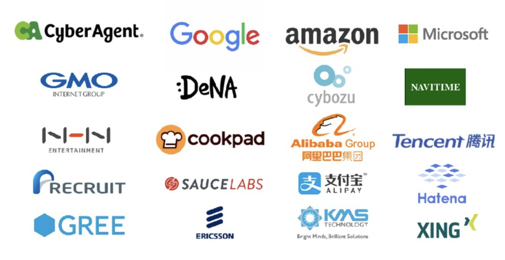

# 最近おすすめのAI

  経営者が今すぐ使うべきAIツール

  〜ChatGPTだけじゃない、本当に使えるAI活用術〜

  
Libra経営研究会特別講演

  
2025年8月18日

  

    Günther Brunner
  

  

    株式会社サイバーエージェント / G Productions, LLC
  

<!--
開始前に：
- 参加者の皆様への感謝を伝える
- 100名規模のイベントであることに触れる
- IT関連8割、人材・コーチング2割、全員経営者という構成を意識

イントロ：
「皆様、こんにちは。今日は『最近おすすめのAI』というテーマで、経営者の皆様に本当に使えるAIツールをご紹介します。ChatGPTは皆さん使われていると思いますが、実はそれだけではもったいない！今日は20分間で、明日から使える実践的な内容をお届けします。」
-->

---
layout: intro
---

# Günther Brunner

## 経歴
- 🎓 2007年 文部科学省国費留学生として来日
- 💼 2012年 サイバーエージェント入社
- 🚀 G Productions, LLC CEO

## 実績
- 🌟 **OpenSTF** 開発者（GitHub 1.3万スター）
- 🏢 200社以上の支援実績
- 🎯 Startup Weekend 優勝

  

    
🚀

    
「AIは世界共通語」

    
グローバル×ローカル＝無限の価値

  

<!--
自己紹介（1分）：
- 2007年から日本在住、18年間日本で活動
- サイバーエージェントでAIドリブン推進室
- G Productionsで200社以上の支援実績
- 「AIは世界共通語」という理念を強調

重要ポイント：
「私は外国人ですが、18年間日本で働いてきました。日本企業の素晴らしさも、課題も、両方見てきました。だからこそ、グローバルな視点で日本企業に最適なAI活用法をお伝えできます。」
-->

---
layout: section
---

# OpenSTFとは？

  
📱

  
世界中のエンジニアが使う

  
スマートフォンテスト自動化ツール

<!--
OpenSTF紹介への導入：
「まず、なぜ私がAIについて語る資格があるのか、OpenSTFの話をさせてください。」

- スマートフォンのテスト自動化という世界共通の課題
- エンジニアリングの視点から経営課題を解決
-->

---
layout: image
image: openstf0.png
---

---

# OpenSTF - 世界が認めたOSS

## 🌟 実績
- GitHub **13,000+ スター**
- 世界中の大手企業が採用
- 月間100万台以上のテスト実行

## 🏢 採用企業
- Google
- Microsoft
- 楽天、LINE、メルカリ...

  

  

    💡 なぜ成功したか？ 世界共通の課題を解決したから
  

<!--
OpenSTFの実績（1分）：
- GitHub 13,000スター = 世界中のエンジニアが認めた証
- Google、Facebook、Samsung等が採用
- 日本企業も楽天、LINE、メルカリが活用

重要メッセージ：
「なぜ成功したか？それは『世界共通の課題』を解決したからです。今日お話しするAI活用も、まさに世界共通の経営課題への解決策です。」

※GIFアニメーションを見せながら説明
-->

---
layout: center
---

# 採用企業

---
layout: center
---

# 今日お伝えしたいこと

1️⃣ AIは戦略・文章・リサーチで使い分ける

2️⃣ Claude Desktopが企業AI活用の未来を変える

3️⃣ 日本企業こそDXT革命に乗るべき理由

<!--
本日の3つのポイント（30秒）：

1. AI使い分け → 「用途によって最適なAIは違います」
2. Claude Desktop → 「これが企業AI活用の未来を変えます」 
3. DXT革命 → 「日本のレガシーシステムが宝の山に変わります」

「では、早速本題に入りましょう！」
-->

---
layout: section
---

# Part 1

  最強のAI使い分け術

用途別ベストプラクティス

<!--
Part 1導入：
「まずは、AIの使い分けについて。皆さん、ChatGPTだけ使っていませんか？実は、用途によって最適なAIは違うんです。」
-->

---

# 🧠 戦略立案なら ChatGPT

## なぜChatGPTか？

### ✅ 最新のo3とGPT-5 Thinkingモデル
- 複雑な推論が得意
- 長期的な計画立案に最適
- ビジネスモデル分析に強い

### ✅ 豊富なプラグイン
- データ分析ツール連携
- 市場調査ツール
- 財務分析機能

  
💬 使用例

  

    
あなた：

    
「弊社の新規事業として、AIを活用したサービスを検討しています。市場分析と3年間の事業計画を作成してください」

    
ChatGPT：

    
「承知しました。まず市場規模から分析します。日本のAI市場は2025年に1.9兆円規模...」

  

  

    
📈

    
戦略的思考のパートナー

  

<!--
ChatGPT説明（1.5分）：

強調ポイント：
- o3モデルの複雑な推論能力
- 戦略立案、事業計画、長期的思考に最適
- プラグインエコシステムの充実

使用例の説明：
「例えば、新規事業の3年計画を作る時、ChatGPTは市場分析から収支計画まで、経営者の思考パートナーになります。」

※実際の画面例を見せながら説明すると効果的
-->

---

# ✍️ 文章作成・コーディングなら Claude

## なぜClaudeか？

### ✅ 圧倒的な文章力
- 自然な日本語生成
- ニュアンスの理解が深い
- 長文でも一貫性を保つ

### ✅ コーディング能力
- Claude Code Max $200
- 最新フレームワーク対応
- バグの少ないコード生成
- 詳細な説明付き

### ✅ 安全性重視
- 倫理的な配慮が徹底
- 機密情報の扱いが慎重

  

    
📝 文章作成例

    

      「プレスリリース、社内通達、マーケティングコピー、技術ドキュメント...」
    

  

  
  

    
💻 コーディング例

    

      「Webアプリ開発、データ分析スクリプト、API設計、インフラ構築...」
    

  

  

    
日本語×技術の最強タッグ

  

<!--
Claude説明（1.5分）：

強調ポイント：
- 日本語の自然さは圧倒的No.1
- プレスリリース、社内文書、メールに最適
- コーディングも最新フレームワーク対応で優秀

重要メッセージ：
「私も日々の業務でClaudeを使っています。特に日本語の文章は、ネイティブの方が書いたような自然さです。」

※倫理的配慮、安全性の高さも経営者には重要なポイント
-->

---

# 🔍 リサーチなら Gemini・Grok・Genspark

  
🔍

  
Gemini

  

    • Google検索と深い統合 
    • 最新情報への即座アクセス 
    • マルチモーダル検索 
    • 学術論文検索に強い
  

  
🐦

  
Grok

  

    • リアルタイムX (Twitter)連携 
    • トレンド分析が得意 
    • ユーモアのある回答 
    • SNSマーケティング分析
  

  
✨

  
Genspark

  

    • 複数ソースの統合分析 
    • ビジュアルな結果表示 
    • 比較分析に特化 
    • 競合調査に最適
  

  

    💡 Pro Tip: 3つを組み合わせて使うと、包括的な市場調査が可能！
  

<!--
リサーチAI説明（2分）：

それぞれの特徴：
- Gemini：Google検索統合、学術論文に強い
- Grok：X(Twitter)のリアルタイム情報、トレンド分析
- Genspark：複数ソース統合、ビジュアル表示

使い分けのコツ：
「市場調査する時は、3つとも使って多角的に分析します。Geminiで基礎情報、Grokで最新トレンド、Gensparkで競合比較。これで見落としがなくなります。」

※「組み合わせて使う」ことの重要性を強調
-->

---
layout: section
---

# Part 2

  Claude Desktop が起こす革命

なぜ今、Claude Desktopなのか

<!--
Part 2導入：
「さて、ここからが今日の本題です。Claude Desktopが、なぜ企業AI活用の未来を変えるのか。」

期待感を高める：
「これからお話しする内容は、まだ多くの経営者が知らない情報です。でも、半年後には常識になっているでしょう。」
-->

---

# 🚀 AI活用の進化

  

    

      
💬

      
第1世代

      
チャット型AI

      
2022年〜

    

    
→

    

      
🔌

      
第2世代

      
API連携型

      
2023年〜

    

    
→

    

      
🖥️

      
第3世代

      
デスクトップ統合型

      
2025年〜 ← 今ここ！

    

  

  
Claude Desktopだけが実現する

  
MCP × DXT の世界

<!--
AI進化の3世代（1分）：

第1世代：「ChatGPTに質問して答えをもらう」
第2世代：「APIで自社システムと連携」
第3世代：「デスクトップで全てが統合」

重要メッセージ：
「今、私たちは第3世代の入り口にいます。そして、Claude Desktopだけが、MCPとDXTという革命的技術を実装しています。」

※図を指しながら、進化の流れを視覚的に説明
-->

---

# 🔮 MCP（Model Context Protocol）とは？

## 従来の問題 😰
- APIごとに異なる仕様
- バージョン管理地獄
- 互換性の問題
- 開発コストの増大

## MCPが解決 ✨
- **統一プロトコル**
- **自動バージョン対応**
- **プラグ&プレイ**
- **開発コスト90%削減**

  

    
🎯

    
一度作れば、永遠の資産

  

  

    
💡 実例

    

      「社内の販売管理システムをMCP化したら、Claude・GPT・Geminiすべてから自然言語でアクセス可能に！」
    

  

  
  

    
開発期間：1週間 → 効果：∞

  

<!--
MCP説明（1.5分）：

分かりやすい例え：
「MCPは、AIの『万能アダプター』です。今まで、各AIごとに違うプラグが必要でした。MCPなら、一度作れば全てのAIで使えます。」

具体例：
「例えば、御社の販売管理システム。MCPサーバーを1つ作れば、Claude、GPT、Gemini、全てから自然言語でアクセスできます。開発期間たった1週間です。」

※「一度作れば、永遠の資産」を強調
-->

---

# 💥 DXT（Desktop Extensions）の破壊力

  

    
「先月の売上データまだ？」が死語になる日

    
20年物のレガシーシステムが、3秒で答える時代へ

  

## Before（現在）
- 💀 データ抽出：**3日**
- 💀 レポート作成：**5時間**  
- 💀 システム連携：**年5000万円**
- 💀 従業員満足度：**41%**

## After（DXT導入後）
- ✨ データ抽出：**3秒**
- ✨ レポート作成：**自動生成**
- ✨ システム連携：**月10万円**
- ✨ 従業員満足度：**85%**

  

    年間削減コスト：1.8億円 | ROI：3,600%
  

<!--
DXT説明（1.5分）：

インパクトのある導入：
「『先月の売上データまだ？』この言葉、今朝も聞きませんでしたか？DXTがあれば、この言葉は死語になります。」

数字で語る：
- Before：データ抽出3日 → After：3秒
- Before：年間5000万円 → After：月10万円
- 年間削減コスト：1.8億円
- ROI：3,600%

「これは架空の数字ではありません。実際の試算です。」
-->

---
layout: section
---

# Part 3

  なぜ日本企業にDXTが必要か

レガシーシステムを資産に変える

<!--
Part 3導入：
「ここからは、日本企業の皆様に特に聞いていただきたい内容です。」

共感を呼ぶ：
「日本には素晴らしいレガシーシステムがたくさんあります。でも、それが足かせになっていませんか？」
-->

---

# 🗾 日本企業の「不都合な真実」

## 現実の課題

### 📊 衝撃のデータ
- 管理職の **25%** の時間が「データ待ち」
- 年間**480時間**を無駄に浪費
- 優秀な人材の離職率**上昇**

### 😰 よくある光景
「先週の売上データは？」  
「すみません、集計中で...木曜日までには」  

**木曜日って...先週のデータですよ？**

  

    
🏯

    
レガシーシステムの呪縛

  

  
  

    

      
❌ 現状

      
20年前のシステムに縛られる

    

    

      
✅ DXTなら

      
レガシーシステムが最新AIと会話！

    

  

  

    
捨てるのではなく、活かす

  

<!--
日本企業の現実（1.5分）：

衝撃的な事実：
「管理職の25%の時間が『データ待ち』。年間480時間。これが日本の生産性が上がらない最大の理由です。」

よくある光景の再現：
「『先週の売上データは？』『木曜日までには...』木曜日？先週のデータですよ？」

希望のメッセージ：
「でも、レガシーシステムは捨てる必要はありません。DXTなら、20年前のシステムも最新AIと会話できます。」
-->

---

# 🎌 日本企業のDXT成功事例（予測）

  

    

      
🏭 製造業A社

      

        • 在庫管理の自動最適化 
        • 32%の在庫削減 
        • 月次棚卸し時間90%削減
      

    

    

      
🏪 小売業B社

      

        • 店舗別分析の即時化 
        • 売上予測精度40%向上 
        • 発注ミス80%削減
      

    

    

      
🏦 金融C社

      

        • リスク分析の高速化 
        • コンプライアンス自動化 
        • 審査時間75%短縮
      

    

  

  
共通する成功要因

  

    

      
🚀

      
スピード重視

    

    

      
🔄

      
既存資産活用

    

    

      
👥

      
現場主導

    

  

<!--
成功事例の予測（1分）：

業界別の具体例：
- 製造業：在庫32%削減
- 小売業：売上予測精度40%向上
- 金融：審査時間75%短縮

共通成功要因：
「成功する企業の共通点は3つ。スピード重視、既存資産活用、現場主導。全て、日本企業の強みを活かせる要素です。」
-->

---

# 🏢 経営者の3つの選択

  

    

      

        
😵

        
否定する経営者

        
30%

      

      

        「うちには関係ない」 
        ↓ 
        3年後、市場から退場
      

    

    

      

        
🤔

        
様子見する経営者

        
65%

      

      

        「もう少し普及してから」 
        ↓ 
        3年後、追いつけない差
      

    

    

      

        
🚀

        
今動く経営者

        
5%

      

      

        「月曜日から始める」 
        ↓ 
        3年後、業界のリーダー
      

    

  

  
あなたは、どれですか？

<!--
3つの選択（1分）：

危機感と希望のバランス：
- 否定する30%：「3年後、市場から退場」
- 様子見する65%：「3年後、追いつけない差」  
- 今動く5%：「3年後、業界のリーダー」

直接的な問いかけ：
「皆様は、どの選択をされますか？私は、今日ここにいらっしゃる皆様全員に、5%の先駆者になっていただきたい。」

※5%の部分を強調、スケール105%の視覚効果も活用
-->

---
layout: section
---

# Part 4

  dots.ly のご紹介

起業家のための統合ソリューション

<!--
dots.ly導入：
「さて、私が現在開発中のdots.lyをご紹介させてください。これは起業家のためのオペレーティングシステムです。」

※時間が押している場合は簡潔に
-->

---
layout: full
---
# dots.ly デモ動画

 

<Youtube id="XZ2IiJdXzkQ" />

 

<h2>https://dots.ly</h2>

<!--
動画デモ（30秒）：
「まずは短い動画でdots.lyの世界観をご覧ください。」

※動画再生中に次のスライドの準備
-->

---

# 🎯 dots.ly - 起業家のためのオペレーティングシステム

## The Dots Philosophy

「将来を見据えて点と点を繋ぐことはできない。 
後から振り返って初めて、繋ぐことができるのだ。」

- Steve Jobs

  

    
⭐

    
Entrepreneurial OS

  

  
  

    問題発見から収益化まで、 
    起業家の全ての旅を支援
  

  
  

    
✅ スタートアップ創業者

    
✅ 企業内起業家

  

  
  

    <a href="https://dots.ly" class="text-lg font-bold text-purple-600">
      https://dots.ly
    </a>
  

<!--
dots.ly説明（1分）：

コンセプト説明：
「スティーブ・ジョブズの名言『点と点は後からつながる』を、リアルタイムで実現。
起業家の旅全体をサポートするエコシステムです。」

価値提案：
「問題発見から収益化まで、起業家に必要なツールを統合的に提供」
-->

---

# 🌟 dots.ly エコシステム - 4つの核となるサービス

  
😤

  
pain.ly

  

    問題マーケットプレイス 
    • 実際の困りごとを投稿 
    • 解決すべき問題を発見 
    • 起業アイデアの源泉
  

  
💡

  
shall.ly

  

    $1投票でアイデア検証 
    • 本当の需要を確認 
    • リアルマネーで投票 
    • 市場検証の革新
  

  
💰

  
fayr.ly

  

    適正価格見積もりシステム 
    • AI powered見積もり 
    • 市場相場分析 
    • フリーランサーの味方
  

  
📢

  
waves.ly

  

    フィードバック収集 
    • 美しいフォーム作成 
    • リアルタイム分析 
    • 顧客の声を形に
  

  
すべてが繋がり、あなたの起業の星座を形成

<!--
dots.lyエコシステム説明（1.5分）：

各サービスの説明：
- pain.ly：「世の中の問題を可視化。起業家はここから始まる」
- shall.ly：「『使いますか？』ではなく『$1払いますか？』で本当の需要を確認」
- fayr.ly：「フリーランサーが適正価格で働ける世界を」
- waves.ly：「顧客の声を美しく、簡単に収集」

エコシステムの価値：
「それぞれが独立して動きながら、データは連携。起業の全工程をサポート」
-->

---

# 🚀 なぜdots.lyなのか？

## 起業家の旅を完全サポート

  

    1️⃣
    

      
問題発見

      
pain.lyで実際の困りごとを発見

    

  

  

    2️⃣
    

      
アイデア検証

      
shall.lyで$1投票による市場検証

    

  

  

    3️⃣
    

      
価格設定

      
fayr.lyで適正価格を決定

    

  

  

    4️⃣
    

      
顧客の声

      
waves.lyでフィードバック収集

    

  

  

    
🌌

    
Your Constellation

  

  
  

    
開発予定のサービス

    

      
• shyp.ly - AI開発支援

      
• slid.ly - プレゼン作成

      
• grow.ly - 成長分析

      
• learn.ly - 起業家教育

    

  

  
  

    
2025年から順次リリース予定

  

<!--
dots.lyの価値提案（1分）：

「なぜdots.lyが必要か？」
- 起業の全プロセスを一つのエコシステムでカバー
- データが連携し、インサイトを提供
- フェアな価格設定と透明性
- 個人でも大企業並みのツールを

将来のビジョン：
「最終的には10以上のサービスで、起業家の全ての『点』を繋げます」
-->

---

# 🎬 その他のおすすめクリエイティブAIツール

  

    

      <h3 class="text-2xl font-bold mb-6">🎨 ビジュアル制作</h3>
      

          

            
Midjourney / DALL-E 3

            

              • 最高品質の画像生成 
              • ブランドイメージ作成 
              • プロダクトビジュアル
            

          

          

            
Sora / Veo / Midjourney

            

              • AI動画生成 
              • プロモーション動画 
              • 説明動画の自動作成
            

          

        

    

    

      <h3 class="text-2xl font-bold mb-6">🎵 音声・音楽制作</h3>
      

        

          
ElevenLabs

          

            • 自然な音声合成 
            • 多言語ナレーション 
            • ポッドキャスト制作
          

        

        

          
音楽生成AI

          

            • BGM自動生成 
            • ブランド音楽 
            • 著作権フリー
          

        

      

    

  

  

    💡 これらのツールと dots.ly を組み合わせて、完璧な起業環境を
  

<!--
クリエイティブツール補足（30秒）：

「dots.lyエコシステムと、これらのクリエイティブツールを組み合わせることで、
アイデアから実装、マーケティングまで全てをカバーできます。」
-->

---
layout: section
---

# まとめ

  今すぐ始める3つのアクション

<!--
まとめ導入：
「お時間も限られていますので、最後に今日から実践できる3つのステップをお伝えします。」
-->

---
zoom: 0.8
---

# 📋 今日から実践！3つのステップ

  

    
1

    

      <h3 class="text-2xl font-bold mb-2">AI使い分けを始める</h3>
      
戦略→ChatGPT、文章→Claude、リサーチ→Gemini/Grok

    

  

  

    
2

    

      <h3 class="text-2xl font-bold mb-2">Claude Desktopを導入</h3>
      
MCPサーバーを1つ作って、業務効率化を体感

    

  

  

    
3

    

      <h3 class="text-2xl font-bold mb-2">DXT導入の検討開始</h3>
      
レガシーシステムを資産に変える第一歩

    

  

<!--
3つのステップ（1分）：

1. AI使い分け：「今日から、用途別にAIを使い分けてください」
2. Claude Desktop：「まず1つ、MCPサーバーを作ってみてください」
3. DXT検討：「レガシーシステムの活用を検討してください」

行動を促す：
「大切なのは、今日から始めること。明日では遅いかもしれません。」
-->

---

# 🚀 G Productions のご紹介

## 提供サービス

### 🌐 グローバルAI技術顧問
- 最新AI技術の導入支援
- シリコンバレー×日本の架け橋
- 200社以上の実績

### 💻 経営者向けAIツール開発
- カスタムMCPサーバー構築
- DXT導入コンサルティング
- 業務特化型AI開発

### 🎯 海外展開支援
- グローバル市場への進出
- 多言語化・ローカライズ
- Go-to-Market戦略

  

    
🤝

    
一緒に未来を創りましょう

  

  

    

      
お問い合わせ

      
@gunta85

      
Twitter (X)

    

    

      
Website

      
g-productions.studio

    

  

<!--
G Productions紹介（30秒）：

サービス紹介：
- AI技術顧問
- MCPサーバー構築
- DXT導入支援

連絡先強調：
「ご相談は @gunta85 まで。一緒に未来を創りましょう。」
-->

---
layout: center
---

# 心に残るメッセージ

  
🌟

  
  

    AIは道具ではなくパートナー
  

  

    正しく使い分ければ、 
    あなたの能力は10倍になる  
    そして、Claude Desktop + DXTが 
    日本企業のレガシーを宝に変える
  

  

    今日この瞬間から、あなたも5%の先駆者になれる
  

<!--
最後のメッセージ（30秒）：

キーメッセージ：
「AIは道具ではなく、パートナーです。」

希望のメッセージ：
「正しく使い分ければ、あなたの能力は10倍になる。
Claude Desktop + DXTが、日本企業のレガシーを宝に変える。」

行動喚起：
「今日この瞬間から、あなたも5%の先駆者になれます。」

※ゆっくりと、心に響くように話す
-->

---
layout: end
class: text-center
---

# ありがとうございました

  
🙏

  
  
ご質問・ご相談はお気軽に

  
  

    

      Twitter: @gunta85
    

    

      Web: g-productions.studio
    

    

      Email: hello@g-productions.studio
    

  

  

    2025年8月18日 Libraコミュニティ
  

  

    #AI革命 #DXT #MCP
  

<!--
締めの言葉：
「ご清聴ありがとうございました。ご質問やご相談がございましたら、お気軽にお声がけください。」

質疑応答の準備：
- MCP/DXTの技術的質問
- 導入コスト、ROIの詳細
- セキュリティ懸念への回答
- 具体的な始め方

※名刺交換の準備も忘れずに
-->
