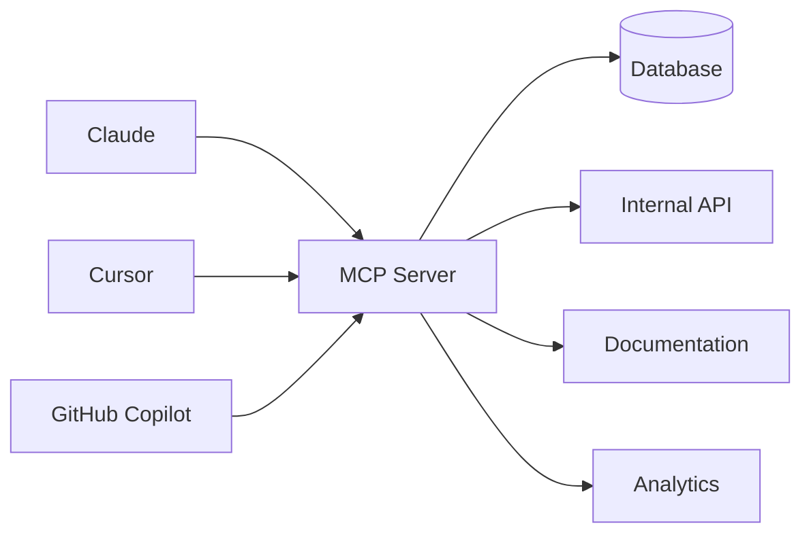

# 確定タイトル

**メインタイトル:**  
# AIエンジニアリングの新方程式
## 〜開発者生産性を10倍にする統合アーキテクチャ〜

**サブタイトル:**  
### AI DXI × Core 4 × Effect × MCP で実現する次世代開発環境

**概要（Connpass用）:**  
AIエンジニアリングの時代に必要な開発者生産性の新しいパラダイムを提案します。<br>
「AI Developer Experience Index (DXI)」「Core 4 フレームワーク」「Effect TypeScript」「Model Context Protocol (MCP)」を<br>
統合した実践的なアプローチで、開発効率を劇的に向上させる具体的な手法をお見せします。<br>
Cloudflare、DX社での実証例と「G Stack」による実践例を交えながら、明日から使える技術スタックも大公開。

---

# 統合コンセプト：開発者生産性の新方程式

## 背景：AI時代の開発者生産性課題

### 現代の開発現場が直面する複合的課題
- **AI生成コードの品質管理**：AIが1日で生成する大量コードの運用・保守
- **測定指標の断片化**：DORA、SPACE、DevExが個別に存在し統合されていない
- **型安全性とエラー処理**：従来のTypeScriptでは限界のある信頼性要求
- **ツール統合の複雑さ**：AIツール間の連携とコンテキスト共有の困難
- **開発環境の依存地獄**：バージョン管理とスケーラビリティの課題

## 解決策：4つの柱による統合アーキテクチャ

### 第1の柱：AI Developer Experience Index (DXI)
**AIエンジニアリング時代の新しい生産性指標**

- 従来のDXIを拡張したAI特化版メトリクス
- AIコード生成効率とヒューマンレビュー品質の複合測定
- リアルタイム学習効率と適応速度の定量化
- 13分/週/開発者の時間節約効果をAIワークフローで最大化

**実装例：**
```typescript
interface AIDXIMetrics extends DXIMetrics {
  aiCodeGenerationEfficiency: number    // AI生成コードの採用率
  humanAICollaborationFlow: number      // ヒューマン-AI協調スムーズネス  
  contextualLearningSpeed: number       // AIツールの学習適応速度
  toolIntegrationFriction: number       // ツール間連携の摩擦係数
}
```

### 第2の柱：Core 4 フレームワーク (AI拡張版)
**DORA × SPACE × DevEx の統合型生産性測定**

- **Speed (速度)**：PR throughput + AI assist ratio
- **Quality (品質)**：テストカバレッジ + AI generated code reliability
- **Impact (影響)**：新機能時間 + AI enhancement contribution
- **Experience (体験)**：開発者満足度 + AI tool satisfaction

**AIワークフロー統合指標：**
```typescript
interface AICore4Metrics {
  speed: {
    prThroughput: number,
    aiAssistRatio: number,        // AI支援による速度向上率
    contextSwitchReduction: number // AI統合によるコンテキスト切り替え削減
  },
  quality: {
    testCoverage: number,
    aiCodeReliability: number,    // AI生成コード信頼性スコア
    humanReviewEfficiency: number // ヒューマンレビュー効率
  }
  // ...
}
```

### 第3の柱：Effect TypeScript
**型安全性と関数型プログラミングによる信頼性革命**

- **完全なエラー処理**: 型レベルでのエラー追跡と自動処理
- **依存性注入の明示化**: テスト可能性とモジュール性の向上
- **非同期処理の合成**: 複雑なワークフローを型安全に構築
- **AIコード生成との親和性**: 生成されたコードの品質担保

**Effect実装による開発効率向上：**
```typescript
// 従来のPromise地獄から...
const traditionalFlow = async () => {
  try {
    const data = await fetchData()
    const processed = await processData(data)
    return await saveData(processed)
  } catch (error) {
    // エラー処理が不完全
    console.error(error)
    throw error
  }
}

// Effectによる型安全な合成へ
const effectFlow = Effect.gen(function* () {
  const data = yield* fetchDataEffect
  const processed = yield* processDataEffect(data) 
  return yield* saveDataEffect(processed)
}).pipe(
  Effect.catchTags({
    FetchError: handleFetchError,
    ProcessError: handleProcessError,  
    SaveError: handleSaveError
  })
)
```

### 第4の柱：Model Context Protocol (MCP)
**AIツール統合の革命的プロトコル**

- **バージョニング不要**: 自動スキーマ認識による運用負荷削減
- **コンテキスト共有**: AIツール間でのシームレスな情報連携
- **企業競争力指標**: MCP Server保有数 = 時価総額相関の新時代
- **開発生産性向上**: ツール統合コストを90%削減

**MCP統合アーキテクチャ：**


## 統合実装戦略

### Phase 1: 基盤構築（1-2週間）
1. **Effect TypeScript 導入**
   - 既存TypeScriptコードのEffectマイグレーション
   - 型安全なエラー処理パイプライン構築
   - 依存性注入レイヤーの実装

2. **Core 4 測定基盤**
   - AI拡張版メトリクス定義
   - 自動収集パイプライン構築
   - リアルタイムダッシュボード実装

### Phase 2: AI統合（2-3週間）
3. **AI DXI 実装**
   - AIワークフロー効率測定
   - ヒューマン-AI協調指標の導入
   - 継続的改善フィードバックループ

4. **MCP Server 構築**
   - 社内ツール統合MCPサーバー開発
   - AIエージェント間コンテキスト共有基盤
   - セキュリティと権限管理の実装

### Phase 3: 最適化・拡張（継続的）
5. **統合最適化**
   - 4つの柱の相互作用分析
   - ボトルネック特定と改善
   - スケーラビリティ向上

6. **組織展開**
   - チーム別カスタマイゼーション
   - トレーニングプログラム
   - 成果測定と改善サイクル

## 想定される効果

### 定量的効果
- **開発速度**: 300-500% 向上（Core 4 + AI DXI効果）
- **品質向上**: バグ発生率 70% 削減（Effect型安全性効果）
- **ツール統合コスト**: 90% 削減（MCP効果）
- **学習曲線**: 新メンバーの生産性向上時間 60% 短縮

### 定性的効果
- **開発者体験の劇的改善**: ストレス削減と創造性向上
- **技術的負債の体系的削減**: 型安全性による品質向上
- **AI時代への適応力**: 次世代開発パラダイムへの準備完了
- **組織競争力の向上**: 業界をリードする開発生産性の実現

## G Stack（Growth Stack）による実証

### 次世代ハッカソン技術スタック
- **Bun**: 高速JavaScript runtime（3倍高速な起動時間）
- **Hono**: 軽量Web framework（Edge-first設計）
- **Effect TypeScript**: 型安全なビジネスロジック
- **Cloudflare Workers**: スケーラブルなEdge computing
- **MCP統合**: AIツール間のシームレスな連携

### G Stackが実現する開発体験
```typescript
const developmentExperience = Effect.gen(function* () {
  const rapidPrototyping = yield* GStack.init()      // 30秒で環境構築
  const aiAssistedDevelopment = yield* AIDXIWorkflow.optimize()
  const qualityAssurance = yield* EffectTypeValidation.ensure()
  const seamlessIntegration = yield* MCPServerStack.connect()
  
  return yield* Effect.succeed("🚀 10x Developer Productivity")
}).pipe(
  Effect.provide(LayerStack.complete)
)
```

## 技術スタック詳細

### コア技術
- **Runtime**: Bun (高速実行環境)
- **Web Framework**: Hono (軽量・高性能)
- **Type System**: Effect TypeScript (関数型・型安全)
- **AI Integration**: MCP (Model Context Protocol)
- **Hosting**: Cloudflare Workers (Edge computing)

### 測定・監視
- **Metrics**: AI-enhanced DXI + Core 4
- **Monitoring**: Sentry + BetterStack + Statsig
- **Testing**: Vitest + Playwright + Maestro
- **Performance**: Real User Monitoring

### 開発・デプロイ
- **Build**: Moon (並行処理) + Depot (分散ビルド)
- **VCS**: Git → Jujutsu (大規模対応)
- **IaC**: Alchemy (Pure TypeScript)
- **Experimentation**: Statsig + Superwall

## 結論：AIエンジニアリングの新方程式

**AI DXI × Core 4 × Effect × MCP = 10倍の開発者生産性**

この統合アプローチは単なる技術選択ではなく、AI時代の開発パラダイムシフトです。4つの柱を組み合わせることで、従来の開発効率を桁違いに向上させ、持続可能で拡張性のある開発体験を実現します。

明日から始められる実践ロードマップと共に、次世代のエンジニアリング組織を構築しませんか？

---

## セッション構成（20分間）

### 1. 問題提起：AI時代の開発者生産性危機 (3分)
- 現代開発現場の複合的課題
- 従来アプローチの限界

### 2. 解決策：4つの柱統合アーキテクチャ (12分)
- **AI DXI**: 新時代の生産性指標 (3分)
- **Core 4**: 統合測定フレームワーク (3分)  
- **Effect TS**: 型安全性革命 (3分)
- **MCP**: AIツール統合プロトコル (3分)

### 3. 実装戦略と実証例 (3分)
- G Stack（Growth Stack）実践例
- 次世代ハッカソン技術スタック

### 4. 今日から始める次世代開発 (2分)
- 実践ロードマップ
- 明日からのアクションプラン